===================
使用指南综述
===================

本文档主要对清微骑士工具链 ``TS.Knight`` 进行整体介绍，帮助客户建立整体概念，引导客户更好的使用工具链提供的各项功能。同时也提供快速上手的演示方式，方便客户直接运行。

**名词解释**

+--------------------------------+-------------------------------------+
| **名词**                       | **说明**                            |
+================================+=====================================+
| Knight                         | 清微骑士工具链英文名称              |
+--------------------------------+-------------------------------------+
| QAT                            | Quantization Aware                  |
|                                | Training，量化感知训练              |
+--------------------------------+-------------------------------------+
| RNE                            | 可重构神经网络加速引擎              |
+--------------------------------+-------------------------------------+
| RCE                            | 可重构计算引擎                      |
+--------------------------------+-------------------------------------+
| Finetune                       | 微调                                |
+--------------------------------+-------------------------------------+
| IR定点模型                     | 中间表示模型，指                    |
|                                | Caffe定点模型或ONNX定点模型         |
+--------------------------------+-------------------------------------+

Knight介绍
===================

概述
----------

 ``TS.Knight`` 是清微智能提供的一站式开发平台，包含部署AI模型所需的全套工具链，支持模型量化、精度比对、模型编译、模拟和性能分析等功能。

整体框架
--------

 ``TS.Knight`` 整体框架如下图所示：

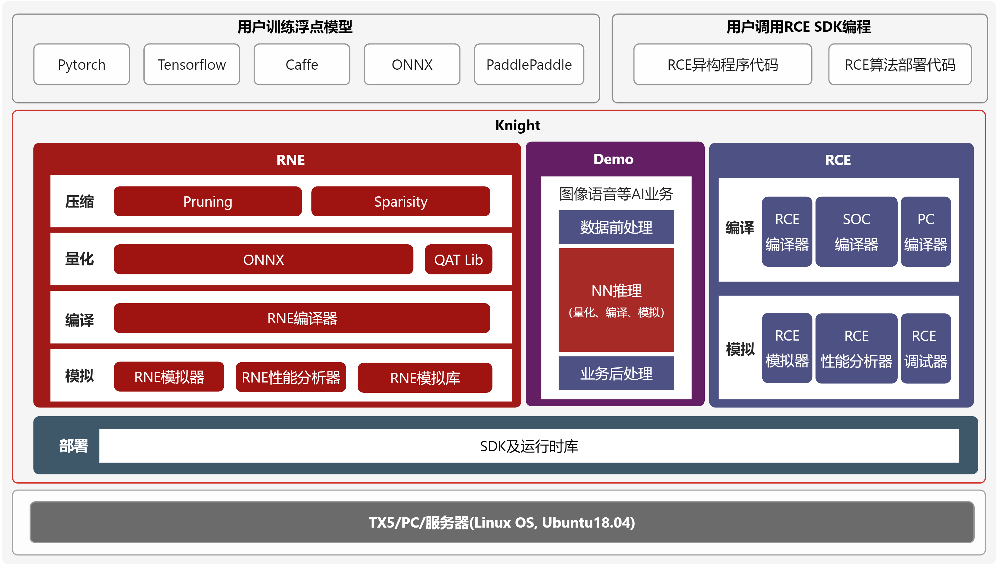

\

**Knight压缩工具(Knight-ModelCompression)**:用于模型剪枝、稀疏、结构搜索、模型蒸馏等模型压缩。

**Knight量化工具(Knight-Quantize)**: 基于少量数据(比如图片、语音、文本等类型) 量化浮点模型。

**Knight RNE编译器(Knight-RNE-Compiler)**:编译量化模型，产生RNE执行的指令配置文件。

**Knight RNE模拟器(Knight-RNE-Simulator)** :用于仿真神经网络在RNE上推理计算过程，输出计算层的结果。

**Knight RNE性能分析器(Knight-RNE-Profiling)**:用于分析神经网络在芯片RNE上执行时间和存储开销，并给出分析报告。

**Knight Finetune库(Knight-Finetune-Lib)** :即QAT库，在使用量化工具后，精度损失较大的情况下，可使用Finetune库进行量化感知训练，得到更适合量化的浮点模型。

**Knight RNE模拟库(Knight-RNE-Simulator-Lib)** :供用户在PC端调用编写自己的应用程序，从而实现模拟运行结果。

**Knight RNE 运行时库(Knight-RNE-Runtime-Lib)** :供用户在PC端交叉编译时调用，从而实现板端运行。

**Knight Demo**:提供计算机视觉，智能语音等领域的端到端的运行示例，演示Knight工具链的使用流程和具体用法。

**Knight RCE(Knight-RCE)**: 提供一种通用计算能力供用户进行C语言编程。

.. note::
    Knight压缩工具、Knight量化工具、Knight RNE编译器、Knight RNE模拟器和Knight RNE性能分析器所有芯片均支持，Knight RCE仅在部分芯片支持，当前仅TX5368x系列，TX5339x系列和TX5335x系列芯片支持。

开发流程
--------

AI全栈应用开发流程
~~~~~~~~~~~~~~~~~~

.. figure:: ../media/overview_img2.png
    :alt: pipeline
    :align: center

\

Knight工具链可支持端侧AI推理全栈开发，包括应用开发，模型部署资源生成和自定义算子开发三个主要流程。

**应用开发**：用户调用Knight RNE SDK API编写自己的业务应用，加载编译后的模型部署资源，链接模拟库在纯软件环境中仿真调试自己的应用，链接板端库在板端进行部署。

**模型部署资源生成**：用户准备已训练好的浮点模型，使用Knight量化工具量化成IR定点模型，然后对比量化精度，接着编译生成模型资源，此时用户可进行模拟器结果验证以及Profiling性能调优。

**自定义算子开发**：当用户模型中存在芯片不支持的算子时，用户在量化后的IR模型中添加自定义算子层，之后进行IR模型编译，供应用开发时调用；用户在应用开发时进行自定义算子的C代码实现，通过SDK
API相应接口进行自定义算子注册。最后，与整个应用程序一起进行模拟库上调测，板端库上部署。

模型资源生成开发流程
~~~~~~~~~~~~~~~~~~~~

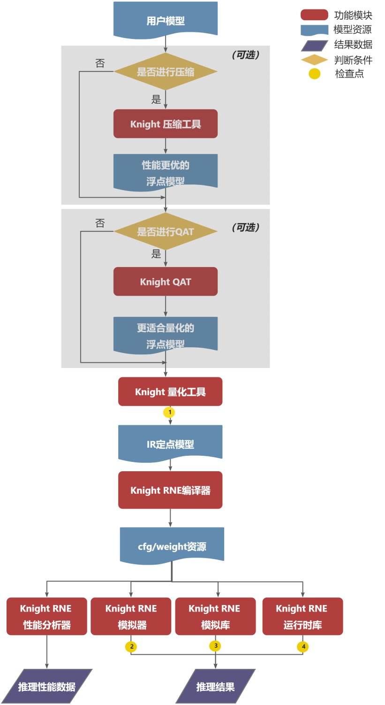

\

1. 用户使用 ``Knight`` 量化工具将提前训练好的浮点模型量化成IR定点模型。

2. 用户使用 ``Knight RNE`` 编译器将IR定点模型编译成芯片部署资源(cfg和weight资源)。

3. 用户使用 ``Knight RNE`` 模拟器对测试数据进行推理，也可以使用 ``Knight RNE`` 性能分析工具对模型进行性能分析。

4. 同时用户也可以调用 ``Knight RNE`` 模拟库编写自己的业务应用在纯软件环境仿真自己的业务模型。

5. 如果步骤3、4均通过，用户可以调用 ``Knight RNE`` 运行时库编写自己的实际业务应用，部署到清微芯片上。

6. 在步骤3中，如果模型推理性能不满足需求，则用户可使用 ``Knight`` 压缩工具将提前训练好的浮点模型进行压缩，得到体积更小，性能更优，更适合端侧部署的浮点模型。（可选）

7. 在步骤1量化后，如果模型精度损失严重，用户可以使用QAT库，即 ``Knight Finetune`` 库（当前仅支持pytorch平台）编写自己的Finetune工具对浮点模型进行微调，得到更适合量化的浮点模型，之后再进行步骤1。（可选）

.. note::
   在整个开发流程中有如下4个检查点：

   1. 用户使用Knight量化工具完成量化操作后，需要使用精度比对工具查看量化后精度是否满足业务要求；

   2. 用户使用Knight RNE模拟器对测试数据进行推理后，需保证其推理结果和Knight量化工具推理结果一致；

   3. 用户使用Knight RNE模拟库对测试数据进行推理后，需保证其推理结果和KnightRNE模拟器推理结果一致；

   4. 用户使用Knight RNE运行时库对测试数据进行推理后，需保证其推理结果和Knight RNE模拟库推理结果一致；

   以上4个检查点若不满足预期，可联系清微技术人员进行支持。
   为便于用户快速进行检查点2，3的结果验证，提供model_check.py脚本，可参考 `model_check.py使用说明`_

软件包目录
----------

``Knight``产品目录如下所示：

.. figure:: ../media/overview_img33.png
    :alt: pipeline
    :align: center

ReleaseDocuments目录中为产品文档，示例如下：

.. figure:: ../media/overview_img4.png
    :alt: pipeline
    :align: center
ReleaseDeliverables目录中为软件产品，示例如下：

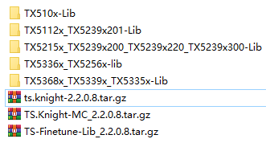
	
\
 
 ``ts.knight-XXX.tar.gz`` 为 ``Knight`` 镜像压缩包，参见 `运行镜像`_ ，运行镜像后进入Knight容器，容器内文件目录如下表所示。

+------------------+-----------+----------+---------------------------------+
|  一级            | 二级目录  |开源/封闭 | 说明                            |
+==================+===========+==========+=================================+
|/TS-KnightSoftware|/tools     | 开源     | 常用小工具。/model_check:       |
|                  |           |          | 检查点2和检查点3结果验证。      |
|                  |           |          | 详情参见                        |
|                  |           |          |  `model_check.py使用说明`_ 。   |
+------------------+-----------+----------+---------------------------------+
|/TS-KnightDemo    |/Resources | 开源     |Knight demo相关的模型和数据，    |
|                  |           |          |和代码                           |
+                  +-----------+----------+---------------------------------+
|                  | /Scripts  | 开源     | Knight demo的运行shell脚本      |
+------------------+-----------+----------+---------------------------------+

Knight库文件目录如下表所示。

+---------------------+----------+------+------------------------------------------------------+
|   一级              | 二级目录 | 开源 |   说明                                               |
|                     |          | 封闭 |                                                      |
+=====================+==========+======+======================================================+
| /TX510x-Lib         | /RNE     | 封闭 | TX510x系列芯片 Knight                                |
|                     | -SIM-Lib |      | RNE模拟库，详情参见                                  |
|                     |          |      | :doc:`SDK使用指南<../user_guides_base/sdk>`          |
+                     +----------+------+------------------------------------------------------+
|                     | /RN      | 封闭 | TX510x系列芯片 Knight                                |
|                     | E-RT-Lib |      | RNE运行时库，详情参见                                |
|                     |          |      | :doc:`SDK使用指南<../user_guides_base/sdk>`          |
+---------------------+----------+------+------------------------------------------------------+
|/TX5368x_TX5339x_TX53| /RNE     | 封闭 | TX5368x系列，TX5339x                                 |
|35x-Lib              | -SIM-Lib |      | 系列和TX5335x系列芯片Knight                          |
|                     |          |      | RNE模拟库，详情参见                                  |
|                     |          |      | :doc:`SDK使用指南<../user_guides_base/sdk>`          |
+                     +----------+------+------------------------------------------------------+
|                     | /RN      | 封闭 | TX5368x系列                                          |
|                     | E-RT-Lib |      | ，TX5339x系列和TX5335x系列                           |
|                     |          |      | Knight RNE运行时库，详情参见                         |
|                     |          |      | :doc:`SDK使用指南<../user_guides_base/sdk>`          |
+---------------------+----------+------+------------------------------------------------------+
|/TX5112x_TX5239x201-L|/RNE      | 封闭 | TX5112x系列和TX5239x201系列芯片                      |
|ib                   |-SIM-Lib  |      | Knight RNE模拟库，详情参见                           |
|                     |          |      | :doc:`SDK使用指南<../user_guides_base/sdk>`          |
+                     +----------+------+------------------------------------------------------+
|                     |/RN       | 封闭 | TX5112x系列                                          |
|                     |E-RT-Lib  |      | 和TX5239x201系列芯片Knight                           |
|                     |          |      | RNE运行时库，详情参见                                |
|                     |          |      | :doc:`SDK使用指南<../user_guides_base/sdk>`          |
+---------------------+----------+------+------------------------------------------------------+
|/TX5215x_TX5239x200\_|/RNE-SIM-L| 封闭 | TX5215x系列，TX5                                     |
|TX5239x220_TX5239x300|ib        |      | 239x200系列，TX5239x220系列                          |
|-Lib                 |          |      | 和TX5239x300系列芯片Knight                           |
|                     |          |      | RNE模拟库,  详情参见                                 |
|                     |          |      | :doc:`SDK使用指南<../user_guides_base/sdk>`          |
+                     +----------+------+------------------------------------------------------+
|                     |/RN       | 封闭 | TX5215x系列,                                         |
|                     |E-RT-Lib  |      | TX5                                                  |
|                     |          |      | 239x200系列,TX5239x220系列                           |
|                     |          |      | 和TX5239x300系列芯片Knight                           |
|                     |          |      | RNE运行时库，详情参见                                |
|                     |          |      | :doc:`SDK使用指南<../user_guides_base/sdk>`          |
+---------------------+----------+------+------------------------------------------------------+
|/TX5336x_TX5256x-Lib | /RNE     | 封闭 | TX5336系列和TX5256系列芯片Knight                     |
|                     |-SIM-Lib  |      | RNE模拟库,  详情参见                                 |
|                     |          |      | :doc:`SDK使用指南<../user_guides_base/sdk>`          |
+                     +----------+------+------------------------------------------------------+
|                     |/RNE-RT-Li| 封闭 | TX5336系列和TX5256系列芯片Knight                     |
|                     |b         |      | RNE运行时库, 详情参见                                |
|                     |          |      | :doc:`SDK使用指南<../user_guides_base/sdk>`          |
+---------------------+----------+------+------------------------------------------------------+
| TS.Knight-Fine      |          | 开源 | Knight Finetune库,详情参见                           |
| tune-Lib_XXX.tar.gz |          |      |:doc:`QAT使用说明<../user_guides_advanced/qat>`       |
+---------------------+----------+------+------------------------------------------------------+
|TS.Knight-MC_XXX.tar.|          | 封闭 | Knight压缩工具详情参见                               |
|gz                   |          |      | :doc:`模型压缩使用指南<../user_guides_advanced/mc>`  |
+---------------------+----------+------+------------------------------------------------------+

安装部署
========

准备docker环境
--------------

当前 ``Knight`` 支持容器部署的方式，因此需要用户保证已安装 ``docker`` 环境，要求 ``docker`` 版本大于等于19.03，如果已安装则可跳过该章节。

docker安装方式有两种：自动更新安装 ``docker`` 和手动安装 ``docker``。

自动更新安装docker
~~~~~~~~~~~~~~~~~~

1) 更新可用软件包列表

.. code-block:: python

   sudo apt update

2) 更新所有软件包

.. code-block:: python

   sudo apt -y upgrade

3) 安装docker

.. code-block:: python

   sudo apt install -y docker.io

4) 确认docker版本大于等于19.03

.. code-block:: python

   docker --version

Ubuntu 16手动安装docker
~~~~~~~~~~~~~~~~~~~~~~~

 ``Ubuntu 16`` 的默认 `docker` 版本是18.x，低于19.03，所以需要手动安装docker。

下载docker安装包
^^^^^^^^^^^^^^^^

1) 下载url：\ https://download.docker.com/linux/ubuntu/dists/

进入该网址后，进入xenial -> pool -> stable -> amd64

2) 下载安装包：

`containerd.io_1.2.13-2_amd64.deb <https://download.docker.com/linux/ubuntu/dists/xenial/pool/stable/amd64/containerd.io_1.2.13-2_amd64.deb>`__

`docker-ce-cli_19.03.12~3-0~ubuntu-xenial_amd64.deb <https://download.docker.com/linux/ubuntu/dists/xenial/pool/stable/amd64/docker-ce-cli_19.03.12~3-0~ubuntu-xenial_amd64.deb>`__

`docker-ce_19.03.12~3-0~ubuntu-xenial_amd64.deb <https://download.docker.com/linux/ubuntu/dists/xenial/pool/stable/amd64/docker-ce_19.03.12~3-0~ubuntu-xenial_amd64.deb>`__

安装docker
^^^^^^^^^^

1) 更新可用软件包列表

.. code-block:: python

   sudo apt update

2) 更新所有软件包

.. code-block:: python

   sudo apt -y upgrade

3) 安装前面下载的安装包（参考\ `下载docker安装包 <#_下载docker安装包>`__\ ）

   sudo dpkg -i
   `containerd.io_1.2.13-2_amd64.deb <https://download.docker.com/linux/ubuntu/dists/xenial/pool/stable/amd64/containerd.io_1.2.13-2_amd64.deb>`__

   sudo dpkg -i
   `docker-ce_19.03.12~3-0~ubuntu-xenial_amd64.deb <https://download.docker.com/linux/ubuntu/dists/xenial/pool/stable/amd64/docker-ce_19.03.12~3-0~ubuntu-xenial_amd64.deb>`__

   sudo dpkg -i
   `docker-ce-cli_19.03.12~3-0~ubuntu-xenial_amd64.deb <https://download.docker.com/linux/ubuntu/dists/xenial/pool/stable/amd64/docker-ce-cli_19.03.12~3-0~ubuntu-xenial_amd64.deb>`__

4) 确认docker版本大于等于19.03

.. code-block:: python

   docker -v

加载镜像文件
------------

.. code-block:: python

   docker load -i ts.knight-<version>.tar.gz

查看镜像
--------

查看已加载的镜像。

.. code-block:: python

   docker images

页面示例如下所示。

.. figure:: ../media/overview_docker_images.png
    :alt: pipeline
    :align: center

\

运行镜像
--------

镜像用户
~~~~~~~~

docker镜像内默认使用root用户。如果使用非root用户，则需要保证自定义目标路径具有写权限。

运行命令参数介绍
~~~~~~~~~~~~~~~~

.. code-block:: python

    docker run -v <宿主目录>:<docker容器目录> -u 用户名 -it 镜像名称:镜像Tag

+-------+--------------------------------------------------------------+
| **参  | **说明**                                                     |
| 数名  |                                                              |
| 称**  |                                                              |
+=======+==============================================================+
| -v    | 给容器挂载存储卷，挂载到容器的某个目录。                     |
|       |                                                              |
|       | “宿主目录”：本地需映射到容器内的目录（绝对路径）；           |
|       |                                                              |
|       | “docker容器目录”：docker容器内目录，可以访问宿主机上的文件。 |
|       |                                                              |
|       | 注意：                                                       |
|       |                                                              |
|       | 1）“宿主目录”建议存放用户模型和工具链                        |
|       | 输出结果。便于在容器内直接操作，无需进行docker内外文件拷贝。 |
|       |                                                              |
|       | 2）“docker容器目录”不能使用 “/TS-KnightDemo”                 |
|       | 和                                                           |
|       | “/TS-KnightSoftware”，以及其子目录，防止覆盖容器内产品代码。 |
+-------+--------------------------------------------------------------+
| -u    | 指定容器的用户，默认是root。                                 |
+-------+--------------------------------------------------------------+
| -e    | 指定环境变量，容器中可以使用该环境变量。                     |
+-------+--------------------------------------------------------------+
| -it   | 其中，-i表示以交互模式运行容器，-t表示为容器重新分配一       |
|       | 个输入终端，两者通常同时使用。“镜像名称”：docker镜像的名称； |
|       |                                                              |
|       | “镜像Tag”：docker镜像的tag。                                 |
+-------+--------------------------------------------------------------+

运行示例
~~~~~~~~

**1）一般运行示例**

.. code-block:: python

   docker run --name=knight_docker -v localhost_dir:container_dir -it
   ts.knight: xxx /bin/bash

容器启动成功后，在容器内任意目录下均可使用Knight命令，Knight帮助信息页面示例如下所示。

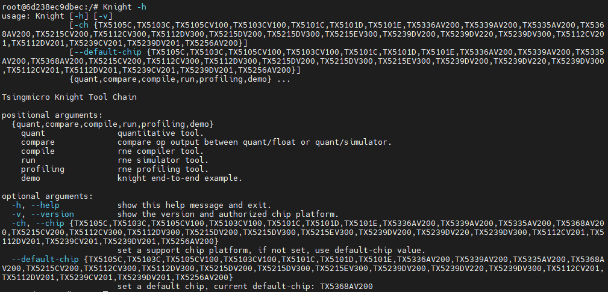

\

**2）特殊场景运行示例**

在使用 ``Knight compare`` 工具的 ``--show-hist`` 直方图功能时，应参考以下方式启动docker。该功能详情请参见 :doc:`量化使用指南<../user_guides_base/quant>` 。

a) 在宿主机开放权限，允许所有用户访问X11 的显示接口：

如果没有安装X11，请执行如下命令:

.. code-block:: bash

   sudo apt-get install x11-xserver-utils

如果$HOME目录下没有.Xauthority文件，创建空文件touch .Xauthority并执行：

.. code-block:: bash

   xhost +

在宿主机每一次开机时执行xhost +

b) 在启动容器时，必须使用root用户权限，同时需额外添加以下命令：

.. code-block:: python

   -u root

   -e DISPLAY=$DISPLAY

   -v /tmp/.X11-unix:/tmp/.X11-unix:rw

   -v $HOME/.Xauthority:/root/.Xauthority

   --net host

c) 运行示例

.. code-block:: python

   docker run -v localhost_dir:container_dir -u root --net host -e
   DISPLAY=$DISPLAY -v /tmp/.X11-unix:/tmp/.X11-unix:rw -v
   $HOME/.Xauthority:/root/.Xauthority -u root -it ts.knight:xxx
   /bin/bash

库文件使用说明
--------------

库文件包括TX510x-Lib,TX5368x_TX5339x_TX5335x-Lib,TX5112x_TX5239x201-Lib,TX5215x_TX5239x200_TX5239x220_TX5239x300-Lib以及TX5336x_TX5256x-Lib使用详情参见`SDK使用指南`_ 。

Knight Finetune库使用详情参见  :doc:`SDK使用指南<../user_guides_base/sdk>`   。
 
支持芯片
========

TS.Knight工具链支持清微芯片型号参见 `支持芯片`_ 。

当前默认芯片型号为 ``TX5368AV200``，如果使用其他系列芯片工具链，可使用 ``--default-chip``
修改默认芯片型号，或者在使用 ``Knight`` 命令行中配置 ``-ch/--chip`` 参数指定芯片型号。

Knight使用方式
==============

整体介绍
--------

如下图所示 ``TS.Knight`` 工具链设计了两层命令行参数，总体命令行层次图如下所示。

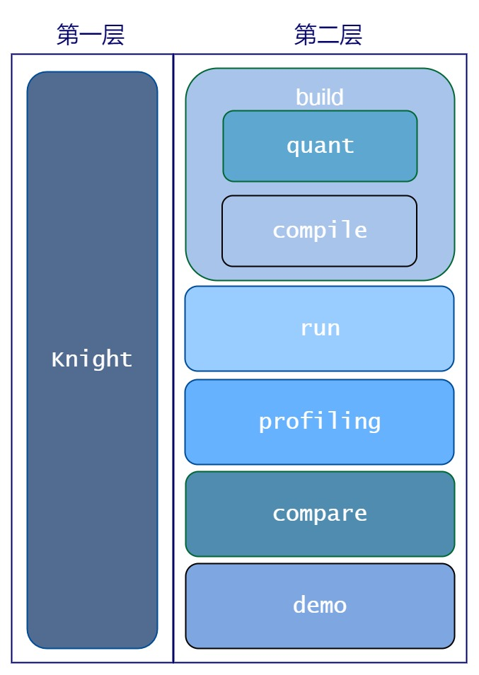

命令介绍
--------

第一层命令介绍
~~~~~~~~~~~~~~

第一层命令为 ``Knight`` ，作为工具链功能的总入口。

命令参数说明
^^^^^^^^^^^^

 ``Knight`` 命令支持参数如下：

- -v: 查看Knight工具链版本信息，界面显示如下所示。

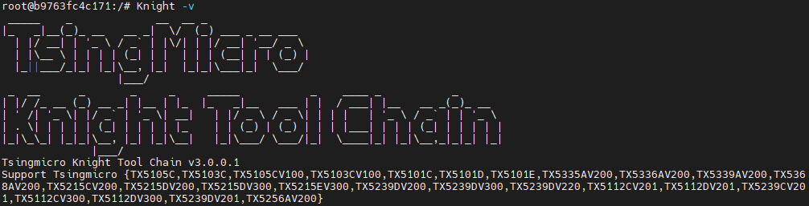

\

- -h: 查看帮助信息，界面显示参见 `运行示例`_ 。

- -ch/--chip:
  配置芯片型号，可调用相应型号下的工具链功能，可选命令参数，默认值为 ``TX5368AV200`` 。

- --default-chip:
  配置芯片型号 ``-ch/--chip`` 默认值，用户可通过以下命令行配置新的默认值。

.. code-block:: bash

   Knight --default-chip TX5368AV200

执行命令后，如果 ``Knight`` 命令中未指定芯片型号 ``-ch/--chip`` ，则其默认值为 ``TX5368AV200`` 。

命令行模板
^^^^^^^^^^

通过 ``Knight`` 命令并配置芯片型号 ``-ch/--chip`` 参数即可调用相应型号下的工具链功能。 ``Knight`` 命令行模板如下所示。

.. code-block:: shell

   Knight -ch/--chip [芯片型号] [第二层命令] …

第二层命令介绍
~~~~~~~~~~~~~~

.. _命令参数说明-1:

命令参数说明
^^^^^^^^^^^^

第二层命令中支持命令参数如下：

\

- -h: 查看帮助信息，比如RNE编译器查看帮助信息界面示例如下。

..

 .. figure:: ../media/overview_cmd2.png
    :alt: pipeline
    :align: center

命令说明
^^^^^^^^

第二层命令对应工具链的功能，命令取值和对应含义如下表所示。

+----------------+-----------------------------------------------------+
| **第二层命令** | **含义**                                            |
+================+=====================================================+
| build          | Knight量化编译工具,包括模型量化，编译两个步骤      |
+----------------+-----------------------------------------------------+
| quant          | Knight量化工具,详情参见《TS.Knight-量化使用指南》  |
+----------------+-----------------------------------------------------+
| compile        | Knight                                              |
|                | RNE编译                                             |
|                | 器,详情参见《TS.Knight- `编译仿真性能分析使用指南`_》  |
+----------------+-----------------------------------------------------+
| compare        | Knight精度比较                                      |
|                | 工具，详情参第        `Knight compare工具介绍`_   |
+----------------+-----------------------------------------------------+
| run            | Knight                                              |
|                | RNE模拟                                             |
|                | 器，详情参见《TS.Knight- `编译仿真性能分析使用指南`_》  |
+----------------+-----------------------------------------------------+
| profiling      | Knight                                              |
|                | RNE性能分析                                         |
|                | 器，详情参见《TS.Knight- `编译仿真性能分析使用指南`_》  |
+----------------+-----------------------------------------------------+
| demo           | Knight Demo演示，详情参见《TS.Knight-快速上手指南》 |
+----------------+-----------------------------------------------------+

配置文件介绍
------------

TS.Knight工具链第二层命令行支持两种使用方式：一是配置文件的使用方式；二是命令行的使用方式。

除Knight demo命令外，以下6个命令均可支持配置文件的使用方式，命令行模板如下所示：

.. code-block:: shell

   Knight build/quant/compile/run/profiling/compare -rc/--run-config config.json

具体示例如下

.. code-block:: bash

   Knight build --run-config config.json

   Knight quant --run-config config.json

   Knight compile --run-config config.json

   Knight run --run-config config.json

   Knight profiling --run-config config.json

   Knight compare --run-config config.json

在 ``json`` 配置文件中可定义 ``quant`` ,  ``compile`` ,  ``run`` ,  ``profiling`` ,  ``compare`` 
字段，不要求包含所有的字段，根据需要执行的流程进行配置即可。

仅包含4个字段的配置文件，示例如下

.. code-block:: json

   {

      "chip": "TX5336AV200",
      "quant": {
         "model": "resnet18.onnx",
         "infer-func": "infer_resnet18",
         "data": "path/data_dir",
         "bit-width": 8,
         "iteration": 50,
         "batch-size": 1,
         "ir-batch": 1,
         "log-level": 3,
         "quant-mode": "kl",
         "run-mode": "quant",
         "output-dequant": false,
         "save-dir": "output",
         "user-defined-script": "model_define.py",
         "input-configs":[
            {
            "input_name": "input1",
            "data_dir": "path/to/img_data",
            "color_space": "BGR",
            "mean": [0, 0, 0],
            "std": [255.0, 255.0, 255.0],
            "is_yolo":false
         }]
      "compile": {
         "onnx": "output/resnet18_quantized.onnx",
         "save-dir": "output/",
         "hardware-resource-mode": "big"
         },

      "run": {
         "input": "output/resnet18_quantized_r.onnx",
         "format": "nchw",
         "weight": "output/resnet18_quantized_r.weight",
         "config": "output/resnet18_quantized_r.cfg",
         "save-dir": "output"
         },

      "profiling": {
         "config": "output/resnet18_quantized_r.cfg",
         "save-dir": "output"
      }}

当执行如下命令时，则仅读取 ``quant`` 字段信息，并执行量化操作。

.. code-block:: bash

   Knight quant --run-config config.json

当同时指定config配置文件和命令行参数时，则命令行参数生效，优先级高于配置文件，示例如下。

.. code-block:: bash

   Knight quant --run-config config.json --bit-width 16

当执行  ``Knight build`` 则连续执行量化 ``quant`` 和 编译 ``compile`` 两个步骤，此时若需要同时使用命令行，
则需要增加 ``quant`` 或 ``compile`` 前缀，示例如下。

.. code-block:: bash

   Knight build --run-config config.json --quant.bit-width 16 --compile.save-dir "/tmp"

若想连续执行 ``build`` ， ``run`` 的命令，则需要注意在配置文件中将编译的输出文件作为模拟的输入文件。

量化json配置参考
~~~~~~~~~~~~~~~~

下面是包含 `quant` 字段的完整json配置文件参考，详细信息请参考  :doc:`量化使用指南<../user_guides_base/quant>` 。

.. code-block:: json

	{
	//可选，默认和--default-chip一致(默认为TX5368AV200)
	"chip": "<芯片型号>"
	"quant": {
		// 待量化模型所属框架类型。类型：string，可选，默认"onnx",取值范围[onnx, pytorch, caffe,paddle, tensorflow]
		"framework": "onnx",
		// 指定模型文件，若为ONNX格式则指ONNX模型文件。类型：string，必选
		"model": "resnet18.onnx",
		// 模型权重文件，类型：string，可选，默认None
		"weight": "None",
		// 前向推理函数名称。类型：string，可选，默认"infer_auto"
		"infer-func": "infer_auto",
		//量化输入数据路径，类型：string，可选
		"data": "path/data_dir",
		//量化位宽，类型：int，可选，默认8，取值范围[8, 16
		"bit-width": 8,
		//量化时模型执行推理次数，类型：int，可选，默认1
		"iteration": 200,
		//量化模型时加载量化数据的batchsize大小。类型：int，可选，默认1
		"batch-size": 16,
		//设置量化后模型的batchsize。类型：int，可选，默认1
		"ir-batch": 1,
		//日志级别。类型：int，可选，默认3
		"log-level": 3,
		//计算激活系数方式。类型：string，可选，默认kl
		"quant-mode": "kl" ,
		//仅在quant-mode设置为percentile时生效，设定量化百分位。类型：string，可选，默认0.99999
		"percent": 0.99999,
		//量化模式。类型：string，可选，默认quant
		"run-mode": "quant",
		//指定量化后模式输入数据类型。类型：string，可选，默认None
		"quantize-input-dtype": "None",
		//存放量化scale信息的json文件路径。类型：string，可选，默认None
		"load-scale-json": "None",
		//是否增加反量化。类型：bool，可选， 默认false
		"output-dequant": false,
		//指定Tensorflow模型量化开始节点名。类型：string，可选，默认None
		"start-node-names": "None",
		//指定Tensorflow模型量化结束节点名。类型：string，可选，默认None
		"end-node-names": "None",
		//仅量化Tensorflow模型时使用，指定后当输入format为4维NHWC，转出的onnx模型从输入开始的format都为NCHW。类型：bool，可选，默认false
		"convert2chw": false,
		//输入数据shape,仅针对Paddle模型。类型：list，可选，默认None
		"input-shapes": "None",
		//指定量化后模型保存路径。类型：string，可选，默认"/TS-KnightOutput/QuantOnnx/"
		"save-dir": "/TS-KnightOutput/QuantOnnx/",
		//设置生成模型对应的混合量化模板json配置文件。类型：string，可选，默认None
		"generate-template":"None",
		//混合量化json文件路径。类型：string，可选，缺省None
		"mix-config": "None",
		//指定输入后需要增加的BN算子的方差。类型：string，可选，缺省None
		"std": 0, 0, 0,
		//指定输入后需要增加的BN算子的均值。类型：string，可选，缺省None
		"mean": 255.0, 255.0, 255.0,
		//指定用户自定义的python脚本，用于加载推理函数、加载pytorch模型定义。类型：string，可选，缺省None
		"user-defined-script": "path/model_define.py",
		//量化并行cpu数。类型：int，可选，默认5
		"cpu-num": 5,
		//scale统计直方图缓存文件路径，设置该参数，则会加载缓存文件，跳过scale计算前向推理过程。类型：string，可选，默认None
		"cache-distribution": "None",
		//是否对Concat，Stack和ScatterND类型的算子进行系数统一。类型：bool，可选，缺省false
		"unify-input-scale": false,
		//设置lut表格长度。类型：int，可选，默认10, 取值范围[8, 9, 10, 11,12]
		"lut-len": 10,
		//生成混合量化模板时使用。类型：float，可选，默认0.5
		"auto-mix-ratio":0.5,
		//指定混合量化模板生成策略。类型：string，可选，默认initial，取值范围['HAWQ', 'IOhigh', ‘initial’]
		"auto-mix-strategy": "initial",
		//数据预处理
		"input-configs":[
			{
			// onnx模型输入名称，必选
			"input_name": "input",
			// 输入图像的路径，必选
			"data_dir": "path/to/img_data",
			// onnx模型需要的图像格式，取值范围[BGR,RGB,Gray]，可选，默认BGR
			"color_space": "BGR",
			//均值，可选
			"mean": [0, 0, 0],
			// 方差，可选
			"std": [255.0, 255.0, 255.0],
			//是否采用yolo的letterbox预处理，类型：bool，可选，默认false,
			"is_yolo": false
			}]}

配置文件加载数据集
~~~~~~~~~~~~~~~~~~

指定预处理参数input-configs，即可使用配置文件的方式对输入的数据集进行预处理，无需编写python代码即可完成量化操作，详情参见 :doc:`量化使用指南<../user_guides_base/quant>` ，使用示例如下：

.. code-block:: json

    {
    "quant": {
        "model": "yolov5.onnx",
        "framework": "onnx",
        "infer-func": "infer_yolov5",
         "bit-width": 8,
         "quant-mode": "min_max",
         "batch-size": 1,
         "run-mode": "quant",
         "mean": "0.0 0.0 0.0",
         "std": "255.0 255.0 255.0",
         "output-dequant": false,
         "save-dir": "output",

    "input-configs":[{
        "input_name": "input",
        "data_dir": "path/to/img_data",
        "color_space": "BGR",
        "is_yolo": "false"

        }]}

Knight demo介绍
===============

为了用户能够有更加直观的体验， ``Knight`` 提供了 ``demo`` 演示的命令，通过简单配置参数即可完成工具链各项功能的 ``demo`` 演示。
在启动容器后，输入

.. code-block:: bash

    Knight --chip TX5368AV200 demo -h

界面示例如下图所示：

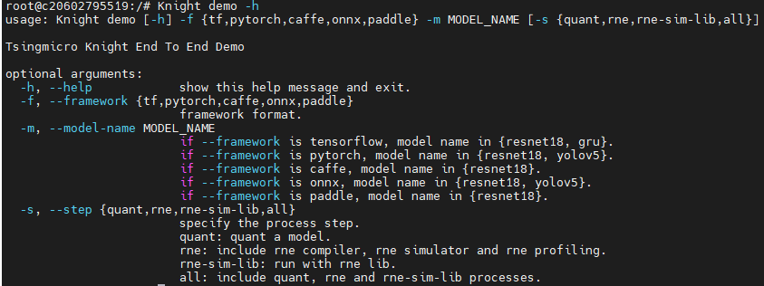

\

.. note::

   请注意，当--framework为不同量化框架时, 可演示的模型范围有所不同。

+-------------+---------+--------+------------------------------------------------------------------------------------------------------+
|参数名称     |必需/可选| 默认值 |   说明                                                                                               |
+=============+=========+========+======================================================================================================+
| -f或        | 必需    | 无     | 表示                                                                                                 |
| --framework |         |        | 原始模型框架类型，可选范围{pytorch,caffe, tf, onnx, paddle}                                          |
+-------------+---------+--------+------------------------------------------------------------------------------------------------------+
| -m或-       | 必需    | 无     | 表示当前demo中的模型名称。                                                                           |
| -model-name |         |        |                                                                                                      |
+-------------+---------+--------+------------------------------------------------------------------------------------------------------+
| -s或--step  | 可选    | all    |表示demo演示的阶段，该参数可选，默认all，取值范围{quant,rne, rne-sim-lib,all}：                       |
|             |         |        | - quant表示对demo模型进行量化，同时会对原始浮点模型进行推理测试、对量化后定点模型进行推理测试。      | 
|             |         |        | - rne表示对量化后的demo模型进行编译、模拟推理、性能分析。                                            |
|             |         |        | - rne-sim-lib表示对已经开发好的C代码app进行编译链接模拟库并运行。                                    |
|             |         |        | - all 表示顺序运行                                                                                   |
|             |         |        |上述quant\\rne\\rne-sim-lib全流程。                                                                   |
|             |         |        |注意，需要先运行quant后，才可运行rne，rne运行后，才可运行rne-sim-lib。                                |
+-------------+---------+--------+------------------------------------------------------------------------------------------------------+
| -h或--help  | 可选    | 无     | 显示帮助信息。                                                                                       |
+-------------+---------+--------+------------------------------------------------------------------------------------------------------+

Knight compare工具介绍
======================

工具说明
--------

为了方便定位产生精度问题的算子，我们可以通过对比浮点-量化算子或者量化-模拟器算子的输出。

Compare工具缺省给出了两种精度指标，MRE和余弦相似度。MRE越小，相似度越高。余弦相似度越大，相似度越高。除了MRE和余弦相似度，compare工具还有三种可选的精度指标，分别是均方根误差（rmse）,最大单点误差（maxdiff），有偏性（bias）。下表为上述5个精度指标的公式及说明。

+-----+-----------+-------------------------+-------------------------+
|名称 |   简称    |   计算公式              |   说明                  |
+=====+===========+=========================+=========================+
|mre  | 平均      | n = np.abs(right_data - | 数值越大，误差越大      |
|     | 相对误差  | left_data).sum()        |                         |
|     |           |                         |                         |
|     |           | d =                     |                         |
|     |           | np.abs(left_data).sum() |                         |
|     |           |                         |                         |
|     |           | return n / d            |                         |
+-----+-----------+-------------------------+-------------------------+
|cos  | 余        | num = np.dot(left_data, | 数值越小，误差越大      |
|     | 弦相似度  | right_data)             |                         |
|     |           |                         |                         |
|     |           | denom =                 |                         |
|     |           | np                      |                         |
|     |           | .linalg.norm(left_data) |                         |
|     |           | \*                      |                         |
|     |           | np.                     |                         |
|     |           | linalg.norm(right_data) |                         |
|     |           |                         |                         |
|     |           | res = num / denom       |                         |
|     |           |                         |                         |
|     |           | return 0.5 + 0.5 \* res |                         |
+-----+-----------+-------------------------+-------------------------+
|rmse | 均        | n = np.power(right_data | 数值越大，误差越大      |
|     | 方根误差  | - left_data, 2).sum()   |                         |
|     |           |                         |                         |
|     |           | d = np.power(left_data, |                         |
|     |           | 2).sum()                |                         |
|     |           |                         |                         |
|     |           | return np.sqrt(n/d)     |                         |
+-----+-----------+-------------------------+-------------------------+
|maxdi| 单        | m1计算:                 | 数值越大，误差越大      |
|ff   | 点最大误  |                         |                         |
|     | 差(m1/m2) | c = left_data > 1e-6    |                         |
|     |           |                         |                         |
|     |           | m1_base = left_data[c]  |                         |
|     |           |                         |                         |
|     |           | m1_eval = right_data[c] |                         |
|     |           |                         |                         |
|     |           | m1_diff =               |                         |
|     |           | np.abs(m1_eval -        |                         |
|     |           | m1_base) /              |                         |
|     |           | np.abs(m1_base)         |                         |
|     |           |                         |                         |
|     |           | m1 = m1_diff.max()      |                         |
|     |           |                         |                         |
|     |           | m2计算:                 |                         |
|     |           |                         |                         |
|     |           | c = left_data > 1e-6    |                         |
|     |           |                         |                         |
|     |           | m2_base = left_data[c]  |                         |
|     |           |                         |                         |
|     |           | m2_eval = right_data[c] |                         |
|     |           |                         |                         |
|     |           | m2_diff =               |                         |
|     |           | np.abs(m1_eval -        |                         |
|     |           | m1_base)                |                         |
|     |           |                         |                         |
|     |           | m2 = m2_diff.max()      |                         |
+-----+-----------+-------------------------+-------------------------+
|bias | 有偏性    | g_cnt = (right_data >   | 第一个数据大，表示数    |
|     | （b1,b2)  | left_data).sum()        | 据偏向右边。第二个数据  |
|     |           |                         | 大，表示数据偏向左边。  |
|     |           | l_cnt = (right_data <   |                         |
|     |           | left_data).sum()        |                         |
|     |           |                         |                         |
|     |           | n = g_cnt + l_cnt       |                         |
|     |           |                         |                         |
|     |           | return g_cnt / n, l_cnt |                         |
|     |           | / n                     |                         |
+-----+-----------+-------------------------+-------------------------+

**说明：**

quant-float比较时，left_data表示浮点数据，right_data指量化数据。
quant-sim比较时, left_data表示量化数据, right_data指模拟器数据。
sim-sim比较时，left_data指第一个路径数据，right_data指第二个路径数据。

Compare工具使用前，需要准备好待比较的数据。量化数据的准备需要使用量化工具的compare运行模式。具体参考 :doc:`量化使用指南<../user_guides_base/quant>` 。模拟器数据的准备需要使用模拟器的--debug参数，
具体参考  :doc:`编译仿真性能分析使用指南<../user_guides_base/compile>` 。

Compare工具支持量化-浮点，量化-模拟器，模拟器-模拟器三种数据比较方式。

参数说明
--------

+----------------+---------+-------+-----------------------------------+
|   参数名称     |必需/可选  |   默认值 |   说明                            |
+================+=========+=======+===================================+
| -qd或          | 可选    | None  | 量化输出的存储路径，即量化输出    |
|                |         |       | dump目录的父目录的路径。参考《TS. |
| --quant-dir    |         |       | Knight-量化使用指南》的--run-mode |
|                |         |       | compare参数说明。                 |
|                |         |       |                                   |
|                |         |       | 如果进行量化-浮点或者量化         |
|                |         |       | -模拟器的输出比较，此参数为必需。 |
+----------------+---------+-------+-----------------------------------+
| -sd或          | 可选    | None  | 模拟器输出的保存路径              |
|                |         |       | 。参考《TS.Knight-编译仿真性能分  |
| --sim-dir      |         |       | 析使用指南》--save-dir参数说明。  |
|                |         |       |                                   |
|                |         |       | 如果进行量化                      |
|                |         |       | -模拟器的数据比较，此参数为必需。 |
|                |         |       |                                   |
|                |         |       | 也可以进行两个模拟器输            |
|                |         |       | 出数据的比较，此时--sim-dir需要指 |
|                |         |       | 定两个路径，路径之间用冒号隔开。  |
+----------------+---------+-------+-----------------------------------+
| -on或          | 可选    | None  | 指定要比较的算子                  |
|                |         |       | 输出名称，默认比较所有算子输出。  |
| --out-name     |         |       |                                   |
+----------------+---------+-------+-----------------------------------+
| -sh或          | 可选    | False | 显示指                            |
|                |         |       | 定算子的输出比较直方图，需要指定  |
| --show-hist    |         |       | --out-name才能生效。设置该参数时  |
|                |         |       | 表示显示直方图，不设置时不显示。  |
|                |         |       |                                   |
|                |         |       | 如果同时指定了                    |
|                |         |       | --compare-result参数，也可以不指  |
|                |         |       | 定--out-name。工具会把每一个输出  |
|                |         |       | 的比较直方图都保存到指定目录下。  |
+----------------+---------+-------+-----------------------------------+
| -sl或          | 可选    | 0     | 设置要比较数据的级别，可选        |
|                |         |       | 范围{0,1,2,3,4,5,6}，默认值为0。  |
| --show-level   |         |       |                                   |
|                |         |       | 0: 不显示out-name输出数据。       |
|                |         |       |                                   |
|                |         |       | 1:                                |
|                |         |       | 显示out-n                         |
|                |         |       | ame输出相对误差在[0,1)%之间数据。 |
|                |         |       |                                   |
|                |         |       | 2:                                |
|                |         |       | 显示out-na                        |
|                |         |       | me输出相对误差在[1,10)%之间数据。 |
|                |         |       |                                   |
|                |         |       | 3:                                |
|                |         |       | 显示out-nam                       |
|                |         |       | e输出相对误差在[10,50)%之间数据。 |
|                |         |       |                                   |
|                |         |       | 4:                                |
|                |         |       | 显示out-name                      |
|                |         |       | 输出相对误差在[50,100)%之间数据。 |
|                |         |       |                                   |
|                |         |       | 5:                                |
|                |         |       | 显示out-nam                       |
|                |         |       | e输出相对误差大于等于100%的数据。 |
|                |         |       |                                   |
|                |         |       | 6: 显示out-name输出所有的数据。   |
+----------------+---------+-------+-----------------------------------+
| -sn或          | 可选    | 10    | 显示要比较的数据的个数            |
|                |         |       | ，默认显示10条，当--              |
| --show-number  |         |       | show-level设置为0时，不显示数据。 |
+----------------+---------+-------+-----------------------------------+
| -si或          | 可选    | False | 显示对比数                        |
|                |         |       | 据时，是否显示索引，设置该参数时  |
| --show-index   |         |       | 表示显示索引值，不设置时不显示。  |
+----------------+---------+-------+-----------------------------------+
| --save-dir     | 可选    | 标准  | 指定比较结果的保存路径            |
|                |         | 输出  | 。如果没有指定，则输出到屏幕上。  |
+----------------+---------+-------+-----------------------------------+
| --no-mre       | 可选    | False | 不输出MRE指标                     |
+----------------+---------+-------+-----------------------------------+
| --no-cos       | 可选    | False | 不输出余弦相似度指标              |
+----------------+---------+-------+-----------------------------------+
| --rmse         | 可选    | False | 输出均方根误差                    |
+----------------+---------+-------+-----------------------------------+
| --maxdiff      | 可选    | False | | 单点最大误差(两个数值m1/m2)     |
|                |         |       | | m1: 最大的相对误差              |
|                |         |       |                                   |
|                |         |       | m2: 最大的绝对误差                |
+----------------+---------+-------+-----------------------------------+
| --bias         | 可选    | False | 有偏性(两个数值b1/b2)             |
|                |         |       |                                   |
|                |         |       | b1：右边数>左边数的百分比         |
|                |         |       |                                   |
|                |         |       | b2：左边数>右边数的百分比         |
+----------------+---------+-------+-----------------------------------+
| --sort         | 可选    | None  | 按照指定的精度指标进行排序。      |
|                |         |       |                                   |
|                |         |       | 可选排序字                        |
|                |         |       | 段为：mre,cos,rmse,maxdiff,bias。 |
|                |         |       |                                   |
|                |         |       | 排序方式是误差大的排在            |
|                |         |       | 前面，因此除了cos指标是按照数值升 |
|                |         |       | 序外，其余指标都是按照降序排列。  |
|                |         |       |                                   |
|                |         |       | maxdiff和bias有两个数值，先按照第 |
|                |         |       | 一个数值降序排列，如果第一个数值  |
|                |         |       | 相同，则按照第二个数值降序排列。  |
|                |         |       |                                   |
|                |         |       | 缺省不排序。                      |
+----------------+---------+-------+-----------------------------------+
| --show-plot    | 可选    | False | 显示指定精度指标的折线图。        |
|                |         |       |                                   |
|                |         |       | 缺                                |
|                |         |       | 省不显示折线图，只显示统计列表。  |
+----------------+---------+-------+-----------------------------------+
| --op-type      | 可选    | 无    | 只显示指定类型的算子统计数据。    |
|                |         |       | 多                                |
|                |         |       | 个算子类型用逗号隔开。大小写敏感  |
|                |         |       | 。不存在的算子类型忽略，不报错。  |
|                |         |       | 缺省显示所有的算子的统计数据。    |
|                |         |       | 只适用于量化                      |
|                |         |       | 定点/浮点，量化定点/模拟器比较。  |
+----------------+---------+-------+-----------------------------------+
| --index-range  | 可选    | 无    | | 只显                            |
|                |         |       | 示指定序号范围内的算子统计数据。  |
|                |         |       | | 参数形式:                       |
|                |         |       |   <start1-end1>,<start2-end2>,... |
|                |         |       | | 1.序号从0开始。                 |
|                |         |       |                                   |
|                |         |       | 2.所有start必须小于等于所有end。  |
|                |         |       |                                   |
|                |         |       | 3.显示范围为包括start和end。      |
|                |         |       |                                   |
|                |         |       | 4.start必须有，end可              |
|                |         |       | 以没有，缺省表示显示至最后一条。  |
|                |         |       |                                   |
|                |         |       | 5.如果有超出范围则报错。          |
+----------------+---------+-------+-----------------------------------+
| --run-config   | 可选    | 无    | 命令行配置文件路径。              |
|                |         |       |                                   |
|                |         |       | 将上述命令行选项写到一个json      |
|                |         |       | 文件中传给compare工具。命令行参数 |
|                |         |       | 的优先级高于配置文件中的对应项。  |
|                |         |       |                                   |
|                |         |       | 具体文件                          |
|                |         |       | 格式参考\ **4.3**\ 配置文件介绍。 |
+----------------+---------+-------+-----------------------------------+
| -h或--help     | 可选    | 无    | 显示帮助信息。                    |
+----------------+---------+-------+-----------------------------------+

使用示例
--------

功能一：量化-浮点精度对比
~~~~~~~~~~~~~~~~~~~~~~~~~

**步骤一：量化(可选, 若已量化则跳过)**

.. code-block:: bash

   Knight -chip TX5368AV200 quant -m /TS- KnightDemo/Resources/Classification/resnet18/onnx_model/resnet18.onnx \
   -if infer_onnx_resnet18 \
   -d /TS-Kni ghtDemo/Resources/Classification/data/test_data/test_data_images_onnx \
   -r quant -uds /TS-K nightDemo/Resources/Classification/pysrc/resnet18_infer/infer_demo.py \
   -save-dir /TS-KnightDemo/Output/resnet18_onnx_use_onnx/quant/

**步骤二：保存层输出数据（可选，若已保存则跳过）**

.. code-block:: bash

   Knight --chip TX5368AV200 quant -m /TS-KnightDemo/Resources/Classification/resnet18/onnx_model/resnet18.onnx -if infer_onnx_resnet18 
   -d  /TS-KnightDemo/Resources/Classification/data/test_data/test_data_images_onnx  -r compare -uds   
   /TS-KnightDemo/Resources/Classification/pysrc/resnet18_infer/infer_demo.py --save-dir /TS-KnightDemo/Output/resnet18_onnx_use_onnx/quant/

**步骤三：逐层数据比对**

.. code-block:: bash
   
   Knight --chip TX5368AV200 compare -qd /TS-KnightDemo/Output/resnet18_onnx_use_onnx/quant          

.. figure:: ../media/overview_compare.png
    :alt: pipeline
    :align: center

功能二：量化-模拟器数据对比
~~~~~~~~~~~~~~~~~~~~~~~~~~~

**步骤一：准备量化数据**

参考量化-浮点对比描述。

**步骤二：准备模拟器输入数据**

首先，修改infer函数，把模型的输入数据保存为.bin文件。

修复文件： ``/TS-KnightDemo/Resources/Classification/pysrc/resnet18_infer/infer_demo.py``

在上述文件的192行的前面（函数 ``infer_onnx_resnet18`` 的内部）

.. code-block:: python

    192 output = executor.forward(input_data)                        

增加一行代码，调用numpy数组的tofile函数，示例如下：

.. code-block:: python

   192 input_data.flatten().tofile(f'{executor.save_dir}/model_input.bin')   
   193 output = executor.forward(input_data)                            

然后，运行量化的推理模式

.. code-block:: python

   Knight --chip TX5368AV200 quant -m /TS-KnightDemo/Resources/Classification/resnet18/onnx_model/resnet18.onnx  
   -if infer_onnx_resnet18 -d /TS-KnightDemo/Resources/Classification/data/test_data/test_data_images_onnx -r infer  
   -uds /TS-KnightDemo/Resources/Classification/pysrc/resnet18_infer/infer_demo.py --save-dir /TS-KnightDemo/Output/resnet18_onnx_use_onnx/quant/

命令运行完毕后，会保存如下文件

.. code-block:: bash 

   /TS-KnightDemo/Output/resnet18_onnx_use_onnx/quant/model_input.bin    

**步骤三: 编译debug模型** 
( ``--opt-ddr`` 参数必须为0, 否则, DDR优化会导致导出数据和量化数据对不齐)

.. code-block:: bash 

   Knight compile --chip TX5368AV200--onnx  /TS-KnightDemo/Output/resnet18_onnx_use_onnx/quant/resnet18_quantize.onnx  
   --save-dir /TS-KnightDemo/Output/resnet18_onnx_use_onnx/rne        
   --debug --opt-ddr 0

编译结果:

.. code-block:: bash 

   /TS-KnightDemo/Output/resnet18_onnx_use_onnx/rne/resnet18_quantize_d.tsmodel 

**步骤四：导出模拟器数据**

**方式1(推荐)**, 利用量化时导出的dump.json指定要导出的数据

.. code-block:: bash 

   Knight run --chip TX5368AV200 --model  /TS-KnightDemo/Output/resnet18_onnx_use_onnx/rne/resnet18_quantize_d.tsmodel 
   --input  /TS-KnightDemo/Output/resnet18_onnx_use_onnx/quant/model_input.bin --format nchw --save-dir /TS-KnightDemo/Output/resnet18_onnx_use_onnx/rne 
   --debug  /TS-KnightDemo/Output/resnet18_onnx_use_onnx/quant/dump.json

**方式2**, 命令行直接指定要导出的算子的名称（多个算子的名称用逗号隔开）

.. code-block:: bash 

   Knight run --chip TX5368AV200 --model  /TS-KnightDemo/Output/resnet18_onnx_use_onnx/rne/resnet18_quantize_d.tsmodel \  
   --input /TS-KnightDemo/Output/resnet18_onnx_use_onnx/quant/model_input.bin \
   --format nchw  --save-dir /TS-KnightDemo/Output/resnet18_onnx_use_onnx/rne --debug layer4_1_conv2_scaleFix,add_7_pyop

导出数据都在 ``--save-dir`` 参数指定的目录下。

**步骤五：进行量化-模拟器数据比较**

.. code-block:: bash 

   knight compare -qd /TS-KnightDemo/Output/resnet18_onnx_use_onnx/quant -sd /TS-KnightDemo/Output/resnet18_onnx_use_onnx/rne  

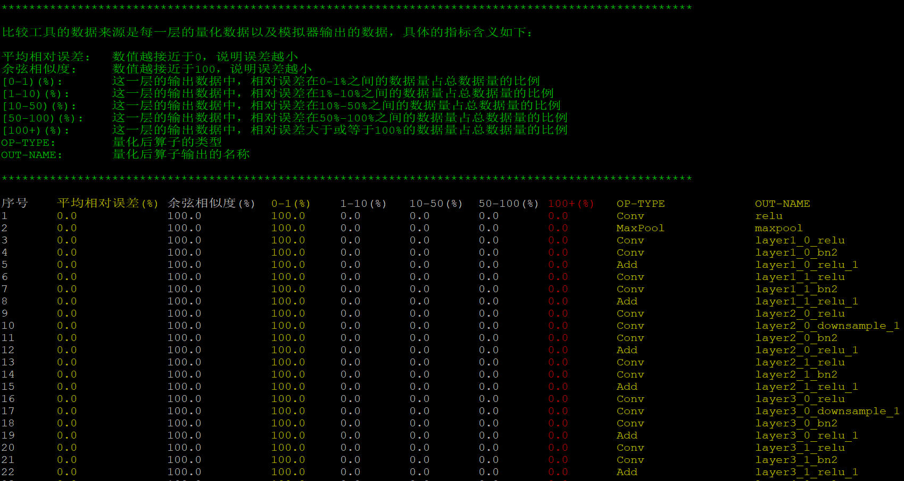
	
\

功能三：两个模拟器输出结果对比
~~~~~~~~~~~~~~~~~~~~~~~~~~~~~~

数据准备参考上一节的模拟器数据准备。

.. code-block:: bash

   knight compare -sd /TS-KnightDemo/Output/resnet18_onnx_use_onnx/rne:/TS-KnightDemo/Output/resnet18_onnx_use_onnx/rne 

.. figure:: ../media/overview_10.png
    :alt: pipeline
    :align: center

\

功能四：直方图比较
~~~~~~~~~~~~~~~~~~

要自动显示直方图, 首先需要使用MobaXterm作为终端, 其次启动knight
docker时需要确保有如下命令行选项。

.. code-block:: bash

   docker run --net host  -e DISPLAY=${DISPLAY} -v /tmp/.X11-unix/:/tmp/.X11-unix/ -v ${HOME}/.Xauthority:/root/.Xauthority 

.. code-block:: bash

   knight compare -qd /TS-KnightDemo/Output/resnet18_onnx_use_onnx/quant/  -on fc -sh

.. figure:: ../media/overview_11.png
    :alt: pipeline
    :align: center

\

输出示例如上图所示，左上为浮点算子输出的直方图，左下为浮点算子的权重直方图。右上为量化算子输出的直方图，
右下为量化算子的权重直方图。

功能五：详细数据比较
~~~~~~~~~~~~~~~~~~~~

.. code-block:: bash

   knight compare -qd /TS-KnightDemo/Output/resnet18_onnx_use_onnx/quant/ -on fc -sl 2 -si

.. figure:: ../media/overview_7.png
    :alt: pipeline
    :align: center

\

功能六：选择精度指标
~~~~~~~~~~~~~~~~~~~~

.. code-block:: bash

   knight compare -qd /TS-KnightDemo/Output/resnet18_onnx_use_onnx/quant/ --no-cos --no-mre --rmse --maxdiff     

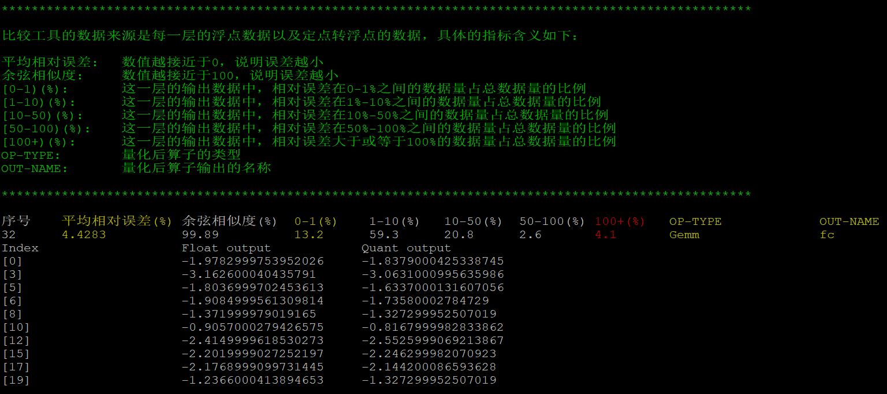

\

功能七：按照指定精度字段排序
~~~~~~~~~~~~~~~~~~~~~~~~~~~~

.. code-block:: bash

   knight compare  -qd /TS-KnightDemo/Output/resnet18_onnx_use_onnx/quant/ --no-cos --no-mre --rmse --maxdiff  --sort rmse  

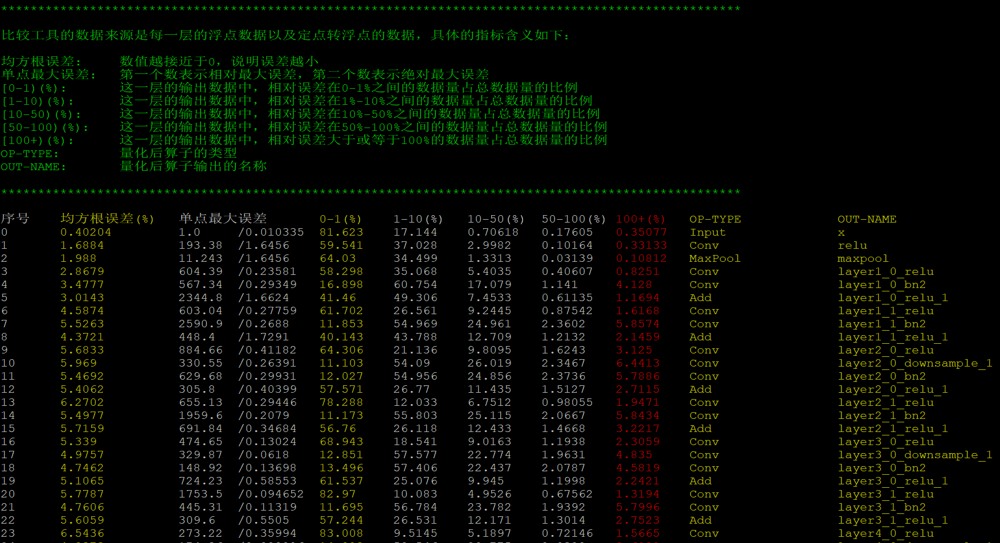

功能八：显示折线图
~~~~~~~~~~~~~~~~~~

要自动显示折线图, 需要特定的终端软件即docker命令行选项, 具体设置请参考 `功能四：直方图比较`_。

.. code-block:: bash

   knight compare -qd /TS-KnightDemo/Output/resnet18_onnx_use_onnx/quant/ --no-cos --rmse --show-plot

.. figure:: ../media/overview_14.png
    :alt: pipeline
    :align: center

同时会在屏幕上输出每个output index对应的输出名称。

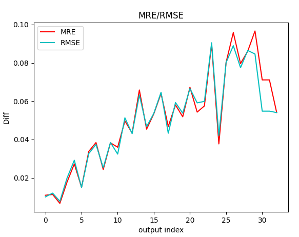

功能九：保存比较结果
~~~~~~~~~~~~~~~~~~~~

.. code-block:: bash

   knight compare -qd /TS-KnightDemo/Output/resnet18_onnx_use_onnx/quant/  -sh --save-dir tmp/result**   

此命令将所有算子的量化-浮点比较直方图输出到 ``tmp/result`` 目录中

.. figure:: ../media/overview_16.png
    :alt: pipeline
    :align: center
	

保存折线图命令

.. code-block:: bash

   Knight compare -qd /TS-KnightDemo/Output/resnet18_onnx_use_onnx/quant/ --no-cos --rmse --show-plot --save-dir ~/tmp/result         

保存的文件如下

.. figure:: ../media/overview_17.png
    :alt: pipeline
    :align: center

其中折线图为plot_result.png, plot_out_name_idx.txt保存了折线图里output
index和output name的映射关系。

功能十：选择要比较的算子类型
~~~~~~~~~~~~~~~~~~~~~~~~~~~~

.. code-block:: bash

   Knight --chip TX5368AV200 compare -qd /TS-KnightDemo/Output/resnet18_onnx_use_onnx/quant --op-type Conv,Gemm             

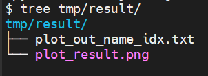
	
\

功能十一：选择要比较的算子序号范围
~~~~~~~~~~~~~~~~~~~~~~~~~~~~~~~~~~

.. code-block:: python

   Knight --chip TX5368AV200 compare -qd /TS-KnightDemo/Output/resnet18_onnx_use_onnx/quant --index-range 0-7,17-19

.. figure:: ../media/overview_6.png
    :alt: pipeline
    :align: center
	
\

Show_sim_result工具介绍
=======================

.. _工具说明-1:

工具说明
--------

此工具的可执行文件为 ``/TS-KnightSoftware/tools/show_sim_result`` 。此工具的功能如下：
   * 以直观的形式显示模拟器输出文件里的数据。
   * 将模拟器的输出数据保存到 `.npy` 文件中。
   * 可以在任意路径下执行。

参数说明
--------

+----------------+---------+-------+-----------------------------------+
|   参数名称     |必需/可选| 默认值|   说明                            |
+================+=========+=======+===================================+
| -sd或          | 必选    | 无    | 指定模拟器输                      |
|                |         |       | 出文件或者模拟器数据的保存路径。  |
| --sim-data     |         |       |                                   |
|                |         |       | 如果指                            |
|                |         |       | 定的是目录，则会将此目录下的模拟  |
|                |         |       | 器输出的*_p.txt文件转化为\*.npy文 |
|                |         |       | 件并保存到—save-dir指定的目录下。 |
|                |         |       |                                   |
|                |         |       | 注：此目录下的*_hwc_p.txt文       |
|                |         |       | 件因为和*_p.txt文件的数据完全相同 |
|                |         |       | ，只是数据排布不同，因此只会在没  |
|                |         |       | 有对应的*_p.txt文件的情况下转换。 |
+----------------+---------+-------+-----------------------------------+
| --save-dir     | 可选    | 无    | 指定\*.npy文件的保存路径。        |
|                |         |       |                                   |
|                |         |       | 如果—sim-data指定的               |
|                |         |       | 是路径，\ **则此选项为必选**\ 。  |
|                |         |       |                                   |
|                |         |       | 如果—sim-data指定的是文           |
|                |         |       | 件，则此选项非必选。无此选项时会  |
|                |         |       | 在终端上输出文件的数据，有此选项  |
|                |         |       | 时会将文件内容保存为\*.npy文件。  |
|                |         |       |                                   |
|                |         |       | **输出文件名格式**\ ：            |
|                |         |       | 文件主名和输                      |
|                |         |       | 入文件名一致，扩展名改为\*.npy。  |
+----------------+---------+-------+-----------------------------------+
| -i或           | 可选    | 无    | 在显示数据                        |
|                |         |       | 时，指定要显示的数据的索引范围。  |
| --index        |         |       |                                   |
|                |         |       | --index所指定                     |
|                |         |       | 的索引个数<=数据维度个数。第一个  |
|                |         |       | 索引范围对应数据第0维度，第二个索 |
|                |         |       | 引范围对应数据第1维度，以此类推。 |
|                |         |       |                                   |
|                |         |       | **格                              |
|                |         |       | 式：**\ 逗号分隔，索引范围列表。  |
|                |         |       |                                   |
|                |         |       | **索引范围格式**:                 |
|                |         |       |                                   |
|                |         |       | 1.                                |
|                |         |       | <                                 |
|                |         |       | n>，一个数字，表示某维度第n组数据 |
|                |         |       |                                   |
|                |         |       | 2.<start>-<end>，表示[start, end] |
|                |         |       |                                   |
|                |         |       | 3.<start>-，一个数字带一          |
|                |         |       | 个减号，表示[start,<该轴的最大值  |
|                |         |       | >]。例如，数据形状[1,3,224,224],  |
|                |         |       | 则--index                         |
|                |         |       | 0,1,2,3-表                        |
|                |         |       | 示的数据索引范围为[0,1,2,3:223]。 |
|                |         |       |                                   |
|                |         |       | **缺省：**\ 显示全部数据。        |
|                |         |       |                                   |
|                |         |       | **注：**\ 此选项只                |
|                |         |       | 适用于--sim-data指定文件的时候。  |
+----------------+---------+-------+-----------------------------------+
| -fmt或         | 可选    | nchw  | 指定输出数据的维度排列格式        |
|                |         |       |                                   |
| --format       |         |       | 支持两种格式：                    |
|                |         |       |                                   |
|                |         |       | 1. nhwc                           |
|                |         |       |                                   |
|                |         |       | 2. nchw                           |
+----------------+---------+-------+-----------------------------------+
| -h或--help     | 可选    | 无    | 显示帮助信息。                    |
+----------------+---------+-------+-----------------------------------+

.. _使用示例-1:

使用示例
--------

显示文件内容
~~~~~~~~~~~~

.. code-block:: python

   show_sim_result --sim-data /TS-KnightDemo/Output/resnet18_onnx_use_onnx/rne/dump/result-maxpool-maxpool_p.txt  

.. figure:: ../media/overview_5.png
    :alt: pipeline
    :align: center

\

指定索引范围
~~~~~~~~~~~~

.. code-block:: bash

   show_sim_result --sim-data /TS-KnightDemo/Output/resnet18_onnx_use_onnx/rne/dump/result-maxpool-maxpool_p.txt --index 0,1,2,3                                                       |

.. figure:: ../media/overview_4.png
    :alt: pipeline
    :align: center

.. code-block:: bash

   show_sim_result --sim-data /TS-KnightDemo/Output/resnet18_onnx_use_onnx/rne/dump/result-maxpool-maxpool_p.txt --index 0,1,2,3

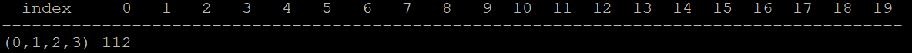

\

缺省索引范围示例
~~~~~~~~~~~~~~~~

.. code-block:: bash

   show_sim_result  --sim-data /TS-KnightDemo/Output/resnet18_onnx_use_onnx/rne/dump/result-maxpool-maxpool_p.txt  --index 0,,2,3                                                  |

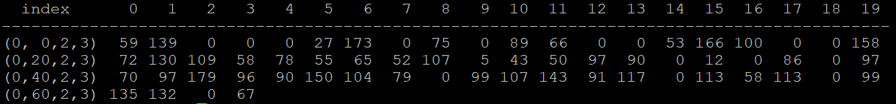

\

转换所有模拟器结果为\*.npy文件
~~~~~~~~~~~~~~~~~~~~~~~~~~~~~~

.. code-block:: python

   show_sim_result --sim-data  /TS-KnightDemo/Output/resnet18_onnx_use_onnx/rne/ --save-dir ~/result/                                                  

保存的文件如下

.. figure:: ../media/overview_1.png
    :alt: pipeline
    :align: center

\

算子介绍
========

Knight工具链中支持的算子有三类：

**高效算子**：运行在RNE硬件单元上，执行效率高；
**通用算子**：运行在CPU等通用计算硬件单元上，执行效率相比于高效算子低，用户模型中经常使用且RNE硬件单元不支持，Knight工具链出厂时已支持；
**用户自定义算子**：运行在CPU等通用计算硬件单元上，执行效率相比于高效算子低，用户自定义开发，除上述两类算子外用户模型中不支持的算子；

各芯片支持的高效算子、通用算子请参见相应芯片的 :doc:`算子支持列表<../op/op>` 。用户自定义算子的添加步骤请参见  :doc:`编译仿真性能分析使用指南<../user_guides_base/compile>` 中的自定义算子章节。

注意事项
========

**1）退出docker容器后恢复工作环境**

可重启容器，然后进入容器以恢复工作环境。

.. code-block:: python

   #重启容器
   docker start docker_name
   #进入容器
   docker exec -it docker_name /bin/bash

**2）Knight命令行芯片型号配置和位置要求**

如果指定的芯片型号不是默认的 ``TX5368AV200`` ，那么使用Knight命令行需要在每次输入命令时配置 ``--chip`` 参数指定芯片型号，配置方式示例如下:
   

.. code-block:: bash

   #正确示例，支持在Knight命令之后
   Knight --chip TX5368AV200 compile …
   Knight --chip TX5368AV200 quant …

   #正确示例，支持在所有命令之后
   Knight quant --chip TX5368AV200…
   Knight compile --chip TX5368AV200 …

   #错误示例,由于quant和compare是抽象功能，因此不支持在其后配置--chip参数。
   Knight quant --chip TX5368AV200 onnx…

**3）Knight命令行重复输入-ch/--chip时第一个生效**

当输入两次及以上的-ch/--chip参数时，第一次配置的芯片型号生效，示例如下。

.. code-block:: bash

   #此时--chip TX5368AV200生效
   Knight --chip TX5368AV200 compile --chip TX5336AV200 -h

FAQ 
====

docker权限问题
--------------

【问题描述】

如果出现“Got permission denied while trying to connect to the Docker
daemon socket at unix:///var/run/docker.sock”

【解决方法】

可能是因为用户没有权限启动docker服务，请联系管理员开通权限。

Knight容器能否使用非root权限启动
--------------------------------

【问题描述】

Knight容器能否使用非root权限启动？

【解决方法】

Knight容器默认使用root用户启动，同样可以支持使用非root权限启动，启动命令如下：

.. code-block:: bash

   docker run -it -u ${uid} ts.knight:xxx /bin/bash

Knight镜像如何增量更新
----------------------

【问题描述】

由于Knight镜像中包含多个模块，若仅有一个模块进行了更新修改，如何增量更新Knight镜像？

【解决方法】

1) 首先启动Knight容器：

.. code-block:: python

   docker run --name=knight_docker -it ts.knight:xxx /bin/bash

2) 将需要更新的模块文件在宿主机上的目录${host_module_file}拷贝到Knight容器中相应目录${docker_module_dir}下，命令示例如下：

.. code-block:: python

   docker cp ${ host_module_dir} 容器ID: ${docker_module_dir}

3) 将容器保存为新镜像，命令示例如下：

.. code-block:: python

   docker commit 容器ID ts.knight-new:xxx

model_check.py使用说明
----------------------

用户执行完量化命令和编译命令后，可使用该脚本进行检查点2，检查点3（参见 `模型资源生成开发流程`_ )结果验证，仅支持单路输入模型，当模型具有多路输出时仅对比最后一路结果。

容器内 ``/TS-Knight-software/tools/model_check/model_check.py`` 参数说明如下表所示：

+--------------------+-----+-----------+-------------------------------------+
|  参数名称          |必选/|  默认值   |   参数说明                          |
|                    |可选 |           |                                     |
+====================+=====+===========+=====================================+
|-h/--help           | 可  | 无        | 查看帮助信息                        |
|                    | 选  |           |                                     |
+--------------------+-----+-----------+-------------------------------------+
|-qo/--quant-output  |必选 | 无        | 执行量化命令时后模型保存目录。      |
|                    |     |           | ONNX 量化命令需要指定参数--dump,    |
|                    |     |           | 此时                                |
|                    |     |           | --quant-output需指定为{--save_dir}  |
|                    |     |           | /dump，或者拷贝该路径内文件到其他路 |
|                    |     |           | 径时，也可指定相应的路径，需要保证d |
|                    |     |           | ump并列的目录下有量化后的onnx模型； |
+--------------------+-----+-----------+-------------------------------------+
|-co/--compile-output| 必  | 无        | 执行编译命令时结果保存目录          |
|                    | 选  |           |                                     |
+--------------------+-----+-----------+-------------------------------------+
|-fmt/--format       | 可  |自动根据量 | 输入数据format, 取值范围            |
|                    | 选  |化输入数据 |                                     |
|                    |     |类型判断   | ["nchw","nhwc"]                     |
+--------------------+-----+-----------+-------------------------------------+
|-r/--run-mode       | 可  | 0         | 取值范围[0,1]                       |
|                    | 选  |           |                                     |
|                    |     |           | 0:                                  |
|                    |     |           | 表示仅对比                          |
|                    |     |           | 量化后结果和模拟器结果（检查点1）； |
|                    |     |           |                                     |
|                    |     |           | 1:                                  |
|                    |     |           | 表示对比量化                        |
|                    |     |           | 后结果和模拟器结果（检查点1），以及 |
|                    |     |           | 模拟器结果和模拟库结果（检查点2）。 |
+--------------------+-----+-----------+-------------------------------------+