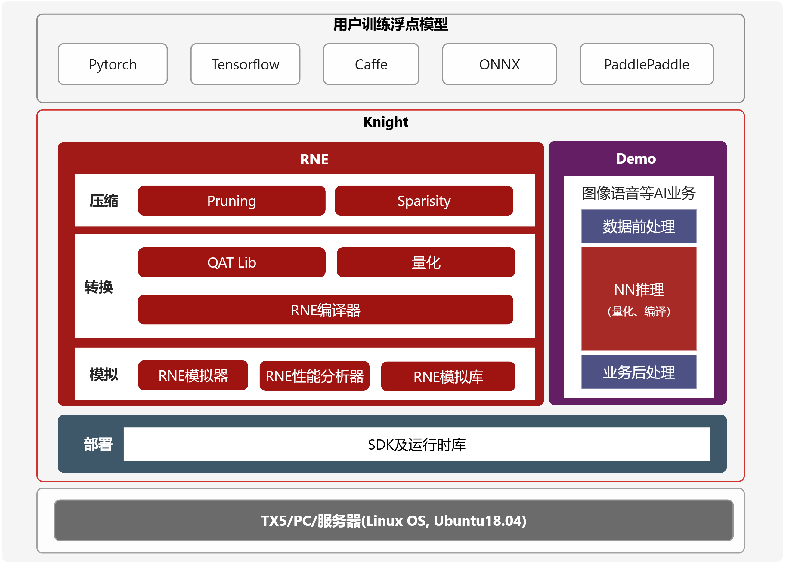
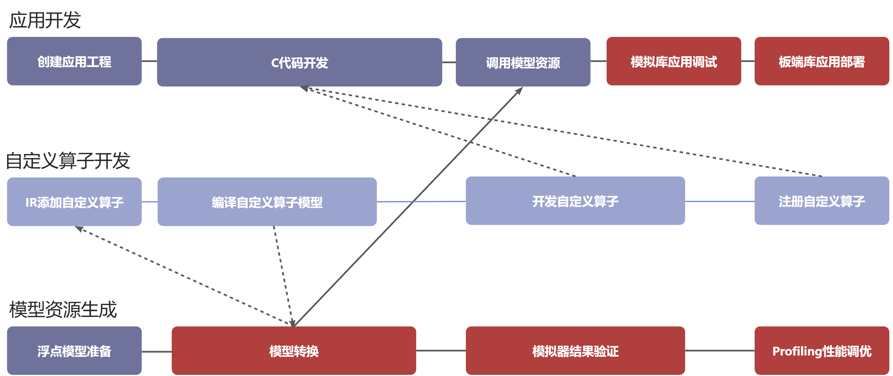

===================
使用指南综述
===================

本文档主要对清微骑士工具链 ``TS.Knight`` 进行整体介绍，帮助客户建立整体概念，引导客户更好的使用工具链提供的各项功能。同时也提供快速上手的演示方式，方便客户直接运行。

**名词解释**

+--------------------------------+-------------------------------------+
| **名词**                       | **说明**                            |
+================================+=====================================+
| Knight                         | 清微骑士工具链英文名称              |
+--------------------------------+-------------------------------------+
| QAT                            | Quantization Aware                  |
|                                | Training，量化感知训练              |
+--------------------------------+-------------------------------------+
| RNE                            | 可重构神经网络加速引擎              |
+--------------------------------+-------------------------------------+
| RCE                            | 可重构计算引擎                      |
+--------------------------------+-------------------------------------+
| Finetune                       | 微调                                |
+--------------------------------+-------------------------------------+
| IR定点模型                     | 中间表示模型，指                    |
|                                | Caffe定点模型或ONNX定点模型         |
+--------------------------------+-------------------------------------+

Knight介绍
==========

概述
----

TS.Knight是清微智能提供的一站式开发平台，包含部署AI模型所需的全套工具链，支持模型量化、精度比对、模型编译、模拟和性能分析等功能。

整体框架
--------

TS.Knight整体框架如下图所示：

-  Knight压缩工具(Knight-ModelCompression):
   用于模型剪枝、稀疏、结构搜索、模型蒸馏等模型压缩。

-  Knight量化工具(Knight-Quantize):
   基于少量数据(比如图片、语音、文本等类型) 量化浮点模型。

-  Knight RNE编译器(Knight-RNE-Compiler):
   编译量化模型，产生RNE执行的指令配置文件。

-  Knight RNE模拟器(Knight-RNE-Simulator) :
   用于仿真神经网络在RNE上推理计算过程，输出计算层的结果。

-  Knight RNE性能分析器(Knight-RNE-Profiling):
   用于分析神经网络在芯片RNE上执行时间和存储开销，并给出分析报告。

-  Knight Finetune库(Knight-Finetune-Lib) :
   即QAT库，在使用量化工具后，精度损失较大的情况下，可使用Finetune库进行量化感知训练，得到更适合量化的浮点模型。

-  Knight RNE模拟库(Knight-RNE-Simulator-Lib) :
   供用户在PC端调用编写自己的应用程序，从而实现模拟运行结果。

-  Knight RNE 运行时库(Knight-RNE-Runtime-Lib) :
   供用户在PC端交叉编译时调用，从而实现板端运行。

-  Knight Demo:
   提供计算机视觉，智能语音等领域的端到端的运行示例，演示Knight工具链的使用流程和具体用法。

.. note::

   注意：Knight压缩工具、Knight量化工具、Knight RNE编译器、Knight
   RNE模拟器和Knight RNE性能分析器所有芯片均支持。 

开发流程
--------

AI全栈应用开发流程
~~~~~~~~~~~~~~~~~~

Knight工具链可支持端侧AI推理全栈开发，包括应用开发，模型部署资源生成和自定义算子开发三个主要流程。

应用开发：用户调用Knight RNE SDK
API编写自己的业务应用，加载编译后的模型部署资源，链接模拟库在纯软件环境中仿真调试自己的应用，链接板端库在板端进行部署。

模型部署资源生成：用户准备已训练好的浮点模型，使用Knight
量化工具量化成IR定点模型，然后对比量化精度，接着编译生成模型资源，此时用户可进行模拟器结果验证以及Profiling性能调优。

自定义算子开发：当用户模型中存在芯片不支持的算子时，用户在量化后的IR模型中添加自定义算子层，之后进行IR模型编译，供应用开发时调用；用户在应用开发时进行自定义算子的C代码实现，通过SDK
API相应接口进行自定义算子注册。最后，与整个应用程序一起进行模拟库上调测，板端库上部署。

模型资源生成开发流程
~~~~~~~~~~~~~~~~~~~~

.. figure:: ./media/image7.png
    :alt: pipeline
    :align: center

1) 用户使用Knight模型转换工具将提前训练好的浮点模型量化编译成芯片部署资源(.tsmodel)。

2) 用户使用Knight RNE模拟器对测试数据进行推理，也可以使用Knight
   RNE性能分析工具对模型进行性能分析。

3) 同时用户也可以调用Knight
   RNE模拟库编写自己的业务应用在纯软件环境仿真自己的业务模型。

4) 如果步骤2、3均通过，用户可以调用Knight
   RNE运行时库编写自己的实际业务应用，部署到清微芯片上。

5) 在步骤1中，如果模型推理性能不满足需求，则用户可使用Knight压缩工具将提前训练好的浮点模型进行压缩，得到体积更小，性能更优，更适合端侧部署的浮点模型。（可选）

6) 在步骤1量化后，如果模型精度损失严重，用户可以使用QAT库，即Knight
   Finetune库（当前仅支持pytorch平台）编写自己的Finetune工具对浮点模型进行微调，得到更适合量化的浮点模型，之后再进行步骤1。（可选）

.. note::

   注意：在整个开发流程中有如下3个检查点：
   1. 用户使用Knight build工具完成模型转换后，精度比对工具可查看量化后精度是否满足业务要求；
   2. 同时model_check工具验证模拟器推理结果和Knight定点模型推理结果一致；
   3. 用户使用Knight RNE运行时库对测试数据进行推理后，需保证其推理结果和Knight RNE模拟库推理结果一致；
   以上3个检查点若不满足预期，可联系清微技术人员进行支持。

软件包目录
----------

Knight产品目录如下所示：

ReleaseDocuments目录中为产品文档，示例如下：

.. code-block:: shell

   ├── 进阶指南
   ├── 算子规格表
   ├── 01-TS.Knight-使用指南综述_V3.5.pdf
   ├── 02-TS.Knight-快速上手指南_V3.5.pdf
   ├── 03-TS.Knight-模型转换使用指南_V3.5.pd
   ├── 04-TS.Knight-仿真性能分析使用指南_V3.5.pdf
   ├── 05-TS.Knight-SDK使用指南_V3.5.pdf
   ├── 06-TS.Knight-量化工具FAQ_V3.5.pdf
   ├── 07-TS.Knight-SDK-FAQ_V3.5.pdf
   ├── 08-TS.Knight-支持模块清单_V3.5.pdf

ReleaseDeliverables目录中为软件产品，示例如下：

.. code-block:: shell

   ├── TX510x-Lib
   ├── TX5112x_TX5239x201-Lib
   ├── TX5215x_TX5239x200_TX5239x220_TX5239x300-Lib
   ├── TX5336x_TX5256x-Lib
   ├── TX5368x_TX5339x_TX5335x-Lib
   ├── TX5326x-Lib
   ├── ts.knight-3.5.tar.gz
   ├── TS.Knight-MC_3.5.tar.gz
   ├── TS-Finetune-Lib_3.5.tar.gz

.. note::

   注意：以上内容仅为示例，不同版本以实际产品包为准。
   ``ts.knight-XXX.tar.gz`` 为 ``Knight`` 镜像压缩包，参见 `运行镜像`_ ，运行镜像后进入Knight容器，
   容器内文件目录如下表所示。

+------------------+-----------+----------+---------------------------------+
|  一级            | 二级目录  |开源/封闭 | 说明                            |
+==================+===========+==========+=================================+
|/TS-KnightSoftware|/tools     | 开源     | 常用小工具。/model_check:       |
|                  |           |          | 检查点2和检查点3结果验证。      |
|                  |           |          | 详情参见                        |
|                  |           |          |  `model_check.py使用说明`_ 。   |
+------------------+-----------+----------+---------------------------------+
|/TS-KnightDemo    |/Resources | 开源     |Knight demo相关的模型和数据，    |
|                  |           |          |和代码                           |
+                  +-----------+----------+---------------------------------+
|                  | /Scripts  | 开源     | Knight demo的运行shell脚本      |
+------------------+-----------+----------+---------------------------------+

Knight库文件目录如下表所示，库相关内容详情参见《TS.Knight-SDK使用指南》

+---------------------+----------+------+------------------------------------------------------+
|   一级              | 二级目录 | 开源 |   说明                                               |
|                     |          | 封闭 |                                                      |
+=====================+==========+======+======================================================+
| /TX510x-Lib         | /RNE     | 封闭 | TX510x系列芯片 Knight                                |
|                     | -SIM-Lib |      | RNE模拟库，详情参见                                  |
|                     |          |      | :doc:`SDK使用指南<../user_guides_base/sdk>`          |
+                     +----------+------+------------------------------------------------------+
|                     | /RN      | 封闭 | TX510x系列芯片 Knight                                |
|                     | E-RT-Lib |      | RNE运行时库，详情参见                                |
|                     |          |      | :doc:`SDK使用指南<../user_guides_base/sdk>`          |
+---------------------+----------+------+------------------------------------------------------+
|/TX5368x_TX5339x_TX53| /RNE     | 封闭 | TX5368x系列，TX5339x                                 |
|35x-Lib              | -SIM-Lib |      | 系列和TX5335x系列芯片Knight                          |
|                     |          |      | RNE模拟库，详情参见                                  |
|                     |          |      | :doc:`SDK使用指南<../user_guides_base/sdk>`          |
+                     +----------+------+------------------------------------------------------+
|                     | /RN      | 封闭 | TX5368x系列                                          |
|                     | E-RT-Lib |      | ，TX5339x系列和TX5335x系列                           |
|                     |          |      | Knight RNE运行时库，详情参见                         |
|                     |          |      | :doc:`SDK使用指南<../user_guides_base/sdk>`          |
+---------------------+----------+------+------------------------------------------------------+
|/TX5112x_TX5239x201-L|/RNE      | 封闭 | TX5112x系列和TX5239x201系列芯片                      |
|ib                   |-SIM-Lib  |      | Knight RNE模拟库，详情参见                           |
|                     |          |      | :doc:`SDK使用指南<../user_guides_base/sdk>`          |
+                     +----------+------+------------------------------------------------------+
|                     |/RN       | 封闭 | TX5112x系列                                          |
|                     |E-RT-Lib  |      | 和TX5239x201系列芯片Knight                           |
|                     |          |      | RNE运行时库，详情参见                                |
|                     |          |      | :doc:`SDK使用指南<../user_guides_base/sdk>`          |
+---------------------+----------+------+------------------------------------------------------+
|/TX5215x_TX5239x200\_|/RNE-SIM-L| 封闭 | TX5215x系列，TX5                                     |
|TX5239x220_TX5239x300|ib        |      | 239x200系列，TX5239x220系列                          |
|-Lib                 |          |      | 和TX5239x300系列芯片Knight                           |
|                     |          |      | RNE模拟库,  详情参见                                 |
|                     |          |      | :doc:`SDK使用指南<../user_guides_base/sdk>`          |
+                     +----------+------+------------------------------------------------------+
|                     |/RN       | 封闭 | TX5215x系列,                                         |
|                     |E-RT-Lib  |      | TX5                                                  |
|                     |          |      | 239x200系列,TX5239x220系列                           |
|                     |          |      | 和TX5239x300系列芯片Knight                           |
|                     |          |      | RNE运行时库，详情参见                                |
|                     |          |      | :doc:`SDK使用指南<../user_guides_base/sdk>`          |
+---------------------+----------+------+------------------------------------------------------+
|/TX5336x_TX5256x-Lib | /RNE     | 封闭 | TX5336系列和TX5256系列芯片Knight                     |
|                     |-SIM-Lib  |      | RNE模拟库,  详情参见                                 |
|                     |          |      | :doc:`SDK使用指南<../user_guides_base/sdk>`          |
+                     +----------+------+------------------------------------------------------+
|                     |/RNE-RT-Li| 封闭 | TX5336系列和TX5256系列芯片Knight                     |
|                     |b         |      | RNE运行时库, 详情参见                                |
|                     |          |      | :doc:`SDK使用指南<../user_guides_base/sdk>`          |
+---------------------+----------+------+------------------------------------------------------+
| TS.Knight-Fine      |          | 开源 | Knight Finetune库,详情参见                           |
| tune-Lib_XXX.tar.gz |          |      |:doc:`QAT使用说明<../user_guides_advanced/qat>`       |
+---------------------+----------+------+------------------------------------------------------+
|TS.Knight-MC_XXX.tar.|          | 封闭 | Knight压缩工具详情参见                               |
|gz                   |          |      | :doc:`模型压缩使用指南<../user_guides_advanced/mc>`  |
+---------------------+----------+------+------------------------------------------------------+

相关文档
--------

   《TS.Knight-快速上手指南》

   《TS.Knight-量化使用指南》

   《TS.Knight-量化工具FAQ》

   《TS.Knight-编译仿真性能分析使用指南》

   《TS.Knight-SDK使用指南》

   《TS.Knight-Finetune-Lib使用指南》

   《TS.Knight-MC使用指南》

   《TS.Knight-xxx-RNE编译器算子规格表》

   《TS.Knight-xxx量化算子规格表》

   《TS.Knight-转换算子规格表》

   《TS.Knight-支持模块清单》

安装部署
========

准备docker环境
--------------

当前Knight支持容器部署的方式，因此需要用户保证已安装docker环境，要求docker版本大于等于19.03，如果已安装则可跳过该章节。

docker安装方式有两种：自动更新安装docker和手动安装docker。

自动更新安装docker
~~~~~~~~~~~~~~~~~~

1) 更新可用软件包列表

.. code-block:: shell

   sudo apt update

2) 更新所有软件包

.. code-block:: shell

   sudo apt -y upgrade

3) 安装docker

.. code-block:: shell

   sudo apt install -y docker.io

4) 确认docker版本大于等于19.03

.. code-block:: shell

   docker --version

Ubuntu 16手动安装docker
~~~~~~~~~~~~~~~~~~~~~~~

Ubuntu 16的默认docker版本是18.x，低于19.03，所以需要手动安装docker。

下载docker安装包
^^^^^^^^^^^^^^^^

1) 下载url：https://download.docker.com/linux/ubuntu/dists/

进入该网址后，进入xenial -> pool -> stable -> amd64

2) 下载安装包：

`containerd.io_1.2.13-2_amd64.deb <https://download.docker.com/linux/ubuntu/dists/xenial/pool/stable/amd64/containerd.io_1.2.13-2_amd64.deb>`__

`docker-ce-cli_19.03.12~3-0~ubuntu-xenial_amd64.deb <https://download.docker.com/linux/ubuntu/dists/xenial/pool/stable/amd64/docker-ce-cli_19.03.12~3-0~ubuntu-xenial_amd64.deb>`__

`docker-ce_19.03.12~3-0~ubuntu-xenial_amd64.deb <https://download.docker.com/linux/ubuntu/dists/xenial/pool/stable/amd64/docker-ce_19.03.12~3-0~ubuntu-xenial_amd64.deb>`__

安装docker
^^^^^^^^^^

1) 更新可用软件包列表

.. code-block:: shell

   sudo apt update

2) 更新所有软件包

.. code-block:: shell

   sudo apt -y upgrade

3) 安装前面下载的安装包（参考\ `下载docker安装包 <\l>`__\ ）

..

   sudo dpkg -i
   `containerd.io_1.2.13-2_amd64.deb <https://download.docker.com/linux/ubuntu/dists/xenial/pool/stable/amd64/containerd.io_1.2.13-2_amd64.deb>`__

   sudo dpkg -i
   `docker-ce_19.03.12~3-0~ubuntu-xenial_amd64.deb <https://download.docker.com/linux/ubuntu/dists/xenial/pool/stable/amd64/docker-ce_19.03.12~3-0~ubuntu-xenial_amd64.deb>`__

   sudo dpkg -i
   `docker-ce-cli_19.03.12~3-0~ubuntu-xenial_amd64.deb <https://download.docker.com/linux/ubuntu/dists/xenial/pool/stable/amd64/docker-ce-cli_19.03.12~3-0~ubuntu-xenial_amd64.deb>`__

4) 确认docker版本大于等于19.03

.. code-block:: shell

   docker -v

加载镜像文件
------------

.. code-block:: shell

   docker load -i ts.knight-<version>.tar.gz

查看镜像
--------

查看已加载的镜像。

.. code-block:: shell

   docker images

页面示例如下所示。

.. figure:: ./media/image9.png
    :alt: pipeline
    :align: center

\

运行镜像
--------

镜像用户
~~~~~~~~

docker镜像内默认使用root用户。如果使用非root用户，则需要保证自定义目标路径具有写权限。

运行命令参数介绍
~~~~~~~~~~~~~~~~

.. code-block:: shell
   docker run -v <宿主目录>:<docker容器目录> -u 用户名 -it 镜像名称:镜像Tag

+-------+--------------------------------------------------------------+
| **参  | **说明**                                                     |
| 数名  |                                                              |
| 称**  |                                                              |
+=======+==============================================================+
| -v    | 给容器挂载存储卷，挂载到容器的某个目录。                     |
|       |                                                              |
|       | “宿主目录”：本地需映射到容器内的目录（绝对路径）；           |
|       |                                                              |
|       | “docker容器目录”：docker容器内目录，可以访问宿主机上的文件。 |
|       |                                                              |
|       | 注意：                                                       |
|       |                                                              |
|       | 1）“宿主目录”建议存放用户模型和工具链                        |
|       | 输出结果。便于在容器内直接操作，无需进行docker内外文件拷贝。 |
|       |                                                              |
|       | 2）“docker容器目录”不能使用 “/TS-KnightDemo”                 |
|       | 和                                                           |
|       | “/TS-KnightSoftware”，以及其子目录，防止覆盖容器内产品代码。 |
+-------+--------------------------------------------------------------+
| -u    | 指定容器的用户，默认是root。                                 |
+-------+--------------------------------------------------------------+
| -e    | 指定环境变量，容器中可以使用该环境变量。                     |
+-------+--------------------------------------------------------------+
| -it   | 其中，-i表示以交互模式运行容器，-t表示为容器重新分配一       |
|       | 个输入终端，两者通常同时使用。“镜像名称”：docker镜像的名称； |
|       |                                                              |
|       | “镜像Tag”：docker镜像的tag。                                 |
+-------+--------------------------------------------------------------+

运行示例
~~~~~~~~

   docker run --name=knight_docker -v localhost_dir:/data -it ts.knight:
   xxx /bin/bash

容器启动成功后，在容器内任意目录下均可使用Knight命令，Knight帮助信息页面示例如下所示。

.. figure:: ./media/image10.png
    :alt: pipeline
    :align: center

库文件使用说明
--------------

库文件包括TX510x-Lib，TX5368x_TX5339x_TX5335x
-Lib，TX5112x_TX5239x201-Lib，TX5215x_TX5239x200\_ TX5239x220_TX5239x300
-Lib，TX5336x_TX5256x-Lib以及TX5110x-Lib使用详情参见《TS.Knight-SDK使用指南》。

支持芯片
========

TS.Knight工具链支持清微芯片型号参见\ `产品版本 <\l>`__\ 。

当前默认芯片型号为TX5368AV200，如果使用其他系列芯片工具链，可使用--default-chip
修改默认芯片型号，或者在使用Knight命令行中配置-ch/--chip参数指定芯片型号。

Knight使用方式
==============

Knight命令介绍
--------------

Knight作为工具链功能的总入口，支持以下参数：

-  -v: 查看Knight工具链版本信息，界面显示如下所示。

.. figure:: ./media/image11.png
    :alt: pipeline
    :align: center

-  -h: 查看帮助信息，界面显示参见\ `2.4.3章节 <\l>`__\ 。

-  -ch/--chip:
   配置芯片型号，可调用相应型号下的工具链功能，可选命令参数，默认值为TX5368AV200。

-  --default-chip:
   配置芯片型号-ch/--chip默认值，用户可通过以下命令行配置新的默认值。

.. code-block:: shell

   Knight --default-chip TX5368AV200

通过Knight命令并配置芯片型号-ch/--chip参数即可调用相应型号下的工具链功能。Knight命令行模板如下所示。

.. code-block:: shell

   Knight -ch/--chip [芯片型号] [子命令] …

Knight 子命令对应工具链的功能，命令取值和对应含义如下表所示。

- Knight build ：-Knight量化编译工具，用来将浮点模型转换为tsmodel模型部署资源，并完成模型精度比对和模型正确性验证。
- Knight quant ：Knight量化工具，详情参见《TS.Knight-量化使用指南》
- Knight compile ：Knight RNE编译器，详情参见《TS.Knight-编译仿真性能分析使用指南》
- Knight compare ： Knight精度比较工具，详情参见第\ `6章节 <\l>`__
- Knight run ：Knight RNE模拟器，详情参见《TS.Knight-编译仿真性能分析使用指南》
- Knight profiling ：Knight RNE性能分析器，详情参见《TS.Knight-编译仿真性能分析使用指南》
 

通过指定--help,可查看各类子命令的参数信息，Knight
compile查看帮助信息界面示例如下。

.. figure:: ./media/image12.png
    :alt: pipeline
    :align: center
\

配置文件介绍
------------

TS.Knight工具链子命令行支持两种使用方式：一是配置文件的使用方式；二是命令行的使用方式。

命令行模板如下所示：

.. code-block:: shell

   Knight build -rc/--run-config config.json

具体示例如下

.. code-block:: shell

   Knight build --run-config config.json
   Knight quant --run-config config.json
   Knight compile --run-config config.json
   Knight run --run-config config.json
   Knight profiling --run-config config.json

在json配置文件中可定义”quant”, ” compile”, ”run”, ”profiling”
字段，不要求包含所有的字段，根据需要执行的流程进行配置即可。

执行Knight build 需要定义”quant”, ” compile”字段，示例如下:

.. code-block:: json

   {
   "chip": TX5336AV200,
   "quant": {
   "model": "resnet18.onnx",
   "infer-func": " infer_resnet18",
   "run-mode": “quant”,
   "output-dequant": false,
   "dump": true,
   "save-dir": "output",
   "user-defined-script": "model_define.py",
   input-configs:[
   {
   "input_name": "input1",
   "data_dir": "path/to/img_data",
   "color_space": “BGR”,
   "mean": [0, 0, 0],
   "std": [255.0, 255.0, 255.0]
   }]
   "compile": {
   "onnx": "output/resnet18_quantized.onnx",
   "save-dir": "output/"
   }
   }

当执行如下命令时，则仅读取”quant”字段信息，并执行量化操作。

.. code-block:: shell

   Knight quant --run-config config.json

当同时指定config配置文件和命令行参数时，则命令行参数生效，优先级高于配置文件，示例如下。

.. code-block:: shell

   Knight quant --run-config config.json --bit-width 16

当执行Knight build则连续执行量化”quant”和 编译”
compile”两个步骤，此时若需要同时使用命令行，则需要增加quant或compile前缀，示例如下。

.. code-block:: shell
   
   Knight build --run-config config.json --quant.bit-width 16
   --compile.save-dir “/tmp”

Knight compare工具
==================

为了方便定位产生精度问题的算子，我们可以通过对比浮点-量化算子或者量化-模拟器算子的输出。

Compare工具给出了两种精度指标，MRE和余弦相似度。此外还提供了均方根误差（rmse）,最大单点误差（maxdiff），有偏性（bias），参考如下：

- mre: 平均相对误差, 数值越大，误差越大
- cos: 余弦相似度,数值越小，误差越大
- rmse: 均方根误差 ,数值越大，误差越大
- maxdiff: 单点最大误差(m1/m2),数值越大，误差越大
- bias: 有偏性（b1,b2),第一个数据大，表示数据偏向右边。第二个数据大，表示数据偏向左边。

Compare工具使用前，需要完成模型转换和模拟器推理，Compare工具支持量化前后精度比对（量化-浮点），定点模型推理结果和模拟推理结果数据比对（量化-模拟器），以及模拟器推理结果和模拟库推理结果比对（模拟器-模拟库）三种数据比较方式。

参数说明
--------

+----------------+---------+-------+-----------------------------------+
|   参数名称     |必需/可选  |   默认值 |   说明                            |
+================+=========+=======+===================================+
| -qd或          | 可选    | None  | 量化输出的存储路径，即量化输出    |
|                |         |       | dump目录的父目录的路径。参考《TS. |
| --quant-dir    |         |       | Knight-量化使用指南》的--run-mode |
|                |         |       | compare参数说明。                 |
|                |         |       |                                   |
|                |         |       | 如果进行量化-浮点或者量化         |
|                |         |       | -模拟器的输出比较，此参数为必需。 |
+----------------+---------+-------+-----------------------------------+
| -sd或          | 可选    | None  | 模拟器输出的保存路径              |
|                |         |       | 。参考《TS.Knight-编译仿真性能分  |
| --sim-dir      |         |       | 析使用指南》--save-dir参数说明。  |
|                |         |       |                                   |
|                |         |       | 如果进行量化                      |
|                |         |       | -模拟器的数据比较，此参数为必需。 |
|                |         |       |                                   |
|                |         |       | 也可以进行两个模拟器输            |
|                |         |       | 出数据的比较，此时--sim-dir需要指 |
|                |         |       | 定两个路径，路径之间用冒号隔开。  |
+----------------+---------+-------+-----------------------------------+
| -on或          | 可选    | None  | 指定要比较的算子                  |
|                |         |       | 输出名称，默认比较所有算子输出。  |
| --out-name     |         |       |                                   |
+----------------+---------+-------+-----------------------------------+
| -sh或          | 可选    | False | 显示指                            |
|                |         |       | 定算子的输出比较直方图，需要指定  |
| --show-hist    |         |       | --out-name才能生效。设置该参数时  |
|                |         |       | 表示显示直方图，不设置时不显示。  |
|                |         |       |                                   |
|                |         |       | 如果同时指定了                    |
|                |         |       | --compare-result参数，也可以不指  |
|                |         |       | 定--out-name。工具会把每一个输出  |
|                |         |       | 的比较直方图都保存到指定目录下。  |
+----------------+---------+-------+-----------------------------------+
| -sl或          | 可选    | 0     | 设置要比较数据的级别，可选        |
|                |         |       | 范围{0,1,2,3,4,5,6}，默认值为0。  |
| --show-level   |         |       |                                   |
|                |         |       | 0: 不显示out-name输出数据。       |
|                |         |       |                                   |
|                |         |       | 1:                                |
|                |         |       | 显示out-n                         |
|                |         |       | ame输出相对误差在[0,1)%之间数据。 |
|                |         |       |                                   |
|                |         |       | 2:                                |
|                |         |       | 显示out-na                        |
|                |         |       | me输出相对误差在[1,10)%之间数据。 |
|                |         |       |                                   |
|                |         |       | 3:                                |
|                |         |       | 显示out-nam                       |
|                |         |       | e输出相对误差在[10,50)%之间数据。 |
|                |         |       |                                   |
|                |         |       | 4:                                |
|                |         |       | 显示out-name                      |
|                |         |       | 输出相对误差在[50,100)%之间数据。 |
|                |         |       |                                   |
|                |         |       | 5:                                |
|                |         |       | 显示out-nam                       |
|                |         |       | e输出相对误差大于等于100%的数据。 |
|                |         |       |                                   |
|                |         |       | 6: 显示out-name输出所有的数据。   |
+----------------+---------+-------+-----------------------------------+
| -sn或          | 可选    | 10    | 显示要比较的数据的个数            |
|                |         |       | ，默认显示10条，当--              |
| --show-number  |         |       | show-level设置为0时，不显示数据。 |
+----------------+---------+-------+-----------------------------------+
| -si或          | 可选    | False | 显示对比数                        |
|                |         |       | 据时，是否显示索引，设置该参数时  |
| --show-index   |         |       | 表示显示索引值，不设置时不显示。  |
+----------------+---------+-------+-----------------------------------+
| --save-dir     | 可选    | 标准  | 指定比较结果的保存路径            |
|                |         | 输出  | 。如果没有指定，则输出到屏幕上。  |
+----------------+---------+-------+-----------------------------------+
| --no-mre       | 可选    | False | 不输出MRE指标                     |
+----------------+---------+-------+-----------------------------------+
| --no-cos       | 可选    | False | 不输出余弦相似度指标              |
+----------------+---------+-------+-----------------------------------+
| --rmse         | 可选    | False | 输出均方根误差                    |
+----------------+---------+-------+-----------------------------------+
| --maxdiff      | 可选    | False | | 单点最大误差(两个数值m1/m2)     |
|                |         |       | | m1: 最大的相对误差              |
|                |         |       |                                   |
|                |         |       | m2: 最大的绝对误差                |
+----------------+---------+-------+-----------------------------------+
| --bias         | 可选    | False | 有偏性(两个数值b1/b2)             |
|                |         |       |                                   |
|                |         |       | b1：右边数>左边数的百分比         |
|                |         |       |                                   |
|                |         |       | b2：左边数>右边数的百分比         |
+----------------+---------+-------+-----------------------------------+
| --sort         | 可选    | None  | 按照指定的精度指标进行排序。      |
|                |         |       |                                   |
|                |         |       | 可选排序字                        |
|                |         |       | 段为：mre,cos,rmse,maxdiff,bias。 |
|                |         |       |                                   |
|                |         |       | 排序方式是误差大的排在            |
|                |         |       | 前面，因此除了cos指标是按照数值升 |
|                |         |       | 序外，其余指标都是按照降序排列。  |
|                |         |       |                                   |
|                |         |       | maxdiff和bias有两个数值，先按照第 |
|                |         |       | 一个数值降序排列，如果第一个数值  |
|                |         |       | 相同，则按照第二个数值降序排列。  |
|                |         |       |                                   |
|                |         |       | 缺省不排序。                      |
+----------------+---------+-------+-----------------------------------+
| --show-plot    | 可选    | False | 显示指定精度指标的折线图。        |
|                |         |       |                                   |
|                |         |       | 缺                                |
|                |         |       | 省不显示折线图，只显示统计列表。  |
+----------------+---------+-------+-----------------------------------+
| --op-type      | 可选    | 无    | 只显示指定类型的算子统计数据。    |
|                |         |       | 多                                |
|                |         |       | 个算子类型用逗号隔开。大小写敏感  |
|                |         |       | 。不存在的算子类型忽略，不报错。  |
|                |         |       | 缺省显示所有的算子的统计数据。    |
|                |         |       | 只适用于量化                      |
|                |         |       | 定点/浮点，量化定点/模拟器比较。  |
+----------------+---------+-------+-----------------------------------+
| --index-range  | 可选    | 无    | | 只显                            |
|                |         |       | 示指定序号范围内的算子统计数据。  |
|                |         |       | | 参数形式:                       |
|                |         |       |   <start1-end1>,<start2-end2>,... |
|                |         |       | | 1.序号从0开始。                 |
|                |         |       |                                   |
|                |         |       | 2.所有start必须小于等于所有end。  |
|                |         |       |                                   |
|                |         |       | 3.显示范围为包括start和end。      |
|                |         |       |                                   |
|                |         |       | 4.start必须有，end可              |
|                |         |       | 以没有，缺省表示显示至最后一条。  |
|                |         |       |                                   |
|                |         |       | 5.如果有超出范围则报错。          |
+----------------+---------+-------+-----------------------------------+
| --run-config   | 可选    | 无    | 命令行配置文件路径。              |
|                |         |       |                                   |
|                |         |       | 将上述命令行选项写到一个json      |
|                |         |       | 文件中传给compare工具。命令行参数 |
|                |         |       | 的优先级高于配置文件中的对应项。  |
|                |         |       |                                   |
|                |         |       | 具体文件                          |
|                |         |       | 格式参考\ **4.3**\ 配置文件介绍。 |
+----------------+---------+-------+-----------------------------------+
| -h或--help     | 可选    | 无    | 显示帮助信息。                    |
+----------------+---------+-------+-----------------------------------+

使用示例
--------

示例一：量化-浮点精度对比

步骤一：量化(需要指定dump 为true)

.. code-block:: bash

   Knight build -rc /TS-KnightDemo/Samples/resnet18_config.json
 

步骤二：使用Knight compare逐层数据比对

.. code-block:: bash

   Knight --chip TX5368AV200 compare -qd /TS-KnightDemo/output/resnet18/quant
 

示例二：量化-模拟器数据对比

步骤一：量化模型

.. code-block:: bash
   
   Knight build -rc /TS-KnightDemo/Samples/resnet18_config.json

命令运行完毕后，会保存如下文件，作为模拟器的输入。
/output/resnet18/quant/inputs/x.bin

步骤二：仿真模型

.. code-block:: bash

   Knight run --model /TS-KnightDemo/output/resnet18/rne/resnet18_quantize_r.tsmodel \
   --input /TS-KnightDemo/output/resnet18/quant/inputs/x.bin \
   --format nchw \
   --save-dir /TS-KnightDemo/output/resnet18/rne
 

步骤三：量化-模拟器数据比较

.. code-block:: bash

   knight compare -qd /TS-KnightDemo/output/resnet18/quant -sd /TS-KnightDemo/output/resnet18/rne
 

示例三：两个模拟器输出结果对比

数据准备参考上一节的模拟器数据准备。

.. code-block:: bash

   Knight compare -sd /TS-KnightDemo/output/resnet18/rne**:**/output/resnet18/rne

示例四：详细数据比较

.. code-block:: bash

   Knight compare -qd /TS-KnightDemo/output/resnet18/quant/ -on fc -sl 2 -si

示例五：按照指定精度字段排序

.. code-block:: bash

   Knight compare -qd /TS-KnightDemo/output/resnet18/quant/ **--no-cos --no-mre --rmse --maxdiff --sort rmse**

示例六：保存比较结果

将所有算子的量化-浮点比较直方图输出到tmp/result目录中

.. code-block:: bash
   Knight compare -qd /TS-KnightDemo/output/resnet18/quant/ -sh --save-dir tmp/result

保存折线图命令

.. code-block:: bash
   Knight compare -qd /TS-KnightDemo/output/resnet18/quant/ **--no-cos --rmse --show-plot** --save-dir tmp/result
   
保存的文件如下

.. figure:: ./media/image13.png
    :alt: pipeline
    :align: center

其中折线图为plot_result.png, plot_out_name_idx.txt保存了折线图里output
index和output name的映射关系。

示例七：选择要比较的算子类型

.. code-block:: bash

   Knight compare -qd /TS-KnightDemo/output/resnet18/quant --op-type Conv,Gemm
 

示例八：直方图比较

要显示直方图，需要完成以下环境配置

a) 在宿主机开放权限，允许所有用户访问X11 的显示接口：

如果没有安装X11，请执行如下命令:

.. code-block:: bash
   sudo apt-get install x11-xserver-utils

如果$HOME目录下没有.Xauthority文件，创建空文件touch .Xauthority并执行：

.. code-block:: bash
   xhost +

在宿主机每一次开机时执行xhost +

b) 在启动容器时，必须使用root用户权限，同时需额外添加以下命令：

.. code-block:: bash

   -u root
   -e DISPLAY=$DISPLAY
   -v /tmp/.X11-unix:/tmp/.X11-unix:rw
   -v $HOME/.Xauthority:/root/.Xauthority
   --net host

c) 运行示例

.. code-block:: bash

   docker run -v localhost_dir:container_dir -u root --net host -e
   DISPLAY=$DISPLAY -v /tmp/.X11-unix:/tmp/.X11-unix:rw -v
   $HOME/.Xauthority:/root/.Xauthority -u root -it ts.knight:xxx
   /bin/bash

执行以下Knight compare命令：

.. code-block:: bash
   Knight compare -qd /TS-KnightDemo/output/resnet18/quant/ -on fc -sh

.. figure:: ./media/image14.png
    :alt: pipeline
    :align: center

输出示例如上图所示，左上为浮点算子输出的直方图，左下为浮点算子的权重直方图。右上为量化算子输出的直方图，
右下为量化算子的权重直方图。

显示折线图示例如下：

.. code-block:: bash 
   Knight compare -qd /TS-KnightDemo/output/resnet18/quant/ **--no-cos --rmse --show-plot**
 
.. figure:: ./media/image14.png
    :alt: pipeline
    :align: center

小工具介绍
==========

show_sim_result工具
-------------------

   show_sim_result用来显示模拟器输出文件里的数据，同时支持将模拟器的输出数据保存到*.npy文件中。

.. _参数说明-1:

参数说明
~~~~~~~~
+----------------+---------+-------+-----------------------------------+
|   参数名称     |必需/可选| 默认值|   说明                            |
+================+=========+=======+===================================+
| -sd或          | 必选    | 无    | 指定模拟器输                      |
|                |         |       | 出文件或者模拟器数据的保存路径。  |
| --sim-data     |         |       |                                   |
|                |         |       | 如果指                            |
|                |         |       | 定的是目录，则会将此目录下的模拟  |
|                |         |       | 器输出的*_p.txt文件转化为\*.npy文 |
|                |         |       | 件并保存到—save-dir指定的目录下。 |
|                |         |       |                                   |
|                |         |       | 注：此目录下的*_hwc_p.txt文       |
|                |         |       | 件因为和*_p.txt文件的数据完全相同 |
|                |         |       | ，只是数据排布不同，因此只会在没  |
|                |         |       | 有对应的*_p.txt文件的情况下转换。 |
+----------------+---------+-------+-----------------------------------+
| --save-dir     | 可选    | 无    | 指定\*.npy文件的保存路径。        |
|                |         |       |                                   |
|                |         |       | 如果—sim-data指定的               |
|                |         |       | 是路径，\ **则此选项为必选**\ 。  |
|                |         |       |                                   |
|                |         |       | 如果—sim-data指定的是文           |
|                |         |       | 件，则此选项非必选。无此选项时会  |
|                |         |       | 在终端上输出文件的数据，有此选项  |
|                |         |       | 时会将文件内容保存为\*.npy文件。  |
|                |         |       |                                   |
|                |         |       | **输出文件名格式**\ ：            |
|                |         |       | 文件主名和输                      |
|                |         |       | 入文件名一致，扩展名改为\*.npy。  |
+----------------+---------+-------+-----------------------------------+
| -i或           | 可选    | 无    | 在显示数据                        |
|                |         |       | 时，指定要显示的数据的索引范围。  |
| --index        |         |       |                                   |
|                |         |       | --index所指定                     |
|                |         |       | 的索引个数<=数据维度个数。第一个  |
|                |         |       | 索引范围对应数据第0维度，第二个索 |
|                |         |       | 引范围对应数据第1维度，以此类推。 |
|                |         |       |                                   |
|                |         |       | **格                              |
|                |         |       | 式：**\ 逗号分隔，索引范围列表。  |
|                |         |       |                                   |
|                |         |       | **索引范围格式**:                 |
|                |         |       |                                   |
|                |         |       | 1.                                |
|                |         |       | <                                 |
|                |         |       | n>，一个数字，表示某维度第n组数据 |
|                |         |       |                                   |
|                |         |       | 2.<start>-<end>，表示[start, end] |
|                |         |       |                                   |
|                |         |       | 3.<start>-，一个数字带一          |
|                |         |       | 个减号，表示[start,<该轴的最大值  |
|                |         |       | >]。例如，数据形状[1,3,224,224],  |
|                |         |       | 则--index                         |
|                |         |       | 0,1,2,3-表                        |
|                |         |       | 示的数据索引范围为[0,1,2,3:223]。 |
|                |         |       |                                   |
|                |         |       | **缺省：**\ 显示全部数据。        |
|                |         |       |                                   |
|                |         |       | **注：**\ 此选项只                |
|                |         |       | 适用于--sim-data指定文件的时候。  |
+----------------+---------+-------+-----------------------------------+
| -fmt或         | 可选    | nchw  | 指定输出数据的维度排列格式        |
|                |         |       |                                   |
| --format       |         |       | 支持两种格式：                    |
|                |         |       |                                   |
|                |         |       | 1. nhwc                           |
|                |         |       |                                   |
|                |         |       | 2. nchw                           |
+----------------+---------+-------+-----------------------------------+
| -h或--help     | 可选    | 无    | 显示帮助信息。                    |
+----------------+---------+-------+-----------------------------------+

.. _使用示例-1:

使用示例
~~~~~~~~

示例一:显示文件内容

.. code-block:: bash 
   show_sim_result --sim-data /TS-KnightDemo/output/resnet18/rne/result-fc_p.txt
 

示例二：指定索引范围

.. code-block:: bash 
   show_sim_result --sim-data /TS-KnightDemo/output/resnet18/rne/result-fc_p.txt --index 0,1

示例三：转换所有模拟器结果为*.npy文件

.. code-block:: bash 
   show_sim_result --sim-data /TS-KnightDemo/output/resnet18/rne/ --save-dir ./

model_modifier工具
------------------

   model_modifier用来裁剪onnx模型。

.. _参数说明-2:

参数说明
~~~~~~~~

+----------------+---------+-------+-----------------------------------+
|   参数名称     |必需/可选| 默认值|   说明                            |
+================+=========+=======+===================================+
| -sd或          | 必选    | 无    | 指定模拟器输                      |
|                |         |       | 出文件或者模拟器数据的保存路径。  |
| --sim-data     |         |       |                                   |
|                |         |       | 如果指                            |
|                |         |       | 定的是目录，则会将此目录下的模拟  |
|                |         |       | 器输出的*_p.txt文件转化为\*.npy文 |
|                |         |       | 件并保存到—save-dir指定的目录下。 |
|                |         |       |                                   |
|                |         |       | 注：此目录下的*_hwc_p.txt文       |
|                |         |       | 件因为和*_p.txt文件的数据完全相同 |
|                |         |       | ，只是数据排布不同，因此只会在没  |
|                |         |       | 有对应的*_p.txt文件的情况下转换。 |
+----------------+---------+-------+-----------------------------------+
| --save-dir     | 可选    | 无    | 指定\*.npy文件的保存路径。        |
|                |         |       |                                   |
|                |         |       | 如果—sim-data指定的               |
|                |         |       | 是路径，\ **则此选项为必选**\ 。  |
|                |         |       |                                   |
|                |         |       | 如果—sim-data指定的是文           |
|                |         |       | 件，则此选项非必选。无此选项时会  |
|                |         |       | 在终端上输出文件的数据，有此选项  |
|                |         |       | 时会将文件内容保存为\*.npy文件。  |
|                |         |       |                                   |
|                |         |       | **输出文件名格式**\ ：            |
|                |         |       | 文件主名和输                      |
|                |         |       | 入文件名一致，扩展名改为\*.npy。  |
+----------------+---------+-------+-----------------------------------+
| -i或           | 可选    | 无    | 在显示数据                        |
|                |         |       | 时，指定要显示的数据的索引范围。  |
| --index        |         |       |                                   |
|                |         |       | --index所指定                     |
|                |         |       | 的索引个数<=数据维度个数。第一个  |
|                |         |       | 索引范围对应数据第0维度，第二个索 |
|                |         |       | 引范围对应数据第1维度，以此类推。 |
|                |         |       |                                   |
|                |         |       | **格                              |
|                |         |       | 式：**\ 逗号分隔，索引范围列表。  |
|                |         |       |                                   |
|                |         |       | **索引范围格式**:                 |
|                |         |       |                                   |
|                |         |       | 1.                                |
|                |         |       | <                                 |
|                |         |       | n>，一个数字，表示某维度第n组数据 |
|                |         |       |                                   |
|                |         |       | 2.<start>-<end>，表示[start, end] |
|                |         |       |                                   |
|                |         |       | 3.<start>-，一个数字带一          |
|                |         |       | 个减号，表示[start,<该轴的最大值  |
|                |         |       | >]。例如，数据形状[1,3,224,224],  |
|                |         |       | 则--index                         |
|                |         |       | 0,1,2,3-表                        |
|                |         |       | 示的数据索引范围为[0,1,2,3:223]。 |
|                |         |       |                                   |
|                |         |       | **缺省：**\ 显示全部数据。        |
|                |         |       |                                   |
|                |         |       | **注：**\ 此选项只                |
|                |         |       | 适用于--sim-data指定文件的时候。  |
+----------------+---------+-------+-----------------------------------+
| -fmt或         | 可选    | nchw  | 指定输出数据的维度排列格式        |
|                |         |       |                                   |
| --format       |         |       | 支持两种格式：                    |
|                |         |       |                                   |
|                |         |       | 1. nhwc                           |
|                |         |       |                                   |
|                |         |       | 2. nchw                           |
+----------------+---------+-------+-----------------------------------+
| -h或--help     | 可选    | 无    | 显示帮助信息。                    |
+----------------+---------+-------+-----------------------------------+

.. _使用示例-2:

使用示例
~~~~~~~~

.. code-block:: bash

   model_modifier --model /TS-KnightDemo/Samples/resnet18/models/onnx_model/resnet18.onnx --submodel-name reset18_bn1_layer1_1_relu_1 --input-names bn1 --output-names layer1_1_relu_1 --save-dir ./

model_info工具
--------------

   model_info工具用来显示量化后的ONNX模型的量化参数信息以及输出层反量化系数。

.. _参数说明-3:

参数说明
~~~~~~~~

+-----------------+-------+-----+----------------------------+
| 参数名称            | 必选/可选 | 默认值 | 说明                         |
+=================+=======+=====+============================+
| -m或             |       |     |                            |
| --model         | 必选    | 无   | 待显示的模型路径，仅支持ONNX格式         |
| -ds或            |       |     |                            |
| --dequant-scale | 可选    | 无   | 若设置，显示量化后模型的输出层及对应的反量化系数。  |
| -qi或            |       |     |                            |
| --quant-info    | 可选    | 无   | 若设置，显示量化后模型的量化配置信息。        |
| -h或--help       | 可选    | 无   | 显示帮助信息。                    |
|                 |       |     |                            |
+-----------------+-------+-----+----------------------------+

.. _使用示例-3:

使用示例
~~~~~~~~

.. code-block:: bash

   model_info -m /TS-KnightDemo/output/resnet18/rne/resnet18_quantize.onnx -ds

.. figure:: ./media/image15.png
    :alt: pipeline
    :align: center

model_check.py工具
------------------

用户执行完量化命令和编译命令后，可使用该脚本进行检查点2，检查点3（参见\ `章节1.3.2 <\l>`__\ ）结果验证。

容器内/TS-Knight-software/tools/model_check/model_check.py 参数说明如下表所示：

.. _参数说明-4:

参数说明
~~~~~~~~

+--------------------+-----+-----------+-------------------------------------+
|  参数名称          |必选/|  默认值   |   参数说明                          |
|                    |可选 |           |                                     |
+====================+=====+===========+=====================================+
|-h/--help           | 可  | 无        | 查看帮助信息                        |
|                    | 选  |           |                                     |
+--------------------+-----+-----------+-------------------------------------+
|-qo/--quant-output  |必选 | 无        | 执行量化命令时后模型保存目录。      |
|                    |     |           | ONNX 量化命令需要指定参数--dump,    |
|                    |     |           | 此时                                |
|                    |     |           | --quant-output需指定为{--save_dir}  |
|                    |     |           | /dump，或者拷贝该路径内文件到其他路 |
|                    |     |           | 径时，也可指定相应的路径，需要保证d |
|                    |     |           | ump并列的目录下有量化后的onnx模型； |
+--------------------+-----+-----------+-------------------------------------+
|-co/--compile-output| 必  | 无        | 执行编译命令时结果保存目录          |
|                    | 选  |           |                                     |
+--------------------+-----+-----------+-------------------------------------+
|-fmt/--format       | 可  |自动根据量 | 输入数据format, 取值范围            |
|                    | 选  |化输入数据 |                                     |
|                    |     |类型判断   | ["nchw","nhwc"]                     |
+--------------------+-----+-----------+-------------------------------------+
|-r/--run-mode       | 可  | 0         | 取值范围[0,1]                       |
|                    | 选  |           |                                     |
|                    |     |           | 0:                                  |
|                    |     |           | 表示仅对比                          |
|                    |     |           | 量化后结果和模拟器结果（检查点1）； |
|                    |     |           |                                     |
|                    |     |           | 1:                                  |
|                    |     |           | 表示对比量化                        |
|                    |     |           | 后结果和模拟器结果（检查点1），以及 |
|                    |     |           | 模拟器结果和模拟库结果（检查点2）。 |
+--------------------+-----+-----------+-------------------------------------+
.. _使用示例-4:

使用示例
~~~~~~~~

步骤一：完成量化编译

.. code-block:: bash

   Knight build -rc /TS-KnightDemo/Samples/configs/resnet18_build_config.json

步骤二：验证模型正确性

.. code-block:: bash

   python model_check.py --quant-model /output/resnet18_onnx/quant/resnet18_quantize.onnx \
   --compile-model /output/resnet18_onnx/rne/resnet18_quantize_r.tsmodel

算子介绍
========

Knight工具链中支持的算子有2类：

高效算子：运行在RNE硬件单元上，执行效率高；

通用算子：运行在CPU等通用计算硬件单元上，执行效率相比于高效算子低，用户模型中经常使用且

RNE硬件单元不支持，Knight工具链出厂时已支持；

各芯片支持的高效算子、通用算子请参见相应芯片的《TS.Knight-xxx-RNE编译器算子规格表》和《TS.Knight-xxx量化算子规格表》。

FAQ 
====

退出docker容器后恢复工作环境
----------------------------

【问题描述】

退出docker容器后如何恢复工作环境?

【解决方法】

   可重启容器，然后进入容器以恢复工作环境。
.. code-block:: bash
   #重启容器
   docker start docker_name
   #进入容器
   docker exec -it docker_name /bin/bash

Knight命令行重复输入--chip
--------------------------

| 【问题描述】
| Knight命令行重复输入-ch/--chip时，哪个生效？

【解决方法】

当输入两次及以上的-ch/--chip参数时，第一次配置的芯片型号生效，示例如下。

.. code-block:: bash
   #此时--chip TX5368AV200生效
   Knight --chip TX5368AV200 compile --chip TX5336AV200 -h

docker权限问题
--------------

【问题描述】

如果出现“Got permission denied while trying to connect to the Docker
daemon socket at unix:///var/run/docker.sock”

【解决方法】

可能是因为用户没有权限启动docker服务，请联系管理员开通权限。

Knight容器能否使用非root权限启动
--------------------------------

【问题描述】

Knight容器能否使用非root权限启动？

【解决方法】

Knight容器默认使用root用户启动，同样可以支持使用非root权限启动，启动命令如下：

.. code-block:: bash
   docker run -it -u ${uid} ts.knight:xxx /bin/bash

Knight镜像如何增量更新
----------------------

【问题描述】

由于Knight镜像中包含多个模块，若仅有一个模块进行了更新修改，如何增量更新Knight镜像？

【解决方法】

1) 首先启动Knight容器：

.. code-block:: bash

   docker run --name=knight_docker -it ts.knight:xxx /bin/bash

2) 将需要更新的模块文件在宿主机上的目录${host_module_file}拷贝到Knight容器中相应目录${docker_module_dir}下，命令示例如下：

.. code-block:: bash

   docker cp ${ host_module_dir} 容器ID: ${docker_module_dir}

3) 将容器保存为新镜像，命令示例如下：

.. code-block:: bash

   docker commit 容器ID ts.knight-new:xxx

附录
====

json配置文件

如下是包含”quant”和”compile”字段的json配置文件示例参考，详细信息请参考《TS.Knight-量化使用指南》和《TS.Knight-编译仿真性能分析使用指南》。

.. code-block:: json

   {
   //可选，默认和--default-chip一致(默认为TX5368AV200)
   "chip": <芯片型号>,
   //可选，类型：bool，默认false,表示开启量化精度比对
   "disable-compare": false,
   //可选，类型：bool，默认false,表示开启模型正确性验证
   "disable-model-check":false,
   "quant": {
   // 待量化模型所属框架类型。类型：string，可选，默认"onnx",
   取值范围[onnx, pytorch, caffe,paddle, tensorflow]
   "framework": "onnx",
   // 指定模型文件，若为ONNX格式则指ONNX模型文件。类型：string，必选
   "model": "resnet18.onnx",
   // 模型权重文件，类型：string，可选，默认None
   "weight": None,
   // 前向推理函数名称。类型：string，可选，默认"infer_auto"
   "infer-func": "infer_auto",
   //量化输入数据路径，类型：string，可选
   "data": "path/data_dir",
   //量化位宽，类型：int，可选，默认8，取值范围[8, 16]
   "bit-width": 8,
   //量化时模型执行推理次数，类型：int，可选，默认1

   "iteration": 200,

   //量化模型时加载量化数据的batchsize大小。类型：int，可选，默认1

   "batch-size": 16,

   //设置量化后模型的batchsize。类型：int，可选，默认1

   "ir-batch": 1,

   //日志级别。类型：int，可选，默认3

   "log-level": 3,

   //计算激活系数方式。类型：string，可选，默认kl

   "quant-mode": “kl” ,

   //仅在quant-mode设置为percentile时生效，设定量化百分位。类型：string，可选，默认0.99999

   "percent": 0.99999,

   //量化模式。类型：string，可选，默认quant，可选范围[“quant”,”infer”,”convert”,”compare”,”auto_quant”]

   "run-mode": “quant”,

   //指定量化后模式输入数据类型。类型：string，可选，默认None

   "quantize-input-dtype": None,

   //存放量化scale信息的json文件路径。类型：string，可选，默认None

   "load-scale-json": None,

   //是否增加反量化。类型：bool，可选， 默认false

   "output-dequant": false,

   //指定Tensorflow模型量化开始节点名。类型：string，可选，默认None

   "start-node-names": None,

   //指定Tensorflow模型量化结束节点名。类型：string，可选，默认None

   "end-node-names": None,

   //仅量化Tensorflow模型时使用，指定后当输入format为4维NHWC，转出的onnx模型从输入开始的format都为NCHW。类型：bool，可选，默认false

   "convert2chw": false,

   //输入数据shape,仅针对Paddle模型。类型：list，可选，默认None

   "input-shapes": None,

   //指定量化后模型保存路径。类型：string，可选，默认"/TS-KnightOutput/QuantOnnx/"

   "save-dir": "/TS-KnightOutput/QuantOnnx/",

   //设置生成模型对应的混合量化模板json配置文件。类型：string，可选，默认None

   "generate-template":None,

   //混合量化json文件路径。类型：string，可选，缺省None

   "mix-config": None,

   //指定输入后需要增加的BN算子的方差。类型：string，可选，缺省None

   "std": 0, 0, 0,

   //指定输入后需要增加的BN算子的均值。类型：string，可选，缺省None

   "mean": 255.0, 255.0, 255.0,

   //指定用户自定义的python脚本，用于加载推理函数、加载pytorch模型定义。类型：string，可选，缺省None

   "user-defined-script": “path/model_define.py”,

   //量化并行cpu数。类型：int，可选，默认5

   "cpu-num": 5,

   //scale统计直方图缓存文件路径，设置该参数，则会加载缓存文件，跳过scale计算前向推理过程。类型：string，可选，默认None

   "cache-distribution": None,

   //是否对Concat，Stack和ScatterND类型的算子进行系数统一。类型：bool，可选，缺省false

   "unify-input-scale": false,

   //设置lut表格长度。类型：int，可选，默认10, 取值范围[8, 9, 10, 11,
   12]

   "lut-len": 10,

   //生成混合量化模板时使用。类型：float，可选，默认0.5

   "auto-mix-ratio":0.5,

   //指定混合量化模板生成策略。类型：string，可选，默认
   initial，取值范围['HAWQ', 'IOhigh', 'initial']

   "auto-mix-strategy": “initial”,

   //数据预处理

   "input-configs":[

   {

   // onnx模型输入名称，必选

   "input_name": "input",

   // 输数据类型，必选，取值范围[Image,Numpy],

   "quant_data_format": "Image",

   // 输入图像的路径，必选

   "data_dir": "path/to/img_data",

   // onnx模型需要的图像格式，取值范围[BGR,RGB]，可选，默认BGR,

   "color_space": "BGR",

   // 均值，可选，quant_data_format为Image时需要配置

   "mean": [0, 0, 0],

   // 方差，可选，quant_data_format为Image时需要配置

   "std": [255.0, 255.0, 255.0],

   }]

   }

   "compile": {

   // onnx神经网络模型文件路径。类型：string，可选

   "onnx": "path",

   // 保存路径。类型：string，可选，默认"onnx"

   "save-dir": "path",

   // 日志级别。类型：int，取值范围[0,1,2,3]，可选，默认3

   "log-level": "3",

   // 指示是否对ddr做优化。类型：int，取值范围[0,1,2]，可选，默认1

   "opt-ddr": "1",

   //设置该参数时，打开input blobs mem是否独立于blobs mem的开关
   指示是否对ddr做优化。类型：bool,可选，默认false

   "input-indep": "0",

   //此参数控制用户可使用的硬件资源大小, 取值范围["little","middle",
   "big", "super"]，可选，默认"super"

   "hardware-resource-mode": "super"

   }}

.. |image0| image:: .//media/image2.png
   :width: 8.29931in
   :height: 0.88264in
.. |image1| image:: .//media/image4.png
   :width: 9.25208in
   :height: 0.19236in
.. |Knight架构图V3 20250901 (1)| image:: .//media/image5.png
   :width: 5.74306in
   :height: 4.11875in
.. |\\\192.168.60.89\home$\chenfan\Desktop\111.jpg| image:: .//media/image6.png
   :width: 5.21736in
   :height: 2.20139in
.. |Knight使用指南综述开发流程图V1.3.0 20250716| image:: .//media/image7.png
   :width: 3.69236in
   :height: 5.84583in
.. |image5| image:: .//media/image8.png
.. |image6| image:: .//media/image9.png
   :width: 6.85833in
   :height: 0.35903in
.. |捕获| image:: .//media/image10.png
   :width: 6.57986in
   :height: 4.45417in
.. |\\\192.168.60.89\home$\chenfan\Desktop\version截图.PNG| image:: .//media/image11.png
   :width: 6.85833in
   :height: 1.75139in
.. |\\\192.168.60.89\home$\chenfan\Desktop\compile.PNG| image:: .//media/image12.png
   :width: 6.85833in
   :height: 2.87292in
.. |image10| image:: .//media/image13.png
   :width: 1.9875in
   :height: 0.72431in
.. |image11| image:: .//media/image14.png
   :width: 3.45694in
   :height: 2.98333in
.. |image12| image:: .//media/image15.png
   :width: 2.84931in
   :height: 2.25833in
.. |image13| image:: .//media/image16.png
   :width: 5.53125in
   :height: 1.02222in
