===================
快速上手指南
===================

为便于客户更直观、更快速的了解清微智能骑士工具链 ``TS.Knight`` 的用法，将自己的业务神经网络模型快速的在清微智能芯片产品上部署，特针对工具链各模块（ ``Knight`` 量化工具、 ``Knight
RNE`` 编译器、 ``Knigh RNE`` 模拟器、 ``Knight RNE`` 性能分析器）提供结合语音、图像业务的快速上手用例。同时对这些用例进行讲解，以期帮助用户达到快速上手的目的。

这些用例结合具体业务只用于演示工具链的典型使用流程，使用的数据量较少，所以精度不具有参考价值，不代表工具链的实际精度效果。用例中的一些脚本，比如语音、图像数据的预处理，
客户可借鉴，如果有类似业务场景可在其基础上进行修改。客户如果想发挥出工具链的最大能力、更灵活的使用、应用到更复杂的场景，还需仔细阅读 ``TS.Knight`` 工具链各模块相应的使用指南文档。

**名词解释**

+---------------------------+------------------------------------------+
| **名词**                  | **说明**                                 |
+===========================+==========================================+
| Knight                    | 清微骑士工具链英文名称                   |
+---------------------------+------------------------------------------+
| QAT                       | Quantization Aware                       |
|                           | Training，量化感知训练                   |
+---------------------------+------------------------------------------+
| RNE                       | 可重构神经网络加速引擎                   |
+---------------------------+------------------------------------------+
| Finetune                  | 微调                                     |
+---------------------------+------------------------------------------+
| IR定点模型                | 中间表示模型，指                         |
|                           | Caffe定点模型或ONNX定点模型              |
+---------------------------+------------------------------------------+

Knight demo介绍
===============

Knight demo是一系列基于智能语音、计算机视觉等领域的典型端到端应用sample，用来端到端的演示Knight工具链的使用流程和具体用法，覆盖Knight工具链的全部功能模块。

.. note::
    说明：
    Knight demo的定位是演示Knight工具链使用流程及用法，而非产品化的工程代码，不建议客户在产品中直接使用。尤其是业务的前后处理代码，仅服务于demo演示，未经过大规模数据测试。

Knight demo整体介绍
-------------------

整体分布如下：

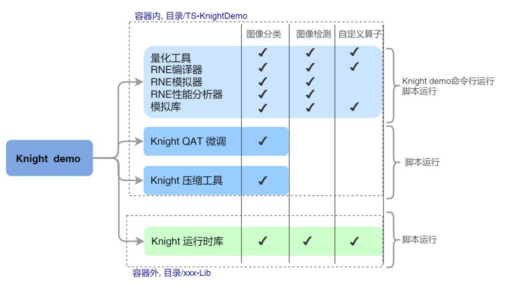

具体demo如下（每一行为一个demo）：

+----+------------+-------+------+-----+----------+-----------------------------------+
|demo| 模型       |模型   | 量化 | 中间|业务场景  | Demo目的                          |
|编号| 名称       |框架   | 平台 | IR  |          |                                   |
+====+============+=======+======+=====+==========+===================================+
| 1  |yolov5      |Pytorch|ONNX  |ONNX |目标检测  |演示Pytorch复杂业务模型量化功能    |
+----+------------+-------+------+-----+----------+-----------------------------------+
| 2  |yolov5      |ONNX   |ONNX  |ONNX |目标检测  |演示ONNX复杂业务模型量化功能       |
+----+------------+-------+------+-----+----------+-----------------------------------+
| 3  |resnet18    |Pytorch|ONNX  |ONNX |图像分类  |演示Pytorch模型使用ONNX量化工具功能|
+----+------------+-------+------+-----+----------+-----------------------------------+
| 4  |resnet18    |ONNX   |ONNX  |ONNX |图像分类  |演示ONNX模型基础量化功能           |
+----+------------+-------+------+-----+----------+-----------------------------------+
| 5  |resnet18    |Caffe  |ONNX  |ONNX |图像分类  |演示Caffe模型使用ONNX量化工具功能  |
+----+------------+-------+------+-----+----------+-----------------------------------+
| 6  |resnet18    |TF     |ONNX  |ONNX |图像分类  |演示TF模型使用ONNX量化工具功能     |
+----+------------+-------+------+-----+----------+-----------------------------------+
| 7  |resnet18    |Paddle |ONNX  |ONNX |图像分类  |演示Paddle模型使用ONNX量化工具功能 |
+----+------------+-------+------+-----+----------+-----------------------------------+
| 8  |gru         |TF     |ONNX  |ONNX |语音检测  |演示TF的语音检测模型的量化功能     |
+----+------------+-------+------+-----+----------+-----------------------------------+
| 9  |resnet18_ops|Caffe  |Caffe |Caffe|图像分类  |演示CaffeIR自定义算子功能          |
+----+------------+-------+------+-----+----------+-----------------------------------+

当前各系列芯片支持的demo如下：

+--------------------------------------------+-------------------------+
|   芯片型号                                 |   支持demo编号          |
+============================================+=========================+
| TX510x                                     | 1~8                     |
+--------------------------------------------+-------------------------+
| TX5336x-TX5256x                            | 1~8                     |
+--------------------------------------------+-------------------------+
| TX5368x_TX5339x_TX5335x                    | 1~9                     |
+--------------------------------------------+-------------------------+
| TX5215x_TX5239x200_TX5239x220_TX5239x300   | 1~8                     |
+--------------------------------------------+-------------------------+
| TX5112x_TX5239x201                         | 1~8                     |
+--------------------------------------------+-------------------------+

.. note::

   注意：本文档仅以TX5368AV200为例进行demo演示，如需演示其他芯片demo, 仅修改--chip参数即可。

Knight demo目录介绍 
--------------------

docker镜像内demo目录介绍
~~~~~~~~~~~~~~~~~~~~~~~~

在产品发布包中提供了Knight镜像，进入镜像后在目录/TS-KnightDemo下存放的是Knight的示例，主目录结构如下图所示:

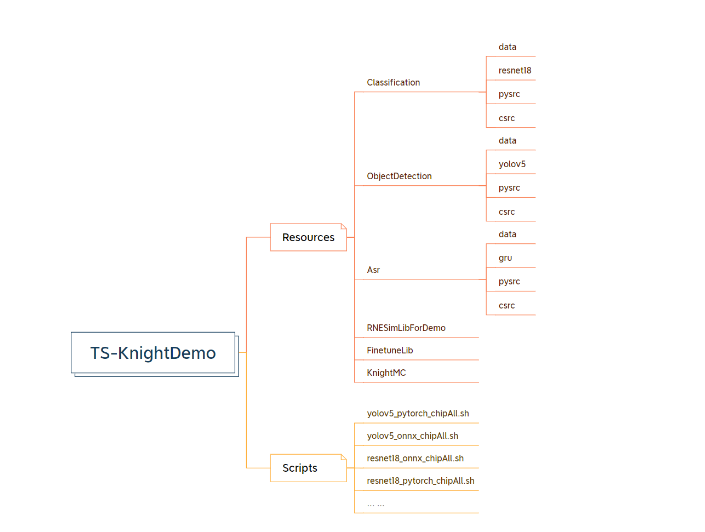

+-----------+----------------------------+-------------------------------------------------------------------------+
| 一级目录  | 二级目录                   | 简介                                                                    |                                                                                                                                                                                                                                                                  
+===========+============================+=========================================================================+
| Resources | Classification             | 图像分类场景demo的模型，数据和代码                                      |
|           |                            |  - data 目录存放量化数据和测试数                                        |
|           |                            |  - resnet18 目录存放resnet18模型                                        |
|           |                            |  - pysrc目录下存放python相关代码                                        |
|           |                            |  - csrc目录下存放C语言相关代码                                          |
+           +----------------------------+-------------------------------------------------------------------------+                                                                                                                                                                
|           | ObjectDetection            | 图像检测场景demo的模型，数据和代码                                      | 
|           |                            |  - data 目录存放量化数据和测试数据                                      |                        
|           |                            |  - yolov5 目录存放yolov5模型                                            |
|           |                            |  - pysrc目录下存放python相关代码                                        |
|           |                            |  - csrc目录下存放C语言相关代码                                          |
+           +----------------------------+-------------------------------------------------------------------------+                                                                                                                                                                          
|           | Asr                        | 语音检测场景demo的模型，数据和代码                                      | 
|           |                            |  - data 目录存放量化数据和测试数据                                      |
|           |                            |  - gru 目录存放gru模型                                                  |
|           |                            |  - pysrc目录下存放python相关代码                                        |
|           |                            |  - csrc目录下存放C语言相关代码                                          |
+           +----------------------------+-------------------------------------------------------------------------+                                                                                                                                          
|           | RNESimLibForDemo           | Knight demo 依赖的RNE模拟库                                             | 
+           +----------------------------+-------------------------------------------------------------------------+                                                                                                                                                                                                                                                                
|           | FinetuneLib                | 量化QAT demo示例，参见章节   `finetune库demo`_                          | 
+           +----------------------------+-------------------------------------------------------------------------+                                                                                                                                                                                                                                                                   
|           | KnightMC                   | KnightMC模型压缩demo示例，参见章节 `knight-mc库demo`_                   |
+-----------+----------------------------+-------------------------------------------------------------------------+                                                                                                                                                                                                                                                               
| Scripts   | yolov5_pytorch_chipAll.sh  | Scripts目录下，每个shell脚本对应一个demo。 命名规则如下：               | 
|           |                            |  - modelname_modelframework_chipAll.sh                                  |
|           | yolov5_onnx_chipAll.sh     |  - modelname表示模型名称；                                              |
|           | ... ...                    |  - modelframework表示浮点模型的框架；                                   |   
|           |                            |  - chipAll表示该模型所有芯片均支持，假如仅正在某几款芯片上支持该demo, 则|
|           |                            |    名称后缀改为chipCDEF，代表支持4款对应芯片。                          |   
|           |                            |比如 yolov5_pytorch_chipAll.sh对应demo1, 表示浮点模型yolov5，原始模型框架|
|           |                            |为pytorch，使用ONNX 量化工具量化，且在所有芯片都支持。                   |
+-----------+----------------------------+-------------------------------------------------------------------------+

docker镜像外demo目录介绍
~~~~~~~~~~~~~~~~~~~~~~~~

RNE运行时库的示例在容器外交付目录，对应不同芯片分别为

 ``/TX510x-Lib``
 ``/TX5336x-TX5256x-Lib``
 ``/TX5368x_TX5339X_TX5335X-Lib``
 ``/TX5215x_TX5239x200_TX5239x220_TX5239x300-Lib``
 ``/TX5112x_TX5239x201-Lib``

其中 ``RNE-RT-Lib_xxxx.tar.gz`` 为 ``RNE`` 运行时库使用。

Knight demo运行方式
-------------------

Knight快速上手指南提供两种运行方式：一种是通过Knight
demo命令行方式运行演示；二是可通过demo脚本运行。

通过demo命令行运行
~~~~~~~~~~~~~~~~~~

在启动容器后，输入

.. code-block:: bash
   
   Knight --chip TX5368AV200 demo -h

界面示例如下图所示：

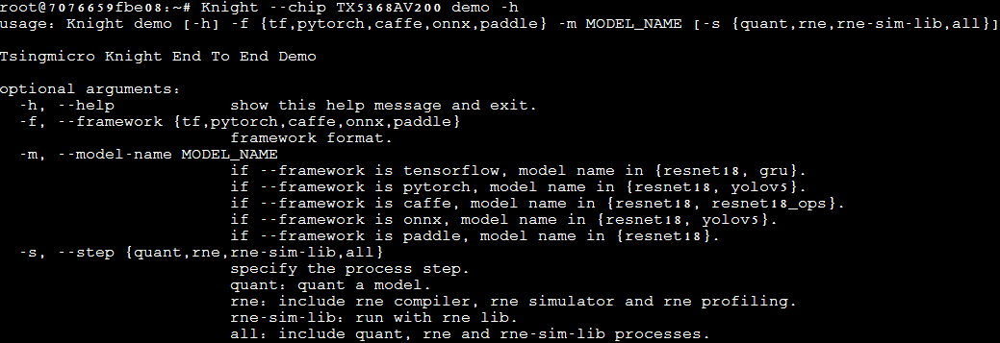

\

.. note::

   请注意，当 ``--framework`` 为不同量化框架时，可演示的模型范围有所不同。

+------------------+--------+------+------------------------------------------------------------------------------------------------+
| 参数名称         | 必需/  |默认值| 说明                                                                                           |
|                  | 可选   |      | 说明                                                                                           |                                                                                                                                                                                                                                             
+==================+========+======+================================================================================================+
| -f或--framework  | 必需   | 无   | 表示原始模型框架类型，可选范围{pytorch, tf, onnx, paddle, caffe}                               |                                                                                                                                                                                                                                         
+------------------+--------+------+------------------------------------------------------------------------------------------------+
| -m或--model-name | 必需   | 无   | 表示当前demo中的模型名称。                                                                     |
+------------------+--------+------+------------------------------------------------------------------------------------------------+
| -s或--step       | 可选   | all  | 表示demo演示的阶段，该参数可选，默认all，取值范围{quant, rne, rne-sim-lib,all}：               |
|                  |        |      |  - quant表示对demo模型进行量化，同时会对原始浮点模型进行推理测试、对量化后定点模型进行推理测试 |
|                  |        |      |  - rne表示对量化后的demo模型进行编译、模拟推理、性能分析。                                     |
|                  |        |      |  - rne-sim-lib表示对已经开发好的C代码app进行编译链接模拟库并运行。                             |
|                  |        |      |  - all 表示顺序运行上述quant\rne\rne-sim-lib全流程。                                           |
|                  |        |      | 注意，需要先运行quant后，才可运行rne， rne运行后，才可运行rne-sim-lib。                        |
+------------------+--------+------+------------------------------------------------------------------------------------------------+
| -h或--help       | 可选   | 无   | 显示帮助信息。                                                                                 |                                                                                                                                                                                                                                      
+------------------+--------+------+------------------------------------------------------------------------------------------------+

通过demo脚本运行
~~~~~~~~~~~~~~~~

Knight
demo示例也可通过Knight中demo脚本运行，具体脚本可参见 `模型部署资源生成快速指南`_ 中重要步骤说明。

开发流程
========

AI全栈应用开发流程
------------------

.. figure:: ../media/demo_3.png
    :alt: pipeline
    :align: center

\

Knight工具链支持端侧AI应用全栈开发，包括应用开发，模型部署资源生成和自定义算子开发三个主要流程。

应用开发：用户调用Knight RNE SDK
API编写自己的业务应用，C代码加载模型部署资源，链接模拟库在纯软件环境中仿真调试自己的应用，没问题后，链接板端库在板端进行部署。

模型部署资源生成：用户准备已训练好的浮点模型，使用Knight
量化工具量化成IR定点模型，然后对比量化精度，接着编译生成模型部署资源，进行模拟器结果验证以及Profiling性能调优。详见 `模型部署资源生成快速指南`_ 。

自定义算子开发：当用户模型中存在芯片不支持的算子时，用户在量化后的IR模型中添加自定义算子层，之后进行IR模型编译生成模型部署资源；用户在应用开发时进行自定义算子的C代码实现，通过SDK
API相应接口进行自定义算子注册。最后，与整个应用程序一起进行模拟库上调测，板端库上部署。

浮点模型训练：用户在使用Knight工具链之前，需准备好已训练的浮点模型。

模型部署资源生成开发流程
------------------------

.. figure:: ../media/demo_4.png
    :alt: pipeline
    :align: center

\

1) 用户使用Knight量化工具将提前训练好的浮点模型量化成IR定点模型。Knight ONNX量化工具demo请参见  `Quant`_ 。

2) 用户使用Knight RNE编译器将IR定点模型编译成芯片部署资源(cfg和weight资源)。
   Knight RNE编译器demo示例请参见 `RNE`_ 。

3) 用户使用Knight RNE模拟器对测试数据进行推理，也可以使用Knight
   RNE性能分析工具对模型进行性能分析。
   Knight RNE模拟器demo请参见 `RNE`_ 。

4) 同时用户也可以调用Knight
   RNE模拟库编写自己的业务应用在纯软件环境仿真自己的业务模型。Knight
   RNE模拟库demo请参见 `模拟库`_ 。

5) 如果步骤3、4均通过，用户可以调用Knight
   RNE运行时库编写自己的实际业务应用，部署到清微芯片上。
   Knight RNE运行时库demo请参见 `运行时库`_  ，板端部署示例请参见   `板端环境搭建及部署`_ 。

6) 在步骤3中，如果模型推理性能不满足需求，则用户可使用Knight压缩工具（简称Knight-MC）将提前训练好的浮点模型进行压缩，得到体积更小，性能更优，更适合端侧部署的浮点模型。（可选）
   Knight-MC demo示例请参见 `Knight-MC库demo`_ 。

7) 在步骤1量化后，如果模型精度损失严重，用户可以使用QAT库，即Knight
   Finetune库编写自己的Finetune工具对浮点模型进行微调，得到更适合量化的浮点模型，之后再进行步骤1。（可选）
   Finetune 库demo示例请参见  `Finetune库demo`_ 。

.. note::

   在整个开发流程中有如下4个检查点：

   1. 用户使用Knight量化工具完成量化操作后，需要使用精度比对工具查看量化后精度是否满足业务要求；

   2. 用户使用Knight RNE模拟器对测试数据进行推理后，需保证其推理结果和Knight量化工具推理结果一致；

   3. 用户使用Knight RNE模拟库对测试数据进行推理后，需保证其推理结果和Knight RNE模拟器推理结果一致；

   4. 用户使用Knight RNE运行时库对测试数据进行推理后，需保证其推理结果和Knight RNE模拟库推理结果一致；

   以上4个检查点若不满足预期，可联系清微技术人员进行支持。

   为便于用户快速进行检查点2，3的结果验证，提供model_check.py脚本，可参考 `model_check.py使用说明`_ 。

开发流程示例
------------

以图像分类业务和目标检测业务为例，说明Knight工具链在此类场景中的开发流程示例。

目标检测场景
~~~~~~~~~~~~

目标检测场景的开发流程如下图所示：

.. figure:: ../media/demo_5.png
    :alt: pipeline
    :align: center

\

(a) 浮点模型推理（用户已有业务流程）
	- 用户对测试图片进行前处理，通过原始浮点模型得到浮点推理结果。然后进行后处理（比如NMS，非极大值抑制算法）等操作并绘制检测框，得到最终的目标检测结果。

(b) 浮点模型使用Knight工具链进行量化，编译，模拟推理
	- 用户对量化图片进行前处理，使用Knight量化工具得到IR模型，接着通过Knight编译器得到cfg/weight资源。
	- 用户准备测试图片进行同样的前处理操作，此时根据需要转化成量化模型所需的数据类型，保存为bin文件，和cfg/weight资源文件一并输入Knight RNE 模拟器得到定点推理结果。
	- 用户需要将定点推理结果进行反量化和后处理绘制检测框得到目标检测结果。

(c) 板端推理
	- 用户使用相同的测试图片，进行相同的图像前处理并转化为所需的dtype类型，然后使用RNE-RT-Lib将cfg/weight资源进行板端部署，得到定点推理结果。
	- 用户需要将定点推理结果进行反量化和后处理绘制检测框得到和图(b)中相同的目标检测结果。

图像分类场景
~~~~~~~~~~~~

   图像分类场景的开发流程如下图所示：

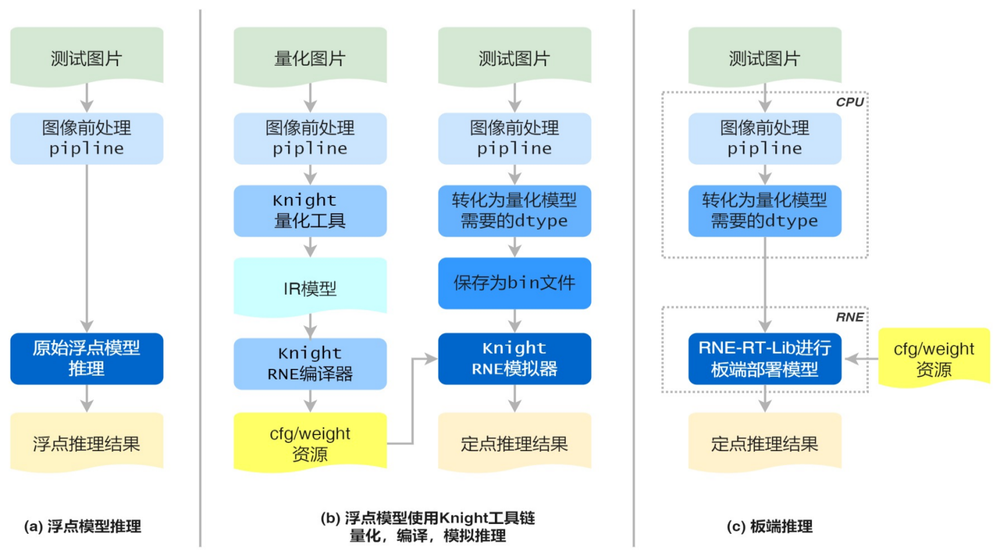

(a) 浮点模型推理（用户已有业务流程）
	- 用户对测试图片进行前处理，通过原始浮点模型得到浮点推理结果。若模型最后一层是softmax，输出为不同类别的概率，此时使用argmax取最大值，则可得到图像分类结果；若模型最后一层是argmax,则可直接得到图像分类结果。

(b) 浮点模型使用Knight工具链进行量化，编译，模拟推理
	- 用户对量化图片进行前处理，使用Knight量化工具得到IR模型，接着通过Knight编译器得到cfg/weight资源。
	- 用户准备测试图片进行同样的前处理操作，此时根据需要转化成量化模型所需的dtype数据类型。比如：图片前处理中最后一步是减均值除方差操作，则前处理后数据类型为浮点。在使用量化工具时，若--ir-input-dtype指定为float32（默认），则此处的dtype为浮点类型，无需进行转换；若--ir-input-dtype指定为int8，则此处的dtype为int8，需要将浮点数据转换为int8类型。
	- 接着将dtype类型数据保存为bin文件，和cfg/weight资源文件一并输入Knight RNE 模拟器得到定点推理结果，从而得到图像分类结果。

(c) 板端推理
	- 用户使用相同的测试图片，进行相同的图像前处理并转化为所需的dtype类型，然后使用RNE-RT-Lib将cfg/weight资源进行板端部署，得到和图(b)中相同的定点推理结果。

模型部署资源生成快速指南
========================

在docker
容器下运行快速上手用例，需要进行docker环境准备，并运行容器，详细安装及使用步骤请参阅  :doc:`使用指南综述<../overview/overview>` 。

Quant
-----

命令行运行方式
~~~~~~~~~~~~~~

Quant表示对demo模型进行浮点推理，量化以及量化后定点模型推理测试，命令如下所示：
以demo1为例演示onnx quant 流程

.. code-block:: bash
   
   Knight --chip TX5368AV200 demo -f pytorch -m yolov5 --step quant

脚本运行方式
~~~~~~~~~~~~

demo1对应的shell脚本为 ``/TS-KnightDemo/Scripts/yolov5_pytorch_chipAll.sh`` ，以yolov5 pytorch浮点模型使用ONNX量化工具为例，运行方式如下：

.. code-block:: bash

   bash /TS-KnightDemo/Scripts/yolov5_pytorch_chipAll.sh TX5368AV200 quant

重要步骤
~~~~~~~~

原始浮点模型推理过程
^^^^^^^^^^^^^^^^^^^^

在使用Knight量化工具之前，需要用户准备好训练充分的浮点模型。基于官方开源的yolov5项目进行图像检测，命令行如下所示：

.. code-block:: bash

   cd /TS-KnightDemo/Resources/ObjectDetection/pysrc/yolov5_master

.. code-block:: python

   python detect.py --source /TS-KnightDemo/Resources/ObjectDetection/data/test_data/bus.jpg --weights yolov5s.pt --img 640

执行成功后会对source指向的图片进行目标检测，并在runs/detect/expN目录中输出以下两个文件：

.. note::

	expN中的N为变数，会随着推理次数增加而递增

``bus.jpg``：绘制了检测框的图片；
``yolo_result.txt``：保存了检测框信息的文件。

完整的浮点模型推理包含以下3个步骤：

1) **前处理**
	前处理过程一般包括resize调整大小、reshape矩阵转换、减均值除方差标准化等预处理。量化数据、测试数据均遵循此方法。

2) **模型推理**
	预处理后的数据输入到原始浮点模型中，推理得到浮点输出结果。

3) **后处理**
	将浮点输出结果进行边界框回归和非极大值抑制等后处理操作，得到最终目标检测框的坐标，格式为[x, y, w, h, conf, label]，保存在文本 ``.txt`` 中，并在图像中绘制检查框得到bus.jpg。

量化过程
^^^^^^^^

**ONNX 量化**

ONNX量化工具内集成了TF2ONNX, Caffe2ONNX, Pytorch2ONNX,Paddle2ONNX转换工具，不仅支持ONNX 浮点模型的量化还可支持Tensorflow, Caffe, Pytorch和PaddlePadlle浮点模型的转换和量化。此处以yolov5 pytorch浮点模型使用ONNX量化工具为例进行说明。

- 数据预处理

	Infer推理函数存放在目录 ``/TS-KnightDemo/Resources/ObjectDetection/pysrc/TS_yolov5_onnx_from_ts`` 中，调用 ``/TS-KnightDemo/Resources/ObjectDetection/pysrc/TS_yolov5_onnx_from_ts/yolov5_onnx_ts.py`` 中的预处理函数

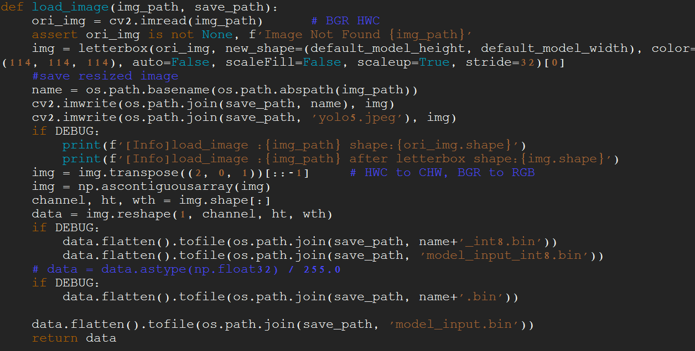

\

.. figure:: ../media/demo_8.png
    :alt: pipeline
    :align: center
	
\

ONNX 量化使用转换命令和量化分步完成：

- **模型转换**

.. code-block:: bash

   Knight --chip TX5368AV200 quant -m yolov5 -f pytorch -r convert -w
   /TS-KnightDemo/Resources/ObjectDetection/yolov5/yolov5s.pt -s
   /TS-KnightDemo/Output/yolov5_pytorch/quant -uds
   /TS-KnightDemo/Resources/ObjectDetection/pysrc/TS_yolov5_onnx_from_ts/yolov5_onnx_ts.py
   -l 3

- **模型量化** 
	量化转换后的yolov5模型：

.. code-block:: bash

   #命令
   Knight --chip TX5368AV200 quant --run-config
   /TS-KnightDemo/Scripts/yolov5_config.json -m
   /TS-KnightDemo/Output/yolov5_pytorch/quant/yolov5.onnx -f onnx -if
   infer_yolov5 --save-dir /TS-KnightDemo/Output/yolov5_pytorch/quant -d
   /TS-KnightDemo/Resources/ObjectDetection/data/quant_data/coco/images/val2017
   -uds
   /TS-KnightDemo/Resources/ObjectDetection/pysrc/TS_yolov5_onnx_from_ts/yolov5_onnx_ts.py
   -qid uint8 --dump

量化结果：
	量化后的模型保存在 ``/TS-KnightDemo/Output/yolov5_pytorch/quant`` 文件夹下， ``yolov5_quantize.onnx`` 是量化后的模型文件。在 ``yolov5`` 的demo中，除了提供一个基础ONNX浮点模型做演示外，也额外提供了一个推理时间更短的ONNX模型做演示，这个模型是使用relu作为激活层的。
    具体实现可参考脚本/TS-KnightDemo/Scripts/yolov5_onnx_chipAll.sh，其中定义了一个变量use_relu_model，使用者可根据自身需要通过改变变量的取值来完成两个模型的使用切换。
    此处以yolov5ONNX的两个浮点模型使用ONNX量化工具生成子图为例，进行量化部分区别的说明。

- **子模型生成**
	Onnx浮点模型在量化前，需要将模型里不支持的算子去掉重新保存为子模型，再进行下一步的量化。使用模型yolov5s_v7.0.onnx生成子模型：

.. code-block:: bash

   #命令
   Knight --chip TX5368AV200 quant --run-config
   /TS-KnightDemo/Scripts/yolov5_config.json -m
   /TS-KnightDemo/Resources/ObjectDetection/yolov5/yolov5s_v7.0.onnx -f
   onnx -if infer_yolov5 --save-dir
   /TS-KnightDemo/Output/yolov5_onnx/quant -d
   /TS-KnightDemo/Resources/ObjectDetection/data/quant_data/coco/images/val2017
   -uds
   /TS-KnightDemo/Resources/ObjectDetection/pysrc/TS_yolov5_onnx_from_torch/yolov5_onnx.py
   -qid uint8 --dump --output-name /model.24/m.0/Conv_output_0
   /model.24/m.1/Conv_output_0 /model.24/m.2/Conv_output_0

使用relu激活的模型yolov5s_v7.0_relu.onnx生成子模型：

.. code-block:: bash

   #命令
   #使用relu激活的模型yolov5s_v7.0_relu.onnx
   Knight --chip TX5368AV200 quant --run-config
   /TS-KnightDemo/Scripts/yolov5_config.json -m
   /TS-KnightDemo/Resources/ObjectDetection/yolov5/yolov5s_v7.0_relu.onnx
   -f onnx -if infer_yolov5 --save-dir
   /TS-KnightDemo/Output/yolov5_onnx/quant -d
   /TS-KnightDemo/Resources/ObjectDetection/data/quant_data/coco/images/val2017
   -uds
   /TS-KnightDemo/Resources/ObjectDetection/pysrc/TS_yolov5_onnx_from_torch/yolov5_onnx.py
   -qid uint8 --dump --output-name 269 324 379

.. note::

   注意：
   在量化命令中有2点注意事项：
   1. 指定--std,--mean,将标准化操作融合到模型中，可加速应用在芯片上的推理性能，同时需指定量化后定点模型输入数据类型uint8,即-qid uint8;
   2. 量化后定点模型推理得到定点结果，需要进行反量化操作，才可进行后处理。若指定-od,
   则量化时自动在定点模型中追加反量化层，定点模型推理后无需再进行反量化。

量化后定点模型推理过程
^^^^^^^^^^^^^^^^^^^^^^

**ONNX 量化**

- 定点推理

	ONNX量化后定点模型推理命令如下所示:

.. code-block:: bash

   Knight --chip TX5368AV200 quant --run-config
   /TS-KnightDemo/Scripts/yolov5_config.json -r infer -d
   /TS-KnightDemo/Resources/ObjectDetection/data/test_data/bus.jpg -m
   /TS-KnightDemo/Output/yolov5_pytorch/quant/yolov5_quantize.onnx -f onnx
   --save-dir /TS-KnightDemo/Output/yolov5_pytorch/quant -uds
   /TS-KnightDemo/Resources/ObjectDetection/pysrc/TS_yolov5_onnx_from_ts/yolov5_onnx_ts.py

推理结果：推理后的结果保存在 ``/TS-KnightDemo/Output/yolov5_pytorch/quant`` 文件夹下，result_0_p.txt, result_1_p.txt, result_2_p.txt是推理后的结果文件。

- 后处理

	量化后定点模型推理指令中，也在内部调用了后处理操作，结果保存为 ``yolov5_result.jpg``

- **MAP示范**

	在yolov5的量化过程中，我们使用了多张图片做为量化数据集，在模型量化后，也提供了批量推理图片并展示MAP指标的步骤。ONNX定点模型批量推理命令如下所示：

.. code-block:: bash

   Knight --chip TX5368AV200 quant -r infer -m
   /TS-KnightDemo/Output/yolov5_pytorch/quant/yolov5_quantize.onnx -f onnx
   -if infer_yolov5 -s /TS-KnightDemo/Output/yolov5_pytorch/quant -d
   /TS-KnightDemo/Resources/ObjectDetection/data/quant_data/coco/images/val2017
   -uds /TS-KnightDemo/Resources/ObjectDetection/pysrc/TS_yolov5_onnx_from_ts/yolov5_onnx_ts.py

MAP的参数如图所示：

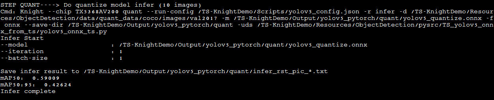

\

.. note::

	注意：在量化时指定-od，此处定点模型推理后无需再进行反量化。
	

检查点
^^^^^^

此时可进行检查点1的检验，对比原始浮点模型的目标检测结果和ONNX量化后的目标检查结果。
Pytorch yolov5原始浮点模型推理后的结果为：

``/TS-KnightDemo/Resources/ObjectDetection/pysrc/yolov5_master/runs/detect/expN/bus.jpg``

经过ONNX量化后的结果为： ``/TS-KnightDemo/Output/yolov5_pytorch/quant/yolov5_result.jpg``

若不满足，可使用精度对比工具  `compare`_ 进行问题定位。

RNE
---

.. _命令行运行方式-1:

命令行运行方式
~~~~~~~~~~~~~~

RNE表示对量化后的demo模型进行RNE编译器编译、RNE模拟器推理、RNE性能分析器评估性能。RNE demo命令如下所示：

以demo1为例演示RNE流程

.. code-block:: bash

   Knight --chip TX5368AV200 demo -f pytorch -m yolov5 --step rne

.. _脚本运行方式-1:

脚本运行方式
~~~~~~~~~~~~

以yolov5
pytorch浮点模型使用ONNX量化工具为例，在目录 ``/TS-KnightDemo/Scripts/yolov5_pytorch_chipAll.sh`` 中RNE阶段对应的脚本如下所示：

.. code-block:: bash
   
   #命令
   bash /TS-KnightDemo/Scripts/yolov5_pytorch_chipAll.sh TX5368AV200 rne

.. _重要步骤-1:

重要步骤
~~~~~~~~

RNE编译器
^^^^^^^^^

RNE编译命令如下所示：

.. code-block:: bash

   Knight compile --chip TX5368AV200 --onnx
   /TS-KnightDemo/Output/yolov5_pytorch/quant/yolov5_quantize.onnx
   --save-dir /TS-KnightDemo/Output/yolov5_pytorch/rne

RNE模拟器
^^^^^^^^^

在模拟器上跑编译后的模型仿真

1) **测试图像经过前处理得到.bin**

.. code-block:: bash

   python3
   /TS-KnightDemo/Resources/ObjectDetection/pysrc/TS_yolov5_onnx_from_ts/yolov5_onnx_ts.py
   --input /TS-KnightDemo/Resources/ObjectDetection/data/test_data/bus.jpg
   --outpath /TS-KnightDemo/Output/yolov5_pytorch/rne --pre_processing

执行成功后会输出文件： ``model_input.bin`` 文件，可作为模拟器的输入使用。

2) **使用模拟器推理一条测试数据**

.. code-block:: bash

   Knight --chip TX5368AV200 run --input
   /TS-KnightDemo/Output/yolov5_pytorch/rne/model_input.bin --model
   /TS-KnightDemo/Output/yolov5_pytorch/rne/yolov5_quantize_r.tsmodel
   --save-dir /TS-KnightDemo/Output/yolov5_pytorch/rne -fmt nchw

执行该命令后，得到以下三路输出文件：
   ``result-357_p.txt``， ``result-358_p.txt``， ``result-359_p.txt``，维度分别为[1, 255, 80, 80]，[1, 255, 40, 40]，[1, 255, 20, 20]，这三个文件中保存了模拟器定点的输出数据。

3) **模拟器输出结果后处理**

   将模拟器输出的三个结果文件result-357_p.txt，result-358_p.txt，result-359_p.txt读入，做反量化及NMS等后处理后，获得预测框信息。

.. code-block:: bash

   python3
   /TS-KnightDemo/Resources/ObjectDetection/pysrc/TS_yolov5_onnx_from_ts/yolov5_onnx_ts.py
   --input /TS-KnightDemo/Output/yolov5_pytorch/rne --outpath
   /TS-KnightDemo/Output/yolov5_pytorch/rne --proc-mode pytorch_use_onnx
   --post_processing --data
   /TS-KnightDemo/Resources/ObjectDetection/data/test_data/bus.jpg

执行完毕后，会在outpath指向的目录中输出下内容：
``yolov5_result.jpg``：检测结果图片。
``result.txt``：保存了检测框的文件。

RNE性能分析器
^^^^^^^^^^^^^

RNE Profiling 执行命令如下：

.. code-block:: bash

   Knight profiling --chip TX5368AV200 --model
   /TS-KnightDemo/Output/yolov5_pytorch/rne/yolov5_quantize_r.tsmodel
   --save-dir /TS-KnightDemo/Output/yolov5_pytorch/rne --log-level 3

.. _检查点-1:

检查点
^^^^^^

使用模拟器推理完成后，需要进行检查3与检查点2的数据result-357_p.txt，result-358_p.txt，result-359_p.txt对比，两者结果应完全一致，参见\ `model_check <#model_check>`__\ 。

model_check
-----------

在执行完量化和编译的命令后可使用model_check.py进行检查点2和检查点3结果的验证，验证命令如下：

.. code-block:: bash

   cd /TS-KnightSoftware/tools/model_check/

   python model_check.py --quant-output
   /TS-KnightDemo/Output/yolov5_pytorch/quant/dump --compile-output
   /TS-KnightDemo/Output/yolov5_pytorch/rne --run-mode 0

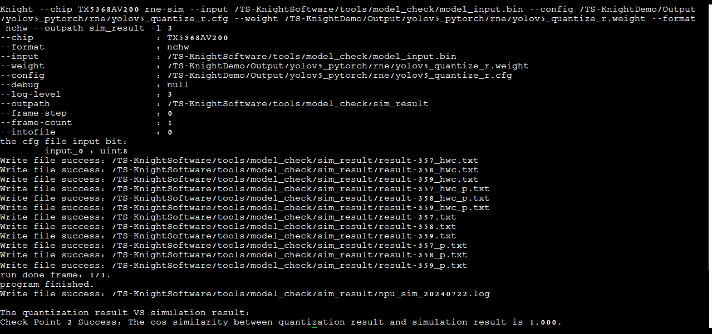

\

compare
-------

在执行量化命令后，若发现结果存在不一致，可使用 ``compare`` 工具进行精度分析和比较，定位问题。首先需要执行 ``ONNX`` 量化脚本, 并指定 ``--dump`` 模式

.. code-block:: bash

   Knight --chip TX5368AV200 quant -m
   /TS-KnightDemo/Output/yolov5_pytorch/quant/yolov5.onnx -f onnx -if
   infer_yolov5 -s /TS-KnightDemo/Output/yolov5_pytorch/quant -bs 1 -qm
   min_max -d
   /TS-KnightDemo/Resources/ObjectDetection/data/quant_data/coco128/images/train2017
   -uds
   /TS-KnightDemo/Resources/ObjectDetection/pysrc/TS_yolov5_onnx_from_ts/yolov5_onnx_ts.py
   --mean 0.0 0.0 0.0 --std 255.0 255.0 255.0 -qid uint8 --dump

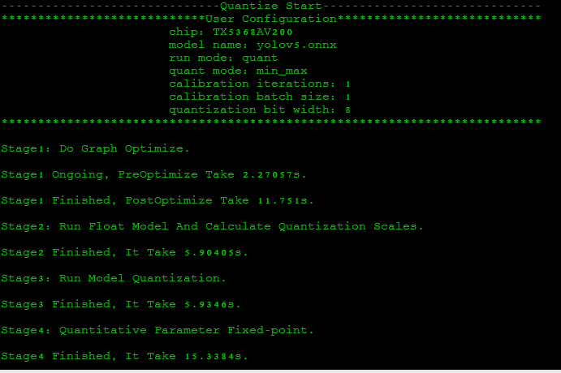

\

然后可执行精度比对工具

.. code-block:: bash

   #命令
   Knight --chip TX5368AV200 compare -qd /TS-KnightDemo/Output/yolov5_pytorch/quant

.. figure:: ../media/demo_12.png
    :alt: pipeline
    :align: center

\

Finetune库demo
--------------

demo文件夹说明
~~~~~~~~~~~~~~

用例在容器内的路径:
``/TS-KnightDemo/Resources/FinetuneLib/cifar10_example``,目录结构如下：

+----------------+-----------------------------------------------------+
| 文件夹或文件   |    说明                                             |
+================+=====================================================+
| checkpoint     | 训练完成后生成该文件夹并存放训练的浮点模型          |
|                |ResNet18_ckpt.pth、Finetune后的模型                  |
|                |ResNet18_ckpt_q.pth                                  |
+----------------+-----------------------------------------------------+
| data           | 存放Finetune所需的训练数据及测试数据                |
+----------------+-----------------------------------------------------+
| models         | 存放模型文件                                        |
+----------------+-----------------------------------------------------+
| script         | 存放运行此用例的脚本,                               |
|                |                                                     |
|                | 其中train.sh为浮点模型训练脚本,                     |
|                | finetune.sh为浮点模型Finetune训练脚本,              |
|                |                                                     |
|                | test.sh为对浮点模型及Finetune模型进行测试的脚本,    |
|                |                                                     |
|                | run_e2e_example.sh为总执行入口脚本                  |
+----------------+-----------------------------------------------------+
| main.py        | Finetune主函数入口文件                              |
+----------------+-----------------------------------------------------+
| utils.py       | Finetune运行时所依赖的函数文件                      |
+----------------+-----------------------------------------------------+

demo运行说明
~~~~~~~~~~~~

执行如下命令：

.. code-block:: bash

   cd /TS-KnightDemo/Resources/FinetuneLib/cifar10_example/script
   sh run_e2e_example.sh

执行成功后，会看到以下信息：
步骤一：train.sh结果如下图：

.. figure:: ../media/demo_13.png
    :alt: pipeline
    :align: center
\

步骤二：finetune.sh结果如下图：

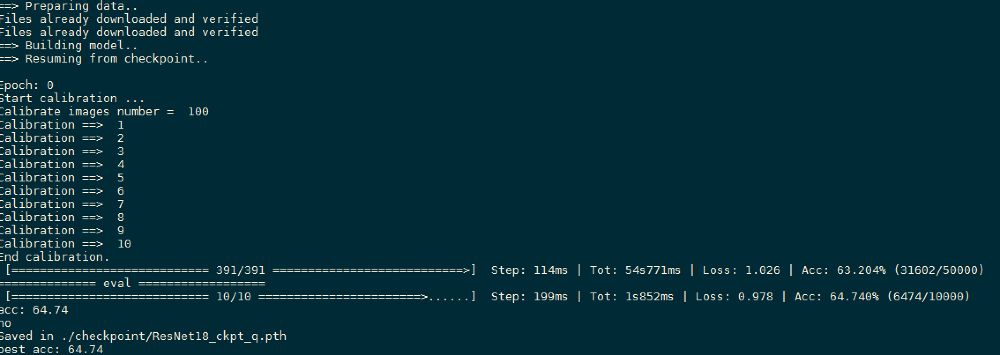

\

步骤三：test.sh结果如下图：

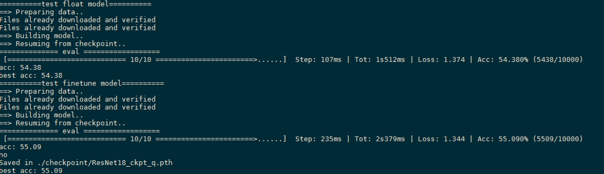

\

最终结果保存在 ``/TS-KnightDemo/Resources/FinetuneLib/cifar10_example/checkpoint`` 目录下

+--------------------+-------------------------------------------------+
| **文件夹或文件**   | **说明**                                        |
+====================+=================================================+
| ResNet18_ckpt.pth  | 浮点模型文件。                                  |
+--------------------+-------------------------------------------------+
| R                  | Finetune后模型文件。                            |
| esNet18_ckpt_q.pth |                                                 |
+--------------------+-------------------------------------------------+

.. note::
	因为演示需要，浮点模型只训练了一个epoch，要想获得更好的浮点精度和Finetune精度可以在train.py里增加epoch数量。

重要步骤说明
~~~~~~~~~~~~

在Knight镜像内/TS-KnightDemo/Resources/FinetuneLib/cifar10_example/main.py是Finetune-Lib运行的必须脚本，执行python
main.py -h 可以获得如下图所示的命令行参数：

.. figure:: ../media/demo_16.png
    :alt: pipeline
    :align: center

\

1) **训练浮点模型**

.. code-block:: bash

   python main.py ResNet18 --epochs 1

执行train.sh，其中ResNet18为模型名称，epochs为epoch的数量，执行完成后会生成ResNet18_ckpt.pth

2) **Finetune浮点模型**

.. code-block:: bash

   python main.py ResNet18 --resume --BackendType TSQAT --quantize --lr 1e-5 --epochs 1

执行finetune.sh，其中ResNet18为模型名称，BackendType
为后端的名称，epochs为epoch的数量，lr为学习率，--quantize使能Finetune功能，执行完成后会生成ResNet18_ckpt_q.pth

3) **测试原始浮点模型和Finetune浮点模型的精度**

.. code-block:: bash

   python main.py ResNet18 --resume -e

   python main.py ResNet18 --resume --quantize -e

执行 ``test.sh``，其中ResNet18为模型名称，resume为指定训练好的模型，--quantize使能Finetune功能，-e为仅仅进行模型测试而不做训练。

4) **编译量化后的模型**

   参见 `RNE编译器`_

5) **在RNE模拟器上跑编译后的模型**

   参见  `RNE模拟器`_

Knight-MC库demo
---------------

Knight-MC库结合cifar10开源数据集提供一个图像分类业务的用例，网络结构是resnet18，模型输入为cifar10原始数据，输出结果为10分类的结果。

.. _demo文件夹说明-1:

demo文件夹说明
~~~~~~~~~~~~~~

用例在容器内的路径: ``/TS-KnightDemo/Resources/KnightMC/`` ,目录结构如下：

+-----------------------+----------------------------------------------+
| **文件夹或文件**      | **说明**                                     |
+=======================+==============================================+
| dataset               | 存放所需的训练数据和测试数据                 |
+-----------------------+----------------------------------------------+
| pretrained_model      | 存放预训练的图像分类模型                     |
+-----------------------+----------------------------------------------+
| resnet18_cifar        | Resnet18图像分类模型压缩示例                 |
|                       |                                              |
|                       | pruning\_                                    |
|                       | config.yaml：Pruning工具配置文件示例         |
|                       |                                              |
|                       | sparsity                                     |
|                       | config.yaml：Sparsity工具配置文件示例        |
|                       |                                              |
|                       | pruning_demo.py：调用Pruning工具代码示例     |
|                       |                                              |
|                       | sparsity_demo.py：调用Sparsity工具代码示例   |
|                       |                                              |
|                       | resnet_cifar.py: resnet模型结构定义          |
|                       |                                              |
|                       | train_val.py:                                |
|                       | 训练模型代码，包含数据加载处理代码           |
+-----------------------+----------------------------------------------+

.. _demo运行说明-1:

demo运行说明
~~~~~~~~~~~~

Pruning Demo剪枝脚本执行如下命令：
工作路径 ``/TS-KnightDemo/Resources/KnightMC/resnet18_cifar``

.. code-block:: bash

   python pruning_demo.py

Sparsity Demo稀疏脚本执行如下命令：

.. code-block:: bash

   # 工作路径 /TS-KnightDemo/Resources/KnightMC/resnet18_cifar
   python sparsity_demo.py

.. note::

	因为演示需要，Pruning剪枝训练次数设置次数较小warmup: 10，num_heatup_episodes：10。

同时，稀疏或剪枝后模型重训练只训练了2个epoch，要想获得更好的浮点精度可以在pruning_demo.py或sparsity_demo.py里增加epoch数量。

.. _重要步骤说明-1:

重要步骤说明
~~~~~~~~~~~~

Pruning Demo重要步骤说明
^^^^^^^^^^^^^^^^^^^^^^^^

1) **准备预训练的浮点模型**

在示例中，已准备好预训练的浮点模型，在目录 ``/TS-KnightDemo/Resources/KnightMC/pretrained_model`` 中。同时用户自行训练得到浮点模型，训练脚本如下：

.. code-block:: bash

   python train_val.py

2) **配置yaml文件**

若不结合Knight工具链，仅考虑模型精度，不考虑模型在芯片上的推理时间，则需要将配置文件pruning_config.yaml中参数run_knight设置为False。

3) **剪枝浮点模型和重训练浮点模型**

执行如下脚本同时完成剪枝和重训练过程，若无需进行重训练则将代码中重训练部分进行屏蔽即可。

.. code-block:: bash

   python pruning_demo.py

执行该脚本，剪枝后的模型保存在 ``/TS-KnightDemo/Resources/KnightMC/resnet18_cifar/output`` 目录下:

.. figure:: ../media/demo_17.png
    :alt: pipeline
    :align: center

\

其中kmc-pruning.csv文件内容如下所示：

.. figure:: ../media/demo_18.png
    :alt: pipeline
    :align: center

\

重训练之后的模型保存在 ``/TS-KnightDemo/Resources/KnightMC/resnet18_cifar/logs`` 目录下

.. figure:: ../media/demo_19.png
    :alt: pipeline
    :align: center

\

pruning_demo.py中包含了测试重训练模型精度的步骤，页面输入示例如下：

.. figure:: ../media/demo_20.png
    :alt: pipeline
    :align: center

4) **编译量化后的模型**

   参见 `RNE编译器`_

5) **在RNE模拟器上跑编译后的模型**

   参见 `RNE模拟器`_

Sparsity Demo重要步骤说明
^^^^^^^^^^^^^^^^^^^^^^^^^

1) **准备预训练的浮点模型**

在示例中，已准备好预训练的浮点模型，在目录 ``/TS-KnightDemo/Resources/KnightMC/pretrained_model`` 中。同时用户自行训练得到浮点模型，训练脚本如下：

.. code-block:: bash

   python train_val.py

2) **配置yaml文件**

在配置文件 ``sparsity_config.yaml`` 中配置参数 ``sparsity_method`` 选择不同的稀疏方式。

3) **稀疏浮点模型和重训练浮点模型**

执行如下脚本同时完成稀疏和重训练过程，若无需进行重训练则将代码中重训练部分进行屏蔽，同时增加保存稀疏后模型的代码即可。

.. code-block:: bash

   python sparsity_demo.py

执行该脚本，稀疏并重训练后模型后的模型保存在
``/TS-KnightDemo/Resources/KnightMC/resnet18_cifar/logs`` 目录下：

  .. figure:: ../media/demo_21.png
    :alt: pipeline
    :align: center

sparsity_demo.py中包含了测试重训练模型精度的步骤，页面输入示例如下：

.. figure:: ../media/demo_22.png
    :alt: pipeline
    :align: center

4) **编译量化后的模型**

   参见 `RNE编译器`_

5) **在RNE模拟器上跑编译后的模型**

   参见 `RNE模拟器`_

应用开发快速指南
================

模拟库
------

.. _命令行运行方式-2:

命令行运行方式
~~~~~~~~~~~~~~

模拟库demo表示对已经开发好的C代码app进行编译链接模拟库并运行，demo命令示例如下所示：
以demo1为例演示rne-sim-lib流程

.. code-block:: bash

   Knight --chip TX5368AV200 demo -f pytorch -m yolov5 --step rne-sim-lib

.. _脚本运行方式-2:

脚本运行方式
~~~~~~~~~~~~

以yolov5 pytorch浮点模型使用ONNX量化工具为例，在目录 ``/TS-KnightDemo/Scripts/yolov5_pytorch_chipAll.sh`` 中rne-sim-lib阶段对应的脚本如下所示：

.. code-block:: bash

   bash /TS-KnightDemo/Scripts/yolov5_pytorch_chipAll.sh TX5368AV200 rne-sim-lib

.. _重要步骤-2:

重要步骤
~~~~~~~~

1) C代码开发

编写 ``/TS-KnightDemo/Resources/ObjectDetection/csrc/yolov5_simlib/src/main.cpp`` 主要API接口说明
为了方便用户使用，模拟库和运行时库提供了一套C形式的API接口。

主要API接口说明如下：C接口说明（部分）：

+-----------------------------------+-------------------------+------------------+------------------------------------------------------------------------+
| 接口名称                          | 功能描述                | 参数名称及描述   | 返回值                                                                 |
+===================================+=========================+==================+========================================================================+
| TS_MPI_TRP_RNE_LoadModel          | 初始化单个NN网络。      | net：网络指针    | 0表示成功，非0表示失败                                                 |
+-----------------------------------+-------------------------+------------------+------------------------------------------------------------------------+
| TS_MPI_TRP_RNE_Forward            | 网络前向推理            | net：网络指针    | 若返回为NULL，则前向推理出现异常；                                     |
|                                   |                         |                  |                                                                        |
|                                   |                         |                  | 若网络的cpDebugLayerName不为空且能找到该调试层，则返回该调试层的输出； |
|                                   |                         |                  |                                                                        |
|                                   |                         |                  | 否则返回网络的最后结果，等同于函数TS_MPI_TRP_RNE_GetResultBlobs的返回值|
+-----------------------------------+-------------------------+------------------+------------------------------------------------------------------------+
| TS_MPI_TRP_RNE_UnloadModel        | 释放单个网络。          | net：网络指针    | 0表示成功，非0表示失败                                                 |
+-----------------------------------+-------------------------+------------------+------------------------------------------------------------------------+
| TS_MPI_TRP_RNE_RegisterGpUserData | 注册通用算子层自定义数据| net：网络指针    | 0表示成功，非0表示失败                                                 |
+-----------------------------------+-------------------------+------------------+------------------------------------------------------------------------+

2) 执行make命令进行编译、运行

在simlib目录下执行make指令进行编译，会在 ``build_sim/Release/RNE_Sim_Lib_demo.elf`` 目录下生成一个仿真elf文件，该文件可以直接在终端执行。

   
工作目录：``/TS-KnightDemo/Resources/ObjectDetection/csrc/yolov5_simlib``

.. code-block:: bash

   make EXPORT_DIR=../../../RNESimLibForDemo/RNESimLibD

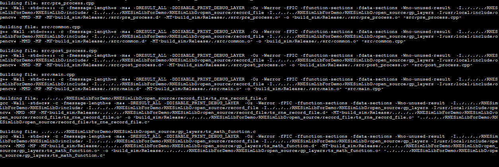

\

工作目录：/TS-KnightDemo/Resources/ObjectDetection/csrc/yolov5_simlib

.. code-block:: bash
   # 运行命令
   ./build_sim/Release/RNE_Sim_Lib_demo.elf
   /TS-KnightDemo/Output/yolov5_pytorch/rne/yolov5_quantize_r.cfg
   /TS-KnightDemo/Output/yolov5_pytorch/rne/yolov5_quantize_r.weight
   /TS-KnightDemo/Resources/ObjectDetection/data/test_data/bus.jpg
   /TS-KnightDemo/Output/yolov5_pytorch

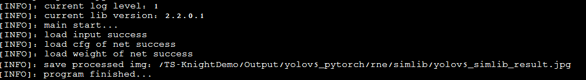

\

模拟库输出的图片 ``yolov5_simlib_result.jpg`` 与 ``TS-RNE-Simulator``
输出的 ``bus_sim.jpg``对比，结果一致。

.. _检查点-2:

检查点
^^^^^^

使用模拟器推理完成后，需要进行检查点4与检查点3的数据或者图片的对比，两者结果应一致。

运行时库
--------

相关文件说明
~~~~~~~~~~~~

容器外 ``/TX5368x_TX5339x_TX5335x_Lib/RNE-RT-Lib/samples`` 目录下有关文件如下：

+---------------------------+-------------------------------------------------------+
| 文件夹或文件              | 说明                                                  |
+===========================+=======================================================+
| compiled_model            |如果无指定路径，脚本默认此文件夹为模拟器输入文件夹。   |
|                           | - DNN_S_mfcc：根据网络名称创建的文件夹。              |
|                           | - model_r.cfg：网络指令文件。                         |
|                           | - model_r.weight：网络权重文件。                      |
|                           | - model_input.bin：网络输入文件。                     |
|                           | 其他网络。                                            |
+---------------------------+-------------------------------------------------------+
| rne_simple_forward        | 演示一般网络基本推理过程的示例程序。                  |
+---------------------------+-------------------------------------------------------+
| rne_set_input_blobs_addr  | 此demo演示用户通过物理地址的方式加载输入数据。        |
+---------------------------+-------------------------------------------------------+
| rne_yolov5_detection      | 此demo演示yolov5的前处理、推理、后处理的完整流程。    |
+---------------------------+-------------------------------------------------------+
| Scripts                   |用例运行脚本及依赖的工具。                             |
|                           |  - bin2header：二进制文件转头文件脚本。               |
|                           |  - run_e2e_example.sh: 总执行入口脚本。               |
|                           |  - run_e2e_example_cm.sh: 指定demo和模型路径编译。    |
+---------------------------+-------------------------------------------------------+

.. _demo运行说明-2:

demo运行说明
~~~~~~~~~~~~

以 ``rne_yolov5_detection``  为例，执行如下命令：

工作路径： ``examples/rne_yolov5_detection``

执行命令：``make clean ; make;``

执行成功后，会看到以下信息提示，表示交叉编译成功，生成板端部署资源：``examples/rne_yolov5_detection/build_linux_a53/Release/rne_yolov5_detection.elf``。

.. figure:: ../media/demo_25.png
    :alt: pipeline
    :align: center
	
\

资源成功生成后,如何在板端部署运行，请参见 `板端环境搭建及部署`_ 。

板端环境搭建及部署
------------------

环境准备
~~~~~~~~

开发板环境的配置及与板端的初始化请参考《TX5368A Linux
SDK安装及升级使用说明_v1.5.pdf》第2章安装、升级TX5368A DEMO板开发环境。

板端运行
~~~~~~~~

配置交叉编译环境
^^^^^^^^^^^^^^^^

在RNE-RT-Lib目录下，有settings_path_linux.sh脚本。编辑该脚本将tools_dir设置成gcc-arm-10.2-2020.11-x86_64-arm-none-linux-gnueabihf.tar.xz
解压后的存放路径（最好是绝对路径），之后source一下就可以。

.. code-block:: bash

   # 工作目录：./RNE_RT_Lib
   # 命令
   vi settings_path_linux.sh
   # 编辑’tools_dir=xxxxxx’

   # 保存退出
   :wq

   #source 是使该文件生效
   source settings_path_linux.sh

.. figure:: ../media/demo_26.png
    :alt: pipeline
    :align: center

\

.. figure:: ../media/demo_27.png
    :alt: pipeline
    :align: center

\

打开串口调试工具
^^^^^^^^^^^^^^^^

确保连线正确，然后打开串口调试工具，可以使用SSCOM、SecureCRT或者其他的软件，本示例使用的是ipop,
确保IPOP工具TFTP已配置好服务器路径，确保打开对应的调试串口，确保板端已经进入linux系统。

拷贝部署资源到板端部署
^^^^^^^^^^^^^^^^^^^^^^

把rne_yolov5_detection.elf以及examples/rne_yolov5_detection目录下resource文件夹拷贝到window系统下IPOP工具配置TFTP服务器目录下，

然后执行如下命令：通过tftp把文件拷贝到板端：

.. code-block:: bash
   tftp –g –r rne_yolov5_detection.elf 192.168.1.20

.. note:: 
	
	板端的连接配置请参考《TX5368A Linux SDK安装及升级使用说明》。

**部署模型**

参数说明：
   参数1: resource/yolov5_quantize_r.cfg

   参数2: resource/yolov5_quantize_r.weight

   参数3: resource/1.jpg or resource/2.jpg or resource/3.jpg or resource/4.jpg

   参数4: 检测结果图片保存文件名(必须图片格式结尾)

   参数5: 前处理是否使用int8 hwc的格式, 0 : 不使用, 1 : 使用./rne_yolov5_detection.elf 参数1 参数2 参数3 参数4 参数5

.. note::

	读入模型文件cfg和weight时, 需保证\*.cfg和\*.weight的前缀一致

 .. code-block:: bash
   # 命令
   chmod +x rne_yolov5_detection.elf
   ./rne_yolov5_detection.elf resource/yolov5_quantize_r.cfg
   resource/yolov5_quantize_r.weight resource/4.jpg resource/bus.jpg

执行前的图片为4.jpg

.. figure:: ../media/demo_28.png
    :alt: pipeline
    :align: center

\

然后可以看到模型运行结果如下图

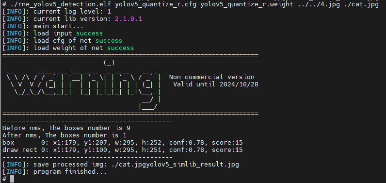
\

生成的识别后的图片如下：

.. figure:: ../media/demo_30.png
    :alt: pipeline
    :align: center

至此，模型部署完毕！

自定义算子开发快速指南
======================

.. _脚本运行方式-3:

脚本运行方式
------------

在目录 ``/TS-KnightDemo/Scripts`` 中对应的脚本运行如下所示：

.. code-block:: bash
   bash /TS-KnightDemo/Scripts/resnet18_ops_caffe_caffe_chipD.sh TX5368AV200 all

.. _重要步骤-3:

重要步骤
--------

1) 修改量化后的模型

将预处理的resize和crop操作作为自定义算子层放在模型中，因此需要在量化后的prototxt模型中增加自定义算子层custom_resize和custom_crop,并修改连接层的bottom值。

.. code-block:: json

   layer {

   name: "custom_resize"

   type: "custom_resize"

   bottom: "data"

   top: "custom_resize"

   ts_rce_layer{

   layer_type: 1153

   top_channel: 3

   top_width: 256

   top_height: 256

   }

   fix_param {

   input_bit: "us8"

   output_bit: "us8"

   }

   }

   layer {

   name: "custom_crop"

   type: "custom_crop"

   bottom: "custom_resize"

   top: "custom_crop"

   ts_rce_layer{

   layer_type: 1154

   top_channel: 3

   top_width: 224

   top_height: 224

   }

   fix_param {

   input_bit: "us8"

   output_bit: "us8"

   }

   }

2) 模型编译

.. code-block:: bash

   Knight --chip TX5368AV200 compile --net /TS-KnightDemo/Resources/Classification/resnet18/customized_model/resnet18_quant.prototxt
   --weight /TS-KnightDemo/Resources/Classification/resnet18/customized_model/resnet18_quant.caffemodel
   –-save-dir /TS-KnightDemo/Output/resnet18_customized/rne -gp 1

3) 自定义算子C语言实现

首先注册自定义算子层：头文件ts_rne_gp_layers.h中新增如下代码，注意此处和ID和prototxt中层类型layer_type一致。

   .. figure:: ../media/demo_31.png
    :alt: pipeline
    :align: center

\

文件ts_rne_gp_layers.c中新增如下代码：

   .. figure:: ../media/demo_32.png
    :alt: pipeline
    :align: center

    .. figure:: ../media/demo_33.png
    :alt: pipeline
    :align: center

然后C语言实现自定义算子，即编写ts_rne_gp_custom_crop.c和ts_rne_gp_custom_resize.c。

4) 模拟库模拟
切换至自定义算子的源码目录，并将编译后模型使用头文件生成工具做转换

.. code-block:: bash

   cd /TS-KnightDemo/Resources/Classification/csrc/resnet18_customized

   ./bin2header
   /TS-KnightDemo/Output/resnet18_ops_caffe/rne/resnet18_quant_r.cfg
   ./resnet18_cfg.h

   ./bin2header
   /TS-KnightDemo/Output/resnet18_ops_caffe/rne/resnet18_quant_r.weight
   ./resnet18_weight.h

\

在 ``/TS-KnightDemo/Resources/Classification/csrc/resnet18_customized`` 目录下运行make命令，生成elf文件后运行

.. code-block:: bash

   make clean
   make
   build_sim/Release/RNE_Sim_Lib_demo.elf /TS-KnightDemo/Output/resnet18_ops_caffe/simlib/

运行时库上板执行，参见运行时库的上板说明  `板端环境搭建及部署`_.
