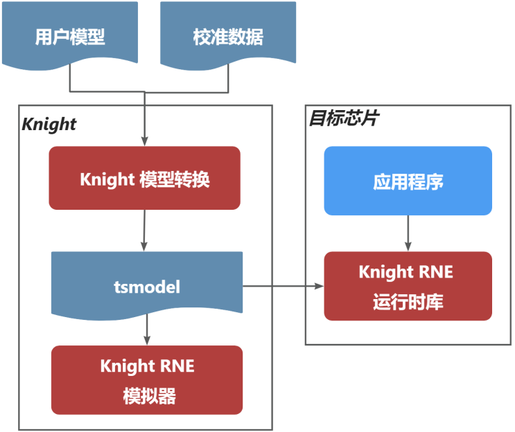
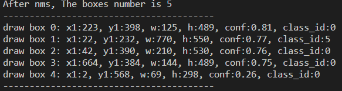
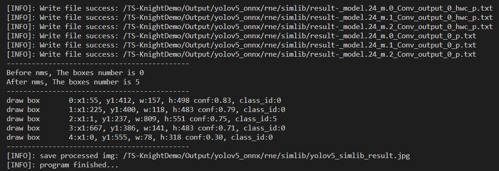

===================
快速上手指南
===================

为便于客户更直观、更快速的了解清微智能骑士工具链 ``TS.Knight`` 的用法，将自己的业务神经网络模型快速的在清微智能芯片产品上部署，特针对工具链各模块（ ``Knight`` 量化工具、 ``Knight
RNE`` 编译器、 ``Knigh RNE`` 模拟器、 ``Knight RNE`` 性能分析器）提供结合语音、图像业务的快速上手用例。同时对这些用例进行讲解，以期帮助用户达到快速上手的目的。

这些用例结合具体业务只用于演示工具链的典型使用流程，使用的数据量较少，所以精度不具有参考价值，不代表工具链的实际精度效果。用例中的一些脚本，比如语音、图像数据的预处理，
客户可借鉴，如果有类似业务场景可在其基础上进行修改。客户如果想发挥出工具链的最大能力、更灵活的使用、应用到更复杂的场景，还需仔细阅读 ``TS.Knight`` 工具链各模块相应的使用指南文档。

**名词解释**

+---------------------------+------------------------------------------+
| **名词**                  | **说明**                                 |
+===========================+==========================================+
| Knight                    | 清微骑士工具链英文名称                   |
+---------------------------+------------------------------------------+
| QAT                       | Quantization Aware                       |
|                           | Training，量化感知训练                   |
+---------------------------+------------------------------------------+
| RNE                       | 可重构神经网络加速引擎                   |
+---------------------------+------------------------------------------+
| Finetune                  | 微调                                     |
+---------------------------+------------------------------------------+
| IR定点模型                | 中间表示模型，指                         |
|                           | Caffe定点模型或ONNX定点模型              |
+---------------------------+------------------------------------------+

Knight demo介绍
===============

简介
====

Knight包含部署AI模型所需的全套工具链，包括模型转换、模拟器仿真、运行时库等功能。

开发环境准备
============

本章介绍使用Knight工具链前所需要完成的开发环境准备。

准备docker环境
--------------

Knight支持容器部署的方式，用户需要保证已安装docker环境，docker版本大于等于19.03。

加载镜像文件
------------

.. code-block:: shell

   docker load -i ts.knight-<version>.tar.gz

查看镜像
--------

查看已加载的镜像。

.. code-block:: shell

   docker images

.. figure:: ./media/image7.png
    :alt: pipeline
    :align: center

运行镜像
--------

执行以下命令启动docker 镜像。

.. code-block:: shell

   docker run --name=knight_docker -v localhost_dir:/data -it ts.knight:
   xxx /bin/bash

其中 localhost_dir表示宿主目录，即本地需映射到容器内的目录（绝对路径）。

容器启动成功后，在容器内任意目录下均可使用Knight命令，Knight帮助信息页面示例如下所示。

.. figure:: ./media/image8.png
    :alt: pipeline
    :align: center

Knight命令说明
==============

Knight作为工具链功能的总入口，支持参数如下：

-  -v: 查看Knight工具链版本信息。

-  -h/--help: 查看帮助信息。

-  -ch/--chip:
   配置芯片型号，可调用相应型号下的工具链功能，可选，默认值为TX5368AV200。

-  --default-chip:
   配置芯片型号-ch/--chip默认值，用户可通过以下命令行配置新的默认值。

Knight子命令重点说明如下：

-  Knight build
   为模型转换命令，包含量化编译操作，用来将浮点模型转换为tsmodel模型部署资源，并完成模型精度比对和模型正确性验证。

-  Knight run 为模型仿真命令，用来完成tsmodel的推理运行。

-  Knight profiling 为模型性能分析命令，用来评估tsmodel在板端的性能。

模型转换配置文件示例
====================

容器内/TS-KnightDemo/Samples目录下中内置了resnet18和yolov5的配置文件示例，本文以yolov5进行说明，/TS-KnightDemo/Samples/yolov5_config.json内容如下：

.. code-block:: json

   {

   "chip": "TX5336AV200",
   "quant": {
   "model": "/TS-KnightDemo/Samples/yolov5s/models/yolov5s.onnx",
   "framework": "onnx",
   "infer-func": "infer_common",
   "bit-width": 8,
   "quant-mode": "mse",
   "batch-size": 1,
   "run-mode": "quant",
   "iteration": 10,
   "output-dequant": false,
   "dump": true,
   "output-name": "/model.24/m.0/Conv_output_0 /model.24/m.1/Conv_output_0
   /model.24/m.2/Conv_output_0",
   "save-dir": "/TS-KnightDemo/output/yolov5s/quant",
   "log-level": 3,
   "user-defined-script": "/opt/Quantize/onnx_examples/infer_common.py",
   "input-configs": [
      {
      "input_name": "images",
      "quant_data_format": "Image",
      "data_dir":"/TS-KnightDemo/Samples/yolov5s/data/quant_data/coco/images/val2017",
      "color_space": "RGB",
      "mean": [0,0,0],
      "std": [255.0,255.0,255.0]
      "quantize_input_dtype": "uint8",
      "padding_constant_value": 0
      }]
   },

   "compile": {
   "save-dir": "/TS-KnightDemo/output/yolov5s/rne"
   }
   }

用户如果需要修改模型，可选择修改以下"quant"中的配置的参数。

-  "model"：用户浮点onnx模型。

-  "output-name"：模型输出层，根据实际需求配置，如果不需要裁剪模型后处理，则可不指定。

-  "save-dir":量化的输出路径。

-  "infer-func":量化推理函数，定义在"user-defined-script"指定的脚本中。

-  "user-defined-script"：量化自定义脚本。

-  "dump":是否保存量化后的输出数据，需要设置为true,以便后续模型验证流程。

-  "input-configs"数据预处理参数参见`章节8.1 <\l>`__\ 。

详细信息请参见 :doc:`量化使用指南<../user_guides_base/quant>`

同时可选择修改以下"compile"中的配置的参数：

-  "save-dir":编译的输出路径，建议和quant.save-dir设置为同级目录。

详细信息请参见 :doc:`编译仿真性能分析使用指南<../user_guides_base/compile>`

在完成模型转换后，可通过以下字段配置自动完成模型验证和精度比对：

-  "disable-compare"：可选，数据类型bool, 取值范围[true, false]

-  值为true，表示不进行模型精度对比。

-  值为false，默认值，表示在完成模型转换后，调用Knight
   compare工具进行量化前后的精度对比。

-  "disable-model-check": 可选，数据类型bool, 取值范围[true, false]

-  值为true，表示不进行模型验证；

-  值为false，默认值，表示在完成模型转换后，调用model_check.py工具执行模型验证，仅支持NCHW输入数据格式的校验。

模型转换命令执行
================

以yolov5为例，执行以下命令编译生成tsmodel。

命令行示例参见/TS-KnightDemo/Samples/yolov5_sample.sh

.. code-block:: shell

   Knight build --run-config /TS-KnightDemo/Samples/yolov5_config.json

模型转换执行成功后，会在设置的save-dir中保存输出文件，输出目录为 /TS-KnightDemo/output/yolov5s。

.. code-block:: shell

   ├──yolov5
   │ ├── quant
   │ │ ├── yolov5s_quantize.onnx #量化后的模型
   │ │ ├── dump #dump设置为true时，保存浮点模型和量化模型每层的输出数据
   │ │ ├── steps #量化过程保存的onnx模型，用于调试
   │ │ ├── inputs #用于模拟器输入的二进制bin数据，仅保存最后一条数据
   │ │ ├── log
   │ ├── rne
   │ │ ├── yolov5s_quantize_r.tsmodel #芯片指令和权重部署文件
   │ │ ├── yolov5s_quantize_r.cfg #芯片指令部署文件
   │ │ ├── yolov5s_quantize_r.weight #芯片权重部署资源
   │ │ ├── log

仿真命令执行
============

输入数据准备
------------

在使用模拟器推理tsmodel之前，需要准备输入bin文件，以下命令将bus.jpg进行前处理，并保存为bin文件。

.. code-block:: shell

   python3 /TS-KnightDemo/Samples/yolov5s/pysrc/yolov5_onnx.py \
   --input /TS-KnightDemo/Samples/yolov5s/data/test_data/bus.jpg \
   --outpath /TS-KnightDemo/output/yolov5s/rne --pre_processing

仿真模型推理
------------

执行Knight run命令，输入bin 文件完成推理。

.. code-block:: shell

   Knight --chip TX5336AV200 run \
   --input /TS-KnightDemo/output/yolov5s/rne/model_input.bin \
   --model /TS-KnightDemo/output/yolov5s/rne/yolov5s_quantize_r.tsmodel \
   --save-dir /TS-KnightDemo/output/yolov5s/rne -fmt nchw

执行该命令后，将模拟器推理tsmodel的输出数据保存为txt文件，示例如下：

.. code-block:: shell

   result-_model.24_m.0_Conv_output_0_p.txt
   result-_model.24_m.1_Conv_output_0_p.txt
   result-_model.24_m.2_Conv_output_0_p.txt

输出数据后处理
--------------

执行以下脚本，完成针对输出数据的后处理，得到最终的计算结果。

.. code-block:: shell

   python3 /TS-KnightDemo/Samples/yolov5s/pysrc/yolov5_onnx.py \
   --input /TS-KnightDemo/output/yolov5s/rne --outpath /TS-KnightDemo/output/yolov5s/rne \
   --post_processing --data /TS-KnightDemo/Samples/yolov5s/data/test_data/bus.jpg

执行该命令后，日志显示如下：

性能评估
--------

在没有板端环境条件下，可使用仿真工具评估模型性能。命令如下

.. code-block:: shell
   
   Knight profiling --chip TX5336AV200 --model
   /TS-KnightDemo/output/yolov5/rne/yolov5s_v7.0_quantize_r.tsmodel
   --save-dir /TS-KnightDemo/output/yolov5/rne

板端运行
========

相关文件说明
------------

容器外/TX5368x_TX5339x_TX5335x_Lib/RNE-RT-Lib/samples/rne_yolov5_detection目录为演示yolov5的前处理、推理、后处理的完整流程。

demo交叉编译
------------

执行如下命令：

.. code-block:: shell

   cd samples/rne_yolov5_detection
   make clean ; make;

执行成功后，会看到以下信息提示，表示交叉编译成功，生成板端部署资源：
samples/rne_yolov5_detection/build_linux_a53/Release/rne_yolov5_detection.elf。

.. figure:: ./media/image10.png
    :alt: pipeline
    :align: center

板端环境搭建及部署
------------------

板端环境准备
~~~~~~~~~~~~

开发板环境的配置及与板端的初始化请参考《TX5368A Linux
SDK安装及升级使用说明_v1.5.pdf》第2章安装、升级TX5368A DEMO板开发环境。

.. _板端运行-1:

板端运行
~~~~~~~~

配置交叉编译环境
^^^^^^^^^^^^^^^^

在RNE-RT-Lib目录下，有settings_path_linux.sh脚本。编辑该脚本将tools_dir设置成gcc-arm-10.2-2020.11-x86_64-arm-none-linux-gnueabihf.tar.xz
解压后的存放路径（最好是绝对路径），之后source一下就可以。

.. code-block:: shell

   # 工作目录：./RNE_RT_Lib
   # 命令
   vi settings_path_linux.sh
   # 编辑’tools_dir=xxxxxx’
   ...
   # 保存退出
   :wq
   #source 是使该文件生效
   source settings_path_linux.sh

.. figure:: ./media/image11.png
    :alt: pipeline
    :align: center

.. figure:: ./media/image12.png
    :alt: pipeline
    :align: center

打开串口调试工具
^^^^^^^^^^^^^^^^

确保连线正确，然后打开串口调试工具，可以使用SSCOM、SecureCRT或者其他的软件，本示例使用的是ipop,
确保IPOP工具TFTP已配置好服务器路径，确保打开对应的调试串口，确保板端已经进入linux系统。

拷贝部署资源到板端部署
^^^^^^^^^^^^^^^^^^^^^^

   把rne_yolov5_detection.elf以及samples/rne_yolov5_detection目录下resource文件夹拷贝到window系统下IPOP工具配置TFTP服务器目录下，

然后执行如下命令：

**通过tftp把文件拷贝到板端：**

.. code-block:: shell

   # 命令
   tftp –g –r rne_yolov5_detection.elf 192.168.1.20

**注：**\ 板端的连接配置请参考《TX5368A Linux SDK安装及升级使用说明》。

   **部署模型：**

   参数说明：
   参数1: resource/yolov5s_v7.0_quantize_r.tsmodel
   参数2: resource/1.jpg or resource/2.jpg or resource/3.jpg or resource/4.jpg
   ./rne_yolov5_detection.elf 参数1 参数2

.. code-block:: shell

   chmod +x rne_yolov5_detection.elf
   ./rne_yolov5_detection.elf resource/yolov5s_quantize_r.tsmodel
   resource/bus.jpg

执行后，可以看到模型运行结果如下图

从以上结果可以看出，板端部署运行结果和 `输出数据后处理`__ 模拟器仿真结果的结果一致。

生成的识别后的图片如下：

功能特性说明
============

数据预处理说明
--------------

Knight build
支持仅配置json文件加载校准数据集，无需编写python推理脚本，配置示例如下
/TS-KnightDemo/Samples/yolov5s/yolov5s_config.json

.. code-block:: json

   {
   "chip": "TX5336AV200",
   "quant": {
   "model": "/TS-KnightDemo/Samples/yolov5s/models/yolov5s.onnx",
   "framework": "onnx",
   "infer-func": "infer_common",
   "bit-width": 8,
   "quant-mode": "mse",
   "batch-size": 1,
   "run-mode": "quant",
   "iteration": 10,
   "output-dequant": false,
   "dump": true,
   "output-name": "/model.24/m.0/Conv_output_0 /model.24/m.1/Conv_output_0 /model.24/m.2/Conv_output_0",
   "save-dir": "/TS-KnightDemo/output/yolov5s/quant",
   "log-level": 3,
   "user-defined-script": "/opt/Quantize/onnx_examples/infer_common.py",
   "input-configs": [
   {
   "input_name": "images",
   "quant_data_format": "Image",
   "data_dir":"/TS-KnightDemo/Samples/yolov5s/data/quant_data/coco/images/val2017",
   "color_space": "RGB",
   "mean": [0,0,0],
   "std": [255.0,255.0,255.0],
   "quantize_input_dtype": "uint8",
   "padding_constant_value": 0
   }
   ]
   },
   "compile": {
   "save-dir": "/TS-KnightDemo/output/yolov5s/rne"
   }}

预处理配置说明
~~~~~~~~~~~~~~

quant字段中input-configs用来配置模型不同输入校准的数据类型，以及经过的预处理步骤。其中的字段说明如下

-  input_name: 必选，指ONNX模型的输入tensor名称。

-  quant_data_format: 必选，表示校准数据类型,可选范围[“Image”, “Numpy”,
   “Bin”]：

..

   值为Image, 则是图像数据；
   值为Numpy, 则是后缀为.npy的numpy数据；
   值为Bin, 则是后缀为.bin的bin数据；

-  data_dir: 必选，表示校准数据路径，仅支持配置绝对路径。

-  color_space:
   可选，在quant_data_format为Image时生效，可选范围[“BGR”,”RGB”,”GRAY”]，默认“BGR”,表示输入图像数据格式为BGR；

-  mean: 可选，均值，list形式，与通道数量相同，与std参数同时提供生效；

-  std: 可选，标准差，list形式，与通道数量相同，与mean参数同时提供生效；

-  quantize_input_dtype:
   可选，量化后定点模型输入数据类型，默认为float32，可选范围["float32",
   "uint8"]；

-  padding_constant_value:
   可选，int类型，表示是否进行常量补边，默认None，不进行补边，针对yolo系列模型建议设置该参数为0；

.. note::

      配置input-configs时注意事项：

   1) quant.data/ quant.batch-size 不再生效。

   2) 必须按照示例中指定infer-func和user-defined-script。

   3) padding_constant_value/mean/std/color_space这些参数仅在quant_data_format为Image时生效。

   4) quant.save-dir 和compile.save-dir 仅支持绝对路径。

多输入模型配置说明
~~~~~~~~~~~~~~~~~~

input-configs是list结构，多输入则需要分别配置。配置示例如下：

.. code-block:: json

   {
   "chip": "TX5336AV200",
   "quant": {
   "model":"/TS-KnightDemo/Samples/yoloworld/models/yolo-word-v2-s-image.onnx",
   "framework": "onnx",
   "infer-func": "infer_common",
   "bit-width": "8",
   "quant-mode": "mse",
   "run-mode": "quant",
   "dump": true,
   "save-dir": "/TS-KnightDemo/output/yoloworld_v2s/quant",
   "user-defined-script": "/opt/Quantize/onnx_examples/infer_common.py",
   "input-configs": [
   {
   "input_name": "images",
   "quant_data_format": "Image",
   "data_dir": "/TS-KnightDemo/Samples/yoloworld/data/images",
   "color_space": "RGB",
   "mean": [0,0,0],
   "std": [255.0,255.0,255.0],
   "quantize_input_dtype": "uint8",
   "padding_constant_value": 0
   },
   {
   "input_name": "text",
   "quant_data_format": "Numpy",
   "data_dir": "/TS-KnightDemo/Samples/yoloworld/data/texts"
   }
   ]
   },
   "compile": {
   "onnx":
   "/TS-KnightDemo/output/yoloworld_v2s/quant/yolo-word-v2-s-image_quantize.onnx",
   "save-dir": "/TS-KnightDemo/output/yoloworld_v2s/rne"
   }
   }

对应校准数据目录结构示例如下：

.. code-block:: shell

   ├──img_data
   │ ├── img1.jpg
   │ ├── img2.jpg
   ├──text_data
   │ ├── text1.npy
   │ ├── text2.npy

模型输出说明
------------

后处理裁剪
~~~~~~~~~~

output-dequant参数设置设置输出节点名，会按输出名进行裁剪和量化。不同输出节点使用空格分割，yolov5中示例如下：

.. code-block:: json

   "quant": {
   "output-name": "/model.24/m.0/Conv_output_0 /model.24/m.0/Conv_output_0 model.24/m.0/Conv_output_0"
   }

增加反量化层
~~~~~~~~~~~~

output-dequant表示是否增加反量化，若设置，会在所有输出层算子前增加反量化算子。

.. code-block:: json

   "quant": {
   "output-dequant ": true
   }

模型输入说明
------------

归一化放入模型首层
~~~~~~~~~~~~~~~~~~

为提升模型板端性能，一般建议将数据预处理中归一化操作放入模型中，配置示例如下：

.. code-block:: json

   "quant": {
   "user-defined-script": "/opt/Quantize/onnx_examples/infer_common.py",
   "input-configs": [
   {
   "input_name": "images",
   "quant_data_format": "Image",
   "data_dir": "/TS-KnightDemo/Samples/yoloworld/data/images",
   "color_space": "RGB",
   "mean": [0,0,0],
   "std": [255.0,255.0,255.0],
   "quantize_input_dtype": "uint8",
   "padding_constant_value": 0
   }]
   }

input-configs内配置"quantize_input_dtype"取值为uint8时，必须同时和mean/std
配套使用，表示在模型中增加归一化层，设置后，量化后的定点模型输入的数据格式为0~255的整数。

input-config内配置"quantize_input_dtype"后，quant.quantize_input_dtype不生效。

针对多输入模型和自动混合量化场景，quantize_input_dtype/std/mean仅支持配置在input-config内，且仅支持一路配置quantize_input_dtype为uint8。

