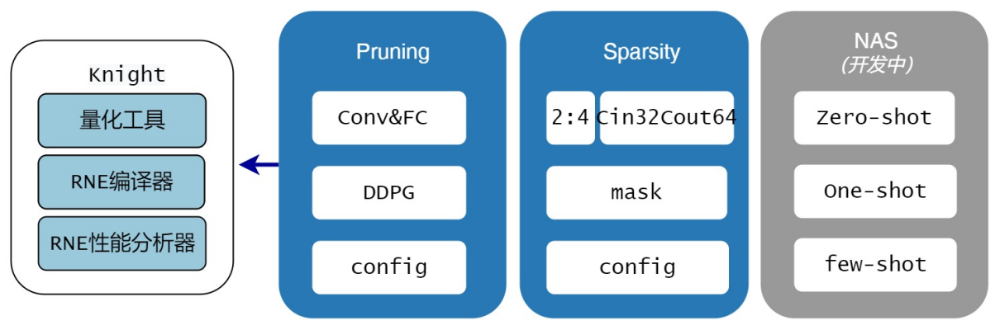
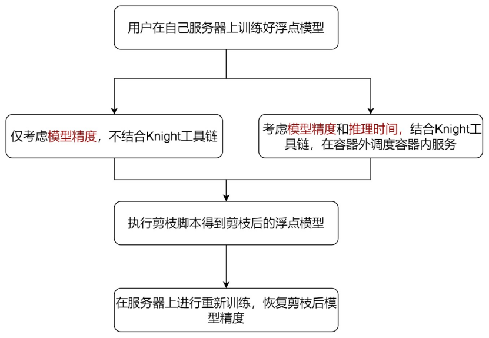
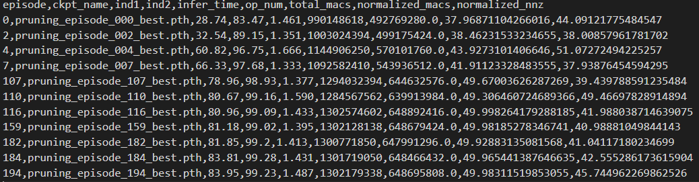
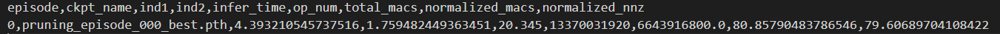
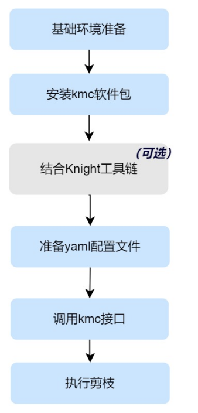
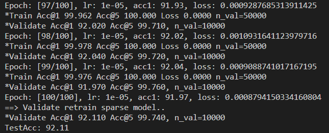
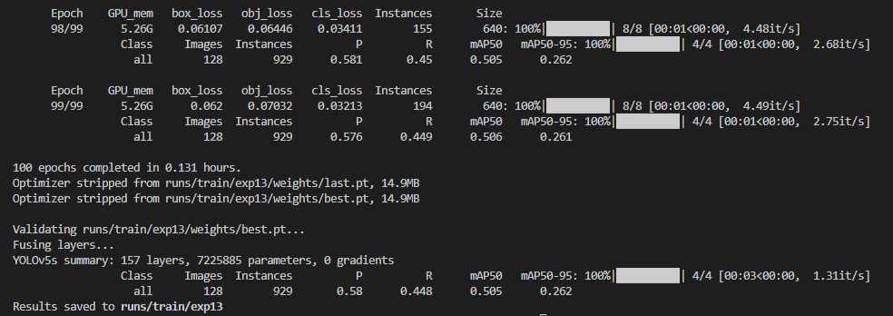
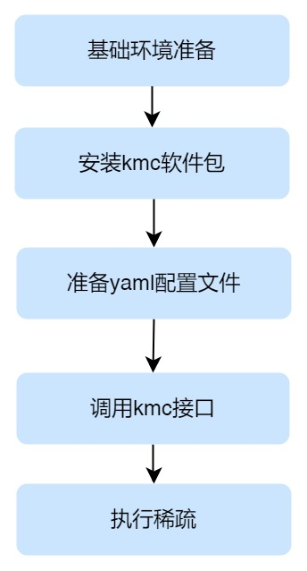
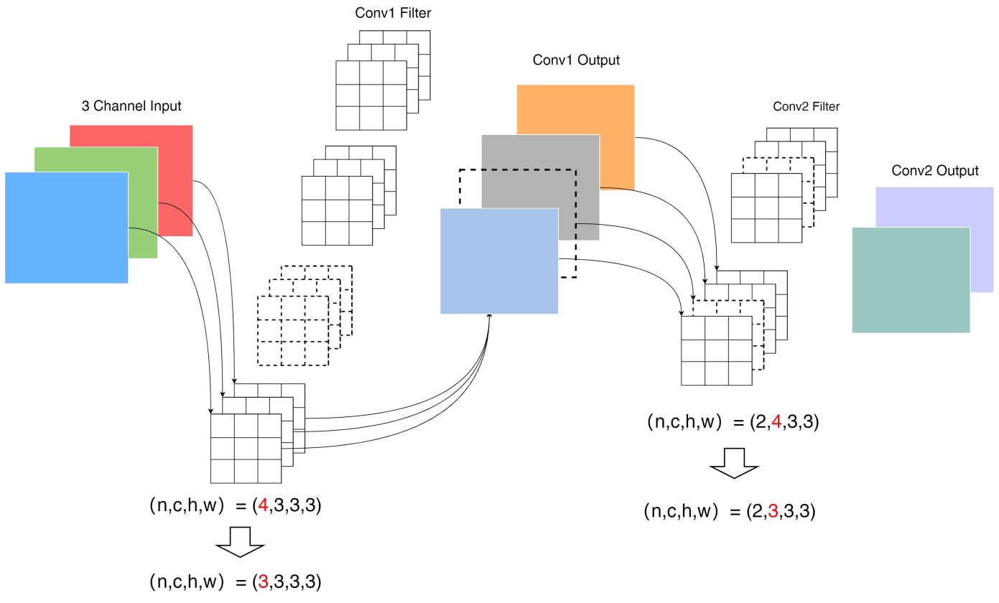
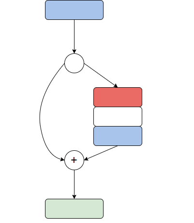

===================
模型压缩使用指南
===================

本文档主要对清微骑士工具链TS.Knight-MC模型压缩工具进行介绍，帮助用户快速上手。

Knight-MC介绍
=============

概述
----

Knight-MC(Model
Compression)是一个专注于深度学习模型压缩的软硬件协同优化平台，提供剪枝、稀疏模型、模型结构搜索等压缩功能，结合清微骑士工具链，帮助客户快速实现模型小型化、提高板端推理性能，同时保持模型精度。

整体框架
--------

Knight-MC架构如下图所示：

当前已实现2个功能：Pruning，Sparsity。

Pruning：模型剪枝是指从模型结构上进行剪枝，比如对卷积进行输入、输出整通道的裁剪。该模块可根据模型精度和模型在芯片上的推理时间进行强化学习，自动剪枝输出较优的剪枝候选模型。此后用户可根据实际业务对精度和耗时的需求选择最优模型。其中Pruning工具中会调用量化，RNE编译器和RNE性能分析器获取模型的推理时间。

Sparsity：模型稀疏是使用指定稀疏方法进行模型权重参数稀疏，比如对卷积kernel中小于阈值的权重参数置0。当前支持两种稀疏方法：一是2:4稀疏，二是清微芯片定制稀疏Cin32Cout64,
该稀疏方法详情请参见 :doc:`编译仿真性能分析使用指南<../user_guides_base/compile>` 。

NAS：模型结构搜索，包含zero-shot，one-shot
和few-shot三种方式。当前尚未支持，在开发中。

.. note::
	Knight-MC当前仅支持对Pytorch模型进行压缩。

目录介绍
--------

文件目录如下表：

+----------------------------+-----+----------------------------------------------+
| 目录                       |开源/|   说明                                       |
|                            |封闭 |                                              |
+============================+=====+==============================================+
|kmc-3.0.0.x-py3-none-any.whl|封闭 | 通过pip install                              |
|                            |     | 可安装在用户本地环境中                       |
+----------------------------+-----+----------------------------------------------+
| config/                    |开源 |配置文件模板                                  |
|                            |     |                                              |
|                            |     |pruning_template.yaml：                       |
|                            |     |Pruning工具的配置文件模板                     |
|                            |     |                                              |
|                            |     |sparsity_template.yaml：                      |
|                            |     |Sparsity工具的配置文件模板                    |
+----------------------------+-----+----------------------------------------------+
| examples/                  |开源 | 供使用kmc库的demo示例                        |
|                            |     |                                              |
+----------------------------+-----+----------------------------------------------+
| requirements.txt           |开源 |提供运行工具必须的python软件包，              |
|                            |     |未注明版本号的软件包对于版本并没有严格的要求。|
+----------------------------+-----+----------------------------------------------+

Demo目录examples涉及的文件目录如下表：

+-----------------------------+--------+---------------------------------------+
|      目录                   | 开源/  |   说明                                |
|                             | 封闭   |                                       |
+=============================+========+=======================================+
|examples/cls/dataset         | 开源   | 存放图像分类的训练数据和测试数据      |
+-----------------------------+--------+---------------------------------------+
|examples/cls/pretrained_model| 开源   | 存放预训练的图像分类模型              |
+-----------------------------+--------+---------------------------------------+
|examples/cls/resnet50_cifar  | 开源   |resnet50图像分类模型压缩示例           |
|                             |        |                                       |
|                             |        |pruning_config.yaml：                  |
|                             |        |Pruning工具配置文件示例                |
|                             |        |                                       |
|                             |        |sparsity_config.yaml：                 |
|                             |        |Sparsity工具配置文件示例               |
|                             |        |                                       |
|                             |        |pruning_demo.py：                      |
|                             |        |调用Pruning工具代码示例                |
|                             |        |                                       |
|                             |        |sparsity_demo.py：                     |
|                             |        |调用Sparsity工具代码示例               |
|                             |        |                                       |
|                             |        |resnet_cifar.py: resnet模型结构定义    |
|                             |        |                                       |
|                             |        |train_val.py:                          |
|                             |        |训练模型代码，包含数据加载处理代码     |
+-----------------------------+--------+---------------------------------------+
|examples/det/dataset         | 开源   | 存放目标检测所需的训练数据和测试数据  |
+-----------------------------+--------+---------------------------------------+
|examples/det/pretraind_model | 开源   | 存放预训练的目标检测模型              |
+-----------------------------+--------+---------------------------------------+
|examples/det/yolov5          | 开源   |Yolov5目标检测模型压缩示例             |
|                             |        |                                       |
|                             |        |pruning_config.yaml：                  |
|                             |        |Pruning工具配置文件示例                |
|                             |        |                                       |
|                             |        |sparsity_config.yaml：                 |
|                             |        |Sparsity工具配置文件示例               |
|                             |        |                                       |
|                             |        |pruning_demo.py：                      |
|                             |        |调用Pruning工具代码示例                |
|                             |        |                                       |
|                             |        |sparsity_demo.py：                     |
|                             |        |调用Sparsity工具代码示例               |
|                             |        |                                       |
|                             |        |其他文件data, models,                  |
|                             |        |utils等均和yolov5模型构建代码相关      |
+-----------------------------+--------+---------------------------------------+

开发流程
--------

Knight-MC整体工作流程如下图所示。

.. figure:: ../media/mc_2.png
    :alt: pipeline
    :align: center

1)用户提供浮点模型和训练数据，使用Pruning进行自动剪枝，得到剪枝候选模型，用户根据实际需求选择最优的剪枝后模型。或者使用Sparsity进行稀疏，得到稀疏后的模型。

2)用户对压缩后的模型进行重训练，以恢复模型精度。

3)使用Knight量化工具对模型进行量化，然后使用Knight
RNE编译器进行编译，最终会将模型部署到清微芯片上，后续步骤详情请可见文档 :doc:`量化使用指南<../user_guides_base/quant>` 
和 :doc:`编译仿真性能分析使用指南<../user_guides_base/compile>`。

环境准备
========

基础环境准备
------------

CUDA环境准备
~~~~~~~~~~~~

用户需要根据显卡型号安装对应版本的CUDA和Pytorch，查看显卡和CUDA的命令如下：

.. code-block:: bash

    nvcc --version

若该命令无法使用，需要在.bashrc中设置环境变量，设置示例如下：

.. code-block:: bash

    export CUDA_HOME="/usr/local/cuda-11.8"
    export LD_LIBRARY_PATH="$CUDA_HOME/lib64:$CUDA_HOME/extras/CUPTI/lib64:$LD_LIBRARY_PATH"
    export PATH="$CUDA_HOME/bin:$PATH"

pip环境准备
~~~~~~~~~~~

确认python(=3.8)安装环境中是否有安装pip，命令如下：

.. code-block:: bash

    which pip

此时会出现pip相应的安装路径，比如 ``miniconda3/envs/quant_tool/bin/pip``，说明pip已安装。
如果pip并未安装，在终端里执行如下命令，则自动安装conda软件包（包含pip安装包），无需另外安装。

.. code-block:: bash

    wget  https://repo.anaconda.com/miniconda/Miniconda3-latest-Linux-x86_64.sh
    bash Miniconda3-latest-Linux-x86_64.sh

python依赖包安装
~~~~~~~~~~~~~~~~

安装kmc依赖包

.. code-block:: bash

   pip install -r requirements.txt

安装完成后需要验证当前环境下GPU是否可用，验证方式如下：

.. figure:: ../media/mc_3.png
    :alt: pipeline
    :align: center

如果没有报错表示pytorch能够在GPU上正常运行，否则需要检查服务器上显卡驱动和CUDA的版本是否安装正确。

.. note::
	为了演示yolov5 Demo,还需安装Arial.ttf字体，若自动下载失败可进行手动下载，放在提示的目录中即可，示例如下，其中root可替换为实际使用的用户名：

.. figure:: ../media/mc_4.png
    :alt: pipeline
    :align: center

\

安装kmc软件包
-------------

Knight-MC环境准备，安装kmc软件包,示例如下:

.. code-block:: bash

   pip install kmc-3.0.0.x-py3-none-any.whl

注意需要保证  `基础环境准备`_  中的环境都满足，才可成功安装并使用kmc软件包。

Knight镜像包准备
----------------

若在使用Pruning工具时，需要结合Knight工具链将芯片推理时间作为剪枝优化目标，则需要准备Knight镜像包ts.knight-<version>.tar.gz，放在用户服务器中目录中，
同时安装docker环境，详情参见 :doc:`使用指南综述<../overview/overview>` 。

其他使用场景则无需准备Knight镜像包。

Pruning工具
===========

工具简介
--------

Pruning工具利用自主学习的策略执行剪枝，提高模型压缩的质量。该方案结合了Knight工具链的其他模块，充分结合芯片的硬件特性，得到不同芯片最适合部署的压缩模型。

Pruning工具应用场景
-------------------

Pruning工具需要用户准备好经过充分训练的精度较好的模型，可支持两种使用方式：

第一种不结合Knight工具链，仅考虑模型精度，直接进行剪枝；

第二种是结合Knight工具链，同时考虑模型精度和模型在芯片上的推理时间，进行自动剪枝。此时需要增加准备Knight镜像。

经过剪枝后的模型，需要用户进行重训练以恢复模型精度。

Pruning Demo模型
----------------

Pruning工具提供了图像分类模型resnet50和目标检测模型Yolov5
的模型压缩示例。

resnet50 Demo
~~~~~~~~~~~~~

不结合Knight工具链
^^^^^^^^^^^^^^^^^^

不结合Knight工具链执行剪枝操作时，``examples/cls/resnet50_cifar/pruning_config.yaml`` 配置文件中docker_cfg字段run_latency设置为False。

在cifar10数据集上，使用Pruning工具压缩resnet50模型示例如下：

.. code-block:: bash

   cd examples/cls/resnet50_cifar
   python pruning_demo.py

执行成功后，在output目录下输出剪枝后的模型文件如下图所示。

.. figure:: ../media/mc_6.png
    :alt: pipeline
    :align: center
\

其中kmc-pruning.csv中内容如下：

.. figure:: ../media/mc_7.png
    :alt: pipeline
    :align: center

\

不同参数含义如下：

   episode对应保存的模型id；

   ckpt_name对应模型名称；

   ind1和ind2表示模型评估结果，参见 `KMC注意事项`_ 第3点；

   infer_time表示模型推理时间(若未使用Knight镜像，则为none)；

   op_num表示总计算数(若未使用Knight镜像，则为none)；

   total_macs表示剪枝后模型计算量；

   normalized_macs表示计算量百分比；

   normalized_nnz表示参数量百分比。

结合Knight工具链
^^^^^^^^^^^^^^^^

首先将examples/cls/resnet50_cifar/pruning_config.yaml配置文件中docker_cfg字段进行如下配置，详情参见 `knight相关配置`_

.. code-block:: yaml

    docker_cfg:
        run_latency: True
       chip: TX5368AV200
       image_path: ${Knight_image_dir}
       localhost_dir: ${host_dir} /examples/
       container_dir: /example
       workspace_dir: / example
       container_name: resnet50_demo
       bit_width: 8
       is_sparse: False

在cifar10数据集上，使用Pruning工具压缩resnet50模型示例如下：

.. code-block:: bash

   cd examples/cls/resnet50_cifar

   python pruning_demo.py

执行成功后，在output目录下输出剪枝后的模型, 其中 kmc-pruning.csv
的文件如下图所示。

\

可以看出，由于结合了Knight工具链，可以获得不同剪枝后模型的板端推理时间infer_time。

重训练后，模型输出在目录examples/cls/resnet50_cifar/logs/中，该目录内容如下所示：

.. figure:: ../media/mc_9.png
    :alt: pipeline
    :align: center

\

yolov5 Demo
~~~~~~~~~~~

不结合Knight工具链示例
^^^^^^^^^^^^^^^^^^^^^^

不结合Knight工具链执行剪枝操作时，examples/det/yolov5/pruning_config.yaml配置文件中docker_cfg字段run_latency设置为False。

在coco数据集上，使用Pruning工具压缩Yolov5模型，示例如下：

.. code-block:: bash

   cd examples/det/yolov5
   python pruning_demo.py

执行成功后，在output目录下输出剪枝后的模型, 其中 kmc-pruning.csv
的文件如下图所示。

.. figure:: ../media/mc_10.png
    :alt: pipeline
    :align: center

\

结合Knight工具链示例
^^^^^^^^^^^^^^^^^^^^

首先将examples/det/yolov5/pruning_config.yaml配置文件中docker_cfg字段进行如下配置，详情参见 `knight相关配置`_

.. code-block:: yaml

    docker_cfg:
        run_latency: True
        chip: TX5368AV20
        image_path: ${Knight_image_dir}
        localhost_dir: ${host_dir}/examples
        container_dir: /example
        workspace_dir: /example
        container_name: yolov5_demo
        bit_width: 8
        is_sparse: False

在coco数据集上，使用Pruning工具压缩yolov5模型示例如下：

.. code-block:: bash

   cd examples/det/yolov5
   python pruning_demo.py

执行成功后，在output目录下输出剪枝后的模型, 其中 examples/det/yolov5/output/kmc-pruning.csv 的文件内容如下图所示。

\

Pruning自定义模型
-----------------

Pruning自定义模型的操作步骤如下：

**步骤一**\ ：基础环境准备，按照 `基础环境准备`_ 说明,
用户在自己训练环境的服务器上安装kmc所需的依赖包，准备kmc运行环境；

**步骤二**\ ：安装kmc软件包，参见 `安装kmc软件包`_ 说明；

**步骤三（可选）**\ ：如果同时考虑模型准确率和清微芯片推理时间，则需要Knight工具链。用户需要准备Knight镜像，同时完成yaml文件中相应配置，
详情请参见  `Pruning自定义模型`_  中结合Knight工具链部分。如果仅将模型准确率作为剪枝优化目标，则无需集成Knight工具链，可跳过该步骤；

**步骤四**\ ：准备yaml配置文件，详情请参见 `Pruning配置文件说明`_ ；

**步骤五**\ ：用户在自己的训练代码中调用kmc
Pruning，详情请参见 `调用pruning说明`_ ；

**步骤六**\ ：执行剪枝脚本得到剪枝后的模型。

Pruning配置文件说明
~~~~~~~~~~~~~~~~~~~~~~~~

Pruning工具的配置文件模板为config/pruning_template.yaml，用户可根据自身需求对模板中参数值修改。配置文件中共包含3个部分的参数配置：基础配置（app_args,
network），Pruning策略配置（amc_cfg）以及Knight相关配置(docker_cfg)

Pruning resnet50 Demo中的yaml文件示例如下：

.. code-block:: yaml

	app_args:
	    arch: resnet50_cifar
	    dataset: cifar10
	    input_shape: [1, 3, 32, 32]
	    device: 0
	    output_dir: ./output
	amc_cfg:
	    agent_algo: DDPG
        protocol: mac-constrained
	    pruning_pattern: channels
	    pruning_method: l1-rank
	    target_density: 0.5
	    n_points_per_fm: 10
	    group_size: 1
	    action_range: [0.05, 0.95]
	    ddpg_cfg:
	        bsize: 256 # batch size
	        tau: 0.01
	        discount: 1.0
	        epsilon: 50000
	        init_delta: 0.5
	        delta_decay: 0.95
	        hidden1: 300
	        hidden2: 300
	        window_length: 1
	        heatup_noise: 0.5
	        initial_training_noise: 0.5
	        training_noise_decay: 0.95
	        warmup: 100 # num_heatup_episodes
            num_training_episodes: 300
	        lr_a: 0.0001 # actor_lr
	        lr_c: 0.001 # critic_lr
	network:
	    resnet50_cifar:
	         [ layer1.0.conv2, layer1.0.conv3, layer1.1.conv2, layer1.1.conv3 … …]
	docker_cfg:
	    run_latency: False
        chip: TX5368AV200
	    image_path: ${Knight_image_dir}
	    localhost_dir: ${host_dir} /examples
	    container_dir: /example
	    workspace_dir: /example
	    container_name: kmc \_dem
	    bit_width: 8
	    is_sparse: False

基础配置
^^^^^^^^

app_args中为基础配置参数，network中则配置模型中要剪枝的层，各参数含义如下所示：

+------------+---------------------------------+-----+---------+--------+
| 参数       | 说明                            | 默认|必选/可选| 参数   |
|            |                                 | 值  |         | 类型   |
+============+=================================+=====+=========+========+
| arch       | 模型结构名称，                  | 无  | 必选    | 无     |
|            | 和模型定义中的名称一致，同时需  |     |         |        |
|            | 要和network参数中模型名称一致。 |     |         |        |
+------------+---------------------------------+-----+---------+--------+
| dataset    | 数据加载名                      | 无  | 必选    | 无     |
|            | 称，和数据加载定义中的名称一致  |     |         |        |
+------------+---------------------------------+-----+---------+--------+
|input_shape | 模型输入shape                   | 无  | 必选    | 无     |
+------------+---------------------------------+-----+---------+--------+
| device     | cpu 或 gpu                      | 0   | 必选    | int    |
|            | id，仅支持使用一个gpu           |     |         |        |
+------------+---------------------------------+-----+---------+--------+
|output_dir  | 压缩后模型输出路径              | 无  | 可选    | 无     |
+------------+---------------------------------+-----+---------+--------+
| network    | 配置模型对应的剪枝层            | 无  | 必选    | 无     |
+------------+---------------------------------+-----+---------+--------+

Pruning策略配置
^^^^^^^^^^^^^^^

amc_cfg中配置自动剪枝算法相关的参数，一般情况下用户无需关注，仅适合剪枝算法调优场景。

各参数含义如下所示：

+----------------+---------------------------------+-----------------+---------+--------+
| **参数**       | **说明**                        | 默认值          |必选/可选|参数类型|
+================+=================================+=================+=========+========+
|agent_algo      |强化学习算法名称，当前仅支持DDPG | DDPG            |可选     |string  |
+----------------+---------------------------------+-----------------+---------+--------+
|protocol        | 压                              |mac-constrained  |可选     |string  |
|                | 缩策略检索方法，取值范围如下：  |                 |         |        |
|                |                                 |                 |         |        |
|                | mac-constrained,                |                 |         |        |
|                |                                 |                 |         |        |
|                | accuracy- guaranteed,           |                 |         |        |
|                |                                 |                 |         |        |
|                | mac-constrained-experimental,   |                 |         |        |
|                |                                 |                 |         |        |
|                | punish-agent                    |                 |         |        |
+----------------+---------------------------------+-----------------+---------+--------+
|pruning_pattern | 剪枝方式，默认channel剪枝       | channels        |可选     |string  |
+----------------+---------------------------------+-----------------+---------+--------+
|pruning_method  | 剪枝方法， 可选范围如下：       |fm-reconstruction|可选     |string  |
|                |                                 |                 |         |        |
|                | （"l1-rank","stochastic         |                 |         |        |
|                | -l1-rank","fm-reconstruction"） |                 |         |        |
+----------------+---------------------------------+-----------------+---------+--------+
|target_density  | 目标稀疏                        | 0.5             |可选     | 无     |
|                | 率，全局的剪枝率,控制稀疏化程度 |                 |         |        |
+----------------+---------------------------------+-----------------+---------+--------+
|n_points_per_fm |当pruning_method为               | 10              |可选     | int    |
|                |fm-reconstruction时，选择的特征点|                 |         |        |
+----------------+---------------------------------+-----------------+---------+--------+
|group_size      |分组大小                         | 1               |可选     | int    |
+----------------+---------------------------------+-----------------+---------+--------+
|action_range    |强化学习中action的范围           | [0.05,0.95]     |可选     | list   |
+----------------+---------------------------------+-----------------+---------+--------+
|ddpg_cfg        | DDPG 强化学习算法配置参数       | 无              |可选     | dic    |
|                |                                 |                 |         |        |
|                | bsize: batchsize, 默认为1       |                 |         |        |
|                |                                 |                 |         |        |
|                | tau: 0.01                       |                 |         |        |
|                |                                 |                 |         |        |
|                | discount: 1.0                   |                 |         |        |
|                |                                 |                 |         |        |
|                | epsilon: 50000                  |                 |         |        |
|                |                                 |                 |         |        |
|                | init_delta: 0.5                 |                 |         |        |
|                |                                 |                 |         |        |
|                | delta_decay: 0.95               |                 |         |        |
|                |                                 |                 |         |        |
|                | hidden1: 300                    |                 |         |        |
|                |                                 |                 |         |        |
|                | hidden2: 300                    |                 |         |        |
|                |                                 |                 |         |        |
|                | window_length: 1                |                 |         |        |
|                |                                 |                 |         |        |
|                | heatup_noise: 0.5               |                 |         |        |
|                |                                 |                 |         |        |
|                | initial_training_noise: 0.5     |                 |         |        |
|                |                                 |                 |         |        |
|                | training_noise_decay: 0.95      |                 |         |        |
|                |                                 |                 |         |        |
|                | warmup: 100                     |                 |         |        |
|                |                                 |                 |         |        |
|                | num_training_episodes:300       |                 |         |        |
|                |                                 |                 |         |        |
|                | lr_a: 0.0001                    |                 |         |        |
|                |                                 |                 |         |        |
|                | lr_c: 0.001                     |                 |         |        |
+----------------+---------------------------------+-----------------+---------+--------+

Knight相关配置
^^^^^^^^^^^^^^

docker_cfg中为结合工具链相关的基础配置参数，适用于 `pruning工具应用场景`_ 中第二种适用场景。

各参数含义如下所示：

+--------------+-----------------------------+-------+-------+----------+
| **参数**     | **说明**                    | 默认值| **必  | **参     |
|              |                             |       | 选/可 | 数类型** |
|              |                             |       | 选**  |          |
+==============+=============================+=======+=======+==========+
|run_latency   | 是否将清微芯片              | False | 可选  | bool     |
|              | 推理时间作为剪枝优化目标。  |       |       |          |
+--------------+-----------------------------+-------+-------+----------+
| chip         | 芯片型号。                  | 无    | 必选  | string   |
+--------------+-----------------------------+-------+-------+----------+
| image_path   | Knight镜像在用户本地的路径  | 无    | 必选  | string   |
+--------------+-----------------------------+-------+-------+----------+
|localhost_dir | 宿主机所在的工作目录，      | 无    | 必选  | string   |
|              | 注意只能使用绝对路径        |       |       |          |
+--------------+-----------------------------+-------+-------+----------+
|container_dir | 映射到Knight 容器内的目录   | 无    | 必选  | string   |
+--------------+-----------------------------+-------+-------+----------+
|workspace_dir | 容器内工作目录              | 无    | 必选  | string   |
+--------------+-----------------------------+-------+-------+----------+
|container_name| 启动镜像时的容器名称        | 无    | 必选  | string   |
+--------------+-----------------------------+-------+-------+----------+
|bit_width     | 量化位宽                    | 8     | 可选  | int      |
+--------------+-----------------------------+-------+-------+----------+
|is_sparse     | 是否稀疏                    | False | 可选  | bool     |
+--------------+-----------------------------+-------+-------+----------+

调用Pruning说明
~~~~~~~~~~~~~~~

kmc Pruning的API接口
^^^^^^^^^^^^^^^^^^^^

+---------------------+-------------+----------------------------------+
| **API接口**         |接口说明     | **输入参数说明**                 |
+=====================+=============+==================================+
|MCPruning.prune_model| 剪枝模型    | need_ar                          |
|                     |             | gs：dict类型参数，包含如下字段： |
|                     |             |                                  |
|                     |             | model_fn: 原始模型定义           |
|                     |             |                                  |
|                     |             | val_fn:                          |
|                     |             | 模型评估函数，要求该函数         |
|                     |             | 返回模型评估指标，详情参见       |
|                     |             | `KMC注意事项`_ 第三点。          |
|                     |             |                                  |
|                     |             | config_file:                     |
|                     |             | Pruning工具配置文件路径          |
+---------------------+-------------+----------------------------------+
|MCPruning.load_pruned| 加载剪      | model: 原始模型定义              |
|_model               | 枝后的模型  |                                  |
|                     |             | weight_file:                     |
|                     |             | 剪枝后模型的权重文件             |
+---------------------+-------------+----------------------------------+
|MCPruning.save_pruned|保存模型文件 |model: 原始模型定义               |
|_model               |             |                                  |
|                     |             |save_name: 保存模型的路径         |
|                     |             |                                  |
|                     |             |extras:                           |
|                     |             |模型额外信息，dict类型，可包含精度|
|                     |             |，优化器，推理时间之类的信息。    |
+---------------------+-------------+----------------------------------+

使用步骤
^^^^^^^^

以resnet50为例说明如何压缩用户自己的模型，如下为examples/cls/resnet50_cifar/
pruning \_demo.py中的示例代码。

模型训练相关的部分只需和浮点模型训练一致即可。

.. code-block:: bash

    # 加载数据集，加载预训练好的模型路径

    train_loader, test_loader = cifar10_loader(data_dir=data_dir)
    ckpt = torch.load(… …)
    model.load_state_dict(ckpt['state_dict'])

    #定义损失函数, 优化器和学习率

    criterion =…
    optimizer = …
    lr_scheduler =…

    #定义所需参数

    need_args = {
    'model_fn': model,
    'val_fn': partial(validate, val_loader=test_loader),
    'config_file': 'pruning_config.yaml'
    }

    from kmc.pruning import MCPruning

    #剪枝训练好的模型
    MCPruning.prune_model(need_args)

    #重训练剪枝后的模型，加载最优的剪枝后模型
    MCPruning.load_pruned_model(model, weight_file=best_pruning_weight)

    for epoch in range(epochs):
        train_acc1, _, train_loss = train(model, optimizer, criterion,train_loader, lr_scheduler
        result_info = validate(model, test_loader)

    #保存带有剪枝mask的模型

    MCPruning.save_pruned_model(…)

结合Knight工具链
~~~~~~~~~~~~~~~~

该剪枝方案为自动模型剪枝，可将在清微芯片上的推理时间和模型精度作为优化目标，得到最优的剪枝模型。因此需要调用工具链量化，编译，Profiling
各模块得到实际推理时间。还需以下两个步骤方可得到软硬一体的自动剪枝模型。

**步骤一**\ ：Knight镜像准备，详情参见 `knight镜像包准备`_；

**步骤二**\ ：配置Knight相关参数，详情参见 `knight相关配置`_ 。

Sparsity工具
============

.. _工具简介-1:

工具简介
--------

Sparsity工具利用指定的稀疏策略对用户浮点模型进行稀疏，然后用户需要重训练以恢复模型精度，可减少模型部署在清微芯片上的推理时间。

Sparsity工具应用场景
--------------------

Sparsity工具需要用户准备好经过充分训练的精度较好的模型，当前可支持两种稀疏方式：

一是2:4稀疏，该方式稀疏后的模型, 在清微芯片上无加速效果。

二是清微芯片定制稀疏Cin32Cout64，目前仅TX5368x_TX5339x_TX5335x系列和TX5336x_TX5256x芯片支持，清微其他系列芯片不支持编译。

Sparsity Demo模型 
------------------

Sparsity工具提供了图像分类模型resnet50和目标检测模型Yolov5
的模型压缩示例。

.. _resnet50-demo-1:

resnet50 Demo
~~~~~~~~~~~~~

在cifar10数据集上，使用Sparsity工具压缩resnet50模型示例如下：

.. code-block:: bash

   cd examples/cls/resnet50_cifar

   python sparsity_demo.py

demo中包含了稀疏和重训练两个过程，执行成功后，输出如下界面。

.. _yolov5-demo-1:

yolov5 Demo
~~~~~~~~~~~

在coco数据集上，使用Sparsity工具压缩yolov5模型示例如下：

.. code-block:: bash

   cd examples/det/yolov5

   python sparsity_demo.py

demo中包含了稀疏和重训练两个过程，执行成功后，输出如下界面。

\

Sparsity自定义模型
------------------

Sparsity自定义模型的操作步骤如下：

**步骤一**\ ：基础环境准备，按照 `基础环境准备`_ 说明,
用户在自己训练环境的服务器上安装kmc所需的依赖包，准备kmc运行环境；

**步骤二**\ ：安装kmc软件包，参见 `安装kmc软件包`_ 说明；

**步骤三**\ ：准备yaml配置文件，详情请参见 `配置文件说明`_ ；

**步骤四**\ ：用户在自己的训练代码中调用kmc
Sparsity，详情请参见 `调用sparsity说明`_ ；

**步骤五**\ ：执行稀疏脚本得到稀疏后的模型。

配置文件说明
~~~~~~~~~~~~

Sparsity工具的配置文件模板为config/sparsity_template.yaml，用户可根据自身需求对模板中参数值修改。配置文件中共包含2个部分的参数配置：基础配置（app_args,
network），Sparsity策略配置（asp_cfg）

Sparsity resnet50 Demo中的yaml文件示例如下：

.. code-block:: yaml

    app_args:

    arch: resnet50_cifar

    dataset: cifar10

    device: 0

    asp_cfg:

    sparsity_method: CustomPruner # options: CustomPruner, Pruner2to4

    target_sparsity: 0.5

    network:

    resnet50_cifar: [

    layer1.0.conv2.weight,

    layer1.1.conv2.weight,

    layer1.2.conv2.weight,

    ]

基础配置
^^^^^^^^

app_args中为基础配置参数，network中则配置模型中要稀疏的层，各参数含义如下所示：

+---------+------------------------------+--------+----------+---------+
|参数     |说明                          |默认值  |必选/可选 |参数类型 |
+=========+==============================+========+==========+=========+
| arch    | 模型结构名称，和模型         | 无     | 必选     | 无      |
|         | 定义中的名称一致，同时需要和 |        |          |         |
|         | network参数中模型名称一致。  |        |          |         |
+---------+------------------------------+--------+----------+---------+
| dataset | 数据加载名称                 | 无     | 必选     | 无      |
|         | ，和数据加载定义中的名称一致 |        |          |         |
+---------+------------------------------+--------+----------+---------+
| device  | cpu 或 gpu                   | 0      | 必选     | int     |
|         | id，仅                       |        |          |         |
|         | 支持使用一个gpu，仅指定控制  |        |          |         |
|         | 稀疏时使用的gpu，重训练需在  |        |          |         |
|         | 代码中根据需求自行配置gpu。  |        |          |         |
+---------+------------------------------+--------+----------+---------+
| network | 配置模型对应的稀疏层         | 无     | 必选     | 无      |
+---------+------------------------------+--------+----------+---------+

Sparsity策略配置
^^^^^^^^^^^^^^^^

asp_cfg中配置稀疏算法相关的参数，各参数含义如下所示

+---------------+-------------------------------------+-------------+-----+------+
|参数           |说明                                 |默认值       |必选/|参数类|
|               |                                     |             |可选 |型    |
+===============+=====================================+=============+=====+======+
|sparsity_method|稀疏方法选择，可选值如下             |CustomPruner |可选 |string|
|               |                                     |             |     |      |
|               |CustomPruner：清微稀疏Cin32Cout64;   |             |     |      |
|               |                                     |             |     |      |
|               |Pruner2to4：2比4稀疏;                |             |     |      |
+---------------+-------------------------------------+-------------+-----+------+
|target_sparsity|目标稀疏率                           | 0.5         | 必选|float |
+---------------+-------------------------------------+-------------+-----+------+

调用Sparsity说明
~~~~~~~~~~~~~~~~

kmc Sparsity的API接口
^^^^^^^^^^^^^^^^^^^^^

+-------------------------------+--------------+---------------------------------------+
| **API接口**                   | 接口说明     | **输入参数说明**                      |
+===============================+==============+=======================================+
|MCSparsity.sparse_model        | 稀疏模型     |need_args：dict类型参数，包含如下字段：|
|                               |              |                                       |
|                               |              |                                       |
|                               |              |"model_fn": 原始模型定义;              |
|                               |              |                                       |
|                               |              |"optimizer": 模型优化器;               |
|                               |              |                                       |
|                               |              |"config_file":Sparsity工具配置文件路径;|
+-------------------------------+--------------+---------------------------------------+
|MCSparsity.load_sparse_model   |加载稀疏后模型| model: 原始模型定义                   |
|                               |              |                                       |
|                               |              | weight_file:                          |
|                               |              | 稀疏后模型的权重文件                  |
+-------------------------------+--------------+---------------------------------------+
|MCSparsity.save_sparse_model   |保存模型文件  | model: 原始模型定义                   |
|                               |              |                                       |
|                               |              | save_name: 要保存的模型文件路径       |
|                               |              |                                       |
|                               |              | extras:                               |
|                               |              | 模型额外信息，dict类型，可包含精度，优|
|                               |              | 化器，推理时间之类的信息。            |
+-------------------------------+--------------+---------------------------------------+

.. _使用步骤-1:

使用步骤
^^^^^^^^

以resnet50为例说明如何压缩用户自己的模型，如下 ``为examples/cls/resnet50_cifar/sparsity_demo.py`` 中的示例代码。

模型训练相关的部分只需和浮点模型训练一致即可。

.. code-block:: bash

    # 加载数据集，加载预训练好的模型路径
    train_loader, test_loader = cifar10_loader(data_dir=data_dir)
    ckpt = torch.load(… …)
    model.load_state_dict(ckpt['state_dict'])

    #定义损失函数, 优化器和学习率
    criterion = …
    optimizer = …
    lr_scheduler = …

    from kmc.sparsity import MCSparsity

    #定义所需参数
    need_args = {
    'model_fn': model,
    'optimizer': optimizer,
    'config_file': 'sparsity_config.yaml'}

    #稀疏训练好的模型

    MCSparsity.sparse_model(need_args)
    for epoch in range(epochs):
        train_acc1, _, train_loss = train(model, optimizer, criterion,
        train_loader, lr_scheduler)
    result_info = validate(model, test_loader)
    #保存带有稀疏mask的模型
    MCSparsity.save_sparse_model(…)
    #重训练稀疏后的模型，加载稀疏后的模型
    MCSparsity.load_sparse_model(model, weight_file=best_sparse_weight)

KMC注意事项
===========

用户需注意以下事项：

1. Pruning工具剪枝范围针对卷积层和全连接层进行剪枝，同时会影响上一层的剪枝。

..

   示例如下，当对Conv2 Filter进行输入通道Ci方向上的通道剪枝时，Conv2
   Filter的输入层即Conv1 Output的通道数会受到影响，而Conv1
   Output的通道数是由Conv1 Filter的数量决定的，因此会剪掉Conv1
   Filter中相应的卷积核。

2. Pruning工具通道剪枝仅影响模型图中直接相连的上一层。如下示例情况不支持，当剪枝了绿色的层，那么直接相连的蓝色的层会受到影响，而与此同时会间接影响红色的层，此种情况会进行报错处理。

3. Pruning工具和Sparsity工具模型评估函数(test_fn/val_fn)返回字典类型，需要增加ind1，ind2参数，作为剪枝优化的目标精度，应包含如下信息：

.. code-block:: bash

   '{'ind1': 模型评估指标1(Acc@top1/mAP@0.5),
   'ind2': 模型评估指标1(Acc@top5/mAP@0.5-0.95),
   'vloss': 可选, ...} '

其中，性能评估采取百分制。examples/cls/resnet50_cifar/train_val.py 中示例如下：

.. code-block:: bash

   {'acc1': top1_acc_avg, 'ind1': top1_acc_avg, 'ind2': top5_acc_avg,
   'vloss': None}

4. Pruning工具和Sparsity工具剪枝或稀疏过程不支持多卡并行，但可支持加载多卡训练的模型。

5. Pruning工具和Sparsity工具剪枝或稀疏后，若经过重训练仍然无法恢复到理想的精度，则用户可考虑修改yaml配置文件中的层配置，建议剪枝或稀疏靠后的层，即channel较多的层，此时对精度影响较小。
