===================
量化使用指南
===================

本文档主要介绍量化工具使用方法，为产品应用提供技术支持。

**名词解释**

+-----------------------------------+-----------------------------------+
| **名词**                          | **说明**                          |
+===================================+===================================+
| TOOL-ROOT                         | 量化工具所在的目录                |
+-----------------------------------+-----------------------------------+

量化介绍
========

量化工具的作用是把用户输入的浮点模型转换成定点模型，将模型转化为全整数计算，从而有效降低了模型的运算量和参数的空间占用量。定点模型以ONNX格式作为IR模型送到编译器进行编译处理。

量化的基本原理是对量化数据集执行浮点模型的前向运算，统计出每层的输入输出和权重数据的分布特征，该特征体现为定点模型文件中的多种scale系数，通过这些系数将浮点数据空间映射到定点数据空间。

量化工具包括Finetune
Lib和ONNX量化工具。其中ONNX量化工具还集成了pytorch2onnx转换模块、caffe2onnx转换模块、tensorflow2onnx转换模块、paddle2onnx转换模块，支持将多种框架下定义的模型转换为ONNX模型，转换后的模型可供ONNX量化工具进一步量化。

不同平台的量化工具所支持的算子稍有差异，具体范围和支持特性需要参考量化算子规格表；不同平台对同一算子的设计原理和实现方案是相同的，但具体实现细节稍有差异，量化精度大体保持一致。为了进一步保证量化精度，降低模型复杂性，量化工具结合芯片规格对部分算子进行了特定优化（比如会将Conv+BN结构或者Conv+BN+Relu结构融合成Conv，其中Conv的权重采用per-channel的方式统计特征信息）。

在下文的描述中，{TOOL-ROOT}在各个章节分别指代对应量化工具的存放目录。

+-----------------------------------+-----------------------------------+
| **章节**                          | **{TOOL-ROOT}的指代路径**         |
+===================================+===================================+
| ONNX量化工具的demo                | /opt/Quantize/onnx_examples       |
+-----------------------------------+-----------------------------------+

量化工具支持范围：

+-------------+-------+---------------+---------------------------+-----------------------------------------+------------------+
|量化支持位宽 |TX510x |TX5336x_TX5256x| TX5368x_TX5339x_TX5335x   | TX5215x_TX5239x200_TX5239x220_TX5239x300|TX5112x_TX5239x201|
+=============+=======+===============+===========================+=========================================+==================+
|ONNX量化工具 | 8bit  | 8/16bit       | 8/16bit                   | 8/16bit                                 | 8/16bit          |
+-------------+-------+---------------+---------------------------+-----------------------------------------+------------------+

工具简介
============

.. figure:: ../media/quant_1.png
    :alt: pipeline
    :align: center

\

ONNX量化工具支持对ONNX，Caffe，Pytorch，PaddlePaddle及Tensorflow五种格式浮点模型的量化。其中Caffe，Pytorch，PaddlePaddle和Tensorflow格式的模型需要先转换为ONNX模型后再进行模型量化。ONNX量化工具通过加载用户提供的量化数据集和ONNX浮点模型开展量化，量化完成后生成ONNX格式的IR定点模型提供给下游编译器使用。

/opt/Quantize/onnx_examples目录结构说明如下：

+--------------------------+------------+-------------------------------------------------------+
| 目录                     | 开源/闭源  | 说明                                                  |
+==========================+============+=======================================================+
| data                     | 开源       | 存放example量化数据。                                 |
+--------------------------+------------+-------------------------------------------------------+
| infer_auto.py            | 开源       | infer_auto函数，自动生成随机化量化数据。              |
+--------------------------+------------+-------------------------------------------------------+
| infer_demo.py            | 开源       | demo脚本，包括infer函数实现示例，pytorch模型定义示例。|
+--------------------------+------------+-------------------------------------------------------+
| model/resnet18_caffe/    | 开源       | caffe模型，用于caffe2onnx示例。                       |
+--------------------------+------------+-------------------------------------------------------+
| model/resnet18_mix/      | 开源       | 混合量化json示例。                                    |
+--------------------------+------------+-------------------------------------------------------+
| model/resnet18_onnx/     | 开源       | onnx模型，用于onnx量化示例等。                        |
+--------------------------+------------+-------------------------------------------------------+
| model/resnet18_paddle/   | 开源       | paddle模型，用于paddle2onnx示例。                     |
+--------------------------+------------+-------------------------------------------------------+
| model/resnet18_pytorch/  | 开源       | pytorch模型的权重，用于pytorch 2onnx示例。            |
+--------------------------+------------+-------------------------------------------------------+
| model/resnet18_qat/      | 开源       | qat示例。                                             |
+--------------------------+------------+-------------------------------------------------------+
| model/resnet18_tf/       | 开源       | tf模型，用于tf2onnx示例。                             |
+--------------------------+------------+-------------------------------------------------------+
| model/resnet18_qdq/      |            | qdq示例。                                             |
+--------------------------+------------+-------------------------------------------------------+

程序功能
========

ONNX量化工具根据提供的量化数据集和浮点模型（支持ONNX, Caffe, Pytorch, PaddlePaddle, Tensorflow格式）进行量化，量化完成后生成ONNX格式的IR定点模型提供给下游编译器使用。

参数说明
========

-h或--help
    - 可选 
    - 默认值：无
    - 说明：显示帮助信息。
	
	
-m或--model
    - 参数类型: string
    - 必选 
    - 默认值：无
    - 说明：
		* 对ONNX格式：指ONNX模型文件的路径，支持相对路径和绝对路径。   
		* 对Pytorch格式：指模型名称，需在-uds参数指定的python脚本中定义一个同名函数，函数返回两个值，分别是模型定义和输入tensor。
		* 对Paddle格式：指pdmodel模型文件的路径，支持相对路径和绝对路径。
		* 对Caffe格式：指prototxt模型文件的路径，支持相对路径和绝对路径。
		* 对Tensorflow格式：指Tensorflow模型文件的路径，支持相对路径和绝对路径。

-f或--framework
    - 参数类型: string
    - 可选 
    - 默认值：onnx
    - 说明：待量化模型所属框架类型：若为onnx模型，则直接量化，其它四种模型格式则需要转换再进行量化。取值范围：[onnx, pytorch, caffe,paddle, tensorflow]

-if或--infer-func
    - 参数类型: string
    - 可选 
    - 默认值：infer_auto
    - 说明：前向推理函数名称。 
	
  .. note::
        infer_auto为量化工具内置的自动根据输入shape生成随机数据开展量化的infer函数，具体说明可参见FAQ文档。

--save-dir
    - 参数类型: string
    - 可选 
    - 默认值：/TS-KnightOutput/QuantOnnx/
    - 说明：指定量化模型的保存路径。指定--save-dir时，量化模型保存{--save-dir}/下。

-d或--data
    - 参数类型: string
    - 可选 
    - 默认值：无
    - 说明：量化输入数据路径，支持相对路径和绝对路径。
	
-gsj或--generate-scale-json
    - 参数类型: action
    - 可选 
    - 默认值：无
    - 说明：若设置，量化过程中会生成存有量化scale信息的json文件，保存在{--save-dir}/目录下。

  .. note::
	注意：run-mode为quant时才生效，且该参数与-lsj互斥。

   
-lsj或--load-scale-json
    - 参数类型: string
    - 可选 
    - 默认值：无
    - 说明：存放量化scale信息的json文件路径，支持相对路径和绝对路径。
	
  .. note::
	该参数与-gsj/-mc互斥。
	

-b或--bit-width
    - 参数类型: int
    - 可选 
    - 默认值：8
    - 说明：设置模型用8bit量化还是16bit量化。当设置16时，需要确保配套硬件是支持16bit量化的，否则量化出的模型无法在硬件上运行。
	
-i或--iteration
    - 参数类型: int
    - 可选 
    - 默认值：1
    - 说明：量化时模型执行推理的次数。
	
  .. note::
	需要选取合适的样本数量才能达到理想的量化模型精度。支持传入多值进行不同数据量化，多值输入时使用空格分割例如-i 1 10 此参数多值输入会分别按照每个值进行量化。
	
-bs或--batch-size
    - 参数类型: int
    - 可选 
    - 默认值：1
    - 说明：量化模型时加载量化数据的batchsize大小，量化过程实际用到的数据量是 ``iteration* batch-size`` 。
	  
  .. note::
	1）此参数仅在模型为动态图时可配置，且需要用户在infer函数里实现相应逻辑才能生效。
	
	2）量化后模型不支持动态图。若原始浮点模型为动态batch，则需设置此参数为与量化时数据相同的batch-size值，否则可能导致量化异常。
	
-ib或--ir-batch
    - 参数类型: int
    - 可选 
    - 默认值：1
    - 说明：设置量化后模型的batch-size。
	
  .. note::
	仅当原始浮点模型为动态batch时此参数方生效，若为固定输入模型此参数不生效。不支持多输入为动态batch且量化后对应输入的batch不一致的场景。
	
-du或--dump
    - 参数类型: action
    - 可选 
    - 默认值：无
    - 说明：若设置，量化过程中会保存每个算子的输出到本地文件，供后面精度对比工具使用。数据结果保存在{--save-dir}/目录下。
	
-gt或--generate-template
    - 参数类型: action
    - 可选 
    - 默认值：无
    - 说明：若设置，会生成模型对应的混合量化模板json配置文件，文件保存在{--save-dir}/目录下。
	
  .. note::
	run-mode为quant时才生效
	
-mc或--mix-config
    - 参数类型: string
    - 可选 
    - 默认值：无
    - 说明：混合量化json文件路径，支持相对路径和绝对路径，需要确保配套硬件是支持混合量化。
	
  .. note::
	该参数与-lsj互斥。
	
-l或--log-level
    - 参数类型: int
    - 可选 
    - 默认值：3
    - 说明：指定量化工具日志级别：
		
		* 0:  显示DEBUG日志。
		* 1:  显示INFO日志。
		* 2:  显示WARNING日志。
		* 3:  显示ERROR日志。
	
-qm或--quant-mode
    - 参数类型: string
    - 可选 
    - 默认值：8bit量化时，默认值为kl;16bit量化时，默认值是min_max
    - 说明：计算激活值的scale系数采用的方法，支持模式如下
		  * kl： kl散度
		  * min_max：最大最小值
		  * mse：均方误差
		  * percentile：保留指定百分比数据 kl_v2：修正特定情况的kl散度
		  * all：分别执行上述所有模式进行量化
  .. note::
	1) 支持传入多值进行不同数据量化，多值输入时使用空格分割例如-qm kl mse
	2) 此参数多值输入会分别按照每个值进行量化。
	
-per或--percent
    - 参数类型: float
    - 可选 
    - 默认值：0.99999
    - 说明：仅在quant-mode设置为percentile时生效，设定量化百分位，保留其指定的数据量，例如值为0.9999时当统计数据量达到10000时丢弃一个数值。建议数值：[0.9999，0.99999，0.999999]，不建议设置太小丢弃太多数值可能会导致精度大幅下降。
	
-r或--run-mode
    - 参数类型: string
    - 可选 
    - 默认值：quant
    - 说明：量化模式选择：取值范围[quant,infer,convert, compare]
		* quant：量化模式，对浮点模型做量化和定点。
		* infer：推理模式，可使用浮点或量化后模型进行推理。
		* convert：转换模式，只进行模型转换不进行模型量化。
		* compare: 数据对比模式，功能上等同于-du。
	
-ll或--lut-len
    - 参数类型: int
    - 可选 
    - 默认值：10
    - 说明：指定LUT表的长度，取值范围[8,9,10,11,12].
  .. note::
    此参数仅在16bit量化时才生效

-lt或--layer-threshold
    - 参数类型: float
    - 可选 
    - 默认值：无
    - 说明：指定LayerNormalization的输入输出范围。

  .. note::
    注意： 此参数仅在LayerNormalization层精度骤降时使用
	
-qid或--quantize-input-dtype
    - 参数类型: string
    - 可选 
    - 默认值：None
    - 说明：指定量化后模型输入数据类型：取值范围：[float32, int8,uint8, int16, None] 
  .. note::
	1)若某输入的下一个量化节点为8bit，则此输入不可指定为int16。
	
	2)可传入一个值或者与输入数量相同的值，传入一个值时会自动广播为与输入数量相同的值。
	
	3)仅当原始浮点模型的输入为float32时才可使用此参数进行输入类型的更改。
	
	4)None表示保持原有输入类型不变。 
	
	5)量化后模型推理时需要指定与量化时相同的qid值。
	
-od或--output-dequant
    - 参数类型: action
    - 可选 
    - 默认值：无
    - 说明：是否增加反量化，若设置，会在所有输出层算子前增加反量化算子。
  .. note::
	若某输出层的上方算子为ArgMax或者软件层，则对此输出层不生效不插入反量化算子。
	
--mean
    - 参数类型: float
    - 可选 
    - 默认值：无
    - 说明：指定输入后需要增加的BN算子的均值，在输入后需要增加减均值除方差操作时使用。
 .. note::
	  1)run-mode为quant时才生效。

	  2)需和--std同时使用。

	  3)mean的个数必须等于输入节点的channel(对应为各通道的均值)或者一个值(所有通道的均值)。
	
--std
    - 参数类型: float
    - 可选 
    - 默认值：无
    - 说明：指定输入后需要增加的BN算子的方差，在输入后需要增加减均值除方差操作时使用。
  .. note::
	1)run-mode为quant时才生效。
	
	2)需和--mean同时使用。
	
	3)std的个数必须等于输入节点的channel(对应为各通道的方差)或者一个值(所有通道的方差)。
	
	4)仅支持一组mean/std，对于多输入网络仅作用于第一路输入。
	
-w或--weight
    - 参数类型: string
    - 可选 
    - 默认值：无
    - 说明：
		* 对Pytorch格式：指pth权重文件的路径，支持相对路径和绝对路径。
		* 对Caffe格式：指caffemodel权重文件的路径，支持相对路径和绝对路径。
		* 对Paddle格式：指pdiparams权重文件的路径，支持相对路径和绝对路径。
	
-snn或--start-node-names
    - 参数类型: string
    - 必选 
    - 默认值：无
    - 说明：指定Tensorflow模型量化开始节点名，仅在Tensorflow模型量化过程中使用。多输入使用空格分割，例如 -snn input1 input2。
	
-enn或--end-node-names
    - 参数类型: string
    - 必选 
    - 默认值：无
    - 说明：指定Tensorflow模型量化结束节点名，仅在Tensorflow模型量化过程中使用。多输出使用空格分割，例如 -enn output1 output2。
	
-c2chw或--convert2chw
    - 参数类型: action
    - 可选 
    - 默认值：无
    - 说明：Tensorflow模型输入的format为4维NHWC，可通过指定该参数使转出的onnx模型从输入开始的format都为NCHW。
  .. note::
	1. 适用场景：
		1) Tensorflow 4维模型 
		2)只对模型第一层算子为Conv、AveragePool、GlobalAveragePool、MaxPool、GlobalMaxPool、Resize等有效； 
		
	2. 推理时用户需要输入数据的format转换为NCHW。
	
-is或--input-shapes
    - 参数类型: int
    - 可选 
    - 默认值：无
    - 说明：输入数据的shape，例如Imagenet数据集的输入：1 3 224 224，量化参数设置为-is 1 3 224 224；当模型为多输入时，需按顺序分别指定各个输入的shape，例如双输入模型，浮点输入分别为1 3 224 224、 1 3 224 224，则设置为-is 1 3 224 224 -is 1 3 224 224, 仅在Paddle模型量化过程中使用。
	

	
-uds或--user-defined-script
    - 参数类型: string
    - 可选 
    - 默认值：无
    - 说明：指定用户自定义的python脚本，用于加载推理函数、加载pytorch模型定义。
	
-cn或--cpu-num
    - 参数类型: int
    - 可选 
    - 默认值：5
    - 说明：设置量化并行计算的CPU数目。
	
-cd或--cache-distribution
    - 参数类型: string
    - 可选 
    - 默认值：无
    - 说明：scale统计直方图缓存文件路径，设置该参数，则会加载缓存文件，跳过scale计算前向推理过程。如果该路径或路径下缓存文件不存在，则会在第一次设置该参数时生成缓存文件。若量化数据改变，则需要重新生成缓存文件。

-uis或--unify-input-scale
    - 参数类型: action
    - 可选 
    - 默认值：无
    - 说明：是否对Concat，Stack和ScatterND类型的算子进行系数统一。默认关闭，若设置则将以上所述类别算子的输入系数统一为相同值。
	
-amr 或--auto-mix-ratio
    - 参数类型: float
    - 可选 
    - 默认值：0.5
    - 说明：生成混合量化模板时，低比特比率。
	
-ams 或--auto-mix-strategy
    - 参数类型: string
    - 可选 
    - 默认值：initial
    - 说明：指定混合量化模板生成策略。支持['HAWQ', 'IOhigh', 'initial']。
		  * 'HAWQ'：根据神经网络损失函数的二阶海森矩阵配置比特位宽。
		  * 'IOhigh'：对输入、输出的多个层配置为高比特位宽，中间层配置为低比特位宽。
		  * 'initial': 默认策略，根据命令行入参--bit-width和--quant-mode生成相应配置。
	
-rc或--run-config
    - 参数类型: string
    - 可选 
    - 默认值：无
    - 说明：包含量化相关的参数配置。
	
-on 或 --output-name
    - 参数类型: string
    - 可选 
    - 默认值：无
    - 说明：量化输出节点裁剪。设置输出节点名，会按输出名进行裁剪和量化。
	
ONNX模型量化
============

ONNX模型量化主体流程如下图所示：

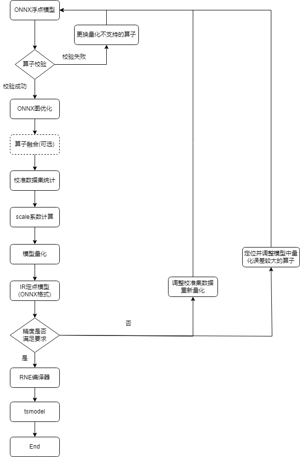

\

demo示例
--------

示例一：量化demo模型
~~~~~~~~~~~~~~~~~~
.. code-block:: bash

    Knight --chip TX5368AV200 quant --save-dir /tmp/resnet18
    -m /opt/Quantize/onnx_examples/model/resnet18_onnx/resnet18.onnx
    -if infer_cls_model -qm kl -bs 10 -r quant -i 1 -uds /opt/Quantize/onnx_examples/infer_demo.py

执行成功后，屏幕会打印如下信息则表示模型量化成功：

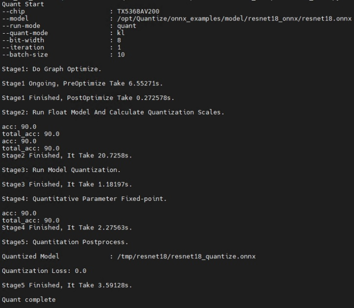

\

示例二：量化时自动在输入后实现减均值除方差操作
~~~~~~~~~~~~~~~~~~~~~~~~~~~~~~~~~~~~~~
.. code-block:: bash

    Knight --chip TX5368AV200 quant --save-dir /tmp/resnet18 -m /opt/Quantize/onnx_examples/model/resnet18_onnx/resnet18.onnx
    -if infer_cls_model -qm kl -bs 10 -r quant -i 1 -uds
    /opt/Quantize/onnx_examples/infer_demo.py --std 1.2 1.1 1.3 --mean 0.1 0.2 0.3

执行成功后，屏幕会打印如下信息则表示模型量化成功：

.. figure:: ../media/quant_4.png
    :alt: pipeline
    :align: center

\

示例三：量化QDQ模型
~~~~~~~~~~~~~~~~

ONNX量化工具可自动识别QDQ格式的模型并加载其中的系数开展后续量化，量化流程与普通浮点模型量化一致。示例如下：

.. code-block:: bash

    Knight --chip TX5368AV200 quant --save-dir /tmp/resnet18
    -m /opt/Quantize/onnx_examples/model/resnet18_qdq/resnet18_qdq.onnx
    -if infer_cls_model -qm kl -bs 10 -r quant -i 1 -uds /opt/Quantize/onnx_examples/infer_demo.py

执行成功后，屏幕会打印如下信息则表示模型量化成功：

.. figure:: ../media/quant_5.png
    :alt: pipeline
    :align: center

\

示例四：多量化模式和iteration进行量化
~~~~~~~~~~~~~~~~~~~~~~~~~~~~~~~~

ONNX量化工具支持同时指定多个quant-mode和iteration进行量化，自动识别和组合两者进行量化，并根据Quantization
Loss进行升序排列，多策略量化时只显示每种策略的开始和结束，示例如下：

.. code-block:: bash

    Knight --chip TX5368AV200 quant --save-dir /tmp/resnet18
    -m /opt/Quantize/onnx_examples/model/resnet18_onnx/resnet18.onnx
    -if infer_cls_model -qm kl min_max -bs 10 -r quant -i 5 10
    -uds /opt/Quantize/onnx_examples/infer_demo.py

执行成功后，屏幕会打印如下信息则表示量化成功，Quantization Loss显示Fail表示当前策略量化失败：

.. figure:: ../media/quant_6.png
    :alt: pipeline
    :align: center

\

.. note::
	多模式量化执行默认会开启数据缓存，若-s目录下存在数据缓存文件需确认缓存的数据量是否与当前量化对应的数据量一致，推荐多模式量化时-s指定为空的新目录。

示例五：--run-config的使用示例 
~~~~~~~~~~~~~~~~~~~~~~~~~~~

input-configs参数说明：参数的必需/可选仅针对其生效任务；input-configs中所有参数仅在指定uds为infer_common.py以及infer_func为infer_default时生效。

.. data:: 数据相关参数

	data_dir
		- 参数类型: string
		- 必选 
		- 默认值：无
		- 生效任务：检测、分类
		- 说明：图片存储目录。图片格式要求为bmp, jpg, jpeg, png。

	label_dir
		- 参数类型: string
		- 必选 
		- 默认值：无
		- 生效任务：检测、分类
		- 说明：标签存储目录。检测任务中支持yolo与coco格式标签；分类任务中标签文件为labels.txt，包含两列数据，第一列为图片名，第二列为图片类别号。

.. data:: 预处理相关参数

	is_yolo
		- 参数类型: bool
		- 必选 
		- 默认值：false
		- 生效任务：检测、分类
		- 说明：是否进行检测任务相关的预处理，检测任务中为true，分类任务中为false
	
	color_space
		- 参数类型: string
		- 必选 
		- 默认值：BGR
		- 生效任务：检测、分类
		- 说明：图片的目标色彩通道，可选项为RGB, BGR, GRAY
		
	augment
		- 参数类型: bool
		- 必选 
		- 默认值：false
		- 生效任务：检测、分类
		- 说明：检测任务中是否对小型图片进行扩大，需要扩大为true，不需要为false
		
	mean
		- 参数类型: int
		- 可选 
		- 默认值：无
		- 生效任务：检测、分类
		- 说明：均值，以list形式给出，必须与通道数量相同，与std同时提供时生效
		
	std
		- 参数类型: int
		- 必选 
		- 默认值：无
		- 生效任务：检测、分类
		- 说明：标准差，以list形式给出，必须与通道数量相同，与mean同时提供时生效

.. data:: 后处理相关参数

	calculate_acc
		- 参数类型: bool
		- 必选 
		- 默认值：false
		- 生效任务：检测、分类
		- 说明：是否计算精度，需要提供标签数据，当未提供label_dir时或label_dir为空时会将浮点模型的输出作为真实标签，并生成标签数据，
		  存储位置为data_dir同级目录下的labels文件夹下或label_dir指定的目录

	draw_box
		- 参数类型: bool
		- 必选 
		- 默认值：false
		- 生效任务：检测
		- 说明：检测任务中是否输出画框图片，该选项仅在infer模式下生效，画框图片存储在data_dir同级目录下的label_imgs文件夹下
		
	max_det
		- 参数类型: int
		- 必选 
		- 默认值：300
		- 生效任务：检测
		- 说明：检测任务中的最大检测数量

	anchors
		- 必选 
		- 生效任务：检测
		- 说明：检测任务的锚框，提供该选项时以list形式给出，以像素为单位
		
	nc
		- 参数类型: int
		- 必选 
		- 生效任务：检测
		- 说明：检测任务的类别数量
	
	conf_thres
		- 参数类型: float
		- 必选 
		- 默认值：0.001
		- 生效任务：检测
		- 说明：检测任务中nms的置信度阈值
		
	iou_thres
		- 参数类型: float
		- 必选 
		- 默认值：0.6
		- 生效任务：检测
		- 说明：检测任务中nms的交并比阈值
		
	names
		- 参数类型: string
		- 可选 
		- 生效任务：检测
		- 说明：检测任务中各类别对应名称，以list形式给出，提供时会在框体显示类别名称

1. 分类任务示例

.. figure:: ../media/quant_7.png
    :alt: pipeline
    :align: center

\

.. code-block:: bash

    Knight quant --run-config /opt/Quantize/onnx_examples/config/run_config_cls.json                                                  |
\

.. figure:: ../media/quant_8.png
    :alt: pipeline
    :align: center

\

2. 检测任务示例

量化示例

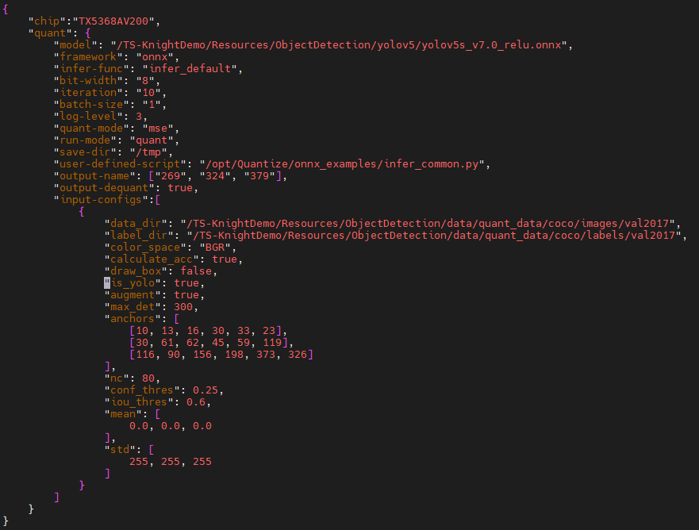

.. code-block:: bash

    Knight quant --run-config /opt/Quantize/onnx_examples/config/run_config_detect.json

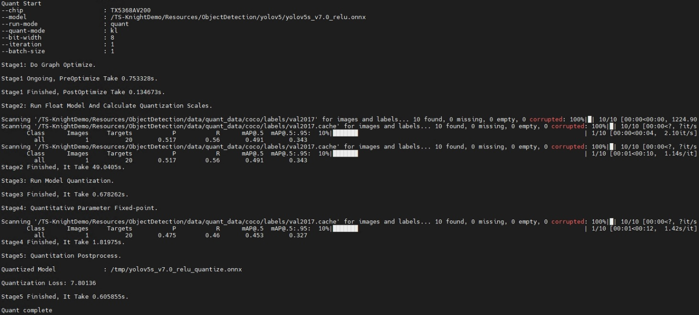

\

画框示例

.. figure:: ../media/quant_11.png
    :alt: pipeline
    :align: center

\

.. code-block:: bash

    Knight quant --run-config /opt/Quantize/onnx_examples/config/run_config_detect.json

\

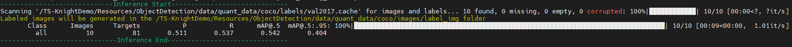

\

.. figure:: ../media/quant_13.png
    :alt: pipeline
    :align: center

量化新模型
---------

ONNX定义前向推理函数
~~~~~~~~~~~~~~~~~

量化过程中，需要前向推理函数加载数据并运行，通过数据统计来量化模型。
推理函数中，需要用户完成：

1. 完成校准数据集的加载及数据预处理。

2. 执行模型的前向推理。

3. 打印每个迭代的精度指标和最后总的精度指标。

注册前向推理函数
~~~~~~~~~~~~~~~~~

1.
指定用户自定义脚本。使用命令行参数 ``--user-defined-script`` 指定用户自定义脚本的路径，并在该脚本中实现前向推理函数。

2.
注册前向推理函数。在自定义脚本中导入注册函数 ``onnx_infer_func``，使用装饰器装饰推理函数，装饰器参数与推理函数名一致。

.. code-block:: python

    from onnx_quantize_tool.common.register import onnx_infer_func #导入注册函数

    @ onnx_infer_func.register("infer_cls_model") #使用装饰器装饰推理函数
    def infer_cls_model(executor):
        # 获取batch_size
        batch_size = executor.batch_size
        # Setting True to enable the early stop for fix forward (可选)
        # 1：校准数据加载及数据预处理
        test_data = 'data/imagenet_input_b10_s1.npy'
        test_label = 'data/imagenet_label_b10_s1.npy'
        input_data = np.load(test_data).astype(np.float32)
        label_data = np.load(test_label).astype(np.float32)
        val_loader = zip(input_data, label_data)
        total_correct_num = 0
        total_num = 0
        for i, (input_data, label) in enumerate(val_loader):
            input_data = input_data[:batch_size]
            label = label[:batch_size]
            # 2：执行模型前向推理
            output = executor.forward(input_data)
            # 3：后处理部分，根据输出结果计算得到对应精度指标
            pred = np.argmax(output[0], axis=1)
            correct_num = (pred == label).sum()
            num = (pred >= 0).sum()
            total_correct_num += correct_num
            total_num += num
            acc = (100.0 * correct_num) / num
            print("acc:", acc)
            if i + 1 == executor.iteration:
                break
            if executor.early_stop_flag == True: # Turning True when the early stop triggered
                break
        total_acc = (100.0 * total_correct_num) / total_num
        print("total_acc:", total_acc)
        return total_acc

**注意：**

1. 函数入参固定为（executor）。其中executor为量化信息载体实例，其中包含量化信息、量化编解码器等。前向推理函数中可能用到的参数及含义说明见下表：

+-----------------------------------+-----------------------------------+
| **参数名称**                      | **参数含义**                      |
+===================================+===================================+
| executor.iteration                | 命令行传递的iteration参数         |
+-----------------------------------+-----------------------------------+
| executor.batch_size               | 命令行传递的batch-size参数        |
+-----------------------------------+-----------------------------------+
| executor.dataset                  | 命令行传递的data参数              |
+-----------------------------------+-----------------------------------+
| executor.input_nodes              | 模型输入名称列表                  |
+-----------------------------------+-----------------------------------+
|executor.output_name_to_node_name()| 所有算子的输出名与算子名称的字典  |
+-----------------------------------+-----------------------------------+
| executor.shape_dicts              | infer函数中执行exe                |
|                                   | cutor.init_shape_info()，可获得层 |
|                                   | 名与对应shape的字典。详见FAQ文档  |
+-----------------------------------+-----------------------------------+
| executor.early_stop_flag          | early stop标志位                  |
+-----------------------------------+-----------------------------------+

用户可利用迭代次数”iteration”参数控制推理的迭代次数，并实现相应的退出逻辑。可利用 ``dataset`` 和 ``batch_size`` 参数完成输入数据的正确加载。

1. 函数出参固定为（模型精度指标）。模型精度指标一般说来是指模型的评价指标，比如准确率，如果没有这样的指标，建议返回1。

2. 前向推理函数中第二部分（执行模型前向推理）格式固定，第一部分（数据预处理）和第三部分（数据后处理）需要用户根据实际模型进行相应实现。

3. 模型前向推理固定为executor.forward(data_1,data_2,…,data_n)，只需按照模型各输入节点顺序依次送入对应的输入数据即可，输入数据data_n必须为numpy数据格式且与模型定义中对应的输入的shape一致，原始数据可为任意数据类型并非为npy格式文件，图片等类型数据格式可参照FAQ文档中ONNX相关章节进行实现。返回结果为list类型，包含了模型各输出节点的输出结果且与各输出节点顺序一致。

4. 使用early
   stop减少量化定点的迭代次数，提高量化速度。使用方法：在推理函数中，通过检查executor.early_stop_flag
   == True，捕获循环break信号。

执行量化命令进行量化
~~~~~~~~~~~~~~~~~~~~~

.. code-block:: bash

    Knight --chip TX5368AV200 quant --save-dir /tmp/resnet18
    -m /opt/Quantize/onnx_examples/model/resnet18_onnx/resnet18.onnx
    -if infer_cls_model -qm kl -bs 10 -r quant -i 1 -uds /opt/Quantize/onnx_examples/infer_demo.py

混合量化
--------

ONNX量化工具支持算子层级粒度的8与16bit混合及量化模式min_max/kl/kl_v2/percentile/mse混合，具体混合方式通过json文件的方式进行配置，配置完成后在量化时通过-mc指定此配置文件即可进行混合量化。

.. note::
	仅TX5368x_TX5339x_TX5335x、TX5215x_TX5239x200_TX5239x220_TX5239x300、TX5336x_TX5256x、TX5112x_TX5239x201支持混合量化。

生成混合量化模板json配置文件
~~~~~~~~~~~~~~~~~~~~~~~~~~~~~

使用ONNX量化工具可生成模型对应的混合量化模板json配置文件，命令如下：

.. code-block:: bash

    Knight --chip TX5368AV200 quant --save-dir /tmp/resnet18
    -m /opt/Quantize/onnx_examples/model/resnet18_onnx/resnet18.onnx -gt

上述命令执行后，屏幕打印如下信息则表示成功生成模板json文件：

.. figure:: ../media/quant_14.png
    :alt: pipeline
    :align: center
\

.. note::

	1. json配置文件只包含量化算子的量化策略信息，非量化算子(如Reshape)无需配置量化策略，也不会出现在配置文件中。

	2. 输入模型先进行图优化进而生成相对应的配置文件，可能出现部分被图优化策略优化或者融合掉的算子，此类算子不再出现在json配置文件中。

更新混合量化json配置文件
~~~~~~~~~~~~~~~~~~~~~~~~~~

按照既定混合量化策略修改json配置文件即可。

更新配置文件时需注意以下事项：

1. 模板json配置文件中的key值均与待量化算子名称一致，不可更改。

2. 每个量化节点均必须设置bitwidth与mode, 两者缺一不可。

3. bitwidth只支持设置为8或者16。

4. mode支持设置为min_max/kl/kl_v2/percentile/mse。

5. 循环类算子(RNN/LSTM/GRU/SRU/LSTMP)和LayerNormalization类型算子的前后量化算子的量化位宽即bitwidth必须与其一致。

6. Abs算子目前不支持混合量化。

7. 多输入时各输入的量化位宽必须一致。

8. Concat算子的父量化节点若存在循环类算子或LayerNormalization类型算子时，
   其量化位宽必须不高于其余父子量化节点的量化位宽。

指定混合量化配置文件开展混合量化
~~~~~~~~~~~~~~~~~~~~~~~~~~~~~~~~~~

量化时通过-mc指定混合量化json配置文件即可开展混合量化，命令如下：

.. code-block:: bash

    Knight --chip TX5368AV200 quant --save-dir /tmp/resnet18
    -m /opt/Quantize/onnx_examples/model/resnet18_onnx/resnet18.onnx
    -if infer_cls_model -bs 10 -mc /opt/Quantize/onnx_examples/model/resnet18_mix/resnet18_mix.json
    -r quant -i 1 -uds /opt/Quantize/onnx_examples/infer_demo.py

上述命令执行后，屏幕打印如下信息则表示模型开展混合量化成功：

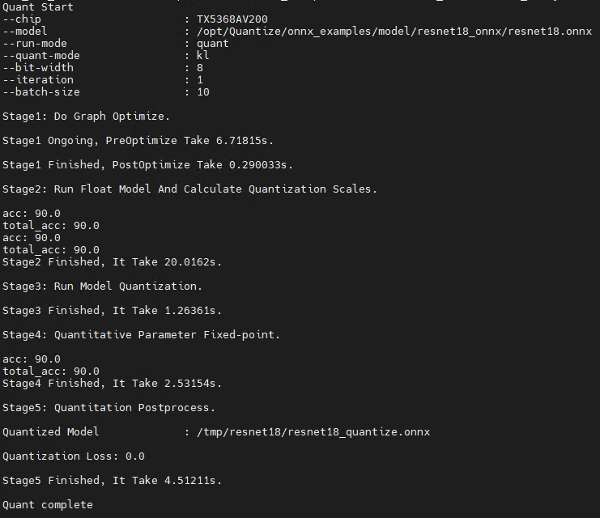

\

自动生成混合量化配置文件
~~~~~~~~~~~~~~~~~~~~~~~~~~~~~

在生成混合量化模板json配置文件时，可加上--auto-mix-ratio、
--auto-mix-strategy命令行参数，自动生成性能较优的混合量化模板。命令如下：

.. code-block:: bash

    Knight --chip TX5368AV200 quant --save-dir /tmp/resnet18
    -m /opt/Quantize/onnx_examples/model/resnet18_onnx/resnet18.onnx
    -if infer_cls_model -bs 10 -mc /opt/Quantize/onnx_examples/model/resnet18_mix/resnet18_mix.json
    -r quant -i 1 -uds /opt/Quantize/onnx_examples/infer_demo.py
    --auto-mix-ratio 0.5 --auto-mix-strategy IOhigh -gt

Pytorch模型量化
===============

Pytorch模型量化主体流程如下图所示：

.. figure:: ../media/quant_16.png
    :alt: pipeline
    :align: center

\

demo量化
----------

示例一，量化常规Pytorch模型，命令如下：

.. code-block:: bash

    Knight --chip TX5368AV200 quant –m resnet18 -f pytorch
    --save-dir /tmp/result -bs 10 -w /opt/Quantize/onnx_examples/model/resnet18_pytorch/resnet18-5c106cde.pth
    -if infer_cls_model -bs 10 -uds /opt/Quantize/onnx_examples/infer_demo.py

ONNX量化工具内部会将Pytorch模型先转换为ONNX模型再执行量化流程。上述命令执行后，屏幕打印如下信息则表示模型量化成功：

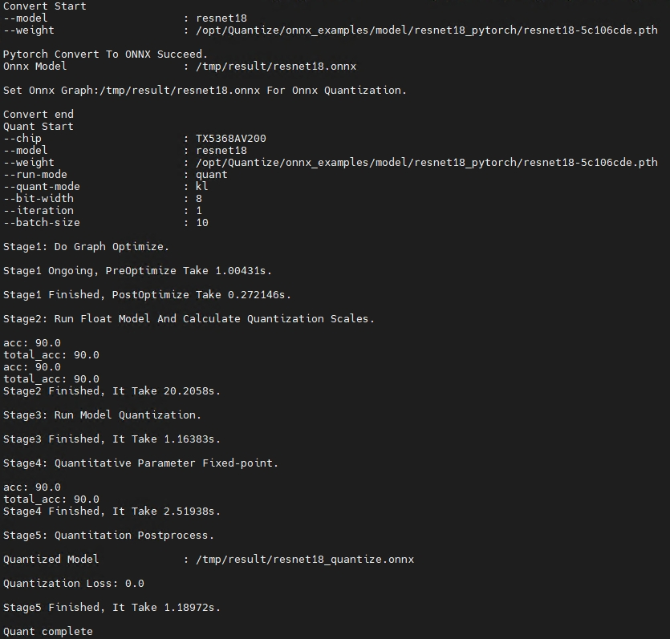

\

示例二：量化QAT模型

.. code-block:: bash

    Knight --chip TX5368AV200 quant -m /opt/Quantize/onnx_examples/model/resnet18_qdq/resnet18_qdq.onnx
    -if infer_cls_model -bs 10 --save-dir result -uds /opt/Quantize/onnx_examples/infer_demo.py

需配套提供由清微Finetune-Lib库训练产生qdq模型文件，执行量化流程，屏幕打印如下信息则表示模型量化成功：

.. figure:: ../media/quant_18.png
    :alt: pipeline
    :align: center

.. _量化新模型-1:

\

量化新模型
----------

模型转换
~~~~~~~~~~

Pytorch模型转换有两种方式：1）使用ONNX量化工具自带的转换工具pytorch2onnx；2）Pytorch官方转换接口torch.onnx.export。以下就两种转换方式详细说明：

1) **pytorch2onnx转换**

在对Pytorch模型量化之前，量化工具内部需先进行模型转换即将Pytorch模型转换为ONNX模型（组成Pytorch模型的算子集合须符合 :doc:`算子支持列表<../op/op>` ，转换成功后，再对转换出的ONNX模型进行量化。

使用命令行参数--user-defined-script指定用户自定义脚本的路径，并在该脚本中实现Pytorch模型定义函数。程序会将该脚本所在文件夹自动添加到环境变量${PYTHONPATH}中，若模型定义需要添加其他环境变量，需要在执行程序前，手动在docker镜像中设置环境变量。

在自定义脚本中导入Pytorch模型注册函数pytorch_model。使用装饰器装饰模型定义函数，装饰器参数与函数名一致。

转换模型时，使用命令行参--model指定Pytorch模型定义函数名，使用--user-defined-script指定用户自定义脚本，使用--weight指定Pytorch模型权重。

.. code-block:: python

    from onnx_quantize_tool.common.register import pytorch_model  # 导入Pytorch模型注册函数
    import torch
    @pytorch_model.register("resnet18")  # 使用装饰器装饰模型定义函数
    def resnet18(weight_path=None):  # 函数名必须与args.model一致
    model = torchvision.models.resnet18() # 模型定义，模型中所有算子须遵从 :doc:`算子支持列表<../op/op>`  之规格。
        if weight_path:# 模型加载
            model.load_state_dict(torch.load(weight_path, map_location='cpu') , strict=True)
        return {"model":model,"inputs": [torch.randn(10,3,224,224)]} # 按字典形式返回加载权重后的模型和转换后模型的输入tensor，key值须为“model”和“inputs”。

上面示例展示了resnet18模型的函数定义，用户需在该函数实现model权重加载和实例化输入tensor以供程序内部调用和解析。
用户可根据模型的输入个数和类型自行实例化输入tensor，如 ``[torch.randn(10,3,224,224)`` , ``torch.randn(10,3,224,224).to(torch.int64)]``。

若用户需要更改转换后模型输入数据的batchsize（只支持N维为动态 batch，CHW轴不支持动态配置），用户需在返回字典加入 
dynamic_axes_inputs:{'input':{0: 'batch_size'}} 和 "dynamic_axes_outputs": {'output':{0:'batch_size'}}，

其中 ``dynamic_axes_inputs`` 和 ``dynamic_axes_outputs`` 为固定键名，以 ``input`` 和 ``output`` 分别指定要动态batch的输入输出名，
输入输出名可任意指定，0表示第0维（一般为batch维度）为动态维度， ``batch_size`` 代指动态维度的  ``shape`` 。``dynamic_axes_inputs`` 必须指定，``dynamic_axes_outputs`` 不必须指定。如果模型是多输入，则{'input':{0:
'batch_size'}}的个数须配置与输入节点个数相等。

例如模型为两输入，设置如下

.. code-block:: python
	
	"dynamic_axes_inputs":{'input0':{0:'batch_size'},
	'input1':{0: 'batch_size'}}

若仅转换模型，则执行以下命令

.. code-block:: bash

    Knight --chip TX5368AV200 quant -m resnet18 -f pytorch -r convert
    -w /opt/Quantize/onnx_examples/model/resnet18_pytorch/resnet18-5c106cde.pth
    --save-dir result -uds /opt/Quantize/onnx_examples/infer_demo.py

2) **torch.onnx.export**

基于Pytorch2.1，官方转出onnx接口如下：

.. code-block:: python

    torch.onnx.export(model, args, f, opset_version=None, input_names=None, output_names=None)

这里面的model为原始模型定义，args是类型为torch.Tensor的模型输入，f指定要转出onnx模型的文件路径，opset_version指定要转出onnx的算子集版本，这里优先指定为14，若已转出的onnx算子集版本小于或大于14，可以使用官方提供的版本转换工具升级或降级到版本14；input_names/output_names分别为网络的输入输出名（可缺省）。官方接口和示例文档分别参见\ `torch.onnx.export <https://pytorch.org/docs/2.1/onnx_torchscript.html#torch.onnx.export>`__\ 和\ `tutorial <https://pytorch.org/docs/2.1/onnx_torchscript.html#example-alexnet-from-pytorch-to-onnx>`__\ 。

定义前向推理函数
~~~~~~~~~~~~~~~~~~~~~~

`ONNX定义前向推理函数`_

执行量化命令进行量化
~~~~~~~~~~~~~~~~~~~~~~

.. code-block:: bash

    Knight --chip TX5368AV200 quant -m resnet18 -f pytorch -if infer_cls_model
    --save-dir result -bs 10 -w /opt/Quantize/onnx_examples/model/resnet18_pytorch/resnet18-5c106cde.pth
    -uds /opt/Quantize/onnx_examples/infer_demo.py

量化QAT模型
-----------

量化由清微Finetune-Lib库训练得到的QAT模型，用户需提供训练得到的qdq模型，由ONNX量化工具加载并量化，以期获得精度更高的量化后模型。

定义前向推理函数
~~~~~~~~~~~~~~~~~~~~~~~~~~~~~

`ONNX定义前向推理函数`_

执行量化命令进行量化 
~~~~~~~~~~~~~~~~~~~~~~~~~~~~~

.. code-block:: bash

    Knight --chip TX5368AV200 quant -m /opt/Quantize/onnx_examples/model/resnet18_qdq/resnet18_qdq.onnx
    -if infer_cls_model -bs 10 --save-dir result -uds  /opt/Quantize/onnx_examples/infer_demo.py                             |

约束条件
-----------

模型转化中有以下场景不支持：

Pytorch到ONNX模型的转换基于torch.fx实现，如下几种情况不支持：

1)前向函数定义含有动态控制流。例如循环、判断语句并且其条件执行依赖于输入数据。

2)前向函数含有python内置函数。例如len()、all()、assert和其它python的外部函数工具包等。

3)前向函数含有@运算符，需用torch.matmul替换。

4)前向函数不支持tensor.to(torch.device(‘cpu’)运算。

5)针对QAT模型，在训练和推理阶段，待转换模型结构不一致。例如在GoogleNet网络定义中，self.aux1模块只在训练阶段出现，不参与前向推理。具体定义如下所示：

.. code-block:: python

    x = self.maxpool3(x)
    x = self.inception4a(x)
    aux1: Optional[Tensor] = None
    if self.aux1 is not None:
        if self.training:
            aux1 = self.aux1(x)
    x = self.inception4b(x)

6)前向函数中含有if判断且判断条件为bool变量时，需在转换函数中定义concrete_args

.. code-block:: python

    def yolov5_v7_relu(weight_path=None):
        if weight_path
            model = attempt_load(weight_path)
        concrete_args = {"augment": False, "profile": False, "visualize": False,"val": True}
        in_dict = {
                "model": model,
                "inputs": [torch.randn((1, 3, 640, 640))],
                "concrete_args": concrete_args
                 }

    return in_dict

7)前向函数中带有torch.reshape但入参不是固定shape时，需改为torch.view()

8)前向中含有torch.mul_等inplace操作时，需改为赋值写法。如：output=output.mul\_(2)

Caffe模型量化
=============

Caffe模型量化主体流程如下图所示：

\

caffe demo量化
---------------

工具包中提供示例demo，使用命令行如下：

.. code-block:: bash

    Knight -ch TX5368AV200 quant -f caffe -if infer_cls_model
    -m /opt/Quantize/onnx_examples/model/resnet18_caffe/resnet-18.prototxt
    -w /opt/Quantize/onnx_examples/model/resnet18_caffe/resnet-18.caffemodel
    --save-dir result -uds /opt/Quantize/onnx_examples/infer_demo.py

执行成功后，屏幕会打印如下信息则表示量化成功:

.. figure:: ../media/quant_20.png
    :alt: pipeline
    :align: center

\

量化新模型
----------

模型转换
~~~~~~~~~~~~~~~~~~~~~~~~~~~~~

首先，需要确认Caffe模型的算子符合 :doc:`算子支持列表<../op/op>` 。

Caffe模型结构文件和模型权重文件，分别由传入参数--model和--weight指定。转出的ONNX模型保存在{--save-dir}/的目录下。转出的ONNX模型名称由原Caffe模型结构文件名和后缀.onnx组成。例如，demo实例中--model为resnet18.prototxt，则转出的模型命名为resnet18.onnx。当所转出的ONNX模型和Caffe原始模型浮点比对一致后，则转换成功，且在窗口打印提示信息。

模型转换示例命令行：

.. code-block:: bash

    Knight -ch TX5368AV200 quant -f caffe -if infer_cls_model
    -m /opt/Quantize/onnx_examples/model/resnet18_caffe/resnet-18.prototxt
    -w /opt/Quantize/onnx_examples/model/resnet18_caffe/resnet-18.caffemodel
    --save-dir result -uds /opt/Quantize/onnx_examples/infer_demo.py -r convert

上述执行后，屏幕打印如下信息则表示模型转换成功：

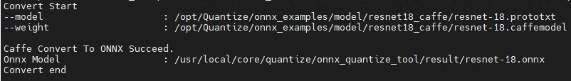
	
\

定义前向推理函数
~~~~~~~~~~~~~~~~~~~~~~~~~~~~~

`ONNX定义前向推理函数`_

执行量化命令进行量化
~~~~~~~~~~~~~~~~~~~~~~~~~~~~~

 `caffe demo量化`_

PaddlePaddle模型量化
======================

PaddlePaddle模型量化主体流程如下图所示：（以下简称PaddlePaddle为paddle）

.. figure:: ../media/quant_22.png
    :alt: pipeline
    :align: center

.. _demo量化-2:

demo量化
----------

示例一：量化常规paddle模型

.. code-block:: bash

    Knight --chip TX5368AV200 quant -f paddle -if infer_cls_model
    --save-dir result -bs 10 -w /opt/Quantize/onnx_examples/model/resnet18_paddle/resnet18.pdiparams
    -m /opt/Quantize/onnx_examples/model/resnet18_paddle/resnet18.pdmodel
    -is 10 3 224 224 -uds /opt/Quantize/onnx_examples/infer_demo.py

执行成功后，屏幕会打印如下信息则表示量化成功：

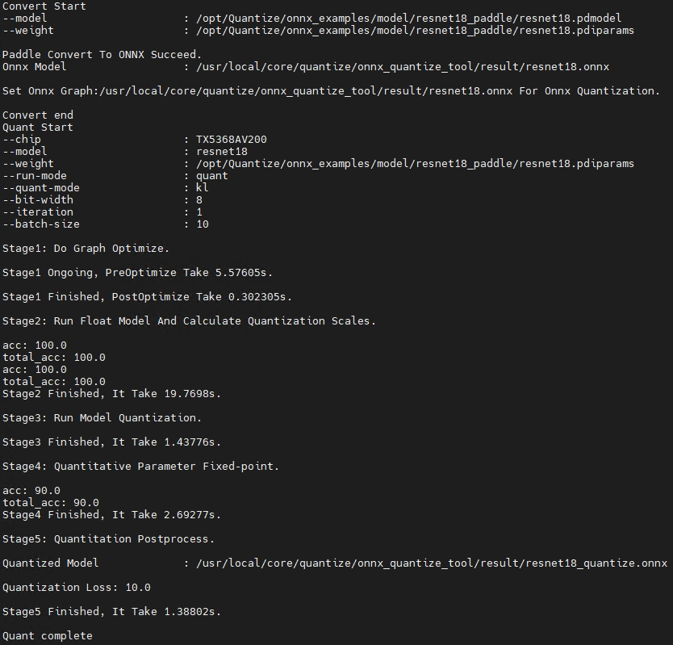

\

量化新模型
----------

模型转换
~~~~~~~~~~~~~~~~~~~~~~~~~~~~~

在对paddle模型量化之前，需要进行模型转换即将paddle模型转换为ONNX模型，组成paddle模型的算子集合须符合 :doc:`算子支持列表<../op/op>` 。

目前该工具只支持加载静态的paddle模型进行转换。静态模型是paddle官方推荐的用于推理部署的形态，通常由paddle.jit.save()或paddle.static.save_inference_model()或paddle.fluid.io.save_inference_model()生成保存。生成结果一般包含3个文件，形如resnet18.pdmodel、resnet18.pdiparams、resnet18.pdiparams.info；其中带pdmodel后缀表示模型文件，带pdiparams后缀表示参数文件，带info后缀是对参数补充说明的文件，此处不需要用到该文件。在使用上述3个函数保存静态推理模型时，也可自定义模型或参数的保存文件名，如\__model\_\_、\__params\_\_，但是建议使用规范的“模型名+相应后缀”的命名方式
。

使用该工具转换静态模型时，需要指定-m(--model)和-w(--weight)参数，-m参数为模型文件（如上述resnet18.pdmodel或者\__model\_\_）的具体路径，-w参数为参数文件（如上述resnet18.pdiparams或者\__params\_\_）的具体路径。

.. note::

    注意：模型文件和参数文件需要保存在同一个目录下；同时建议转换开始前使用合适的名字命名模型文件和参数文件，如模型名字+相应后缀，参考demo中的resnet18.pdmodel/resnet18.pdiparams。
    常见的静态模型的输入shape的各个维度均是固定的，或者只有第零维可变，如(128,3,224,224)、(-1,3,224,224)；也有少数静态模型的输入存在多个维度可动态赋值的情况，如(10,3,-1,-1)，需要为后两个维度指定具体数值；用户可在命令行中通过-is(--input-shapes)指定输入，如--input-shapes
    10 3 224 224。

.. note::

    注意：--input-shapes只是用来处理静态模型输入shape的某些维度是动态（即-1或None）的情况；不能通过-is参数更改静态模型非动态输入维度，如静态模型输入shape为(10,3,-1,-1)，则不能设置--input-shapes
    10 9 224 224 或者8 3 224 224；目前不支持第一维的3->9或者第零维的10->8这种改动。

当前某些模型输入shape的batchsize维度如果设置为-1（如输入shape为[-1,3,224,224]，-1表示batchsize），量化可能会失败。此时请指定具体的batchsize进行尝试，如[4,3,224,224]。我们将在后续版本优化该问题。

对于有多个输入的，请以相同方式按顺序指定（中间如果有其他非tensor类型的跳过即可）。
执行以下命令转换：

.. code-block:: bash

    Knight --chip TX5368AV200 quant -f paddle -if infer_cls_model -r convert
    --save-dir result -w /opt/Quantize/onnx_examples/model/resnet18_paddle/resnet18.pdiparams
    -m /opt/Quantize/onnx_examples/model/resnet18_paddle/resnet18.pdmodel
    -uds /opt/Quantize/onnx_examples/infer_demo.py

上述执行后，屏幕打印如下信息则表示模型转换成功：

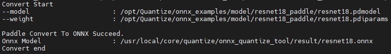

\

定义前向推理函数
~~~~~~~~~~~~~~~~~~~~~~~~~~~~~

`ONNX定义前向推理函数`_

执行量化命令进行量化
~~~~~~~~~~~~~~~~~~~~~~~~~~~~~

.. code-block:: bash

    Knight --chip TX5368AV200 quant -f paddle -if infer_cls_model
    --save-dir result -bs 10 -w /opt/Quantize/onnx_examples/model/resnet18_paddle/resnet18.pdiparams
    -m /opt/Quantize/onnx_examples/model/resnet18_paddle/resnet18.pdmodel
    -is 10 3 224 224 -uds /opt/Quantize/onnx_examples/infer_demo.py

说明：-bs指定了量化过程使用数据的batch大小；-is指定转换生成的onnx的输入shape（默认第零维为batch大小）；要求-bs和-is指定的batch大小要一致；如果转换前的paddle网络的输入shape包含动态batch（batch=-1），则可以不用指定-is。

Tensorflow模型量化
==================

Tensorflow模型量化主体流程如下图所示：

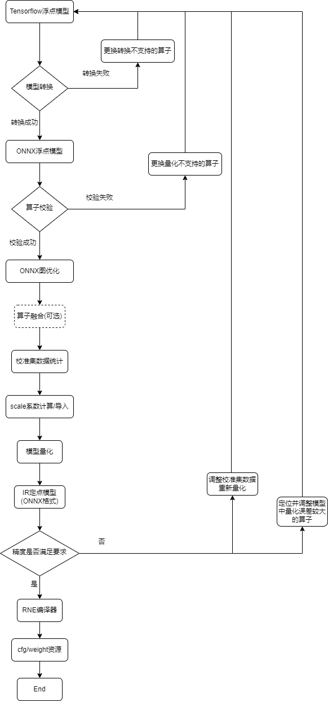

\

demo量化示例
-------------

步骤一：量化模型

.. code-block:: bash

    Knight --chip TX5368AV200 quant -m /opt/Quantize/onnx_examples/model/resnet18_tf/resnet18.pb
    -if infer_cls_model -f tensorflow -snn data_input:0 -enn output:0
    --save-dir result -uds /opt/Quantize/onnx_examples/infer_demo.py

执行成功后，屏幕会打印如下信息则表示量化成功：

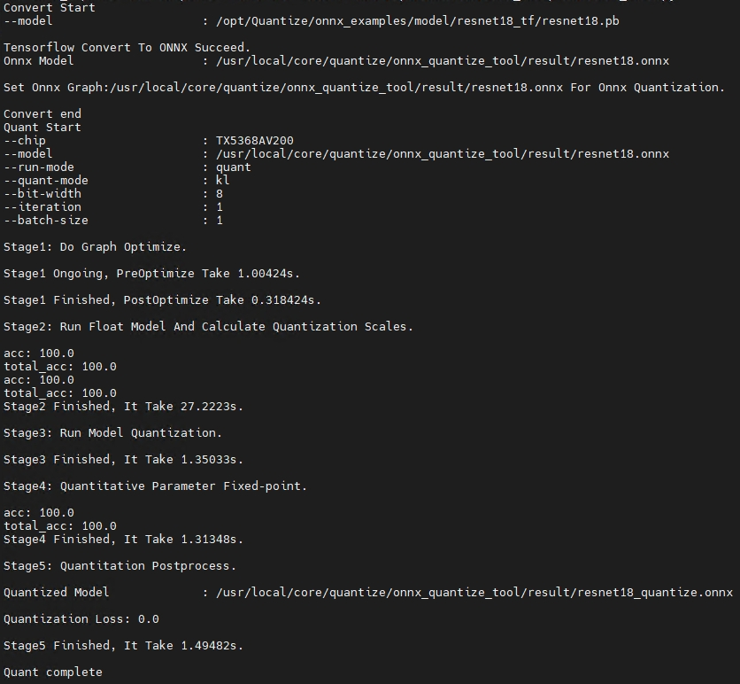

\

量化新模型
---------

模型转换
~~~~~~~~~~~~~~~~~~~~~~~~~~~~~

Tensorflow模型需要首先转换为ONNX模型后才能进行量化。

首先，需要确认Tensorflow模型的算子符合 :doc:`算子支持列表<../op/op>`  约束。

Tensorflow模型由传入参数--model指定。转出的ONNX模型保存在{--save-dir}/目录下。转出的ONNX模型名称由原Tensorflow模型文件名和后缀.onnx组成。例如，demo实例中--model为resnet18.pb，则转出的模型命名为resnet18.onnx。当所转出的ONNX模型和Tensorflow原始模型浮点比对一致后，则转换成功。

执行如下命令转换模型，示例如下：

.. code-block:: bash

    Knight --chip TX5368AV200 quant -m /opt/Quantize/onnx_examples/model/resnet18_tf/resnet18.pb
    -if infer_test_float -f tensorflow -snn data_input:0 -enn output:0
    --save-dir result -r convert -uds /opt/Quantize/onnx_examples/infer_demo.py

执行完成后，生成resnet18.onnx模型文件：

.. figure:: ../media/quant_27.png
    :alt: pipeline
    :align: center

\

定义前向推理函数
~~~~~~~~~~~~~~~~~~~~~~~~~~~~~

`ONNX定义前向推理函数`_

执行量化命令进行量化
~~~~~~~~~~~~~~~~~~~~~~~~~~~~~

.. code-block:: bash

    Knight --chip TX5368AV200 quant -m
    /opt/Quantize/onnx_examples/model/resnet18_tf/resnet18.pb -if
    infer_cls_model -f tensorflow -snn data_input:0 -enn output:0 --save-dir
    result -uds /opt/Quantize/onnx_examples/infer_demo.py

量化后模型路径
============

存放位置：{--save-dir}/目录下

文件名称：{原浮点模型名称}_quantize.<扩展名>

例如：

	原文件名称：``resnet18.onnx``

	量化后名称：``resnet18_quantize.onnx``

.. note::
    
    量化过程中生成的中间文件也放置在{--save-dir}/目录下，其中dump目录下存放模型各层输出结果文件，steps目录下存放量化过程中各阶段生成的中间模型。

测试量化后模型精度
===================

量化模型的精度测试需要在完整的测试数据集上进行。为了方便用户，我们也提供了该项功能，使用该功能时用户要在参数-if对应的infer-func函数里加载完整测试集，并根据模型预测结果计算相对应的精度，需要注意的是参数-i指定的数字需要能够覆盖整个测试集，参数-r设置为infer表示推理模式，参数--model需指定为量化后的模型，示例如下：

.. code-block:: bash

    Knight --chip TX5368AV200 quant --save-dir result -m
    /result/resnet18_quantize.onnx -if infer_cls_model -qm kl -bs 10 -r
    infer -i 100 -uds /opt/Quantize/onnx_examples/infer_demo.py

执行成功后，屏幕会打印如下信息:

.. figure:: ../media/quant_28.png
    :alt: pipeline
    :align: center
\

注意事项
============

用户需注意以下事项：

1. 模型中需要量化的算子需要包含在 :doc:`算子支持列表<../op/op>` 中。

2. 在进行多进程量化模型时不同进程对应的--save-dir存储目录必须不同，若相同则可能导致量化异常。

3. 转换为ONNX模型时需使用指定版本的ONNX(1.14.0)进行转换。

4. ONNX浮点模型输入只支持float32数据类型，不支持其它输入数据类型。

5. ONNX量化后模型(未增加输出反量化)输出结果为浮点类型表示的定点结果数据。

6. Compare工具支持比对的算子与 :doc:`算子支持列表<../op/op>` 中支持算子保持一致。

7. ONNX量化前浮点模型支持静态图和动态图，量化后定点模型只支持静态图。

8. 若用户设置的PYTHONPATH中存在与ONNX量化工具下定义的包同名时，可能会引起包引用异常。

9. ONNX静态图是指输入维度均为固定值的图(如下左图所示)，动态图是指 ``batchsize`` 可配置的图(如下右图所示)。

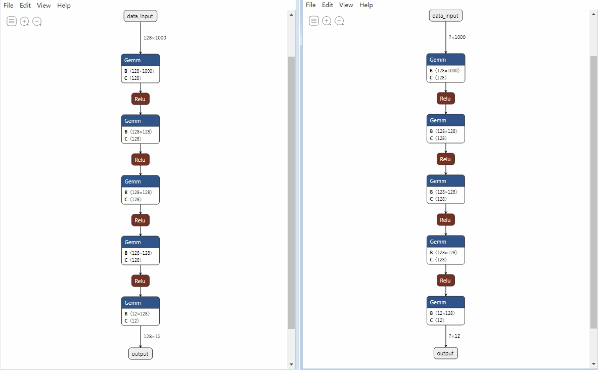
