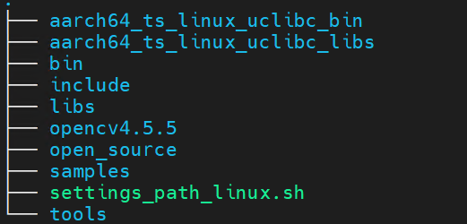
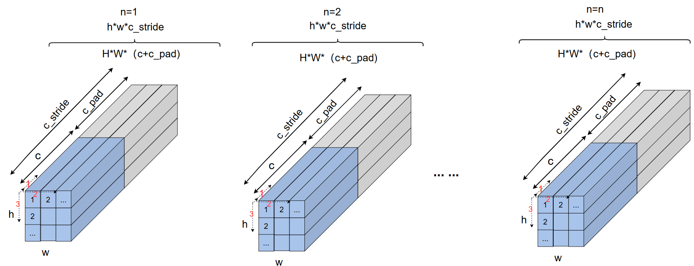
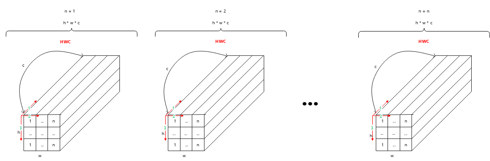
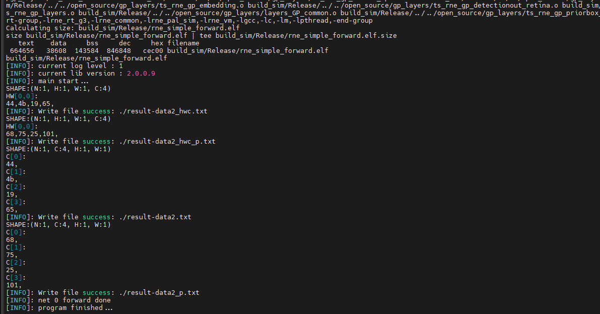
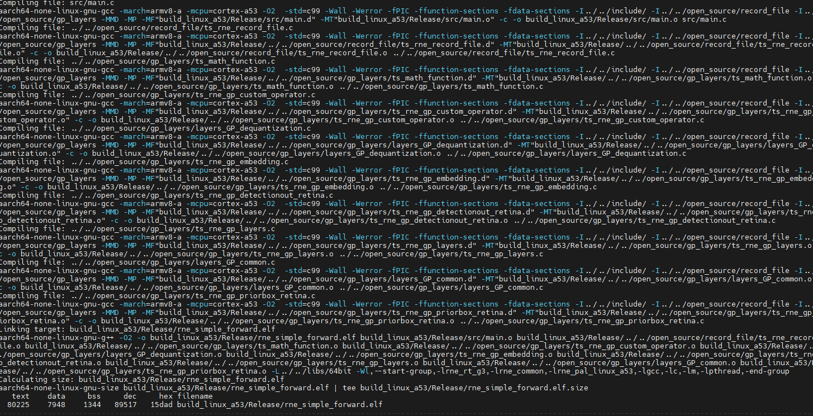
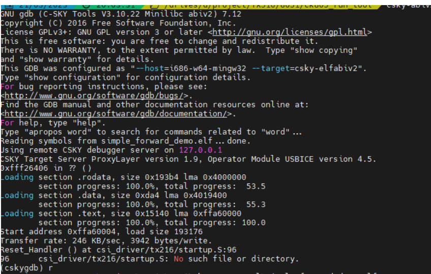
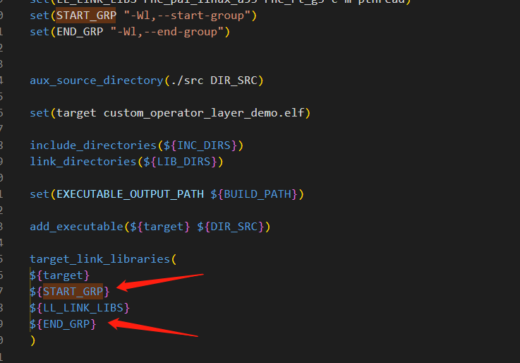
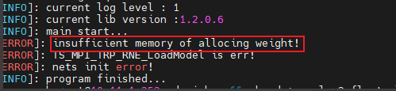

=============
SDK使用指南
=============

本文档旨在帮助用户快速了解RNE库的使用流程，以期达到快速上手的目的。

**名称解释**

+-----------------------------------+-----------------------------------+
| 术语                              | 说明                              |
+===================================+===================================+
| Knight                            | 清微骑士工具链英文名称            |
+-----------------------------------+-----------------------------------+
| CGRA                              | 粗粒度可重构阵列处理器            |
+-----------------------------------+-----------------------------------+
| RNE                               | 可重构神经网络加速引擎            |
+-----------------------------------+-----------------------------------+
| FSPM                              | CGRA芯片内部数据缓存              |
+-----------------------------------+-----------------------------------+
| WSPM                              | CGRA芯片权重数据缓存              |
+-----------------------------------+-----------------------------------+
| MSPM                              | CGRA芯片量化参数缓存              |
+-----------------------------------+-----------------------------------+
| DDR                               | CGRA芯片外部数据缓存              |
+-----------------------------------+-----------------------------------+
| DMA                               | 直接存储器访问功能                |
+-----------------------------------+-----------------------------------+
| RCCN                              | 可重构矩阵计算功能                |
+-----------------------------------+-----------------------------------+
| RCVT                              | 可重构向量计算功能                |
+-----------------------------------+-----------------------------------+
| RDMA                              | 读DMA功能                         |
+-----------------------------------+-----------------------------------+
| WDMA                              | 写DMA功能                         |
+-----------------------------------+-----------------------------------+
| 通用算子层                        | CPU中执行的算子操作层             |
+-----------------------------------+-----------------------------------+
| 高效算子层                        | NPU中执行的算子操作层             |
+-----------------------------------+-----------------------------------+

RNE库介绍
=========

RNE库包含模拟库 ``RNE-SIM-Lib`` 和板端运行库 ``RNE-RT-Lib``。

RNE模拟库提供在 ``linux pc`` 下模拟正常网络推理所需的API，方便用户在PC端 构建开发调试NN相关的算法原型，使用户在没有硬件环境的情况下也能进行快速的NN模型算法原型开发。以及模拟调试某些在板端发现的NN相关问题。

RNE板端运行库提供网络在板端推理所需的API，用户可以通过加载运行库，完成在板端的部署。

.. note::
	下文提及的库，默认都为RNE库，以 ``TX5368AV200`` 平台示例，下文不再特殊说明。

库结构
------

.. figure:: ../media/sdk_1.png
    :alt: pipeline
    :align: center

.. centered:: 库结构图

RNE-SIM-Lib
-----------

.. figure:: ../media/sdk_2.png
    :alt: pipeline
    :align: center

.. centered:: RNE-SIM-Lib目录结构

如图
1‑2所示，RNE-SIM-Lib由samples、open_source、include、bin和libs和文件夹构成，五个文件夹下对应的内容如下表所示：

+-----------------------------------+-----------------------------------+
| 文件夹                            | 描述                              |
+===================================+===================================+
| samples                           | 示例程序                          |
+-----------------------------------+-----------------------------------+
| include                           | 库对应的头文件                    |
+-----------------------------------+-----------------------------------+
| libs                              | 静态模拟库                        |
+-----------------------------------+-----------------------------------+
| open_source                       | 开源代码                          |
+-----------------------------------+-----------------------------------+
| bin                               | 动态模拟库                        |
+-----------------------------------+-----------------------------------+

.. figure:: ../media/sdk_3.png
    :alt: pipeline
    :align: center

.. centered:: include和libs详细结构图

根据图
1‑3所示，模拟库（libs）共有librne_common.a、librne_pal_sim.a、librne_rt_g3.a和librne_vm.a四个库组成，include中是库对应的头文件，两者的对应关系描述如下表所示：

+--------------------------------+-------------------------------------+
| libs                           | 头文件                              |
+================================+=====================================+
| librne_common.a                | ts_type.h                           |
|                                |                                     |
|                                | ts_rne_type.h                       |
|                                |                                     |
|                                | ts_rne_log.h                        |
|                                |                                     |
|                                | ts_rne_nn_input.h                   |
|                                |                                     |
|                                | ts_rne_nn_output.h                  |
|                                |                                     |
|                                | ts_rne_version.h                    |
|                                |                                     |
|                                | ts_rne_time.h                       |
|                                |                                     |
|                                | ts_rne_nn_thread.hpp                |
|                                |                                     |
|                                | ts_rne_thread_safe_queue.hpp        |
+--------------------------------+-------------------------------------+
| librne_vm.a                    | 无                                  |
+--------------------------------+-------------------------------------+
| librne_rt_g3.a                 | 对应头文件为：                      |
|                                |                                     |
|                                | ts_rne_c_api.h                      |
|                                |                                     |
|                                | ts_rne_device.h                     |
+--------------------------------+-------------------------------------+
| librne_pal_sim.a               | ts_rne_plat_port.h                  |
+--------------------------------+-------------------------------------+

.. note::
	librne_rt_g3.a在不同产品有所差异：
	
	TX510x对应的为librne_rt_g1.a。
	
	TX5368x_TX5339x_TX5335x、TX5215x_TX5239x200_TX5239x220_TX5239x300和TX5112x_TX5239x201、TX5336x_TX5256x对应的为librne_rt_g3.a。
	
	bin下动态库和libs静态库一一对应，此处不再做特殊说明。

.. figure:: ../media/sdk_4.png
    :alt: pipeline
    :align: center

.. centered::  Samples详细结构图

如图所示，samples共有compiled_model、scripts和rne_simple_foward等文件夹构成，各个文件夹描述如下表所示：

+--------------+-------------------------------------------------------+
| samples      | 描述                                                  |
+==============+=======================================================+
|compiled_model| 编译器编译生成的二进制部署资源                        |
+--------------+-------------------------------------------------------+
| scripts      | bin2header实现二进制文件到头文件的转化。详细用法见FAQ |
+--------------+-------------------------------------------------------+
|              | rne_e2e_example.sh                                    |
|              | 执行典型sample的脚本，关联sample为rne_simple_forward  |
+--------------+-------------------------------------------------------+
|              | rne_e2e_example_cm.sh 执行指定sample的脚本            |
+--------------+-------------------------------------------------------+
| rne_si       | 调用库实现典型网络推理的sample                        |
| mple_forward |                                                       |
+--------------+-------------------------------------------------------+
| ...          | 其他sample参考第6章节                                 |
+--------------+-------------------------------------------------------+

RNE-RT-Lib
----------

.. centered:: RNE-RT-Lib目录结构图

如图所示，RNE-RT-Lib由samples、open_source、include、bin和libs等文件夹构成，九个文件夹下对应的内容如下表所示：

+-----------------------------------+-----------------------------------+
| 文件夹                            | 描述                              |
+===================================+===================================+
| samples                           | 示例程序                          |
+-----------------------------------+-----------------------------------+
| include                           | 库对应的头文件                    |
+-----------------------------------+-----------------------------------+
| libs                              | glibc静态运行时库                 |
+-----------------------------------+-----------------------------------+
| open_source                       | 开源code                          |
+-----------------------------------+-----------------------------------+
| aarch64_ts_linux_uclibc_libs      | uclibc静态运行时库                |
+-----------------------------------+-----------------------------------+
| opencv4.5.5                       | opencv4.5.5 libs与include         |
+-----------------------------------+-----------------------------------+
| bin                               | glibc动态运行时库                 |
+-----------------------------------+-----------------------------------+
| aarch64_ts_linux_uclibc_bin       | uclibc动态运行时库                |
+-----------------------------------+-----------------------------------+
| tools                             | 小工具                            |
+-----------------------------------+-----------------------------------+

.. figure:: ../media/sdk_6.png
    :alt: pipeline
    :align: center

.. centered:: include和libs详细结构图

根据图所示，板端运行库（libs）共有librne_common.a、librne_pal_linux_a53.a和librne_rt_g3.a三个库组成，include中是库对应的头文件，两者的对应关系描述如下表所示：

+--------------------------------+-------------------------------------+
| libs                           | 头文件                              |
+================================+=====================================+
| librne_common.a                | ts_type.h                           |
|                                |                                     |
|                                | ts_rne_type.h                       |
|                                |                                     |
|                                | ts_rne_log.h                        |
|                                |                                     |
|                                | ts_rne_nn_input.h                   |
|                                |                                     |
|                                | ts_rne_nn_output.h                  |
|                                |                                     |
|                                | ts_rne_version.h                    |
|                                |                                     |
|                                | ts_rne_time.h                       |
|                                |                                     |
|                                | ts_rne_nn_thread.hpp                |
|                                |                                     |
|                                | ts_rne_thread_safe_queue.hpp        |
+--------------------------------+-------------------------------------+
| librne_rt_g3.a                 | 对应头文件为：                      |
|                                |                                     |
|                                | ts_rne_c_api.h                      |
|                                |                                     |
|                                | ts_rne_device.h                     |
+--------------------------------+-------------------------------------+
| librne_pal_linux_a53.a         | ts_rne_plat_port.h                  |
+--------------------------------+-------------------------------------+

.. note::

	librne_rt_g3.a在不同产品有所差异：

	TX510x对应的为librne_rt_g1.a。

	TX5368x_TX5339x_TX5335x、TX5336x_TX5256x、TX5215x_TX5239x200_TX5239x220_TX5239x300和TX5112x_TX5239x201对应的为librne_rt_g3.a。

	librne_pal_linux_a53.a在不同产品有所差异：

	TX510x对应的为linux_pal_ck805.a。

	TX5368x_TX5339x_TX5335x对应的为librne_pal_linux_a53.a。

	TX5336x_TX5256x、TX5215x_TX5239x200_TX5239x220_TX5239x300和TX5112x_TX5239x201对应的为librne_pal_linux_a7.a。

	uclibc版本下库的名称与glibc版本下相同，此处不再做特殊说明。

	*bin下动态库和*libs静态库一一对应，此处不再做特殊说明。

.. centered:: samples详细结构图

根据图所示，samples共有compiled_model、scripts和rne_simple_forward等文件夹构成，各个文件夹描述如下表所示：

+-------------------+------------------------------------------------------+
| samples           | 描述                                                 |
+===================+======================================================+
|compiled_model     | 编译器编译生成的二进制部署资源                       |
+-------------------+------------------------------------------------------+
| scripts           |bin2header实现二进制文件到头文件的转化。              |
|                   |详细用法见 `FAQ`_                                     |
+                   +------------------------------------------------------+
|                   | rne_e2e_example.sh                                   |
|                   | 执行典型sample的脚本，关联sample为rne_simple_forward |
+                   +------------------------------------------------------+
|                   | rne_e2e_example_cm.sh 执行指定sample的脚本           |
+-------------------+------------------------------------------------------+
|rne_simple_forward | 调用库实现典型网络推理的sample                       |
+-------------------+------------------------------------------------------+
| ...               | 其他sample参考 `samples说明`_                        |
+-------------------+------------------------------------------------------+

API介绍
=======

SDK提供了一些不同方面的API，包含基本接口、时间接口、日志接口、版本接口、VPE接口、输入输出接口、高级内存接口、通用算子接口、异步接口、多核相关接口等，涉及到以下头文件。

+--------------------+-------------------------------------------------+
| 头文件             | API说明                                         |
+====================+=================================================+
| ts_rne_c_api.h     | 包含了N                                         |
|                    | N层的API，提供了与RNE相关的函数和结构体的声明。 |
+--------------------+-------------------------------------------------+
| ts_rne_device.h    | 提供                                            |
|                    | 了与RNE设备层相关的API，用于管理和控制RNE设备。 |
+--------------------+-------------------------------------------------+
| ts_rne_log.h       | 包含                                            |
|                    | 了与SDK日志相关的API，用于打印和管理日志信息。  |
+--------------------+-------------------------------------------------+
| ts_rne_version.h   | 提供了获取SDK版本信息的API。                    |
+--------------------+-------------------------------------------------+
| ts_rne_plat_port.h | 定义了SDK底层                                   |
|                    | 数据结构，可能包含与平台相关的接口和类型定义。  |
+--------------------+-------------------------------------------------+
| ts_rne_time.h      | 提供                                            |
|                    | 了与SDK时间相关的API，用于获取和处理时间信息。  |
+--------------------+-------------------------------------------------+
| ts_rne_type.h      | 定义了SDK中使用的一些类型和数据结构。           |
+--------------------+-------------------------------------------------+
| ts_rne_nn_input.h  | 提供了                                          |
|                    | 填充NN层输入blobs相关的API，用于准备输入数据。  |
+--------------------+-------------------------------------------------+
| ts_rne_nn_output.h | 提供                                            |
|                    | 了填充NN层输出addr相关的API，用于获取输出数据。 |
+--------------------+-------------------------------------------------+
| ts                 | 用于异步调用多个网络                            |
| _rne_nn_thread.hpp | 时使用的头文件，提供了多线程相关的功能和接口。  |
+--------------------+-------------------------------------------------+
| ts_rne_thr         | 用于异步调用多个                                |
| ead_safe_queue.hpp | 网络时使用的头文件，提供了线程安全队列的实现。  |
+--------------------+-------------------------------------------------+
| ts_rne_vpe.h       | 包含了与图像处理                                |
|                    | 和视觉任务相关的函数、结构体或其他类型的声明。  |
+--------------------+-------------------------------------------------+
| ts_rne_type.h      | 包                                              |
|                    | 含了与神经网络推理相关的类型定义、枚举常量等。  |
+--------------------+-------------------------------------------------+
| ts_type.h          | 包                                              |
|                    | 含了与系统或库中使用的一些常见类型相关的定义。  |
+--------------------+-------------------------------------------------+

.. note::
	NN层是RNE设备层的上层，用户一般的使用只需要用到NN层的API，特殊情况下才需要用到底层的RNE设备层API。

基础接口
--------

TS_MPI_TRP_RNE_InitResourceByType
~~~~~~~~~~~~~~~~~~~~~~~~~~~~~~~~~~~~~                                

【描述】
初始化芯片资源。

【定义】

.. code-block:: c

   TS_S32 TS_MPI_TRP_RNE_InitResourceByType(RNE_TYPE_NAME_E type);

【参数】

+------------+--------------------------------------------+-----------+
| 参数名称   | 描述                                       | 输入/输出 |
+============+============================================+===========+
| type       | 芯片类型                                   | 输入      |
+------------+--------------------------------------------+-----------+

【返回值】

+---------------------+------------------------------------------------+
| 返回值              | 描述                                           |
+=====================+================================================+
| 非0                 | 失败                                           |
+---------------------+------------------------------------------------+
| 0                   | 成功                                           |
+---------------------+------------------------------------------------+

【所在头文件】

ts_rne_version.h

.. note::
	此接口必须调用。

【举例】

参考samples。

TS_MPI_TRP_RNE_OpenDevice
~~~~~~~~~~~~~~~~~~~~~~~~~~~~~~~~~~~~~  
                         

【描述】

打开RNE设备并初始化RNE驱动。通过传入RNE_DRIVER_S结构体指针，可以设置相关的设备信息和配置参数。同时，需要传入一个函数指针，该函数用于注册所有的通用算子层。
该函数会根据传入的设备信息和配置进行设备的打开和初始化操作，并将相关的驱动句柄保存在RNE_DRIVER_S结构体中。在成功打开设备并初始化驱动后，可以进行后续的模型加载和推理操作。

【定义】

.. code-block:: c

   TS_S32 TS_MPI_TRP_RNE_OpenDevice(RNE_DRIVER *driver, TS_MPI_TRP_RNE_RegisterAllGpLayers registerGpLayers);  

【参数】

+-----------+----------------------------------------------+-----------+
| 参数名称  | 描述                                         | 输入/输出 |
+===========+==============================================+===========+
| driver    | RNE驱动结                                    | 输入      |
|           | 构体指针，用于传递RNE设备的相关信息和配置。  |           |
|           |                                              |           |
|           | 如果参数为NULL，则调                         |           |
|           | 用内部默认driver相关配置，此参数传NULL即可。 |           |
+-----------+----------------------------------------------+-----------+
| registe   | 函数指针，用于注册通用算子层。               | 输入      |
| rGpLayers |                                              |           |
|           | 如                                           |           |
|           | 果模型中不包含通用算子层，此参数可以为NULL。 |           |
+-----------+----------------------------------------------+-----------+

【返回值】

+--------------+-------------------------------------------------------+
| 返回值       | 描述                                                  |
+==============+=======================================================+
| 非0          | 失败                                                  |
+--------------+-------------------------------------------------------+
| 0            | 成功                                                  |
+--------------+-------------------------------------------------------+

【所在头文件】

ts_rne_device.h

.. note::

	此接口必须调用，且调用一次即可，多次调用无意义。此接口不支持线程互斥。

【举例】

参考samples。

TS_MPI_TRP_RNE_CloseDevice
~~~~~~~~~~~~~~~~~~~~~~~~~~~~~~~~~~~~~  
                          

【描述】

用于关闭RNE设备并释放相关资源。在完成模型加载、推理和卸载任务后，可以调用该函数来进行设备的关闭操作，以释放占用的资源。该函数会执行设备的关闭操作，并释放相关的驱动句柄和资源。

【定义】

.. code-block:: c

   TS_S32 TS_MPI_TRP_RNE_CloseDevice(TS_VOID);  

【返回值】

+--------------+-------------------------------------------------------+
| 返回值       | 描述                                                  |
+==============+=======================================================+
| 非0          | 失败                                                  |
+--------------+-------------------------------------------------------+
| 0            | 成功                                                  |
+--------------+-------------------------------------------------------+

【所在头文件】

ts_rne_device.h

.. note::
	在调用该函数前，需要确保已经完成了所有的模型推理任务，并且不再需要使用RNE设备。调用一次即可，多次调用无意义。

【举例】

参考samples。

TS_MPI_TRP_RNE_DeviceIsOpened
~~~~~~~~~~~~~~~~~~~~~~~~~~~~~~~~~~~~~  
                             

【描述】

获取当前RNE设备的状态。

【定义】

.. code-block:: c

   TS_RNE_BOOL TS_MPI_TRP_RNE_DeviceIsOpened(TS_VOID);  

【返回值】

+--------------+-------------------------------------------------------+
| 返回值       | 描述                                                  |
+==============+=======================================================+
| TS_TRUE      | 当前RNE设备为打开状态                                 |
+--------------+-------------------------------------------------------+
| TS_FALSE     | 当前RNE设备为关闭状态                                 |
+--------------+-------------------------------------------------------+

【所在头文件】

ts_rne_device.h

 

TS_MPI_TRP_RNE_LoadModel
~~~~~~~~~~~~~~~~~~~~~~~~~~~~~~~~~~~~~  
                        

【描述】

用于加载RNE模型。通过传入RNE_NET_S结构体指针，可以设置模型的相关信息和配置参数。

该函数会根据传入的模型信息和配置进行模型的加载操作。在成功加载模型后，可以进行后续的推理任务。

【定义】

.. code-block:: c

   TS_S32 TS_MPI_TRP_RNE_LoadModel(RNE_NET_S *net);

【参数】

+------+--------------------------------------------------+-----------+
| 参数 | 描述                                             | 输入/输出 |
| 名称 |                                                  |           |
+======+==================================================+===========+
| net  | 指向RNE                                          | 输入      |
|      | _NET_S结构体的指针，用于传递模型的相关信息和配置 |           |
+------+--------------------------------------------------+-----------+

【返回值】

+--------------+-------------------------------------------------------+
| 返回值       | 描述                                                  |
+==============+=======================================================+
| 非0          | 失败                                                  |
+--------------+-------------------------------------------------------+
| 0            | 成功                                                  |
+--------------+-------------------------------------------------------+

【所在头文件】

ts_rne_c_api.h

.. note::
	调用此函数之前，必需要先调用TS_MPI_TRP_RNE_OpenDevice。

【举例】

参考samples。

TS_MPI_TRP_RNE_UnloadModel
~~~~~~~~~~~~~~~~~~~~~~~~~~~~~~~~~~~~~  
                          

【描述】

用于卸载RNE模型。通过传入RNE_NET_S结构体指针，可以设置模型的相关信息和配置参数，如模型文件路径、输入输出节点名称、模型类型等。

该函数会根据传入的模型信息和配置进行模型的卸载操作。在完成模型推理任务后，调用该函数可以释放占用的模型资源。

【定义】

.. code-block:: c

   TS_S32 TS_MPI_TRP_RNE_UnloadModel(RNE_NET_S *net);

【参数】

+--------+-------------------------------------------------------+-----------+
| 参     | 描述                                                  | 输入/输出 |
| 数名称 |                                                       |           |
+========+=======================================================+===========+
| net    |指向RNE_NET_S结构体的指针，用于传递模型的相关信息和配置| 输入      |
+--------+-------------------------------------------------------+-----------+

【返回值】

+----------+-----------------------------------------------------------+
| 返回值   | 描述                                                      |
+==========+===========================================================+
| 非0      | 失败                                                      |
+----------+-----------------------------------------------------------+
| 0        | 成功                                                      |
+----------+-----------------------------------------------------------+

【所在头文件】

ts_rne_c_api.h

.. note::
	在调用该函数前，需要确保已经完成了所有的模型推理任务，并且不再需要使用该模型。

【举例】

参考samples。

TS_MPI_TRP_RNE_Forward
~~~~~~~~~~~~~~~~~~~~~~~~~~~~~~~~~~~~~                        

【描述】

用于执行RNE模型的前向推理操作。通过传入RNE_NET_S结构体指针，可以设置模型的相关信息和配置参数。

该函数会根据传入的模型信息和配置进行模型的前向推理操作，并返回推理结果。推理结果以RNE_BLOBS_S结构体的形式返回，包含了模型输出的各个节点的数据。

【定义】

.. code-block:: c

   RNE_BLOBS_S *TS_MPI_TRP_RNE_Forward(RNE_NET_S *net);  

【参数】

+-------+-------------------------------------------------+-----------+
| 参数  | 描述                                            | 输入/输出 |
| 名称  |                                                 |           |
+=======+=================================================+===========+
| net   | 指向RNE_                                        | 输入      |
|       | NET_S结构体的指针，用于传递模型的相关信息和配置 |           |
+-------+-------------------------------------------------+-----------+

【返回值】

+----------+-----------------------------------------------------------+
| 返回值   | 描述                                                      |
+==========+===========================================================+
| RNE_B    | 若返回为NULL，则前向推理出现异常；                        |
| LOBS_S*  |                                                           |
|          | 若网络的cpDeb                                             |
|          | ugLayerName不为空且能找到该调试层，则返回该调试层的输出； |
|          |                                                           |
|          | 否则返回网络的                                            |
|          | 最后结果，等同于函数TS_MPI_TRP_RNE_GetResultBlobs的返回值 |
+----------+-----------------------------------------------------------+

【所在头文件】

ts_rne_c_api.h

.. note::
  在调用该函数前，需要确保已经成功打开设备，加载了模型，并且准备好输入数据、权重或者量化数据。

【举例】

参考samples。

TS_MPI_TRP_RNE_OnceLoad
~~~~~~~~~~~~~~~~~~~~~~~~~~~~~~~~~~~~~                         

【描述】

用于执行RNE模型的一次前向推理操作，实现权重或者量化数据一次性加载到RNE内部存储空间。

【定义】

.. code-block:: c

   TS_S32 TS_MPI_TRP_RNE_OnceLoad(RNE_NET_S *net);  

【参数】

+-------+-------------------------------------------------+-----------+
| 参数  | 描述                                            | 输入/输出 |
| 名称  |                                                 |           |
+=======+=================================================+===========+
| net   | 指向RNE_                                        | 输入      |
|       | NET_S结构体的指针，用于传递模型的相关信息和配置 |           |
+-------+-------------------------------------------------+-----------+

【返回值】

+----------+-----------------------------------------------------------+
| 返回值   | 描述                                                      |
+==========+===========================================================+
| 非0      | 失败                                                      |
+----------+-----------------------------------------------------------+
| 0        | 成功                                                      |
+----------+-----------------------------------------------------------+

【所在头文件】

ts_rne_c_api.h

.. note::

	只针对在编译器编译资源时，使用onceload方式编译的资源文件。在调用该函数前，需要确保已经成功打开设备，加载了模型，并且准备好权重或者量化数据。

【举例】

参考samples。

TS_MPI_TRP_RNE_GetBlobsBufSize
~~~~~~~~~~~~~~~~~~~~~~~~~~~~~~~~~~~~~                                

【描述】

获取网络blob数据缓存区大小。

【定义】

.. code-block:: c

   TS_U32 TS_MPI_TRP_RNE_GetBlobsBufSize(RNE_NET_S *net);  

【参数】

+-------+-------------------------------------------------+-----------+
| 参数  | 描述                                            | 输入/输出 |
| 名称  |                                                 |           |
+=======+=================================================+===========+
| net   | 指向RNE_                                        | 输入      |
|       | NET_S结构体的指针，用于传递模型的相关信息和配置 |           |
+-------+-------------------------------------------------+-----------+

【返回值】

+----------+-----------------------------------------------------------+
| 返回值   | 描述                                                      |
+==========+===========================================================+
| 1 ~ MAX  | blob缓存数据大小，MAX为TS_U32的最大值                     |
+----------+-----------------------------------------------------------+
| 0        | 获取blob缓存数据大小失败                                  |
+----------+-----------------------------------------------------------+

【所在头文件】

ts_rne_c_api.h

TS_MPI_TRP_RNE_CStride
~~~~~~~~~~~~~~~~~~~~~~~~~~~~~~~~~~~~~                        

【描述】

计算内存中数据按通道方向对齐后的通道数c_stride,
一般计算出的c_stride大于等于输入的channel数。

【定义】

.. code-block:: c

   TS_S32 TS_MPI_TRP_RNE_CStride(TS_S32 chan, TS_S32 bitNum, TS_RNE_BOOL isJoined);  

【参数】

+--------------+-------------------------------------------+-----------+
| 参数名称     | 描述                                      | 输入/输出 |
+==============+===========================================+===========+
| chan         | 通道数                                    | 输入      |
+--------------+-------------------------------------------+-----------+
| bitNum       | 数据位宽                                  | 输入      |
+--------------+-------------------------------------------+-----------+
| isJoined     | 是否是拼接的                              | 输入      |
+--------------+-------------------------------------------+-----------+

【返回值】

+--------------+-------------------------------------------------------+
| 返回值       |   描述                                                |
+==============+=======================================================+
| 1 ~ MAX      | 返回对齐后的通道数,MAX为TS_U32的最大值。              |
+--------------+-------------------------------------------------------+
| 小于等于0    | 传参存在错误。                                        |
+--------------+-------------------------------------------------------+

【所在头文件】

ts_rne_c_api.h

.. note::
	根据位宽、通道数以及是否拼接，计算内存中数据按通道方向向上对齐后的通道数。该接口即将废弃，后续该功能将被TS_MPI_TRP_RNE_GetBlobCStride代替。

TS_MPI_TRP_RNE_GetBlobCStride
~~~~~~~~~~~~~~~~~~~~~~~~~~~~~~~~~~~~~                               

【描述】

该函数用于计算 blob 数据在 C
维度上的跨度，以便进行数据操作和内存布局的处理。

【定义】

.. code-block:: c

   TS_S32 TS_MPI_TRP_RNE_GetBlobCStride(RNE_BLOB_S * blob);  

【参数】

+--------------+-------------------------------------------+-----------+
| 参数名称     | 描述                                      | 输入/输出 |
+==============+===========================================+===========+
| blob         | 指向 RNE_BLOB_S                           | 输入      |
|              | 结构体的指针，表示要获取跨度的 Blob       |           |
|              | 数据。                                    |           |
+--------------+-------------------------------------------+-----------+

【返回值】

+--------------+-------------------------------------------------------+
| 返回值       |  描述                                                 |
+==============+=======================================================+
| 1 ~ MAX      | 返回对齐后的通道数,MAX为TS_U32的最大值。              |
+--------------+-------------------------------------------------------+
| 小于等于0    | 传参存在错误。                                        |
+--------------+-------------------------------------------------------+

【所在头文件】

ts_rne_c_api.h

.. note::
	需要在加载模型后调用。

【举例】

.. code-block:: c

   TS_S32 cStride = TS_MPI_TRP_RNE_GetBlobCStride(blobs->blob[idx]);

TS_MPI_TRP_RNE_GetResultBlobs
~~~~~~~~~~~~~~~~~~~~~~~~~~~~~~~~~~~~~                               

【描述】

获取网络推理结果或调试层的输出blobs。

【定义】

.. code-block:: c

   RNE_BLOBS_S *TS_MPI_TRP_RNE_GetResultBlobs(RNE_NET_S *net);  

【参数】

+------------+--------------------------------------------+-----------+
| 参数名称   | 描述                                       | 输入/输出 |
+============+============================================+===========+
| net        | 指向RNE_NET_S                              | 输入      |
|            | 结构体的指针，用于传递模型的相关信息和配置 |           |
+------------+--------------------------------------------+-----------+

【返回值】

+-----------+----------------------------------------------------------+
| 返回值    | 描述                                                     |
+===========+==========================================================+
| RNE_      | 若网络init时的cpDebugLayerName不                         |
| BLOBS_S*  | 为空,并且能找到该调试层，则返回该调试层的输出blobs指针； |
|           |                                                          |
|           | 否则返回网络的最后结果blobs指针                          |
+-----------+----------------------------------------------------------+

【所在头文件】

ts_rne_c_api.h

.. note::

	需要在加载模型后调用。

TS_MPI_TRP_RNE_GetInputBlobs 
~~~~~~~~~~~~~~~~~~~~~~~~~~~~~~~~~~~~~                               

【描述】

获取网络输入的blobs。

【定义】

.. code-block:: c

   RNE_BLOBS_S *TS_MPI_TRP_RNE_GetInputBlobs(RNE_NET_S *net);  

【参数】

+------------+--------------------------------------------+-----------+
| 参数名称   | 描述                                       | 输入/输出 |
+============+============================================+===========+
| net        | 指向RNE_NET_S                              | 输入      |
|            | 结构体的指针，用于传递模型的相关信息和配置 |           |
+------------+--------------------------------------------+-----------+

【返回值】

+--------------------+-------------------------------------------------+
| 返回值             | 描述                                            |
+====================+=================================================+
| RNE_BLOBS_S*       | 返回网络输入Blobs                               |
+--------------------+-------------------------------------------------+

【所在头文件】

ts_rne_c_api.h

.. note::
	需要在加载模型后调用。

TS_MPI_TRP_RNE_GetHideBlobs
~~~~~~~~~~~~~~~~~~~~~~~~~~~~~~~~~~~~~                             

【描述】

获取隐藏层的blobs。

【定义】

.. code-block:: c

   RNE_BLOBS_S *TS_MPI_TRP_RNE_GetHideBlobs(RNE_NET_S *net);  

【参数】

+------------+--------------------------------------------+-----------+
| 参数名称   | 描述                                       | 输入/输出 |
+============+============================================+===========+
| net        | 指向RNE_NET_S                              | 输入      |
|            | 结构体的指针，用于传递模型的相关信息和配置 |           |
+------------+--------------------------------------------+-----------+

【返回值】

+--------------------+-------------------------------------------------+
| 返回值             | 描述                                            |
+====================+=================================================+
| RNE_BLOBS_S*       | 返回网络隐藏层Blobs                             |
+--------------------+-------------------------------------------------+

【所在头文件】

ts_rne_c_api.h

.. note::

	需要在加载模型后调用。

TS_MPI_TRP_RNE_GetResVersion
~~~~~~~~~~~~~~~~~~~~~~~~~~~~~~~~~~~~~                              

【描述】

获取网络资源信息。

【定义】

.. code-block:: c

    const  TS_CHAR *TS_MPI_TRP_RNE_GetResVersion(RNE_NET_S *net);  

【参数】

+------------+--------------------------------------------+-----------+
| 参数名称   | 描述                                       | 输入/输出 |
+============+============================================+===========+
| net        | 指向RNE_NET_S                              | 输入      |
|            | 结构体的指针，用于传递模型的相关信息和配置 |           |
+------------+--------------------------------------------+-----------+

【返回值】

+-------------------+--------------------------------------------------+
| 返回值            | 描述                                             |
+===================+==================================================+
| const TS_CHAR*    | 网络资源信息                                     |
+-------------------+--------------------------------------------------+

【所在头文件】

ts_rne_c_api.h

.. note::

	需要在加载模型后调用。

TS_MPI_TRP_RNE_GetWeightSize
~~~~~~~~~~~~~~~~~~~~~~~~~~~~~~~~~~~~~                              

【描述】

获取权重数据和量化数据的总大小。

【定义】

.. code-block:: c

   TS_S64 TS_MPI_TRP_RNE_GetWeightSize(RNE_NET_S *net);  

【参数】

+------------+--------------------------------------------+-----------+
| 参数名称   | 描述                                       | 输入/输出 |
+============+============================================+===========+
| net        | 指向RNE_NET_S                              | 输入      |
|            | 结构体的指针，用于传递模型的相关信息和配置 |           |
+------------+--------------------------------------------+-----------+

【返回值】

+-------------------+--------------------------------------------------+
| 返回值            | 描述                                             |
+===================+==================================================+
| TS_S64            | 权重数据和量化数据的总大小                       |
+-------------------+--------------------------------------------------+

【所在头文件】

ts_rne_c_api.h

.. note::

	需要在加载模型后调用。

TS_MPI_TRP_RNE_GetCfgSize
~~~~~~~~~~~~~~~~~~~~~~~~~~~~~~~~~~~~~                           

【描述】

获取指令文件的大小。

【定义】

.. code-block:: c

   TS_S64 TS_MPI_TRP_RNE_GetCfgSize(RNE_NET_S *net);  

【参数】

+------------+--------------------------------------------+-----------+
| 参数名称   | 描述                                       | 输入/输出 |
+============+============================================+===========+
| net        | 指向RNE_NET_S                              | 输入      |
|            | 结构体的指针，用于传递模型的相关信息和配置 |           |
+------------+--------------------------------------------+-----------+

【返回值】

+-------------------+--------------------------------------------------+
| 返回值            | 描述                                             |
+===================+==================================================+
| TS_S64            | 指令文件的大小                                   |
+-------------------+--------------------------------------------------+

【所在头文件】

ts_rne_c_api.h

.. note::

	需要在加载模型后调用。

 

TS_MPI_TRP_RNE_SetTimeout
~~~~~~~~~~~~~~~~~~~~~~~~~~~~~~~~~~~~~                          

【描述】

设置网络推理超时时间。

【定义】

.. code-block:: c

   TS_RNE_BOOL TS_MPI_TRP_RNE_SetTimeout(TS_S32 times);

【参数】

+------------+--------------------------------------------+-----------+
| 参数名称   | 描述                                       | 输入/输出 |
+============+============================================+===========+
| times      | 网络推理超时时间，单位：毫秒               | 输入      |
+------------+--------------------------------------------+-----------+

【返回值】

+-------------------+--------------------------------------------------+
| 返回值            | 描述                                             |
+===================+==================================================+
| TS_RNE_BOOL       | 成功或者失败                                     |
+-------------------+--------------------------------------------------+

【所在头文件】

ts_rne_c_api.h

.. note::

	调用此函数之前，必需要先调用TS_MPI_TRP_RNE_OpenDevice。此接口不适用于TX510x系列。
 

时间接口
--------

TS_MPI_TRP_RNE_NetBindTimeState
~~~~~~~~~~~~~~~~~~~~~~~~~~~~~~~~~~~~~                                 

【描述】

用于网络绑定时间结构状态信息。

【定义】

.. code-block:: c

   TS_S32 TS_MPI_TRP_RNE_NetBindTimeState(RNE_NET_S *net, RNE_TIME_STATES_S *timeState);

【参数】

+------------+--------------------------------------------+-----------+
| 参数名称   | 描述                                       | 输入/输出 |
+============+============================================+===========+
| net        | 指向RNE_NET_S                              | 输入      |
|            | 结构体的指针，用于传递模型的相关信息和配置 |           |
+------------+--------------------------------------------+-----------+
| timeState  | RNE_TIME_STATES_S数据                      | 输入      |
+------------+--------------------------------------------+-----------+

【返回值】

+---------------------+------------------------------------------------+
| 返回值              | 描述                                           |
+=====================+================================================+
| 非0                 | 失败                                           |
+---------------------+------------------------------------------------+
| 0                   | 成功                                           |
+---------------------+------------------------------------------------+

【所在头文件】

ts_rne_c_api.h

【举例】

参考samples。

TS_MPI_TRP_RNE_StartSysTimer
~~~~~~~~~~~~~~~~~~~~~~~~~~~~~~~~~~~~~                              

【描述】

用于启动系统计时器。

【定义】

.. code-block:: c

   TS_S32 TS_MPI_TRP_RNE_StartSysTimer(TS_VOID);

【返回值】

+----------+-----------------------------------------------------------+
| 返回值   | 描述                                                      |
+==========+===========================================================+
| 非0      | 失败                                                      |
+----------+-----------------------------------------------------------+
| 0        | 成功                                                      |
+----------+-----------------------------------------------------------+

【所在头文件】

ts_rne_time.h

【举例】

参考samples。 

TS_MPI_TRP_RNE_InitTimeState
                            

【描述】

用于初始化时间状态。

【定义】

.. code-block:: c

   TS_S32 TS_MPI_TRP_RNE_InitTimeState(const TS_S32 gpNum, RNE_TIME_STATES_S *timeState);

【参数】

+------------+--------------------------------------------+-----------+
| 参数名称   | 描述                                       | 输入/输出 |
+============+============================================+===========+
| gpNum      | 通用算子层总数，指定了要初始化的时间状态中 | 输入      |
|            | 通用算子层的个数。                         |           |
+------------+--------------------------------------------+-----------+
| timeState  | 指向 RNE_TIME_STATES_S                     | 输入      |
|            | 结构体的指针，用于存储初始化后的时间       |           |
|            |                                            |           |
|            | 状态信息。                                 |           |
+------------+--------------------------------------------+-----------+

【返回值】

+----------+-----------------------------------------------------------+
| 返回值   | 描述                                                      |
+==========+===========================================================+
| 非0      | 失败                                                      |
+----------+-----------------------------------------------------------+
| 0        | 成功                                                      |
+----------+-----------------------------------------------------------+

【所在头文件】

ts_rne_time.h

.. note::

	初始化时间状态前必须已经启动系统计时器。

【举例】

参考samples。

TS_MPI_TRP_RNE_ReleaseTimeState
~~~~~~~~~~~~~~~~~~~~~~~~~~~~~~~~~~~~~                                 

【描述】

用于释放时间状态。

【定义】

.. code-block:: c

   TS_S32 TS_MPI_TRP_RNE_ReleaseTimeState(RNE_TIME_STATES_S *timeState);  

【参数】

+------------+--------------------------------------------+-----------+
| 参数名称   | 描述                                       | 输入/输出 |
+============+============================================+===========+
| timeState  | RNE_TIME_STATES_S数据                      | 输入      |
+------------+--------------------------------------------+-----------+

【返回值】

+----------+-----------------------------------------------------------+
| 返回值   | 描述                                                      |
+==========+===========================================================+
| 非0      | 失败                                                      |
+----------+-----------------------------------------------------------+
| 0        | 成功                                                      |
+----------+-----------------------------------------------------------+

【所在头文件】

ts_rne_time.h

 

【举例】

参考samples。 

TS_MPI_TRP_RNE_ResetTimeState
~~~~~~~~~~~~~~~~~~~~~~~~~~~~~~~~~~~~~                               

【描述】

用于重置时间状态。

【定义】

.. code-block:: c

   TS_S32 TS_MPI_TRP_RNE_ResetTimeState(RNE_TIME_STATES_S *timeState);  

【参数】

+------------+--------------------------------------------+-----------+
| 参数名称   | 描述                                       | 输入/输出 |
+============+============================================+===========+
| timeState  | 指向 RNE_TIME_STATES_S                     | 输入      |
|            | 结构                                       |           |
|            | 体的指针，用于存储初始化后的时间状态信息。 |           |
+------------+--------------------------------------------+-----------+

【返回值】

+----------+-----------------------------------------------------------+
| 返回值   | 描述                                                      |
+==========+===========================================================+
| 非0      | 失败                                                      |
+----------+-----------------------------------------------------------+
| 0        | 成功                                                      |
+----------+-----------------------------------------------------------+

【所在头文件】

ts_rne_time.h

.. note::
	重置时间状态前必须已经启动系统计时器，并且初始化时间状态。

【举例】

参考samples。

TS_MPI_TRP_RNE_GetSysTimeUs
~~~~~~~~~~~~~~~~~~~~~~~~~~~~~~~~~~~~~                             

【描述】

获取当前系统时间（微秒）。

【定义】

.. code-block:: c

   TS_U32 TS_MPI_TRP_RNE_GetSysTimeUs(TS_VOID);  

【返回值】

+------------+--------------------------------------------+-----------+
| 参数名称   | 描述                                       | 输入/输出 |
+============+============================================+===========+
| TS_U32     | us时间计数                                 | 输入      |
+------------+--------------------------------------------+-----------+

【所在头文件】

ts_rne_time.h

.. note::

	获取系统时间前必须已经启动系统计时器，并且初始化时间状态。

TS_MPI_TRP_RNE_GetSysTimeMs
~~~~~~~~~~~~~~~~~~~~~~~~~~~~~~~~~~~~~                             

【描述】

获取当前系统时间（毫秒）。

【定义】

.. code-block:: c

   TS_U32 TS_MPI_TRP_RNE_GetSysTimeMs(TS_VOID);  

【返回值】

+------------+--------------------------------------------+-----------+
| 参数名称   | 描述                                       | 输入/输出 |
+============+============================================+===========+
| TS_U32     | ms时间计数                                 | 输入      |
+------------+--------------------------------------------+-----------+

【所在头文件】

ts_rne_time.h

.. note::

	获取系统时间前必须已经启动系统计时器，并且初始化时间状态。

TS_MPI_TRP_RNE_GetTotalTime
~~~~~~~~~~~~~~~~~~~~~~~~~~~~~~~~~~~~~                             

【描述】

获取当前网络所有高效算子层和通用算子层的总耗时（微秒）。

【定义】

.. code-block:: c

   TS_U64 TS_MPI_TRP_RNE_GetTotalTime(RNE_TIME_STATES_S *timeState);  

【参数】

+------------+--------------------------------------------+-----------+
| 参数名称   | 描述                                       | 输入/输出 |
+============+============================================+===========+
| timeState  | 指向 RNE_TIME_STATES_S                     | 输入      |
|            | 结构                                       |           |
|            | 体的指针，用于存储初始化后的时间状态信息。 |           |
+------------+--------------------------------------------+-----------+

【返回值】

+----------+-----------------------------------------------------------+
| 返回值   | 描述                                                      |
+==========+===========================================================+
| TS_U64   | 总耗时                                                    |
+----------+-----------------------------------------------------------+
| 0        | 失败                                                      |
+----------+-----------------------------------------------------------+

【所在头文件】

ts_rne_time.h

.. note::

	获取耗时前必须已经启动系统计时器，并且初始化时间状态。

【举例】

参考samples。

TS_MPI_TRP_RNE_GetTimeOfForward
~~~~~~~~~~~~~~~~~~~~~~~~~~~~~~~~~~~~~                                 

【描述】

获取当前网络网络前向推理的总耗时（微秒）。

【定义】

.. code-block:: c

   TS_U64 TS_MPI_TRP_RNE_GetTimeOfForward(RNE_TIME_STATES_S *timeState);  

【参数】

+------------+--------------------------------------------+-----------+
| 参数名称   | 描述                                       | 输入/输出 |
+============+============================================+===========+
| timeState  | RNE_TIME_STATES_S数据                      | 输入      |
+------------+--------------------------------------------+-----------+

【返回值】

+------------+--------------------------------------------+-----------+
| 返回值     | 描述                                       | 返回值    |
+============+============================================+===========+
| TS_U64     | 当前网络总耗时                             | TS_U32    |
+------------+--------------------------------------------+-----------+
| 0          | 失败                                       |           |
+------------+--------------------------------------------+-----------+

【所在头文件】

ts_rne_time.h

.. note::

	获取耗时前必须已经启动系统计时器，并且初始化时间状态。

【举例】

参考samples。

TS_MPI_TRP_RNE_GetTimeAtGpLayer
~~~~~~~~~~~~~~~~~~~~~~~~~~~~~~~~~~~~~                                 

【描述】

获取当前网络在指定通用算子层耗时（微秒）。

【定义】

.. code-block:: c

   TS_U64 TS_MPI_TRP_RNE_GetTimeAtGpLayer(RNE_TIME_STATES_S *timeState, TS_S32 layerType);  

【参数】

+------------+--------------------------------------------+-----------+
| 参数名称   | 描述                                       | 输入/输出 |
+============+============================================+===========+
| timeState  | RNE_TIME_STATES_S数据                      | 输入      |
+------------+--------------------------------------------+-----------+
| layerType  | 通用算子层layer type id                    | 输入      |
+------------+--------------------------------------------+-----------+

【返回值】

+--------------+-------------------------------------------------------+
| 返回值       | 描述                                                  |
+==============+=======================================================+
| TS_U64       | 网络在指定通用算子层耗时                              |
+--------------+-------------------------------------------------------+
| 0            | 失败或者指定层是软件层                                |
+--------------+-------------------------------------------------------+

【所在头文件】

ts_rne_time.h

.. note::

	获取耗时前必须已经启动系统计时器，并且初始化时间状态。

TS_MPI_TRP_RNE_GetTimeOfGpLayer
~~~~~~~~~~~~~~~~~~~~~~~~~~~~~~~~~~~~~                                 

【描述】

获取当前网络在通用算子层耗时（微秒）。

【定义】

.. code-block:: c

   TS_U64 TS_MPI_TRP_RNE_GetTimeOfGpLayer(RNE_TIME_STATES_S *timeState);  

【参数】

+------------+--------------------------------------------+-----------+
| 参数名称   | 描述                                       | 输入/输出 |
+============+============================================+===========+
| timeState  | RNE_TIME_STATES_S数据                      | 输入      |
+------------+--------------------------------------------+-----------+

【返回值】

+--------------+-------------------------------------------------------+
| 返回值       | 描述                                                  |
+==============+=======================================================+
| TS_U64       | 通用算子层耗时                                        |
+--------------+-------------------------------------------------------+
| 0            | 失败或者指定层是软件层                                |
+--------------+-------------------------------------------------------+

【所在头文件】

ts_rne_time.h

.. note::

	获取耗时前必须已经启动系统计时器，并且初始化时间状态。

【举例】

参考samples。  

TS_MPI_TRP_RNE_GetTimeOfHwLayer
~~~~~~~~~~~~~~~~~~~~~~~~~~~~~~~~~~~~~                                 

【描述】

获取当前网络在高效算子层耗时（微秒）。

【定义】

.. code-block:: c

   TS_U64 TS_MPI_TRP_RNE_GetTimeOfHwLayer(RNE_TIME_STATES_S *timeState);  

【参数】

+------------+--------------------------------------------+-----------+
| 参数名称   | 描述                                       | 输入/输出 |
+============+============================================+===========+
| timeState  | RNE_TIME_STATES_S数据                      | 输入      |
+------------+--------------------------------------------+-----------+

【返回值】

+--------------+-------------------------------------------------------+
| 返回值       | 描述                                                  |
+==============+=======================================================+
| TS_U64       | 高效算子层耗时                                        |
+--------------+-------------------------------------------------------+

【所在头文件】

ts_rne_time.h

.. note::

	获取耗时前必须已经启动系统计时器，并且初始化时间状态。

日志接口
--------

TS_MPI_TRP_RNE_SetLogLevel
~~~~~~~~~~~~~~~~~~~~~~~~~~~~~~~~~~~~~                            

【描述】

用于设置日志级别。

【定义】

.. code-block:: c

   TS_VOID TS_MPI_TRP_RNE_SetLogLevel(RNE_LOG_E logLevel);  

【参数】

+------------+--------------------------------------------+-----------+
| 参数名称   | 描述                                       | 输入/输出 |
+============+============================================+===========+
| logLevel   | 日志级别                                   | 输入      |
+------------+--------------------------------------------+-----------+

【所在头文件】

ts_rne_c_api.h

【举例】

参考samples。

TS_MPI_TRP_RNE_GetLogLevel
~~~~~~~~~~~~~~~~~~~~~~~~~~~~~~~~~~~~~                            

【描述】

用于获取当前日志级别。

【定义】

.. code-block:: c

   RNE_LOG_E TS_MPI_TRP_RNE_GetLogLevel(TS_VOID);  

【返回值】

+-----------------+----------------------------------------------------+
| 返回值          | 描述                                               |
+=================+====================================================+
| RNE_LOG_E       | log等级                                            |
+-----------------+----------------------------------------------------+

【所在头文件】

ts_rne_c_api.h

TS_MPI_TRP_RNE_Debug
~~~~~~~~~~~~~~~~~~~~~~~~~~~~~~~~~~~~~                      

【描述】

Debug级别日志打印。

【定义】

.. code-block:: c

   TS_MPI_TRP_RNE_Debug(...)

【参数】

+------------+--------------------------------------------+-----------+
| 参数名称   | 描述                                       | 输入/输出 |
+============+============================================+===========+
| ...        | 不定参数                                   | 输入      |
+------------+--------------------------------------------+-----------+

【所在头文件】

ts_rne_c_api.h

【举例】

.. code-block:: c

   TS_MPI_TRP_RNE_Debug("DEBUG\\n");  

TS_MPI_TRP_RNE_Info
~~~~~~~~~~~~~~~~~~~~~~~~~~~~~~~~~~~~~                     

【描述】

Info级别日志打印。

【定义】

.. code-block:: c

   TS_MPI_TRP_RNE_Info(...)  

【参数】

+------------+--------------------------------------------+-----------+
| 参数名称   | 描述                                       | 输入/输出 |
+============+============================================+===========+
| ...        | 不定参数                                   | 输入      |
+------------+--------------------------------------------+-----------+

【所在头文件】

ts_rne_c_api.h

【举例】

.. code-block:: c

   TS_MPI_TRP_RNE_Info("INFO\\n");

TS_MPI_TRP_RNE_Warn
~~~~~~~~~~~~~~~~~~~~~~~~~~~~~~~~~~~~~                     

【描述】

Warn级别日志打印。

【定义】

.. code-block:: c

   TS_MPI_TRP_RNE_Warn(...)

【参数】

+------------+--------------------------------------------+-----------+
| 参数名称   | 描述                                       | 输入/输出 |
+============+============================================+===========+
| ...        | 不定参数                                   | 输入      |
+------------+--------------------------------------------+-----------+

【所在头文件】

ts_rne_c_api.h

【举例】

.. code-block:: c

   TS_MPI_TRP_RNE_Warn("WARN\\n");

TS_MPI_TRP_RNE_Error
~~~~~~~~~~~~~~~~~~~~~~~~~~~~~~~~~~~~~  

【描述】

Error级别打印宏定义。

【定义】

.. code-block:: c

   TS_MPI_TRP_RNE_Error(...)

【参数】

+------------+--------------------------------------------+-----------+
| 参数名称   | 描述                                       | 输入/输出 |
+============+============================================+===========+
| ...        | 不定参数                                   | 输入      |
+------------+--------------------------------------------+-----------+

【所在头文件】

ts_rne_c_api.h

【举例】

.. code-block:: c

   TS_MPI_TRP_RNE_Error("ERROR\\n");

版本接口
--------

TS_MPI_TRP_RNE_GetSdkVersion
~~~~~~~~~~~~~~~~~~~~~~~~~~~~~~~~~~~~~                              

【描述】

获取当前SDK版本信息。

【定义】

.. code-block:: c

   const TS_CHAR *TS_MPI_TRP_RNE_GetSdkVersion(TS_VOID);

【返回值】

+--------------+-------------------------------------------------------+
| 返回值       | 描述                                                  |
+==============+=======================================================+
| constTS_CHAR | 版本信息字符串指针                                    |
+--------------+-------------------------------------------------------+

【所在头文件】

ts_rne_sdk_version.h

 

VPE接口
-------

TS_MPI_TRP_RNE_VpeCreate                      
~~~~~~~~~~~~~~~~~~~~~~~~~~~~~~~~~~~~~  

【描述】

创建图像格式转化所需要的指令集合。

【定义】

.. code-block:: c

   TS_RNE_VPE_HD * TS_MPI_TRP_RNE_VpeCreate(TS_S32 h, TS_S32 w, TS_S32, n_mode, RNE_IMG_CONVERT_MODE_E *mode);

   【参数】

+-----------+----------------------------------+-----------------------+
| 参数名称  | 描述                             | 输入/输出             |
+===========+==================================+=======================+
| h         | 图像高度                         | 输入                  |
+-----------+----------------------------------+-----------------------+
| w         | 图像宽度                         | 输入                  |
+-----------+----------------------------------+-----------------------+
| n_mode    | 转化次数                         | 输入                  |
+-----------+----------------------------------+-----------------------+
| mode      | 转化格式的数组指针               | 输入                  |
+-----------+----------------------------------+-----------------------+

【返回值】

+----------+-----------------------------------------------------------+
| 返回值   | 描述                                                      |
+==========+===========================================================+
| NULL     | 失败                                                      |
+----------+-----------------------------------------------------------+
| 非NULL   | 成功初始化指令集合，返回指令集合的指针                    |
+----------+-----------------------------------------------------------+

【所在头文件】

ts_rne_vpe.h

【举例】

参考samples。

TS_MPI_TRP_RNE_VpeConvert 
~~~~~~~~~~~~~~~~~~~~~~~~~~~~~~~~~~~~~                            

【描述】

对图像进行格式转化。

【定义】

.. code-block:: c

   TS_S32 TS_MPI_TRP_RNE_VpeConvert(TS_RNE_VPE_HD, vpe_hd, TS_VOID, dst, TS_VOID, src);

   【参数】

+-----------+----------------------------------+-----------------------+
| 参数名称  | 描述                             | 输入输出              |
+===========+==================================+=======================+
| vpe_hd    | 指令集合指针                     | 输入                  |
+-----------+----------------------------------+-----------------------+
| dst       | 转化后的图像数据                 | 输入                  |
+-----------+----------------------------------+-----------------------+
| src       | 转化前的图像数据                 | 输入                  |
+-----------+----------------------------------+-----------------------+

【返回值】

+----------+-----------------------------------------------------------+
| 返回值   | 描述                                                      |
+==========+===========================================================+
| 非0      | 失败                                                      |
+----------+-----------------------------------------------------------+
| 0        | 成功                                                      |
+----------+-----------------------------------------------------------+

【所在头文件】

ts_rne_vpe.h

.. note::
	需要先调用TS_MPI_TRP_RNE_VpeCreate生成指令集合。

【举例】

参考samples。

TS_MPI_TRP_RNE_VpeRelease
~~~~~~~~~~~~~~~~~~~~~~~~~~~~~~~~~~~~~                           

【描述】

释放指令集所占用的空间。

【定义】

.. code-block:: c

   TS_S32 TS_MPI_TRP_RNE_VpeRelease(TS_RNE_VPE_HD *vpe_hd);

   【参数】

+----------+-----------------------------------+-----------------------+
| 参数名称 | 描述                              | 输入输出              |
+==========+===================================+=======================+
| vpe_hd   | 指令集合指针                      | 输入                  |
+----------+-----------------------------------+-----------------------+

【返回值】

+----------+-----------------------------------------------------------+
| 返回值   | 描述                                                      |
+==========+===========================================================+
| 非0      | 失败                                                      |
+----------+-----------------------------------------------------------+
| 0        | 成功                                                      |
+----------+-----------------------------------------------------------+

【所在头文件】

ts_rne_vpe.h

【举例】

参考samples。

.. note::
	VPE相关函数只支持产品TX5336x_TX5256x_TX5256x系列。

输入输出接口
------------

TS_MPI_TRP_RNE_FillInputBlob
                            

【描述】

填充网络输入blob。

【定义】

.. code-block:: c

   TS_S32 TS_MPI_TRP_RNE_FillInputBlob(RNE_NET_S *net, TS_S32 coreIdx, TS_VOID *input, TS_S32 blobIdx);  

【参数】

+------------+--------------------------------------------+-----------+
| 参数名称   | 描述                                       | 输入/输出 |
+============+============================================+===========+
| net        | 指向RNE_NET_S                              | 输入      |
|            | 结构体的指针，用于传递模型的相关信息和配置 |           |
+------------+--------------------------------------------+-----------+
| coreIdx    | 多核index，默认为0                         | 输入      |
+------------+--------------------------------------------+-----------+
| input      | 输入input数据（数据未做cStride对齐）       | 输入      |
+------------+--------------------------------------------+-----------+
| blobIdx    | 多blob index。                             | 输入      |
+------------+--------------------------------------------+-----------+

【返回值】

+----------+-----------------------------------------------------------+
| 返回值   | 描述                                                      |
+==========+===========================================================+
| 非0      | 失败                                                      |
+----------+-----------------------------------------------------------+
| 0        | 成功                                                      |
+----------+-----------------------------------------------------------+

【所在头文件】

ts_rne_nn_input.h

【举例】

参考samples。

TS_MPI_TRP_RNE_FillInputBlobs
~~~~~~~~~~~~~~~~~~~~~~~~~~~~~~~~~~~~~                               

【描述】

填充网络输入blobs。

【定义】

.. code-block:: c

    TS_S32 TS_MPI_TRP_RNE_FillInputBlobs(RNE_NET_S *net, TS_S32 coreIdx, TS_VOID *input);

【参数】

+------------+--------------------------------------------+-----------+
| 参数名称   | 描述                                       | 输入/输出 |
+============+============================================+===========+
| net        | 指向RNE_NET_S                              | 输入      |
|            | 结构体的指针，用于传递模型的相关信息和配置 |           |
+------------+--------------------------------------------+-----------+
| coreIdx    | 多核index，默认为0                         | 输入      |
+------------+--------------------------------------------+-----------+
| input      | 输入input数据（数据未做cStride对齐）       | 输入      |
+------------+--------------------------------------------+-----------+

【返回值】

+----------+-----------------------------------------------------------+
| 返回值   | 描述                                                      |
+==========+===========================================================+
| 非0      | 失败                                                      |
+----------+-----------------------------------------------------------+
| 0        | 成功                                                      |
+----------+-----------------------------------------------------------+

【所在头文件】

ts_rne_nn_input.h

【举例】

参考samples。 

TS_MPI_TRP_RNE_DumpOutputBlob
~~~~~~~~~~~~~~~~~~~~~~~~~~~~~~~~~~~~~                               

【描述】

导出网络输出blob。

【定义】

.. code-block:: c

   TS_VOID *TS_MPI_TRP_RNE_DumpOutputBlobs(RNE_NET_S *net, TS_VOID *output); 

【参数】

+------------+--------------------------------------------+-----------+
| 参数名称   | 描述                                       | 输入/输出 |
+============+============================================+===========+
| net        | 指向RNE_NET_S                              | 输入      |
|            | 结构体的指针，用于传递模型的相关信息和配置 |           |
+------------+--------------------------------------------+-----------+
| output     | 输出                                       | 输入      |
|            | output地址（用户自行控制此空间的申请释放） |           |
+------------+--------------------------------------------+-----------+

【返回值】

+----------+-----------------------------------------------------------+
| 返回值   | 描述                                                      |
+==========+===========================================================+
| TS_VOID  | 输出output                                                |
+----------+-----------------------------------------------------------+

【所在头文件】

ts_rne_nn_output.h

.. note::
	默认输出blobs格式为NHWC，当输出内存中格式需要NCHW格式时，此函数与RNE_NET_S结构体中的成员变量eOutputType一起使用，其中eOutputType赋值RNE_NET_OUTPUT_TYPE_FORMAT_NHWC_TO_NCHW。

【举例】

参考samples。

TS_MPI_TRP_RNE_DumpOutputBlobs
~~~~~~~~~~~~~~~~~~~~~~~~~~~~~~~~~~~~~                                

【描述】

导出网络输出blobs。

【定义】

.. code-block:: c

   TS_VOID *TS_MPI_TRP_RNE_DumpOutputBlobs(RNE_NET_S *net, TS_VOID *output,
   TS_S32 blobIdx); 

【参数】

+------------+--------------------------------------------+-----------+
| 参数名称   | 描述                                       | 输入/输出 |
+============+============================================+===========+
| net        | 指向RNE_NET_S                              | 输入      |
|            | 结构体的指针，用于传递模型的相关信息和配置 |           |
+------------+--------------------------------------------+-----------+
| output     | 输出                                       | 输入      |
|            | output地址（用户自行控制此空间的申请释放） |           |
+------------+--------------------------------------------+-----------+
| blobIdx    | 多blob index。                             | 输入      |
+------------+--------------------------------------------+-----------+

【返回值】

+----------+-----------------------------------------------------------+
| 返回值   | 描述                                                      |
+==========+===========================================================+
| TS_VOID  | 输出output                                                |
+----------+-----------------------------------------------------------+

【所在头文件】

ts_rne_nn_output.h

.. note::
	默认输出blobs格式为NHWC，当输出内存中格式需要NCHW格式时，此函数与RNE_NET_S结构体中的成员变量eOutputType一起使用，其中eOutputType赋值RNE_NET_OUTPUT_TYPE_FORMAT_NHWC_TO_NCHW。

【举例】

参考samples。

TS_MPI_TRP_RNE_FormatConversion
~~~~~~~~~~~~~~~~~~~~~~~~~~~~~~~~~~~~~                                 

【描述】

将源数据的RNE_BLOB_N_Cn_N_H_W_Cx格式转换为目标数据的RNE_BLOB_N_H_W_Cstride格式。

【定义】

.. code-block:: c

   TS_S32 *TS_MPI_TRP_RNE_FormatConversion(RNE_BLOBS_S *srcBlobs,
   RNE_BLOBS_S *dstBlobs); 

【参数】

+------------+--------------------------------------------+-----------+
| 参数名称   | 描述                                       | 输入/输出 |
+============+============================================+===========+
| srcBlobs   | 指向 RNE_NET_S 结构体的指针，表示源数据的  | 输入      |
|            | Blob 数组。                                |           |
+------------+--------------------------------------------+-----------+
| dstBlobs   | 指向 RNE_NET_S                             | 输入      |
|            | 结构体的指针，表示目标数据的 Blob 数组。   |           |
+------------+--------------------------------------------+-----------+

【返回值】

+----------+-----------------------------------------------------------+
| 返回值   | 描述                                                      |
+==========+===========================================================+
| 非0      | 失败                                                      |
+----------+-----------------------------------------------------------+
| 0        | 成功                                                      |
+----------+-----------------------------------------------------------+

【所在头文件】

ts_rne_nn_output.h

【举例】

参考samples。  

高级内存接口
------------

TS_MPI_TRP_RNE_SetCommonBlobsMemoryCache
~~~~~~~~~~~~~~~~~~~~~~~~~~~~~~~~~~~~~                                          

【描述】

配置打开或关闭blobmemory
带cache属性的接口，1为打开，0为关闭。用户不调用该接口和调用该接口status设置为off时，效果一致，均为关闭cache功能，与Knight1.3版本不安装hwacc.ko时等价；用户调用该接口status设置为on时，开启cache功能，与Knight1.3版本安装hwacc.ko等价。

【定义】

.. code-block:: c

    TS_RNE_BOOL TS_MPI_TRP_RNE_SetCommonBlobsMemoryCache(RNE_CACHE_STATUS_S status);

【参数】

+------------+--------------------------------------------+-----------+
| 参数名称   | 描述                                       | 输入/输出 |
+============+============================================+===========+
| status     | 1为打开cache,0为关闭                       | 输入      |
+------------+--------------------------------------------+-----------+

【返回值】

+---------------------+------------------------------------------------+
| 返回值              | 描述                                           |
+=====================+================================================+
| true                | 缓存打开或关闭成功                             |
+---------------------+------------------------------------------------+
| false               | 缓存打开或关闭失败                             |
+---------------------+------------------------------------------------+

【所在头文件】

ts_rne_device.h

.. note::

	此接口必须在TS_MPI_TRP_RNE_OpenDevice和TS_MPI_TRP_RNE_LoadModel之间调用;

TS_MPI_TRP_RNE_GetCommonBlobsMemoryCacheStatus
~~~~~~~~~~~~~~~~~~~~~~~~~~~~~~~~~~~~~                                                

【描述】

获取带cache打开或关闭状态的接口，1为打开，0为关闭。

【定义】

.. code-block:: c

    TS_RNE_BOOL TS_MPI_TRP_RNE_GetCommonBlobsMemoryCacheStatus();

【返回值】

+---------------------+------------------------------------------------+
| 返回值              | 描述                                           |
+=====================+================================================+
| true                | 缓存打开或关闭成功                             |
+---------------------+------------------------------------------------+
| false               | 缓存打开或关闭失败                             |
+---------------------+------------------------------------------------+

【所在头文件】

ts_rne_device.h

TS_MPI_TRP_RNE_AllocLinearMemCached
~~~~~~~~~~~~~~~~~~~~~~~~~~~~~~~~~~~~~                                     

【描述】

分配连续的物理内存空间，并且支持缓存控制，返回物理内存的虚拟地址。

【定义】

.. code-block:: c

   TS_VOID * TS_MPI_TRP_RNE_AllocLinearMemCached(TS_SIZE_T len, TS_U32
   isNoCached);

【参数】

+------------+--------------------------------------------+-----------+
| 参数名称   | 描述                                       | 输入/输出 |
+============+============================================+===========+
| len        | 要分配的内存空间的大小，单位为字节。       | 输入      |
+------------+--------------------------------------------+-----------+
| isNoCached | 是否禁用缓存，如果为非                     | 输入      |
|            | 零值，则禁用缓存；如果为零值，则启用缓存。 |           |
+------------+--------------------------------------------+-----------+

【返回值】

+---------------------+------------------------------------------------+
| 返回值              | 描述                                           |
+=====================+================================================+
| NULL                | 内存分配失败。                                 |
+---------------------+------------------------------------------------+
| 非NULL              | 指向分配的                                     |
|                     | 连续物理内存空间的起始地址，此地址为虚拟地址。 |
+---------------------+------------------------------------------------+

【所在头文件】

ts_rne_device.h

【举例】

.. code-block:: c

    1. TS_S32 bufSize = TS_MPI_TRP_RNE_GetBlobsBufSize(net);

    2. TS_VOID *addr = TS_MPI_TRP_RNE_AllocLinearMemCached(bufSize, 0); TS_MPI_TRP_RNE_FreeLinearMemCached
                                   

【描述】

用于释放通过 TS_MPI_TRP_RNE_AllocLinearMemCached
函数分配的连续物理内存空间。

【定义】

.. code-block:: c

   TS_VOID TS_MPI_TRP_RNE_FreeLinearMemCached(TS_VOID *ptr);

【参数】

+------------+--------------------------------------------+-----------+
| 参数名称   | 描述                                       | 输入/输出 |
+============+============================================+===========+
| ptr        | 需要被释放的通过TS_MPI_TRP_RNE_            | 输入      |
|            | AllocLinearMemCached申请的内存空间的指针。 |           |
+------------+--------------------------------------------+-----------+

【所在头文件】

ts_rne_device.h

【举例】

.. code-block:: c

    TS_S32 bufSize = TS_MPI_TRP_RNE_GetBlobsBufSize(net);
    TS_VOID *addr = TS_MPI_TRP_RNE_AllocLinearMemCached(bufSize, 0);
    TS_MPI_TRP_RNE_FreeLinearMemCached(addr);
    TS_MPI_TRP_RNE_CleanLinearMemCached
                                   

【描述】

用于将cpu cache清除。

【定义】

.. code-block:: c

   TS_VOID TS_MPI_TRP_RNE_CleanLinearMemCached(TS_VOID *ptr, TS_SIZE_T len);

【参数】

+------------+--------------------------------------------+-----------+
| 参数名称   | 描述                                       | 输入/输出 |
+============+============================================+===========+
| ptr        | 要清除的地址                               | 输入      |
+------------+--------------------------------------------+-----------+
| len        | 需要清除的内存大小，单位为字节             | 输入      |
+------------+--------------------------------------------+-----------+

【所在头文件】

ts_rne_device.h

【举例】

.. code-block:: c

    TS_S32 bufSize = TS_MPI_TRP_RNE_GetBlobsBufSize(net);
    TS_VOID  *addr = TS_MPI_TRP_RNE_AllocLinearMemCached(bufSize, 0);
    TS_MPI_TRP_RNE_CleanLinearMemCached(addr, bufSize);
    TS_MPI_TRP_RNE_FreeLinearMemCached(addr);
 
                                        
TS_MPI_TRP_RNE_InvalidateLinearMemCached
~~~~~~~~~~~~~~~~~~~~~~~~~~~~~~~~~~~~~  

【描述】

用于将cpu cache的缓存置为无效。

【定义】

.. code-block:: c

   TS_VOID TS_MPI_TRP_RNE_InvalidateLinearMemCached(TS_VOID  *ptr, TS_SIZE_T len);

【参数】

+------------+--------------------------------------------+-----------+
| 参数名称   | 描述                                       | 输入/输出 |
+============+============================================+===========+
| ptr        | 指向需要被置为无效的内存                   | 输入      |
+------------+--------------------------------------------+-----------+
| len        | 需要置为无效的内存大小，单位为字节         | 输入      |
+------------+--------------------------------------------+-----------+

【所在头文件】

ts_rne_device.h

【举例】

.. code-block:: c

    TS_S32 bufSize = TS_MPI_TRP_RNE_GetBlobsBufSize(net);

    TS_VOID *addr = TS_MPI_TRP_RNE_AllocLinearMemCached(bufSize, 0);

    TS_MPI_TRP_RNE_CleanLinearMemCached(addr, bufSize);

    TS_MPI_TRP_RNE_InvalidateLinearMemCached(addr, bufSize);

    TS_MPI_TRP_RNE_FreeLinearMemCached(addr);

TS_MPI_TRP_RNE_VirtualToPhysicalAddress
~~~~~~~~~~~~~~~~~~~~~~~~~~~~~~~~~~~~~                                          

【描述】

用于将TS_MPI_TRP_RNE_AllocLinearMemCached
函数分配的空间的虚拟地址转换为物理地址。

【定义】

.. code-block:: c

   TS_SIZE_T TS_MPI_TRP_RNE_VirtualToPhysicalAddress(TS_SIZE_T addrVir);

【参数】

+------------+--------------------------------------------+-----------+
| 参数名称   | 描述                                       | 输入/输出 |
+============+============================================+===========+
| addrVir    | 要进行地址转换的虚拟地址。                 | 输入      |
+------------+--------------------------------------------+-----------+

【返回值】

+---------------------+------------------------------------------------+
| 返回值              | 描述                                           |
+=====================+================================================+
| TS_SIZE_T           | 转换后的物理地址。                             |
+---------------------+------------------------------------------------+

【所在头文件】

ts_rne_device.h

.. note::

	此函数只支持TS_MPI_TRP_RNE_AllocLinearMemCached申请的空间地址转换。

【举例】

.. code-block:: c

    TS_S32 bufSize = TS_MPI_TRP_RNE_GetBlobsBufSize(net);

    TS_VOID *addr = TS_MPI_TRP_RNE_AllocLinearMemCached(bufSize, 0); 

    TS_SIZE_T phyAddr = TS_MPI_TRP_RNE_VirtualToPhysicalAddress(addr);

    TS_MPI_TRP_RNE_FreeLinearMemCached(addr);

TS_MPI_TRP_RNE_PhysicalToVirtualAddress
~~~~~~~~~~~~~~~~~~~~~~~~~~~~~~~~~~~~~                                          

【描述】

用于将TS_MPI_TRP_RNE_AllocLinearMemCached
函数分配的空间的物理地址转换为虚拟地址。

【定义】

.. code-block:: c

   TS_SIZE_T TS_MPI_TRP_RNE_PhysicalToVirtualAddress(TS_SIZE_T addrPhy);

【参数】

+------------+--------------------------------------------+-----------+
| 参数名称   | 描述                                       | 输入/输出 |
+============+============================================+===========+
| addrPhy    | 要进行地址转换的物理地址。                 | 输入      |
+------------+--------------------------------------------+-----------+

【返回值】

+---------------------+------------------------------------------------+
| 返回值              | 描述                                           |
+=====================+================================================+
| 0 ~ MAX             | 转换后                                         |
|                     | 的虚拟地址。MAX为TS_SIZE_T类型能表示的最大值。 |
+---------------------+------------------------------------------------+

【所在头文件】

ts_rne_device.h

.. note::
	此函数只支持TS_MPI_TRP_RNE_AllocLinearMemCached申请的空间地址转换。

【举例】

.. code-block:: c

    TS_S32 bufSize = TS_MPI_TRP_RNE_GetBlobsBufSize(net);
    TS_VOID  *addr = TS_MPI_TRP_RNE_AllocLinearMemCached(bufSize, 0); 
    TS_SIZE_T phyAddr = TS_MPI_TRP_RNE_VirtualToPhysicalAddress(addr);
    TS_SIZE_T virAddr = TS_MPI_TRP_RNE_PhysicalToVirtualAddress(phyAddr);
    TS_MPI_TRP_RNE_FreeLinearMemCached(addr);

TS_MPI_TRP_RNE_SetInputBlobsAddr
~~~~~~~~~~~~~~~~~~~~~~~~~~~~~~~~~~~~~                                  

【描述】

赋值输入blobs地址。

【定义】

.. code-block:: c

   TS_S32 TS_MPI_TRP_RNE_SetInputBlobsAddr(RNE_NET_S  *net, TS_VOID *virAddr, TS_VOID * phyAddr);

【参数】

+------------+--------------------------------------------+-----------+
| 参数名称   | 描述                                       | 输入/输出 |
+============+============================================+===========+
| net        | 指向                                       | 输入      |
|            | R                                          |           |
|            | NE_NET_S结构体的指针，表示神经网络的指针。 |           |
+------------+--------------------------------------------+-----------+
| virAddr    | 第一个输入 Blob 地址的虚拟地址。           | 输入      |
+------------+--------------------------------------------+-----------+
| phyAddr    | 第一个输入 Blob 地址的物理地址。           | 输入      |
+------------+--------------------------------------------+-----------+

【返回值】

+---------------------+------------------------------------------------+
| 返回值              | 描述                                           |
+=====================+================================================+
| 非0                 | 失败                                           |
+---------------------+------------------------------------------------+
| 0                   | 成功                                           |
+---------------------+------------------------------------------------+

【所在头文件】

ts_rne_c_api.h

.. note::
	当多输入的情况下，多个输入需要合并到一块连续输入空间，且每个输入的起始地址，需要4字节对齐。

.. figure:: ../media/sdk_8.png
    :alt: pipeline
    :align: center

【举例】

.. code-block:: c

    TS_S32 bufSize = TS_MPI_TRP_RNE_GetBlobsBufSize(net);
    TS_VOID *addr = TS_MPI_TRP_RNE_AllocLinearMemCached(bufSize, 0);
    TS_SIZE_T phyAddr = TS_MPI_TRP_RNE_VirtualToPhysicalAddress(addr);
    TS_SIZE_T virAddr = TS_MPI_TRP_RNE_PhysicalToVirtualAddress(phyAddr);
    TS_MPI_TRP_RNE_SetInputBlobsAddr(net[i], (TS_VOID *)virAddr, (TS_VOID *)phyAddr);

TS_MPI_TRP_RNE_SetResultBlobsAddr
~~~~~~~~~~~~~~~~~~~~~~~~~~~~~~~~~~~~~                                   

【描述】

赋值输出blobs地址。

【定义】

.. code-block:: c

   TS_S32 TS_MPI_TRP_RNE_SetResultBlobsAddr(RNE_NET_S *net, TS_VOID
   *virAddr, TS_VOID * phyAddr);

【参数】

+------------+--------------------------------------------+-----------+
| 参数名称   | 描述                                       | 输入/输出 |
+============+============================================+===========+
| net        | 指向 RNE_NET_S                             | 输入      |
|            | 结构体的指针，表示神经网络的指针。         |           |
+------------+--------------------------------------------+-----------+
| virAddr    | 第一个输出 Blob 地址的虚拟地址。           | 输入      |
+------------+--------------------------------------------+-----------+
| phyAddr    | 第一个输出 Blob 地址的物理地址。           | 输入      |
+------------+--------------------------------------------+-----------+

【返回值】

+---------------------+------------------------------------------------+
| 返回值              | 描述                                           |
+=====================+================================================+
| 非0                 | 失败                                           |
+---------------------+------------------------------------------------+
| 0                   | 成功                                           |
+---------------------+------------------------------------------------+

【所在头文件】

ts_rne_c_api.h

【举例】

.. code-block:: c

    TS_S32 bufSize = TS_MPI_TRP_RNE_GetBlobsBufSize(net);

    TS_VOID *addr = TS_MPI_TRP_RNE_AllocLinearMemCached(bufSize, 0); 

    TS_SIZE_T phyAddr = TS_MPI_TRP_RNE_VirtualToPhysicalAddress(addr);

    TS_SIZE_T virAddr = TS_MPI_TRP_RNE_PhysicalToVirtualAddress(phyAddr);

    TS_MPI_TRP_RNE_SetResultBlobsAddr(net[i], (TS_VOID *)virAddr, (TS_VOID *)phyAddr);

TS_MPI_TRP_RNE_SetWeightAddr
~~~~~~~~~~~~~~~~~~~~~~~~~~~~~~~~~~~~~                              

【描述】

赋值输入权重数据。

【定义】

.. code-block:: c

   TS_S32 TS_MPI_TRP_RNE_SetWeightAddr(RNE_NET_S *net, TS_VOID *addr, TS_RNE_BOOL isPhyAddr);

【参数】

+------------+--------------------------------------------+-----------+
| 参数名称   | 描述                                       | 输入/输出 |
+============+============================================+===========+
| net        | 网络指针                                   | 输入      |
+------------+--------------------------------------------+-----------+
| addr       | 权重数据地址                               | 输入      |
+------------+--------------------------------------------+-----------+
| isPhyAddr  | addr地址是否为物理地址                     | 输入      |
+------------+--------------------------------------------+-----------+

【返回值】

+---------------------+------------------------------------------------+
| 返回值              | 描述                                           |
+=====================+================================================+
| 非0                 | 失败                                           |
+---------------------+------------------------------------------------+
| 0                   | 成功                                           |
+---------------------+------------------------------------------------+

【所在头文件】

ts_rne_c_api.h

【举例】

.. code-block:: c
   TS_MPI_TRP_RNE_SetWeightAddr(net, weight, TS_TRUE);  

通用算子接口
------------

TS_MPI_TRP_RNE_GetGpLayers
~~~~~~~~~~~~~~~~~~~~~~~~~~~~~~~~~~~~~                            

【描述】

获取通用算子层列表。

【定义】

.. code-block:: c

   RNE_GP_LAYER_S *TS_MPI_TRP_RNE_GetGpLayers(RNE_NET_S *net);  

【参数】

+------------+--------------------------------------------+-----------+
| 参数名称   | 描述                                       | 输入/输出 |
+============+============================================+===========+
| net        | 网络指针                                   | 输入      |
+------------+--------------------------------------------+-----------+

【返回值】

+-------------------------+--------------------------------------------+
| 返回值                  | 描述                                       |
+=========================+============================================+
| RNE_GP_LAYER_S*        | 通用算子层列表指针                         |
+-------------------------+--------------------------------------------+

【所在头文件】

ts_rne_device.h

.. note::
	需在网络初始化后调用。

【举例】

.. code-block:: c

 	RNE_GP_LAYER_S *layersInfo = TS_MPI_TRP_RNE_GetGpLayers(net);  
	if (NULL == layersInfo) {  
		TS_MPI_TRP_RNE_Info("layersInfo is NULL\\n");  
		return ;  
	}  

TS_MPI_TRP_RNE_RegisterGpUserData
~~~~~~~~~~~~~~~~~~~~~~~~~~~~~~~~~~~~~                                   

【描述】

注册通用算子层自定义数据。

【定义】

.. code-block:: c

   TS_S32 TS_MPI_TRP_RNE_RegisterGpUserData(RNE_NET_S *net, TS_S32 layerId, TS_VOID *userData);  

【参数】

+------------+--------------------------------------------+-----------+
| 参数名称   | 描述                                       | 输入/输出 |
+============+============================================+===========+
| net        | 网络指针                                   | 输入      |
+------------+--------------------------------------------+-----------+
| layerId    | 层唯一标识                                 | 输入      |
+------------+--------------------------------------------+-----------+
| userData   | 自定义数据指针                             | 输入      |
+------------+--------------------------------------------+-----------+

【返回值】

+---------------------+------------------------------------------------+
| 返回值              | 描述                                           |
+=====================+================================================+
| 非0                 | 失败                                           |
+---------------------+------------------------------------------------+
| 0                   | 成功                                           |
+---------------------+------------------------------------------------+

【所在头文件】

ts_rne_c_api.h

.. note::
	此函数需要在网络初始化前调用。

【举例】

.. code-block:: c

	for (TS_S32 i = 0; i < layersInfo->u32LayersNum; ++i) {  
		TS_MPI_TRP_RNE_Info("layer id: %d layer name: %s layerType:%d typeName:%s\\n",  
			layersInfo->stpLayerInfo[i].s32LayerId,  
			layersInfo->stpLayerInfo[i].cpLayerName,  
			layersInfo->stpLayerInfo[i].s32LayerType,  
			layersInfo->stpLayerInfo[i].cpTypeName);  

			if (RNE_LAYER_TYPE_TEST_GP == layersInfo->stpLayerInfo[i].s32LayerType) {  
				TS_MPI_TRP_RNE_RegisterGpUserData(net, layersInfo->stpLayerInfo[i].s32LayerId, (**char** \*)TS_MPI_TRP_RNE_GetResVersion(net));  

				}  
		}  

TS_MPI_TRP_RNE_InitGpLayerNum
~~~~~~~~~~~~~~~~~~~~~~~~~~~~~~~~~~~~~                               

【描述】

初始化通用算子层。

【定义】

.. code-block:: c

   TS_S32 TS_MPI_TRP_RNE_InitGpLayerNum(TS_S32 num);  

【参数】

+--------------+-------------------------------------------+-----------+
| 参数名称     | 描述                                      | 输入/输出 |
+==============+===========================================+===========+
| num          | 通用算子层总数                            | 输入      |
+--------------+-------------------------------------------+-----------+

【返回值】

+--------------+-------------------------------------------------------+
| 返回值       | 描述                                                  |
+==============+=======================================================+
| 非0          | 失败                                                  |
+--------------+-------------------------------------------------------+
| 0            | 成功                                                  |
+--------------+-------------------------------------------------------+

【所在头文件】

ts_rne_device.h

【举例】

.. code-block:: c

   TS_S32 ret = TS_MPI_TRP_RNE_InitGpLayerNum(RNE_LAYER_TYPE_MAX_LAYER_TYPE - RNE_LAYER_TYPE_START_LAYER);  

TS_MPI_TRP_RNE_RegisterAllGpLayers
~~~~~~~~~~~~~~~~~~~~~~~~~~~~~~~~~~~~~                                    

【描述】

注册所有通用算子层处理函数的指针。

【定义】

.. code-block:: c

    typedef TS_S32 (\*TS_MPI_TRP_RNE_RegisterAllGpLayers)(TS_VOID); 

【返回值】

+--------------+-------------------------------------------------------+
| 返回值       | 描述                                                  |
+==============+=======================================================+
| 非0          | 失败                                                  |
+--------------+-------------------------------------------------------+
| 0            | 成功                                                  |
+--------------+-------------------------------------------------------+

【所在头文件】

ts_rne_device.h

TS_MPI_TRP_RNE_GpLayerHandler
~~~~~~~~~~~~~~~~~~~~~~~~~~~~~~~~~~~~~                               

【描述】

通用算子层处理函数的指针。

【定义】

.. code-block:: c

   typedef TS_VOID (\*TS_MPI_TRP_RNE_GpLayerHandler)(RNE_BLOBS_S *input, RNE_BLOBS_S *output, RNE_BIN_DATA_S *extraData,TS_VOID *userData);  

【参数】

+--------------+--------------------------------+---------------------+
| 参数名称     | 描述                           | 输入/输出           |
+==============+================================+=====================+
| input        | 通用算子层输入blobs指针        | 输入                |
+--------------+--------------------------------+---------------------+
| output       | 通用算子层输出blobs指针        | 输入                |
+--------------+--------------------------------+---------------------+
| extraData    | 编译器                         | 输入                |
|              | 编译网络后传给通用算子层的数据 |                     |
+--------------+--------------------------------+---------------------+
| userData     | `TS_MPI_TRP_RNE_RegisterGpUse  | 输入                |
|              | rData <#ts_mpi_trp_rne_getgpla |                     |
|              | yers>`__\ 函数调用时注册的数据 |                     |
+--------------+--------------------------------+---------------------+

【所在头文件】

ts_rne_device.h

【举例】

.. code-block:: c

	typedef struct  tsRNE_GP_LAYERS_HD_S {  
		TS_MPI_TRP_RNE_GpLayerHandler *fnpGpLayerHd;  
		TS_S32 s32GpLayerTypeNum;  
		TS_S32 s32UserLayerTypeNum;  
		} RNE_GP_LAYERS_HD_S;  

TS_MPI_TRP_RNE_GetGpLayersHd
~~~~~~~~~~~~~~~~~~~~~~~~~~~~~~~~~~~~~  

【描述】

获取所有通用算子层对应的处理函数。

【定义】

.. code-block:: c

   TS_MPI_TRP_RNE_gpLayersHd *TS_MPI_TRP_RNE_GetGpLayersHd(TS_VOID);  

【返回值】

+---------------+------------------------------------------------------+
| 返回值        | 描述                                                 |
+===============+======================================================+
| RNE_GP_       | 所有通用算子层处理函数所在结构体的数组               |
| LAYERS_HD_S*  |                                                      |
+---------------+------------------------------------------------------+

【所在头文件】

ts_rne_device.h

【举例】

.. code-block:: c

	static  TS_VOID TS_MPI_TRP_RNE_PrintGpLayersList() {  
 		RNE_GP_LAYERS_HD_S *layerHd = TS_MPI_TRP_RNE_GetGpLayersHd();  
    	TS_MPI_TRP_RNE_Info("gpLayerTypeNum: %d\\n", layerHd->s32GpLayerTypeNum);  
    	TS_MPI_TRP_RNE_Info("userLayerTypeNum: %d\\n", layerHd->s32UserLayerTypeNum);  
        for  (TS_S32 i = 0; i < layerHd->s32UserLayerTypeNum; ++i) {  
            TS_MPI_TRP_RNE_Info("user gp layer func: %p\\n", layerHd->fnpGpLayerHd[i]);  
			}  

	}  

TS_MPI_TRP_RNE_RegisterGpLayer
~~~~~~~~~~~~~~~~~~~~~~~~~~~~~~~~~~~~~                                

【描述】

注册前向推理的单个通用算子层。

【定义】

.. code-block:: c

   TS_S32 TS_MPI_TRP_RNE_RegisterGpLayer(TS_S32 layerType, TS_MPI_TRP_RNE_GpLayerHandler gpLayerCallback);  

【参数】

+---------------+---------------------------------------+-------------+
| 参数名称      | 描述                                  | 输入/输出   |
+===============+=======================================+=============+
| layerType     | 通用算子层类型                        | 输入        |
+---------------+---------------------------------------+-------------+
| gp            | 通用算子层回调函数，详见定义2.8.5     |             |
| LayerCallback | `TS_MPI_TRP_RNE_GpLayerHandler        |             |
|               |  <#_TS_MPI_TRP_RNE_GpLayerHandler>`__ |             |
+---------------+---------------------------------------+-------------+

【返回值】

+--------------+-------------------------------------------------------+
| 返回值       | 描述                                                  |
+==============+=======================================================+
| 非0          | 失败                                                  |
+--------------+-------------------------------------------------------+
| 0            | 成功                                                  |
+--------------+-------------------------------------------------------+

【所在头文件】

ts_rne_device.h

【举例】

.. code-block:: c

   ret \|= TS_MPI_TRP_RNE_RegisterGpLayer(RNE_LAYER_TYPE_CUSTOM_OPERATOR_LAYER, TS_MPI_TRP_RNE_GpLayerCustormOperator);  

异步相关接口
------------

TS_MPI_TRP_RNE_AsyncExecutorBind
~~~~~~~~~~~~~~~~~~~~~~~~~~~~~~~~~~~~~                                  

【描述】

用于将异步执行器绑定到指定的网络，并设置优先级。

【定义】

.. code-block:: c

   TS_S32 TS_MPI_TRP_RNE_AsyncExecutorBind(RNE_ASYNC_EXECUTOR *asyncEtr,

   RNE_NET_S *net, TS_S32 priority);

【参数】

+---------------------+------------------------------------------------+
| 参数名称            | 描述                                           |
+=====================+================================================+
| asyncEtr            | 异步执行器指针                                 |
+---------------------+------------------------------------------------+
| net                 | 指向RNE_N                                      |
|                     | ET_S结构体的指针，用于传递模型的相关信息和配置 |
+---------------------+------------------------------------------------+
| priority            | 设置优先级                                     |
+---------------------+------------------------------------------------+

【返回值】

+---------------------+------------------------------------------------+
| 返回值              | 描述                                           |
+=====================+================================================+
| 非0                 | 失败                                           |
+---------------------+------------------------------------------------+
| 0                   | 成功                                           |
+---------------------+------------------------------------------------+

【所在头文件】

ts_rne_c_api.h

【举例】

.. code-block:: c

    RNE_ASYNC_EXECUTOR exe;
    int ret = TS_MPI_TRP_RNE_AsyncExecutorBind(&exe, net, priority);
    TS_MPI_TRP_RNE_AsyncExecutorUnbind
                                  

【描述】

解除指定异步执行器与其绑定的网络之间的绑定关系。

【定义】

.. code-block:: c

    TS_S32 TS_MPI_TRP_RNE_AsyncExecutorUnbind(RNE_ASYNC_EXECUTOR *asyncEtr);

【参数】

+---------------------+------------------------------------------------+
| 参数名称            | 描述                                           |
+=====================+================================================+
| asyncEtr            | 异步执行器指针                                 |
+---------------------+------------------------------------------------+

【返回值】

+--------------+-------------------------------------------------------+
| 返回值       | 描述                                                  |
+==============+=======================================================+
| 非0          | 失败                                                  |
+--------------+-------------------------------------------------------+
| 0            | 成功                                                  |
+--------------+-------------------------------------------------------+

【所在头文件】

ts_rne_c_api.h

【举例】

.. code-block:: c

   RNE_ASYNC_EXECUTOR exe;

   TS_S32 ret = TS_MPI_TRP_RNE_AsyncExecutorUnBind(&exe, net,
   priority);  

TS_MPI_TRP_RNE_ForwardAsync
~~~~~~~~~~~~~~~~~~~~~~~~~~~~~~~~~~~~~                             

【描述】

用于执行RNE模型的前向异步推理操作。

该函数会根据传入的模型信息和配置进行模型的前向异步推理操作，并返回前向异步推理结果。推理结果以RNE_BLOBS_S结构体的形式返回，包含了模型输出的各个节点的数据。

【定义】

.. code-block:: c

   RNE_BLOBS_S *TS_MPI_TRP_RNE_ForwardAsync(RNE_ASYNC_EXECUTOR
   *asyncEtr);;

【参数】

+---------------------+------------------------------------------------+
| 参数名称            | 描述                                           |
+=====================+================================================+
| asyncEtr            | 异步执行器指针                                 |
+---------------------+------------------------------------------------+

【返回值】

+----------+-----------------------------------------------------------+
| 返回值   | 描述                                                      |
+==========+===========================================================+
| RNE_B    | 若返回为NU                                                |
| LOBS_S*  | LL，则前向推理出现异常；当state的状态为done时，返回网络的 |
|          | 最后结果，等同于函数TS_MPI_TRP_RNE_GetResultBlobs的返回值 |
+----------+-----------------------------------------------------------+

【所在头文件】

ts_rne_c_api.h

【举例】

.. code-block:: C

    RNE_ASYNC_EXECUTOR exe[num];
    RNE_BLOBS_S *rst= TS_MPI_TRP_RNE_ForwardAsync(&exe[i]);  
        if  (NULL == rst) {  
            TS_MPI_TRP_RNE_Error("net forward error!\\n");  
            goto releaseResult;  
        }  
		 

多核相关接口
------------

TS_MPI_TRP_RNE_GetCoreNum
~~~~~~~~~~~~~~~~~~~~~~~~~~~~~~~~~~~~~                           

【描述】

用于获取 NPU 设备的核心数。

【定义】

.. code-block:: c

   TS_S32 TS_MPI_TRP_RNE_GetCoreNum(TS_VOID);

【返回值】

+---------------------+------------------------------------------------+
| 返回值              | 描述                                           |
+=====================+================================================+
| 1 ~ MAX             | 有可用的核, MAX为TS_S32的最大值                |
+---------------------+------------------------------------------------+
| 小于等于0           | 无可用的核                                     |
+---------------------+------------------------------------------------+

【所在头文件】

ts_rne_device.h

【举例】

.. code-block:: c

   TS_S32 coreNum = TS_MPI_TRP_RNE_GetCoreNum();  

TS_MPI_TRP_RNE_GetDeviceBufferSize
~~~~~~~~~~~~~~~~~~~~~~~~~~~~~~~~~~~~~                                    

【描述】

用于获取所有网络在设备上的缓冲区大小。

【定义】

.. code-block:: c

   TS_SIZE_T TS_MPI_TRP_RNE_GetDeviceBufferSize(TS_VOID);

【返回值】

+----------+-----------------------------------------------------------+
| 返回值   | 描述                                                      |
+==========+===========================================================+
| 1 ~ MAX  | 所有网络在设备上的缓冲区大小，MAX为TS_SIZE_T的最大值。    |
+----------+-----------------------------------------------------------+
| 0        | 获取设备的缓冲区大小失败。                                |
+----------+-----------------------------------------------------------+

【所在头文件】

ts_rne_c_api.h

.. note::
	如果RNE_NET_S结构体成员vpSelfBuf赋值非NULL时，不使用此设备缓冲区。

【举例】

.. code-block:: c

   TS_SIZE_T size = TS_MPI_TRP_RNE_GetDeviceBufferSize();  

TS_MPI_TRP_RNE_GetAvailableCore
~~~~~~~~~~~~~~~~~~~~~~~~~~~~~~~~~~~~~                                 

【描述】

获取当前可用的核

【定义】

.. code-block:: c

   TS_MPI_TRP_RNE_GetAvailableCore(RNE_NET_S *net);

【参数】

+------------+--------------------------------------------+-----------+
| 参数名称   | 描述                                       | 输入/输出 |
+============+============================================+===========+
| net        | 指向RNE_NET_S                              | 输入      |
|            | 结构体的指针，用于传递模型的相关信息和配置 |           |
+------------+--------------------------------------------+-----------+

【返回值】

+---------------------+------------------------------------------------+
| 返回值              | 描述                                           |
+=====================+================================================+
| 0~ MAX-1            | 有可用的核, MAX为实际设备上的最大核数。        |
+---------------------+------------------------------------------------+
| -1                  | 无可用的核                                     |
+---------------------+------------------------------------------------+

【所在头文件】

ts_rne_c_api.h

.. note::

	使用多进程时，要求板子上所有进程均调用此接口或者TS_MPI_TRP_RNE_GetExpectedCore接口。
	当进程异常退出，无法正常使用时，需手动清理以下文件:”/tmp/ts_mpu_ipc”。
	在未调用此函数时默认使用核心0，而在调用后则按顺序使用核心 MAX-1、MAX-2。
	调用此函数获取的核心一直被占用，仅当TS_MPI_TRP_RNE_Forward推理后才会被释放,且此接口必须与TS_MPI_TRP_RNE_Forward接口在同一线程内。

【举例】

.. code-block:: c

   TS_MPI_TRP_RNE_GetAvailableCore(&nn_test);  

TS_MPI_TRP_RNE_GetExpectedCore
~~~~~~~~~~~~~~~~~~~~~~~~~~~~~~~~~~~~~                               

【描述】

获取期望的核

【定义】

.. code-block:: c

   TS_MPI_TRP_RNE_GetExpectedCore(RNE_NET_S *net, TS_SIZE_T coreIdx);

【参数】

+------------+--------------------------------------------+-----------+
| 参数名称   | 描述                                       | 输入/输出 |
+============+============================================+===========+
| net        | 指向RNE_NET_S                              | 输入      |
|            | 结构体的指针，用于传递模型的相关信息和配置 |           |
+------------+--------------------------------------------+-----------+
| coreIdx    | 期望的核                                   | 输入      |
+------------+--------------------------------------------+-----------+

【返回值】

+---------------------+------------------------------------------------+
| 返回值              | 描述                                           |
+=====================+================================================+
| 0~ MAX-1            | 有可用的核, MAX为实际设备上的最大核数。        |
+---------------------+------------------------------------------------+
| -1                  | 无可用的核                                     |
+---------------------+------------------------------------------------+

【所在头文件】

ts_rne_c_api.h

.. note::
	使用多进程时，要求板子上所有进程均调用此接口或者TS_MPI_TRP_RNE_GetAvailableCore接口。
	当进程异常退出，无法正常使用时，需手动清理以下文件:”/tmp/ts_mpu_ipc”。
	在未调用此函数时默认使用核心0，而在调用后则按顺序使用核心 MAX-1、MAX-2
    调用此函数获取的核心一直被占用，仅当TS_MPI_TRP_RNE_Forward推理后才会被释放，且此接口必须与
    TS_MPI_TRP_RNE_Forward接口在同一线程内。

【举例】

.. code-block:: c

   TS_MPI_TRP_RNE_GetExpectedCore(&nn_test, 0);  

数据结构 
=========

RNE_NET_INPUT_TYPE_E
~~~~~~~~~~~~~~~~~~~~~~~~~~~~~~~~~~~~~                      

【说明】

输入数据的排列及类型的枚举。

【定义】

.. code-block:: c

    typedef enum tsRNE_NET_INPUT_TYPE_E {  
    RNE_NET_INPUT_TYPE_FLOAT_HWC=0,
    RNE_NET_INPUT_TYPE_FLOAT_CHW=1, 
    RNE_NET_INPUT_TYPE_INT_HWC=2, 
    RNE_NET_INPUT_TYPE_INT_CHW=3, 
    RNE_NET_INPUT_TYPE_FORMAT_RGB0=4,
    RNE_NET_INPUT_TYPE_FORMAT_BGR0=5,
    RNE_NET_INPUT_TYPE_HWC_GREY=6,  
    RNE_NET_INPUT_TYPE_INT_HWCSTRIDE=7, 
    } RNE_NET_INPUT_TYPE_E;  

【成员】

+--------------------------+-------------------------------------------+
| 成员名称                 | 描述                                      |
+==========================+===========================================+
| RNE_                     | 输入是数据32bit浮点型，形状：[n:h:w:c]    |
| NET_INPUT_TYPE_FLOAT_HWC |                                           |
+--------------------------+-------------------------------------------+
| RNE_                     | 输入是数据32bit浮点型，形状：[n:c:h:w]    |
| NET_INPUT_TYPE_FLOAT_CHW |                                           |
+--------------------------+-------------------------------------------+
| RN                       | 输入是数据任意bit整形，形状：[n:h:w:c]    |
| E_NET_INPUT_TYPE_INT_HWC |                                           |
+--------------------------+-------------------------------------------+
| RN                       | 输入是数据任意bit整形，形状：[n:c:h:w]    |
| E_NET_INPUT_TYPE_INT_CHW |                                           |
+--------------------------+-------------------------------------------+
| RNE_NE                   | 输入是数据是 BGRA格式，形状：[n:h:w:4]    |
| T_INPUT_TYPE_FORMAT_BGR0 |                                           |
+--------------------------+-------------------------------------------+
| RNE_NE                   | 输入是数据是 RGBA格式，形状：[n:h:w:4]    |
| T_INPUT_TYPE_FORMAT_RGB0 |                                           |
+--------------------------+-------------------------------------------+
| RNE                      | 输入是数据是 GREY格式，形状：[n:h:w:1]    |
| _NET_INPUT_TYPE_HWC_GREY |                                           |
+--------------------------+-------------------------------------------+
| RNE_NET_                 | 输入                                      |
| INPUT_TYPE_INT_HWCSTRIDE | 是数据任意bit整形，形状：[n:h:w:c_stride] |
+--------------------------+-------------------------------------------+

【相关数据类型及接口】

   RNE_NET_S;  

RNE_NET_OUTPUT_TYPE_E
~~~~~~~~~~~~~~~~~~~~~~~~~~~~~~~~~~~~~                       

【说明】

输出数据的排列类型的枚举。

【定义】

.. code-block:: c

	1.  typedef enum tsRNE_NET_OUTPUT_TYPE_E {  

	2.     RNE_NET_OUTPUT_TYPE_FORMAT_NONE,  

	3.     RNE_NET_OUTPUT_TYPE_FORMAT_NHWC_TO_NCHW  

	4. } RNE_NET_OUTPUT_TYPE_E;  

【成员】

+----------------------------------+-----------------------------------+
| 成员名称                         | 描述                              |
+==================================+===================================+
| RNE_NET_OUTPUT_TYPE_FORMAT_NONE  | 输出blobs内存保持NHWC排列格式     |
+----------------------------------+-----------------------------------+
| RNE_NET                          | 输出blobs内存转换成NCHW排列格式   |
| _OUTPUT_TYPE_FORMAT_NHWC_TO_NCHW |                                   |
+----------------------------------+-----------------------------------+

【相关数据类型及接口】

   RNE_NET_S;  

RNE_NET_S 
~~~~~~~~~~~~~~~~~~~~~~~~~~~~~~~~~~~~~          

【说明】

RNE_NET_S结构体。

【定义】

.. code-block:: c

	1.   typedef struct tsRNE_NET_S {  

	2.      RNE_NET_INPUT_TYPE_E eInputType;  

	3.      RNE_NET_OUTPUT_TYPE_E eOutputType;  

	4.      TS_U8 *u8pParams;  

	5.      TS_U8 *u8pWeight;  

	6.      TS_S32 s32GraphLen;  

	7.      TS_U8 *u8pGraph;  

	8.      TS_CHAR *cpDebugLayerName;  

	9.      TS_VOID *vpGpUserData;  

	10.     TS_VOID *vpInnerNd;  

	11.     TS_VOID *vpSelfBuf;  

	12.     TS_S32 s32NTask;

	13. TS_S32 s32HoldCore; 

	14. } RNE_NET_S;  

【成员】

+----------------+-----------------------------------------------------+
| 成员名称       | 描述                                                |
+================+=====================================================+
| eInputType     | 输入数据的类型，参考RNE_NET_INPUT_TYPE_E            |
+----------------+-----------------------------------------------------+
| eOutputType    | 输出数据的类型，参考RNE_NET_OUTPUT_TYPE_E           |
+----------------+-----------------------------------------------------+
| u8pParams      | 网络参数指针，包括量化参数                          |
+----------------+-----------------------------------------------------+
| u8pWeight      | 网络参数指针，包括权重参数                          |
+----------------+-----------------------------------------------------+
| s32GraphLen    | net config数据大小                                  |
+----------------+-----------------------------------------------------+
| u8pGraph       | net config数据指针                                  |
+----------------+-----------------------------------------------------+
| cp             | 调试层名字，调式中间层用，只有编译出来              |
| DebugLayerName | 的debug版本的网络可以用。若不需要此参数可以置为NULL |
+----------------+-----------------------------------------------------+
| vpGpUserData   | 通用算子层用户数据列表，只需初始化为NULL即可        |
+----------------+-----------------------------------------------------+
| vpInnerNd      | 内部网络描述，只需初始化为NULL即可                  |
+----------------+-----------------------------------------------------+
| vpSelfBuf      | 自定义缓存，若为NULL则使用内部共享缓存；否则使用    |
|                | 用户在调用网络init前自己分配的缓存，可以通过接口TS_ |
|                | MPI_TRP_RNE_GetInputBlobs获取每个网络的数据缓存大小 |
+----------------+-----------------------------------------------------+
| s32NTask       | 多核npu(将可拆分的并行指令部署到多核npu)            |
+----------------+-----------------------------------------------------+
| s32HoldCore    | 占用npu(0表示未占用，1表示占用npu进行推理)          |
+----------------+-----------------------------------------------------+

【相关数据类型及接口】

.. code-block:: c

	RNE_GP_LAYER_S *TS_MPI_TRP_RNE_GetGpLayers(RNE_NET_S *net);  
	TS_S32 TS_MPI_TRP_RNE_LoadModel(RNE_NET_S *net);  
	TS_VOID TS_MPI_TRP_RNE_UnloadModel(RNE_NET_S *net);  
	TS_S32 TS_MPI_TRP_RNE_OnceLoad(RNE_NET_S *net);  
	RNE_BLOBS_S *TS_MPI_TRP_RNE_Forward(RNE_NET_S *net);  
	TS_U32 TS_MPI_TRP_RNE_GetInputBlobs(RNE_NET_S *net);  
	RNE_BLOBS_S *TS_MPI_TRP_RNE_GetResultBlobs(RNE_NET_S *net);  
	RNE_BLOBS_S *TS_MPI_TRP_RNE_GetInputBlobs(RNE_NET_S *net);  
	RNE_BLOBS_S *TS_MPI_TRP_RNE_GetHideBlobs(RNE_NET_S *net);  
	TS_S32 TS_MPI_TRP_RNE_RegisterGpUserData(RNE_NET_S *net, TS_S32 layerId, TS_VOID *userData);
	const TS_CHAR *TS_MPI_TRP_RNE_GetResVersion(RNE_NET_S *net);  
	TS_S64 TS_MPI_TRP_RNE_GetWeightSize(RNE_NET_S *net);   
	TS_S64 TS_MPI_TRP_RNE_GetCfgSize(RNE_NET_S *net);  
	TS_S32 TS_MPI_TRP_RNE_FillInputBlobs(RNE_NET_S *net, TS_S32 coreIdx, TS_U8 *input);  
	

RNE_BLOB_FORMAT_E
~~~~~~~~~~~~~~~~~~~~~~~~~~~~~~~~~~~~~                   

【说明】

RNE_BLOB_FORMA_E枚举

【定义】

.. code-block:: c

	typedef enum tsRNE_BLOB_FORMAT_E {  
		RNE_BLOB_N_H_W_Cstride,  
		RNE_BLOB_N_Cn_N_H_W_Cx,  
		RNE_BLOB_N_H_W_C,  
		} RNE_BLOB_FORMAT_E;  

【成员】

+------------------+---------------------------------------------------+
| 成员名称         | 描述                                              |
+==================+===================================================+
| RNE_BL           | 数据存储按照批次、高度                            |
| OB_N_H_W_Cstride | 、宽度、通道存储，通道对齐到4、8、16、32、32+4等  |
+------------------+---------------------------------------------------+
| RNE_BL           | 此方式为硬件存                                    |
| OB_N_Cn_N_H_W_Cx | 储的方式，数据存储按照批次、高度、宽度、通道存储  |
+------------------+---------------------------------------------------+
| RNE_BLOB_N_H_W_C | 数据存储按照批次、高度、宽度、通道存储，无对齐    |
+------------------+---------------------------------------------------+

RNE_BLOB_S
~~~~~~~~~~~~~~~~~~~~~~~~~~~~~~~~~~~~~            

【说明】

RNE_BLOB_S 结构体

【定义】

.. code-block:: c

 typedef struct tsRNE_BLOB_S {  
 	TS_S32 s32N;  
 	TS_S32 s32H;  
	TS_S32 s32W;  
	TS_S32 s32C;  
	TS_CHAR  *cpName;  
	TS_VOID  *vpAddr;  
	TS_S32 s32Offs;  
	TS_S32 s32BitNum;  
	TS_RNE_BOOL bIsUnsigned;  
	TS_RNE_BOOL bIsJoined; 
	TS_S32  *s32pQ;  
	TS_FLOAT  *fCoeff;  
	RNE_BLOB_FORMAT_E eFormat;
 	TS_U32 u32Size;  
	} RNE_BLOB_S;  

【成员】

+----------------+-----------------------------------------------------+
| 成员名称       | 描述                                                |
+================+=====================================================+
| s32N           | 批数                                                |
+----------------+-----------------------------------------------------+
| s32H           | 高度                                                |
+----------------+-----------------------------------------------------+
| s32W           | 宽度                                                |
+----------------+-----------------------------------------------------+
| s32C           | 通道数                                              |
+----------------+-----------------------------------------------------+
| cpName         | 名称                                                |
+----------------+-----------------------------------------------------+
| vpAddr         | 数据基址                                            |
+----------------+-----------------------------------------------------+
| s32Offs        | 偏移量                                              |
+----------------+-----------------------------------------------------+
| s32BitNum      | 位宽                                                |
+----------------+-----------------------------------------------------+
| bIsUnsigned    | 是否是无符号的                                      |
+----------------+-----------------------------------------------------+
| bIsJoined      | 是否是拼接的                                        |
+----------------+-----------------------------------------------------+
| s32pQ          | *q = -1为浮点数，其他整数                           |
+----------------+-----------------------------------------------------+
| fCoeff         | 数据系数                                            |
+----------------+-----------------------------------------------------+
| eFormat        | 数据格式                                            |
+----------------+-----------------------------------------------------+
| u32Size        | 数据长度                                            |
+----------------+-----------------------------------------------------+

【注意事项】

所有blob数据形状是[n:h:w:c_stride], 包括结果。

【相关数据类型及接口】

   RNE_BLOBS_S;  

RNE_BLOBS_S
~~~~~~~~~~~~~~~~~~~~~~~~~~~~~~~~~~~~~             

【说明】

RNE_BLOBS_S结构体。

【定义】

.. code-block:: c

    typedef struct tsRNE_BLOBS_S

    TS_U32 u32NBlob;

    RNE_BLOB_S *stpBlob;

    } RNE_BLOBS_S;

【成员】

+------------------+---------------------------------------------------+
| 成员名称         | 描述                                              |
+==================+===================================================+
| u32NBlob         | blob数组个数                                      |
+------------------+---------------------------------------------------+
| stpBlob          | 指向RNE_BLOB_S结构体数组的指针                    |
+------------------+---------------------------------------------------+

【相关数据类型及接口】

.. code-block:: c

	1. RNE_BLOBS_S *TS_MPI_TRP_RNE_Forward(RNE_NET_S *net);  
	2. RNE_BLOBS_S *TS_MPI_TRP_RNE_GetResultBlobs(RNE_NET_S *net);  
	3. RNE_BLOBS_S *TS_MPI_TRP_RNE_GetInputBlobs(RNE_NET_S *net);  
	4. RNE_BLOBS_S *TS_MPI_TRP_RNE_GetHideBlobs(RNE_NET_S *net); 
	5. TS_S32 TS_MPI_TRP_RNE_FillInputBlobs(RNE_NET_S *net, TS_S32 coreIdx, TS_U8 *input);  

RNE_BIN_DATA_S
~~~~~~~~~~~~~~~~~~~~~~~~~~~~~~~~~~~~~                

【说明】

RNE_BIN_DATA_S结构体。

【定义】

.. code-block:: c
   typedef struct  tsRNE_BIN_DATA_S {  
   	   TS_SIZE_T szLen;  
       TS_U8 *u8pData;  
       } RNE_BIN_DATA_S;  

【成员】

+--------------+-------------------------------------------------------+
| 成员名称     | 描述                                                  |
+==============+=======================================================+
| szLen        | 描述data数据的字节个数                                |
+--------------+-------------------------------------------------------+
| u8pData      | TS_U8型data的起始地址                                 |
+--------------+-------------------------------------------------------+

【相关数据类型及接口】

.. code-block:: c

   typedef TS_VOID (*TS_MPI_TRP_RNE_GpLayerHandler)(RNE_BLOBS_S *input,  RNE_BLOBS_S *output, RNE_BIN_DATA_S *extraData, TS_VOID *userData); 
    

RNE_GP_LAYERS_HD_S
~~~~~~~~~~~~~~~~~~~~~~~~~~~~~~~~~~~~~                    

【说明】

所有通用算子层处理函数的结构体。

【定义】

.. code-block:: c

	1.  typedef struct tsRNE_GP_LAYERS_HD_S {  
	2.     TS_MPI_TRP_RNE_GpLayerHandler *fnpGpLayerHd;  
	3.     TS_S32 s32GpLayerTypeNum;  
	4.     TS_S32 s32UserLayerTypeNum;  
	5. } RNE_GP_LAYERS_HD_S;  
	

【成员】

+---------------------+------------------------------------------------+
| 成员名称            | 描述                                           |
+=====================+================================================+
| fnpGpLayerHd        | 通用算子层处理函数的数组                       |
+---------------------+------------------------------------------------+
| s32GpLayerTypeNum   | 通用算子层处理函数的数组的大小                 |
+---------------------+------------------------------------------------+
| s32UserLayerTypeNum | 自定义的已注册的通用算子层处理函数个数         |
+---------------------+------------------------------------------------+

【相关数据类型及接口】

.. code-block:: c

   RNE_GP_LAYERS_HD_S *TS_MPI_TRP_RNE_GetGpLayersHd(TS_VOID);  

RNE_GP_LAYER_S
              

【说明】

单个通用算子层数据结构体。

【定义】

.. code-block:: c

	1.  typedef struct  tsRNE_GP_LAYER_S {  
	2.     TS_S32 s32LayerId;  
	3.     TS_CHAR  *cpLayerName;  
	4.     TS_S32 s32LayerType;  
	5.     TS_CHAR *cpTypeName;  
	6. } RNE_GP_LAYER_S;  

【成员】

+---------------------+------------------------------------------------+
| 成员名称            | 描述                                           |
+=====================+================================================+
| s32LayerId          | 通用算子层唯一标识                             |
+---------------------+------------------------------------------------+
| cpLayerName         | 通用算子层名称                                 |
+---------------------+------------------------------------------------+
| s32LayerType        | 通用算子层类型唯一标识                         |
+---------------------+------------------------------------------------+
| cpTypeName          | 通用算子层类型名称                             |
+---------------------+------------------------------------------------+

【相关数据类型及接口】

   RNE_GP_LAYERS_S;  

RNE_GP_LAYERS_S
~~~~~~~~~~~~~~~~~~~~~~~~~~~~~~~~~~~~~                

【说明】

通用算子层数据结构体。

【定义】

.. code-block:: c

	1.  typedef struct tsRNE_GP_LAYERS_S {  
	2.     TS_U32 u32LayersNum; 
	3.     RNE_GP_LAYER_S  *stpLayerInfo;  
	4. } RNE_GP_LAYERS_S;  

【成员】

+---------------------+------------------------------------------------+
| 成员名称            | 描述                                           |
+=====================+================================================+
| u32LayersNum        | 通用算子层总数                                 |
+---------------------+------------------------------------------------+
| stpLayerInfo        | 通用算子层信息                                 |
+---------------------+------------------------------------------------+

【相关数据类型及接口】

.. code-block:: c

   RNE_GP_LAYERS_S *TS_MPI_TRP_RNE_GetGpLayers(RNE_NET_S *net);  

RNE_LOG_E
~~~~~~~~~~~~~~~~~~~~~~~~~~~~~~~~~~~~~           

【说明】

log打印等级。

【定义】

.. code-block:: c

	1. typedef enum  tsRNE_LOG_E {  
	2.     RNE_LOG_DEBUG,  
	3.     RNE_LOG_INFO, 
	4.     RNE_LOG_WARN,  
	5.     RNE_LOG_ERROR,  
	6.     RNE_LOG_NONE  
	7. } RNE_LOG_E;  

【成员】

+---------------------+------------------------------------------------+
| 成员名称            | 描述                                           |
+=====================+================================================+
| RNE_LOG_DEBUG       | log等级为debug                                 |
+---------------------+------------------------------------------------+
| RNE_LOG_INFO        | log等级为info                                  |
+---------------------+------------------------------------------------+
| RNE_LOG_WARN        | log等级为warn                                  |
+---------------------+------------------------------------------------+
| RNE_LOG_ERROR       | log等级为error                                 |
+---------------------+------------------------------------------------+
| RNE_LOG_NONE        | log等级设置必须小于此值                        |
+---------------------+------------------------------------------------+

【相关数据类型及接口】

.. code-block:: c

	TS_VOID TS_MPI_TRP_RNE_SetLogLevel(RNE_LOG_E logLevel);  
	RNE_LOG_E TS_MPI_TRP_RNE_GetLogLevel(TS_VOID);  

RNE_PORT_ADDR_S
~~~~~~~~~~~~~~~~~~~~~~~~~~~~                

【说明】

端口地址结构体。

【定义】

.. code-block:: c

	typedef struct tsRNE_PORT_ADDR_S {  
		TS_SIZE_T szBaseAddr;  
		TS_SIZE_T szNNpu;  
		TS_SIZE_T szMemPhyAddr;  
		TS_SIZE_T szMemVirAddr;  
		TS_U32 u32MemSize;  
		} RNE_PORT_ADDR_S;  

【成员】

+---------------------+------------------------------------------------+
| 成员名称            | 描述                                           |
+=====================+================================================+
| szBaseAddr          | RNE base地址                                   |
+---------------------+------------------------------------------------+
| szNNpu              | NPU总数                                        |
+---------------------+------------------------------------------------+
| szMemPhyAddr        | RNE物理内存地址                                |
+---------------------+------------------------------------------------+
| szMemVirAddr        | RNE虚拟内存地址                                |
+---------------------+------------------------------------------------+
| u32MemSize          | RNE内存大小                                    |
+---------------------+------------------------------------------------+

【相关数据类型及接口】

   RNE_DRIVER_S;  

RNE_DRIVER_S
~~~~~~~~~~~~~~~~~~~~~~~~~~~~             

【说明】

驱动结构体。

【定义】

.. code-block:: c

	typedef struct  tsRNE_DRIVER_S {  
	TS_S32 (*fnpRneInit)(RNE_PORT_ADDR_S *port);  
	TS_VOID (*fnpRneFree)();  
	TS_VOID (*fnpRneProcOpt)(TS_VOID *optional);  
	TS_U32 (*fnpRneIsForwardDone)(TS_S32 npuIdx, TS_S32 timeOutMs);  
	TS_VOID (*fnpRneClearForwardDone)(TS_S32 npuIdx);  
	} RNE_DRIVER_S;  

【成员】

+-------------------------+--------------------------------------------+
| 成员名称                | 描述                                       |
+=========================+============================================+
| fnpRneInit              | 加载驱动函数指针                           |
+-------------------------+--------------------------------------------+
| fnpRneFree              | 卸载驱动函数指针                           |
+-------------------------+--------------------------------------------+
| fnpRneProcOpt           | 可选参预处理函数指针                       |
+-------------------------+--------------------------------------------+
| fnpRneIsForwardDone     | RNE前向推理完成判断函数指针                |
+-------------------------+--------------------------------------------+
| fnpRneClearForwardDone  | RNE清除前向推理完成标志位函数指针          |
+-------------------------+--------------------------------------------+

【相关数据类型及接口】

.. code-block:: c
	
   TS_S32 TS_MPI_TRP_RNE_OpenDevice(RNE_DRIVER_S *driver, TS_MPI_TRP_RNE_RegisterAllGpLayers registerGpLayers);  

RNE_TIME_STATE_S
                

【说明】

单对象时间统计结构体。

【定义】

.. code-block:: c
	1.  typedef struct  tsRNE_TIME_STATE_S {  
	2.     const TS_CHAR* cpObjName;  
	3.     TS_S32 s32ObjID;  
	4.     TS_U32 u32Calls;  
	5.     TS_U64 u64TempTime;  
	6.     TS_U64 u64TotalTime;  
	7. } RNE_TIME_STATE_S;  
	8. typedef struct tsRNE_TIME_STATE_S {  
	9.      const   TS_CHAR* cpObjName;  
	10.     TS_S32 s32ObjID;  
	11.     TS_U32 u32Calls;  
	12.     TS_U64 u64TempTime;  
	13.     TS_U64 u64TotalTime;  
	14. } RNE_TIME_STATE_S;  

【成员】

+-------------------------+--------------------------------------------+
| 成员名称                | 描述                                       |
+=========================+============================================+
| cpObjName               | 对象名称                                   |
+-------------------------+--------------------------------------------+
| s32ObjID                | 对象ID                                     |
+-------------------------+--------------------------------------------+
| u32Calls                | 被调用总次数                               |
+-------------------------+--------------------------------------------+
| u64TempTime             | 临时时间统计变量                           |
+-------------------------+--------------------------------------------+
| u64TotalTime            | 被调用总耗时                               |
+-------------------------+--------------------------------------------+

【相关数据类型及接口】

   RNE_TIME_STATES_S;  

RNE_TIME_STATES_S
~~~~~~~~~~~~~~~~~~~~~~~~~~~~                   

【说明】

时间统计结构体。

【定义】

.. code-block:: c

	1.  typedef struct  tsRNE_TIME_STATES_S {  
	2.     RNE_TIME_STATE_S* stpSta;  
	3.     TS_S32 s32Num;  
	4. } RNE_TIME_STATES_S;  

【成员】

+-------------------------+--------------------------------------------+
| 成员名称                | 描述                                       |
+=========================+============================================+
| stpSta                  | 对象指针                                   |
+-------------------------+--------------------------------------------+
| s32Num                  | 对象总数                                   |
+-------------------------+--------------------------------------------+

【相关数据类型及接口】

.. code-block:: c

	1. TS_U32 TS_MPI_TRP_RNE_GetTotalTime(RNE_TIME_STATES_S *timeState);  
	2. TS_U32 TS_MPI_TRP_RNE_GetTimeOfForward(RNE_TIME_STATES_S *timeState);  
	3. TS_U32 TS_MPI_TRP_RNE_GetTimeOfGpLayar(RNE_TIME_STATES_S *timeState);  
	4. TS_U32 TS_MPI_TRP_RNE_GetTimeOfHwLayar(RNE_TIME_STATES_S *timeState);  
	5. TS_U32 TS_MPI_TRP_RNE_GetTimeAtGpLayar(RNE_TIME_STATES_S *timeState, TS_S32 layerType);  
	6. TS_VOID TS_MPI_TRP_RNE_InitTimeState(const TS_S32 gpStartId, const TS_S32 gpNum, RNE_TIME_STATES_S *timeState);  
	7. TS_VOID TS_MPI_TRP_RNE_ResetTimeState(RNE_TIME_STATES_S *timeState);  
	8. TS_VOID TS_MPI_TRP_RNE_ReleaseTimeState(RNE_TIME_STATES_S *timeState);  
	9. TS_S32 TS_MPI_TRP_RNE_NetBindTimeState(RNE_NET_S *net, RNE_TIME_STATES_S *timeState);  

RNE_TYPE_NAME_E
~~~~~~~~~~~~~~~~~~~~~~~~~~~~                 

【说明】

芯片类型枚举。

【定义】

.. code-block:: c

	1. typedef enum tsRNE_TYPE_NAME_E {
	2.  RNE_TYPE_NAME_TX5105C = 0,
	3.  RNE_TYPE_NAME_TX5103C,
	4.  RNE_TYPE_NAME_TX5105CV100,
	5.  RNE_TYPE_NAME_TX5103CV100,
	6.  RNE_TYPE_NAME_TX5101C,
	7.  RNE_TYPE_NAME_TX5101D,
	8.  RNE_TYPE_NAME_TX5101E,
	9.  RNE_TYPE_NAME_TX5368AV200 = 10,
	10. RNE_TYPE_NAME_TX5339AV200,
	11. RNE_TYPE_NAME_TX5335AV200,
	12. RNE_TYPE_NAME_TX5215CV200,
	13. RNE_TYPE_NAME_TX5215DV200,
	14. RNE_TYPE_NAME_TX5215DV300,
	15. RNE_TYPE_NAME_TX5215EV300,
	16. RNE_TYPE_NAME_TX5239DV200,
	17. RNE_TYPE_NAME_TX5239DV220,
	18. RNE_TYPE_NAME_TX5239DV300,
	19. RNE_TYPE_NAME_TX5112CV201,
	20. RNE_TYPE_NAME_TX5112DV201,
	21. RNE_TYPE_NAME_TX5112CV300,
	22. RNE_TYPE_NAME_TX5112DV300,
	23. RNE_TYPE_NAME_TX5239CV201,
	24. RNE_TYPE_NAME_TX5239DV201,
	25. RNE_TYPE_NAME_TX5336AV200,
	26. RNE_TYPE_NAME_TX5256AV200,
	27. RNE_TYPE_NAME_MAX
	28. } RNE_TYPE_NAME_E;

【成员】

+-------------------------+--------------------------------------------+
| 成员名称                | 描述                                       |
+=========================+============================================+
| RNE_TYPE_NAME_TX5105C   | 芯片TX5105C                                |
+-------------------------+--------------------------------------------+
| RNE_TYPE_NAME_TX5103C   | 芯片TX5103C                                |
+-------------------------+--------------------------------------------+
| RN                      | 芯片TX5105CV100                            |
| E_TYPE_NAME_TX5105CV100 |                                            |
+-------------------------+--------------------------------------------+
| RN                      | 芯片TX5103CV100                            |
| E_TYPE_NAME_TX5103CV100 |                                            |
+-------------------------+--------------------------------------------+
| RNE_TYPE_NAME_TX5101C   | 芯片TX5101C                                |
+-------------------------+--------------------------------------------+
| RNE_TYPE_NAME_TX5101D   | 芯片TX5101D                                |
+-------------------------+--------------------------------------------+
| RNE_TYPE_NAME_TX5101E   | 芯片TX5101E                                |
+-------------------------+--------------------------------------------+
| RN                      | 芯片TX5368AV200                            |
| E_TYPE_NAME_TX5368AV200 |                                            |
+-------------------------+--------------------------------------------+
| RN                      | 芯片TX5339AV200                            |
| E_TYPE_NAME_TX5339AV200 |                                            |
+-------------------------+--------------------------------------------+
| RN                      | 芯片TX5335AV200                            |
| E_TYPE_NAME_TX5335AV200 |                                            |
+-------------------------+--------------------------------------------+
| RN                      | 芯片TX5215CV200                            |
| E_TYPE_NAME_TX5215CV200 |                                            |
+-------------------------+--------------------------------------------+
| RN                      | 芯片TX5215DV200                            |
| E_TYPE_NAME_TX5215DV200 |                                            |
+-------------------------+--------------------------------------------+
| RN                      | 芯片TX5215DV300                            |
| E_TYPE_NAME_TX5215DV300 |                                            |
+-------------------------+--------------------------------------------+
| RN                      | 芯片TX5215EV300                            |
| E_TYPE_NAME_TX5215EV300 |                                            |
+-------------------------+--------------------------------------------+
| RN                      | 芯片TX5239DV200                            |
| E_TYPE_NAME_TX5239DV200 |                                            |
+-------------------------+--------------------------------------------+
| RN                      | 芯片TX5239DV220                            |
| E_TYPE_NAME_TX5239DV220 |                                            |
+-------------------------+--------------------------------------------+
| RN                      | 芯片TX5239DV300                            |
| E_TYPE_NAME_TX5239DV300 |                                            |
+-------------------------+--------------------------------------------+
| RN                      | 芯片TX5112CV201                            |
| E_TYPE_NAME_TX5112CV201 |                                            |
+-------------------------+--------------------------------------------+
| RN                      | 芯片TX5112DV201                            |
| E_TYPE_NAME_TX5112DV201 |                                            |
+-------------------------+--------------------------------------------+
| RN                      | 芯片TX5112CV300                            |
| E_TYPE_NAME_TX5112CV300 |                                            |
+-------------------------+--------------------------------------------+
| RN                      | 芯片TX5112DV300                            |
| E_TYPE_NAME_TX5112DV300 |                                            |
+-------------------------+--------------------------------------------+
| RN                      | 芯片TX5239CV201                            |
| E_TYPE_NAME_TX5239CV201 |                                            |
+-------------------------+--------------------------------------------+
| RN                      | 芯片TX5239DV201                            |
| E_TYPE_NAME_TX5239DV201 |                                            |
+-------------------------+--------------------------------------------+
| RN                      | 芯片TX5336AV200                            |
| E_TYPE_NAME_TX5336AV200 |                                            |
+-------------------------+--------------------------------------------+
| RN                      | 芯片TX5256AV200                            |
| E_TYPE_NAME_TX5256AV200 |                                            |
+-------------------------+--------------------------------------------+
| RNE_TYPE_NAME_MAX       | 枚举最大值                                 |
+-------------------------+--------------------------------------------+

【相关数据类型及接口】

.. code-block:: c

   TS_S32 TS_MPI_TRP_RNE_InitResourceByType(RNE_TYPE_NAME_E type);  

RNE_IMG_CONVERT_MODE_E
~~~~~~~~~~~~~~~~~~~~~~~~~~~~                        

【说明】

所有支持的图片格式转化的枚举。

【定义】

.. code-block:: c

	1. typedef enum tsRNE_IMG_CONVERT_MODE{
	2.  ARGB8888_RGBA8888 0,
	3.  RGBA8888_ARGB8888 = 1,
	4.  ARGB8888_ABGR8888 = 2,
	5.  ABGR8888_ARGB8888 = 3,
	6.  ABGR8888_BGRA8888 = 4,
	7.  BGRA8888_ABGR8888 = 5,
	8.  ARGB8888_RGB888 = 6,
	9.  RGB888_ARGB8888 = 7,
	10. ABGR8888_BGR888 = 8,
	11. BGR888_ABGR8888 = 9,
	12. ARGB8888_RGB565 = 10,
	13. RGB565_ARGB8888 = 11,
	14. ABGR8888_BGR565 = 12,
	15. BGR565_ABGR8888 = 13,
	16. RGB565_BGR565 = 14,
	17. BGR565_RGB565 = 15,
	18. RGB565_ARGB4444 = 16,
	19. ARGB4444_RGB565 = 17,
	20. RGB565_ABGR4444 = 18,
	21. ABGR4444_RGB565 = 19,
	22. ARGB4444_ABGR4444 = 20,
	23. ABGR4444_ARGB4444 = 21,
	24. BGR565_ARGB1555 = 22,
	25. ARGB1555_BGR565 = 23,
	26. BGR565_ABGR1555 = 24,
	27. ABGR1555_BGR565 = 25,
	28. ARGB1555_ABGR1555 = 26,
	29. ABGR1555_ARGB1555 = 27,
	30. ARGB4444_ARGB1555 = 28,
	31. ARGB1555_ARGB4444 = 29,
	32. ARGB8888_YUV444 = 30,
	33. ARGB8888_YUV422 = 31,
	34. ARGB8888_YUV420 = 32
	35. YUV444_ARGB8888 = 33,
	36. YUV422_ARGB8888 = 34,
	37. YUV420_ARGB8888 = 35,
	38. YUV444_3P_YUV422_3P = 36,
	39. YUV422_3P_YUV444_3P = 37,
	40. YUV422_3P_YUV422_NV12 = 38,
	41. YUV422_NV12_YUV422_3P = 39,
	42. YUV422_3P_YUV422_NV21 = 40,
	43. YUV422_NV21_YUV422_3P = 41,
	44. YUV422_NV12_YUV422_NV21 = 42,
	45. YUV422_NV21_YUV422_NV12 = 43
	46. YUV422_3P_YUV422_YUYV = 44,
	47. YUV422_YUYV_YUV422_3P = 45,
	48. YUV422_3P_YUV422_YVYU = 46,
	49. YUV422_YVYU_YUV422_3P = 47,
	50. YUV422_3P_YUV422_UYVY = 48,
	51. YUV422_UYVY_YUV422_3P = 49,
	52. YUV422_3P_YUV422_VYUY = 50,
	53. YUV422_VYUY_YUV422_3P = 51,
	54. YUV422_3P_YUV420_3P = 52,
	55. YUV420_3P_YUV422_3P = 53,
	56. YUV420_3P_YUV420_NV12 = 54,
	57. YUV420_NV12_YUV420_3P = 55,
	58. YUV420_3P_YUV420_NV21 = 56,
	59. YUV420_NV21_YUV420_3P = 57,
	60. YUV420_NV12_YUV420_NV21 = 58,
	61. YUV420_NV21_YUV420_NV12 = 59,
	62. IMAGE_METHOD_MAX = 6
	63. } RNE_IMG_CONVERT_MODE_E; 

【成员】

+-----------------------------------+-----------------------------------+
| 成员名称                          | 描述                              |
+===================================+===================================+
| ARGB8888_RGBA8888                 | ARGB8888格式转RGBA8888格式        |
+-----------------------------------+-----------------------------------+
| RGBA8888_ARGB8888                 | RGBA8888格式转ARGB8888格式        |
+-----------------------------------+-----------------------------------+
| ARGB8888_ABGR8888                 | ARGB8888格式转ABGR8888格式        |
+-----------------------------------+-----------------------------------+
| ABGR8888_ARGB8888                 | ABGR8888格式转ARGB8888格式        |
+-----------------------------------+-----------------------------------+
| ABGR8888_BGRA8888                 | ABGR8888格式转BGRA8888格式        |
+-----------------------------------+-----------------------------------+
| BGRA8888_ABGR8888                 | BGRA8888格式转ABGR8888格式        |
+-----------------------------------+-----------------------------------+
| ARGB8888_RGB888                   | ARGB8888格式转RGB888格式          |
+-----------------------------------+-----------------------------------+
| RGB888_ARGB8888                   | RGB888格式转ARGB8888格式          |
+-----------------------------------+-----------------------------------+
| ABGR8888_BGR888                   | ABGR8888格式转BGR888格式          |
+-----------------------------------+-----------------------------------+
| BGR888_ABGR8888                   | BGR888格式转ABGR8888格式          |
+-----------------------------------+-----------------------------------+
| ARGB8888_RGB565                   | ARGB8888格式转RGB565格式          |
+-----------------------------------+-----------------------------------+
| RGB565_ARGB8888                   | RGB565格式转ARGB8888格式          |
+-----------------------------------+-----------------------------------+
| ABGR8888_BGR565                   | ABGR8888格式转BGR565格式          |
+-----------------------------------+-----------------------------------+
| BGR565_ABGR8888                   | BGR565格式转ABGR8888格式          |
+-----------------------------------+-----------------------------------+
| RGB565_BGR565                     | RGB565格式转BGR565格式            |
+-----------------------------------+-----------------------------------+
| BGR565_RGB565                     | BGR565格式转RGB565格式            |
+-----------------------------------+-----------------------------------+
| RGB565_ARGB4444                   | RGB565格式转ARGB4444格式          |
+-----------------------------------+-----------------------------------+
| ARGB4444_RGB565                   | ARGB4444格式转RGB565格式          |
+-----------------------------------+-----------------------------------+
| RGB565_ABGR4444                   | RGB565格式转ABGR4444格式          |
+-----------------------------------+-----------------------------------+
| ARGB4444_RGB565                   | ARGB4444格式转RGB565格式          |
+-----------------------------------+-----------------------------------+
| ARGB4444_ABGR4444                 | ARGB4444格式转ABGR4444格式        |
+-----------------------------------+-----------------------------------+
| ABGR4444_ARGB4444                 | ABGR4444格式转ARGB4444格式        |
+-----------------------------------+-----------------------------------+
| BGR565_ARGB1555                   | BGR565格式转ARGB1555格式          |
+-----------------------------------+-----------------------------------+
| ARGB1555_BGR565                   | ARGB1555格式转BGR565格式          |
+-----------------------------------+-----------------------------------+
| BGR565_ABGR1555                   | BGR565格式转ABGR1555格式          |
+-----------------------------------+-----------------------------------+
| ABGR1555_BGR565                   | ABGR1555格式转BGR565格式          |
+-----------------------------------+-----------------------------------+
| ARGB1555_ABGR1555                 | ARGB1555格式转ABGR1555格式        |
+-----------------------------------+-----------------------------------+
| ABGR1555_ARGB1555                 | ABGR1555格式转ARGB1555格式        |
+-----------------------------------+-----------------------------------+
| ARGB4444_ARGB1555                 | ARGB4444格式转ARGB1555格式        |
+-----------------------------------+-----------------------------------+
| ARGB1555_ARGB4444                 | ARGB1555格式转ARGB4444格式        |
+-----------------------------------+-----------------------------------+
| ARGB8888_YUV444                   | ARGB8888格式转YUV444格式          |
+-----------------------------------+-----------------------------------+
| ARGB8888_YUV422                   | ARGB8888格式转YUV422格式          |
+-----------------------------------+-----------------------------------+
| ARGB8888_YUV420                   | ARGB8888格式转YUV420格式          |
+-----------------------------------+-----------------------------------+
| YUV444_ARGB8888                   | YUV444格式转ARGB8888格式          |
+-----------------------------------+-----------------------------------+
| YUV422_ARGB8888                   | YUV422格式转ARGB8888格式          |
+-----------------------------------+-----------------------------------+
| YUV420_ARGB8888                   | YUV420格式转ARGB8888格式          |
+-----------------------------------+-----------------------------------+
| YUV444_3P_YUV422_3P               | YUV444_3P格式转YUV422_3P格式      |
+-----------------------------------+-----------------------------------+
| YUV422_3P_YUV444_3P               | YUV422_3P格式转YUV444_3P格式      |
+-----------------------------------+-----------------------------------+
| YUV422_3P_YUV422_NV12             | YUV422_3P格式转YUV422_NV12格式    |
+-----------------------------------+-----------------------------------+
| YUV422_NV12_YUV422_3P             | YUV422_NV12格式转YUV422_3P格式    |
+-----------------------------------+-----------------------------------+
| YUV422_3P_YUV422_NV21             | YUV422_3P格式转YUV422_NV21格式    |
+-----------------------------------+-----------------------------------+
| YUV422_NV21_YUV422_3P             | YUV422_NV21格式转YUV422_3P格式    |
+-----------------------------------+-----------------------------------+
| YUV422_NV12_YUV422_NV21           | YUV422_NV12格式转YUV422_NV21格式  |
+-----------------------------------+-----------------------------------+
| YUV422_NV21_YUV422_NV12           | YUV422_NV21格式转YUV422_NV12格式  |
+-----------------------------------+-----------------------------------+
| YUV422_3P_YUV422_YUYV             | YUV422_3P格式转YUV422_YUYV格式    |
+-----------------------------------+-----------------------------------+
| YUV422_YUYV_YUV422_3P             | YUV422_YUYV格式转YUV422_3P格式    |
+-----------------------------------+-----------------------------------+
| YUV422_3P_YUV422_YVYU             | YUV422_3P格式转YUV422_YVYU格式    |
+-----------------------------------+-----------------------------------+
| YUV422_YVYU_YUV422_3P             | YUV422_YVYU格式转YUV422_3P格式    |
+-----------------------------------+-----------------------------------+
| YUV422_3P_YUV422_UYVY             | YUV422_3P格式转YUV422_UYVY格式    |
+-----------------------------------+-----------------------------------+
| YUV422_UYVY_YUV422_3P             | YUV422_UYVY格式转YUV422_3P格式    |
+-----------------------------------+-----------------------------------+
| YUV422_3P_YUV422_VYUY             | YUV422_3P格式转YUV422_VYUY格式    |
+-----------------------------------+-----------------------------------+
| YUV422_VYUY_YUV422_3P             | YUV422_VYUY格式转YUV422_3P格式    |
+-----------------------------------+-----------------------------------+
| YUV422_3P_YUV420_3P               | YUV422_3P格式转YUV420_3P格式      |
+-----------------------------------+-----------------------------------+
| YUV420_3P_YUV422_3P               | YUV420_3P格式转YUV422_3P格式      |
+-----------------------------------+-----------------------------------+
| YUV420_3P_YUV420_NV12             | YUV420_3P格式转YUV420_NV12格式    |
+-----------------------------------+-----------------------------------+
| YUV420_NV12_YUV420_3P             | YUV420_NV12格式转YUV420_3P格式    |
+-----------------------------------+-----------------------------------+
| YUV420_3P_YUV420_NV21             | YUV420_3P格式转YUV420_NV21格式    |
+-----------------------------------+-----------------------------------+
| YUV420_NV21_YUV420_3P             | YUV420_NV21格式转YUV420_3P格式    |
+-----------------------------------+-----------------------------------+
| YUV420_NV12_YUV420_NV21           | YUV420_NV12格式转YUV420_NV21格式  |
+-----------------------------------+-----------------------------------+
| YUV420_NV21_YUV420_NV12           | YUV420_NV21格式转YUV420_NV12格式  |
+-----------------------------------+-----------------------------------+
| IMAGE_METHOD_MAX                  | 枚举最大值                        |
+-----------------------------------+-----------------------------------+

【相关数据类型及接口】

.. code-block:: c
   TS_RNE_VPE_HD *TS_MPI_TRP_RNE_VpeCreate(TS_S32 h, TS_S32 w, TS_S32
   n_mode, RNE_IMG_CONVERT_MODE_E *mode);

RNE_ASYNC_EXE_STATE
~~~~~~~~~~~~~~~~~~~~~~~~~~~~                     

【说明】

异步执行器状态枚举。

【定义】

.. code-block:: c

	1.  typedef struct tsRNE_ASYNC_EXE_STATE {
	2.  RNE_NN_FORWARD_INIT,
	3.  RNE_NN_FORWARD_FEED,
	4.  RNE_NN_FORWARD_READY,
	5.  RNE_NN_FORWARD_RUNNING,
	6.  RNE_NN_FORWARD_DONE,
	7.  RNE_NN_FORWARD_SUSPEND,
	8.  RNE_NN_FORWARD_RESUME,
	9.  RNE_NN_FORWARD_WAIT,
	10. RNE_NN_FORWARD_IDLE,
	11. RNE_NN_FORWARD_EXCEPTION
	12. } RNE_ASYNC_EXE_STATE;

【成员】

+-------------------------+--------------------------------------------+
| 成员名称                | 描述                                       |
+=========================+============================================+
| RNE_NN_FORWARD_INIT     | 初始化状态。                               |
+-------------------------+--------------------------------------------+
| RNE_NN_FORWARD_FEED     | 输入数据准备就绪，等待进行前向推理。       |
+-------------------------+--------------------------------------------+
| RNE_NN_FORWARD_READY    | 前向推理准备就绪，可以开始执行前向推理。   |
+-------------------------+--------------------------------------------+
| RNE_NN_FORWARD_RUNNING  | 正在执行前向推理。                         |
+-------------------------+--------------------------------------------+
| RNE_NN_FORWARD_DONE     | 前向推理完成。                             |
+-------------------------+--------------------------------------------+
| RNE_NN_FORWARD_SUSPEND  | 暂停状态。                                 |
+-------------------------+--------------------------------------------+
| RNE_NN_FORWARD_RESUME   | 恢复执行状态。                             |
+-------------------------+--------------------------------------------+
| RNE_NN_FORWARD_WAIT     | 等待状态。                                 |
+-------------------------+--------------------------------------------+
| RNE_NN_FORWARD_IDLE     | 空闲状态。                                 |
+-------------------------+--------------------------------------------+
| R                       | 异常状态。                                 |
| NE_NN_FORWARD_EXCEPTION |                                            |
+-------------------------+--------------------------------------------+

RNE_ASYNC_EXECUTOR
                  

【说明】

异步执行器状态枚举。

【定义】

.. code-block:: c
	1. typedef struct tsRNE_ASYNC_EXECUTOR {
	2.  RNE_ASYNC_EXE_STATE eState;
	3.  TS_S32 s32NTaskDone;
	4.  TS_S32 *s32CoreIdx;
	5.  RNE_NET_S *pNet;
	6.  TS_U8 *u8pNetIn;
	7.  TS_U8 *u8pNetOut;
	8.  TS_S32 s32Priority;
	9.  TS_VOID *vpContext;
	10. } RNE_ASYNC_EXECUTOR;

【成员】

+-------------------------+--------------------------------------------+
| 成员名称                | 描述                                       |
+=========================+============================================+
| eState                  | 异步执行器的状态。                         |
+-------------------------+--------------------------------------------+
| s32NTaskDone;           | 已完成的任务数。                           |
+-------------------------+--------------------------------------------+
| s32CoreIdx              | 核心索引的整型指针。                       |
+-------------------------+--------------------------------------------+
| pNet                    | 神经网路结构体指针。                       |
+-------------------------+--------------------------------------------+
| u8pNetIn                | 输入数据的指针。                           |
+-------------------------+--------------------------------------------+
| u8pNetOut               | 输出数据的指针。                           |
+-------------------------+--------------------------------------------+
| s32Priority             | 优先级值，取值（0 ~ 255）。                |
+-------------------------+--------------------------------------------+
| vpContext               | 上下文指针，用于存储任意用户自定义的数据。 |
+-------------------------+--------------------------------------------+

【相关数据类型及接口】

.. code-block:: c

	1. TS_S32 TS_MPI_TRP_RNE_AsyncExecutorBind(RNE_ASYNC_EXECUTOR *asyncEtr,
	2. RNE_NET_S *net, TS_S32 priority);
	3. TS_S32 TS_MPI_TRP_RNE_AsyncExecutorUnbind(RNE_ASYNC_EXECUTOR *asyncEtr);
	4. RNE_BLOBS_S *TS_MPI_TRP_RNE_ForwardAsync(RNE_ASYNC_EXECUTOR
	   *asyncEtr);  

典型调用流程图
==============

.. _典型调用流程图-1:

典型调用流程图
--------------

.. centered:: 典型调用流程图

典型流程
--------

设置芯片型号
~~~~~~~~~~~~

.. code-block:: c

	1. /* 1 设置芯片型号 
	2.  \*/  
	3. TS_MPI_TRP_RNE_InitResourceByType(RNE_TYPE_NAME_TX5368AV200);  

设置log等级
~~~~~~~~~~~

.. code-block:: c

	1. /* 2 设置log等级 （可选，默认RNE_LOG_ERROR） 
	2. \*/  
	3. TS_MPI_TRP_RNE_SetLogLevel(RNE_LOG_INFO);  

初始化数据结构
~~~~~~~~~~~~~~

.. code-block:: c

	1. /* 3 初始化数据结构 
	2.  \*/  
	3. RNE_NET_S nnModel;  
	4. memset(&nnModel, 0, sizeof (RNE_NET_S));  
	5. nnModel.u8pGraph = (TS_U8 *)modelData;  
	6. nnModel.s32GraphLen = getFileSize(modelFile);   
	7. nnModel.eInputType = RNE_NET_INPUT_TYPE_INT_CHW;  
	8. nnModel.eOutputType = RNE_NET_OUTPUT_TYPE_FORMAT_NONE;  
	9. RNE_NET_S *net[] = {&nnModel};   

打开RNE设备
~~~~~~~~~~~

.. code-block:: c

	1.     /* 4 打开RNE设备 
	2.      \*/  
	3.     TS_S32 ret = TS_MPI_TRP_RNE_OpenDevice(NULL, TS_MPI_TRP_RNE_RegisterGpLayers);  
	4.     if (ret) {  
	5.         TS_MPI_TRP_RNE_Error("open device error!\\n");  
	6.         return ret;  
	7.     }  

初始化网络模型
~~~~~~~~~~~~~~

.. code-block:: c

	1.  /* 5 初始化多网络模型，并在每次初始化网络配置后，进行网络OnceLoad 
	2.   \*/  
	3.  for (TS_S32 n = 0; n < num; ++n) {  
	4.      /* 初始化单个网路 
	5.       \*/  
	6.      ret = TS_MPI_TRP_RNE_LoadModel(net[n]);  
	7.      if (ret) {  
	8.          TS_MPI_TRP_RNE_Error("load model error!\\n");  
	9.          goto releaseResult;  
	10.     }  
	11.     /* net once load 
	12.      * 仅有网络模型配置为once load情况下，内部才真正执行once load 
	13.      \*/  
	14.     ret = TS_MPI_TRP_RNE_OnceLoad(net[n]);  
	15.     if (ret) {  
	16.         TS_MPI_TRP_RNE_Error("once load error!\\n");  
	17.         goto releaseResult;  
	18.     }  
	19. }  

填充网络输入数据
~~~~~~~~~~~~~~~~

.. code-block:: c

	1. /* 6 填充输入数据 
	2.  \*/  
	3. if (0 != TS_MPI_TRP_RNE_FillInputBlobs(net[n], 0, modelInput)) {  
	4.     TS_MPI_TRP_RNE_Error("fill inputBlobs error!\\n");  
	5.     goto releaseResult;  
	6. }  

网络推理
~~~~~~~~

.. code-block:: c

	1. /*  7 网络推理 
	2.  \*/  
	3. RNE_BLOBS_S *outputBlobs = TS_MPI_TRP_RNE_Forward(net[n]);  
	4. if (outputBlobs == NULL) {  
	5.     TS_MPI_TRP_RNE_Error("net forward error!\\n");  
	6.     goto releaseResult;  
	7. }  

dump输出数据
~~~~~~~~~~~~

.. code-block:: c

	1.  sLen=0;  
	2.  for(TS_S32 i = 0; i < outputBlobs->u32NBlob; ++i){
	3.  sLen += outputBlobs->stpBlob[i].u32Size;
	4.  }
	5.  TS_VOID *cpAddr = TS_MPI_TRP_RNE_Alloc(sLen);  
	6.  if (NULL == cpAddr) {  
	7.      TS_MPI_TRP_RNE_Error("insufficient memory!\\n");  
	8.      goto releaseResult; 
	9.  }  
	10. /*  8 dump输出数据 
	11.  \*/  
	12. TS_MPI_TRP_RNE_DumpOutputBlobs(net[n], cpAddr);  
	13.   
	14. RNE_RecordFile(outputBlobs, "./", NULL, 0, 1);  
	15. TS_MPI_TRP_RNE_Info("net %d forward done\\n", n);  
	16.   
	17. TS_MPI_TRP_RNE_Free(cpAddr); 

释放网络
~~~~~~~~

.. code-block:: c

	1. /* 9 释放网络 
	2.  \*/  
	3. for (TS_S32 n = 0; n < num; ++n) { 
	4.     TS_MPI_TRP_RNE_UnloadModel(net[n]); 
	5. }  

关闭RNE设备
~~~~~~~~~~~

.. code-block:: c

	1. /* 10 关闭RNE设备 
	2.  \*/  
	3. TS_MPI_TRP_RNE_CloseDevice();  

重点问题说明
============

存储格式介绍
------------

BLOB_N_H_W_Cstride格式
~~~~~~~~~~~~~~~~~~~~~~

.. centered:: BLOB_N_H_W_Cstride存储格式

如图，假设输入shape为[N:H:W:C]，箭头1为C方向,
箭头2为W方向，箭头3为H方向，浅灰色表示pad补0。数据存储在c方向上做stride对齐，c_stride需要调用TS_MPI_TRP_RNE_CStride获得。

.. note::
	文档中提到的[N:H:W:C_Stride]格式为BLOB_N_H_W_Cstride格式。

BLOB_N_H_W_C格式
~~~~~~~~~~~~~~~~

.. figure:: ../media/sdk_11.png
    :alt: pipeline
    :align: center

.. centered:: BLOB_N_H_W_C存储格式

如图，数据存储在n方向上做stride对齐，c_stride需要调用TS_MPI_TRP_RNE_CStride获得（c_stride=c+c_pad）。内存存储时先存放h*w*c的数据，
再存放h*w*c_pad， 即n = x时的地址偏移为 x * h * w * c_stride。

假设输入shape为[N:H:W:C]，箭头1为C方向,
箭头2为W方向，箭头3为H方向，浅灰色表示pad补0。

INT_NHWC格式
~~~~~~~~~~~~

.. centered:: INT_NHWC格式存储

如图，数据存储在所有方向上无stride对齐，即n = x时的地址偏移为 x *h * w * c。

假设输入shape为[N:H:W:C] [1:2:3:2]，箭头1为C方向,
箭头2为W方向，箭头3为H方向，则NHWC：

   {0000} {0001} {0010} {0011} {0020} {0021}

   {0100} {0101} {0110} {0111} {0120} {0121}

如何设置输入数据
----------------

设置输入数据的方式
~~~~~~~~~~~~~~~~~~

RNE硬件要求输入数据为[N:H:W:C_Stride]格式的定点数据。

当用户的图片数据C维度为1（即灰度图模式），且是8bit或者16bit数据时，C_Stride为1；

其他情况，C_Stride都需要通过接口TS_MPI_TRP_RNE_CStride获取或通过编译器log查看。

用户有两种方式可以将输入数据转换为[N:H:W:C_stride]格式的定点数据:

方式一：用户指定输入数据类型，调用TS_MPI_TRP_RNE_FillInputBlobs接口，内部自动转换为[N:H:W:C_Stride]定点格式，输入数据类型与eInputType对应关系参见5.2.2章节。

方式二：用户根据输入数据的特点自己编程转换为[N:H:W:C_Stride]格式的定点数据。

可根据open_source/fill_input_blobs/ts_rne_fill_input_blobs.c进行改写，实现更高效的输入数据转换。

输入数据类型与eInputType对应关系
~~~~~~~~~~~~~~~~~~~~~~~~~~~~~~~~

.. figure:: ../media/sdk_13.png
    :alt: pipeline
    :align: center

.. centered:: eInputType对应关系

如果用户的图片是RGBA格式（定点数据），则SDK的RNE_NET_S结构体的eInputType设置为0RGB模式；

如果用户的图片是灰度图格式（定点数据），则SDK的RNE_NET_S结构体的eInputType设置为GREY模式；

如果用户的图片是RGB格式或BGR格式（定点数据），则SDK的RNE_NET_S结构体的eInputType设置为INT_HWC/INT_CHW模式（由图片数据读入顺序来确定，参见下图）；

如果用户的图片是RGB格式或BGR格式（浮点数据），则SDK的RNE_NET_S结构体的eInputType设置为FLOAT_HWC/FLOAT_CHW模式（由图片数据读入顺序来确定，参见下图）；

其他格式，用户需要自行编程实现。

.. centered:: NCHW和NHWC的差异

由于硬件对浮点不友好，产品部署时，不推荐用户设置FLOAT_HWC/FLOAT_CHW模式，如果网络是浮点输入，可以在量化时，将减均值除方差作为BN层量化进网络，参考《TS.Knight-量化工具FAQ》。

由于ARGB格式和灰度图格式的图片是[N:H:W:C_stride]定点数据（浮点须先转换为定点）,
推荐用户使用ARGB格式或者灰度图格式的图片。此时，SDK中设置为0RGB或者GREY模式，SDK只做memcpy操作，效率更高。

FLOAT_HWC/FLOAT_CHW/INT_CHW
三种模式一般用于和量化的结果进行比较时使用。例如：用户使用caffe量化模型，caffe默认输入数据为CHW格式，此时，SDK与其做对比，也要设置CHW格式。

SDK内0RGB模式对应的是每个通道占8bit，前三个通道有效，最后一个通道在网络中不参与计算。

SDK内GREY模式要求数据是单通道8bit或16bit，注意某些芯片不支持16bit
GREY模式。

.. note::
	TX510x系列不支持16bit灰度图模式。

如何解析输出数据
----------------

.. figure:: ../media/sdk_15.png
    :alt: pipeline
    :align: center

.. centered:: eOutputType对应关系图

如果用户期望的输出是定点NCHW格式的数据，则用户在量化时无需指定“-od”参数，则SDK的RNE_NET_S结构体的eOutputType设置为FORMAT_HWC_TO_CHW模式；

如果用户期望的输出是定点NHWC格式的数据，则用户在量化时无需指定“-od”参数，则SDK的RNE_NET_S结构体的eOutputType设置为FORMAT_NONE模式；

如果用户期望的输出是浮点NCHW格式的数据，则用户在量化时需要指定“-od”参数，SDK的RNE_NET_S结构体的eOutputType设置为FORMAT_HWC_TO_CHW模式；

如果用户期望的输出是浮点NCHW格式的数据，则用户在量化时需要指定“-od”参数，SDK的RNE_NET_S结构体的eOutputType设置为FORMAT_NONE模式。

.. note::
	编码解析推理结果可参考open_source/record_file/ts_rne_record_file.c。

SDK中的BLOBS mem
----------------

.. figure:: ../media/sdk_16.png
    :alt: pipeline
    :align: center

.. centered:: 数据流图

+----------+-------+----------------------+---------------------------+
|          | RNE_  | 特点                 |                           |
|          | NET_S |                      |                           |
|          |       |                      |                           |
|          | 成员  |                      |                           |
|          | vpSe  |                      |                           |
|          | lfBuf |                      |                           |
+==========+=======+======================+===========================+
|          |       | **方式1（参          | **方式                    |
|          |       | 见5.2.1章节方式1）** | 2（参见5.2.1章节方式2）** |
+----------+-------+----------------------+---------------------------+
| --inp    | NULL  | blobs mem包含input   | blobs mem包含input blobs  |
| ut-indep |       | blobs mem，          | mem，                     |
| 0（Input |       |                      |                           |
| blobs    |       | blobs mem由RNE       | blobs mem由RNE            |
| me       |       | SDK分配控制，        | SDK分配控制，             |
| m在blobs |       |                      |                           |
| mem内）  |       | input                | input                     |
|          |       | data调用接口直接赋值 | data调用RNE_BLOB_         |
|          |       |                      | S的vpAddr指针赋值方式赋值 |
+----------+-------+----------------------+---------------------------+
|          | !NULL | blobs mem包含input   | blobs mem包含input blobs  |
|          |       | blobs mem，          | mem，                     |
|          |       |                      |                           |
|          |       | blobs                | blobs mem由用户分配控制， |
|          |       | mem由用户分配控制，  |                           |
|          |       |                      | input                     |
|          |       | input                | data调用RNE_BLOB_         |
|          |       | data调用接口直接赋值 | S的vpAddr指针赋值方式赋值 |
+----------+-------+----------------------+---------------------------+
| --inp    | NULL  | input blobs          | input blobs               |
| ut-indep |       | mem由用户分配控制，  | mem由用户分配控制，       |
| 1（Input |       |                      |                           |
| blobs    |       | blobs mem由RNE       | blobs mem由RNE            |
| me       |       | SDK分配控制，        | SDK分配控制，             |
| m在blobs |       |                      |                           |
| mem外）  |       | input                | input                     |
|          |       | data调用接口直接赋值 | data调用RNE_BLOB_         |
|          |       |                      | S的vpAddr指针赋值方式赋值 |
+----------+-------+----------------------+---------------------------+
|          | !NULL | input blobs          | input blobs               |
|          |       | mem由用户分配控制，  | mem由用户分配控制，       |
|          |       |                      |                           |
|          |       | blobs                | blobs mem由用户分配控制， |
|          |       | mem由用户分配控制，  |                           |
|          |       |                      | input                     |
|          |       | input                | data调用RNE_BLOB_         |
|          |       | data调用接口直接赋值 | S的vpAddr指针赋值方式赋值 |
+----------+-------+----------------------+---------------------------+

网络权重对齐方式
----------------

常用权重对齐的方式为申请内存方式对齐，也可以头文件方式对齐。

【典型代码】

权重对齐的方式:

.. code-block:: c

	1.  #define RNE_W_ALIGN_BYTES_NUM  
	2.  #ifdef RNE_W_ALIGN_BYTES_NUM  
	3.  if (((TS_SIZE_T)net[i]->u8pParams& (TS_MPI_TRP_RNE_W_ALIGN_BYTES_NUM - 1)) != 0) {  
	4.      paramStride[i] = (TS_U8 \*)TS_MPI_TRP_RNE_Alloc(paramSize[i] +  
	5.     
	6.                                   TS_MPI_TRP_RNE_W_ALIGN_BYTES_NUM);  
	7.      if (NULL == paramStride[i]) {  
	8.          TS_MPI_TRP_RNE_Error("insufficient memory!\\n");  
	9.          return ret;  
	10.     }  
	11.     TS_SIZE_T addr = (TS_SIZE_T)paramStride[i];  
	12.     addr += TS_MPI_TRP_RNE_W_ALIGN_BYTES_NUM - 1;  
	13.     addr &= ~(TS_MPI_TRP_RNE_W_ALIGN_BYTES_NUM - 1);  
	14.     memcpy((TS_VOID \*)addr, net[i]->u8pParams, paramSize[i]);  
	15.     net[i]->params = (TS_U8 \*)addr;  
	16. }  
	17. #endif 

数组方式对齐：

.. code-block:: c
    static unsigned char __attribute__((aligned(4))) modelWeight[] = {  }

.. note::

	TX510x型号产品，用户在赋值RNE_NET_T成员u8pParams时，需要做权重对齐。
	在linux平台下，sdk内部对权重做了对齐，不需要再对齐，如果使用TS_MPI_TRP_RNE_SetWeightAddr函数设置权重时，所有型号都需要做权重对齐。

设置网络blobs和权重地址为物理地址
---------------------------------

linux为了实现内存隔离，存在物理地址和虚拟地址，RNE硬件无法直接访问虚拟地址，允许用户出于性能或者内存的考虑，直接设置网络blobs地址和网络权重地址为物理地址。

其中设置网络输入blobs地址为物理地址时，用户需要自己保证输入数据C_Stride对齐。

.. figure:: ../media/sdk_17.png
    :alt: pipeline
    :align: center
\

.. figure:: ../media/sdk_18.png
    :alt: pipeline
    :align: center

.. centered:: 设置输入blobs地址为物理地址

\

其中设置网络权重地址为物理地址时，SDK内部将不对\ `权重对齐 <#网络权重对齐方式>`__\ 做保证，需要用户自行保证。

.. centered:: 设置输入权重地址为物理地址

onceload网络推理的注意点
------------------------

onceload网络是在网络初始化时，一次性将网络权重或者网络量化系数导入到RNE内部存储空间，由于在推理时不需要导入，会节省推理时间。

而非onceload网络，是在推理过程中，根据需要导入网络权重或者网络量化系数。

上述就可能导致有onceload模型的多网络推理中，会发生RNE内部存储空间覆盖，为此：

当所有网络都是onceload网络时，需要用户根据权重和量化系数的大小，自行保证不覆盖；当部分网络为onceload时，需要保证onceload的导入bank与pingpong的bank不覆盖。

onceload 功能参见 :doc:`编译仿真性能分析使用指南<../user_guides_base/compile>`  Knight编译器章节说明 。

samples说明
===========

+---+-----------------+-----------------------------------------------+
| 序 | 名称           | 说明                                          |
| 号 |                |                                               |
+===+=================+===============================================+
| 1 | rne             | 演示一般网络基本推理的流程。                  |
|   | _simple_forward |                                               |
+---+-----------------+-----------------------------------------------+
| 2 | rne_y           | 演示yolov5的前处理、推理、后处理的完整流程。  |
|   | olov5_detection |                                               |
+---+-----------------+-----------------------------------------------+
| 3 | rne_vpe         | 演示图片格式转换的流程。                      |
+---+-----------------+-----------------------------------------------+
| 4 | rn              | 演示多网络异步推理的流程。                    |
|   | e_async_forward |                                               |
+---+-----------------+-----------------------------------------------+
| 5 | rne_set_i       | 演                                            |
|   | nput_blobs_addr | 示用户通过物理地址的方式加载输入数据的流程。  |
+---+-----------------+-----------------------------------------------+
| 6 | rne_yo          | 演示yolov8s的前处理、推理、后处理的完整流程。 |
|   | lov8s_detection |                                               |
+---+-----------------+-----------------------------------------------+
| 7 | rne_resnet18    | 演                                            |
|   | _classification | 示resnet18的前处理、推理、后处理的完整流程。  |
+---+-----------------+-----------------------------------------------+

+-----------------------+----------------------+----------------------+
| 芯片型号              | SIM-Lib支持的sample  | RT-Lib支持的sample   |
+=======================+======================+======================+
| TX510x                | 1                    | 1                    |
+-----------------------+----------------------+----------------------+
| TX                    | 1, 5                 | 1, 2,5,6,7           |
| 5368x_TX5339x_TX5335x |                      |                      |
+-----------------------+----------------------+----------------------+
| TX5215x_TX5239x200_   | 1, 5                 | 1,2, 5,6,7           |
| TX5239x220_TX5239x300 |                      |                      |
+-----------------------+----------------------+----------------------+
| TX5112x_TX5239x201    | 1, 5                 | 1,2, 5,6,7           |
+-----------------------+----------------------+----------------------+
| TX5336x_TX5256x-Lib   | 1, 3,4,5             | 1, 2,3,4,5,6,7       |
+-----------------------+----------------------+----------------------+

部署
====

PC模拟
------

相关文件说明
~~~~~~~~~~~~

*RNE-SIM-Lib/samples*\ 目录下有关文件如下：

+--------------------+-------------------------------------------------+
| 文件夹或文件       | 说明                                            |
+====================+=================================================+
| compiled_model     | 如果无指定路径，脚本默                          |
|                    | 认此文件夹下test_net文件夹为模拟器输入文件夹。  |
|                    |                                                 |
|                    | test_gp: 简单的包含自定义算子层的网络。         |
|                    |                                                 |
|                    | model_r.cfg：网络指令文件。                     |
|                    |                                                 |
|                    | model_r.weight：网络权重文件。                  |
|                    |                                                 |
|                    | model_input.bin：网络输入文件。                 |
|                    |                                                 |
|                    | model_r.tsmodel：网络指令与权重合一文件。       |
+--------------------+-------------------------------------------------+
| scripts            | 用例运行脚本及依赖的工具。                      |
|                    |                                                 |
|                    | bin2header：二进制文件转头文件脚本。            |
|                    |                                                 |
|                    | run_e2e_example.sh:                             |
|                    | 支持Makefile编译并可指定模型路径的脚本。        |
|                    |                                                 |
|                    | run_e2e_example_cm.sh:                          |
|                    | 支持cmake方式编译并指定模型路径的脚本。         |
+--------------------+-------------------------------------------------+
| open_source        | 示例调用的部分源码。                            |
+--------------------+-------------------------------------------------+
| rne_simple_forward | 简单的网络推理示例程序。                        |
+--------------------+-------------------------------------------------+
| ...                | 其他示例参考 `samples说明`_ 。                  |
+--------------------+-------------------------------------------------+

重要步骤说明
~~~~~~~~~~~~

1) **配置main.c和Makefile文件**

配置samples/rne_simple_forward/目录下的Makefile和samples/rne_simple_forward/src/main.c文件：

a. Makefile

.. code-block:: c

	1.  ################################################################################  
	2.  # makefile  
	3.  ################################################################################  
	4.   ifeq ($(strip $(ARCH)),linux_a53)
	5.  CC_PREFIX := aarch64-none-linux-gnu-
	6.  CPU_FLAGS := -march=armv8-a -mcpu=cortex-a53
	7.  X_LIB_L_FLAGS := -lrne_pal_linux_a53,-lgcc,-lc,-lm,-lpthread
	8.  LIBS_DIR := $(if $(filter 1,$(USE_DYNAMIC_LIB)),bin,libs)
	9.  else ifeq ($(strip $(ARCH)),linux_a53_uclibc)
	10. CC_PREFIX := aarch64-ts-linux-uclibc-
	11. CPU_FLAGS := -march=armv8-a -mcpu=cortex-a53
	12. X_LIB_L_FLAGS := -lrne_pal_linux_a53,-lgcc,-lc,-lm,-lpthread
	13. LIBS_DIR := $(if $(filter
		1,$(USE_DYNAMIC_LIB)),aarch64_ts_linux_uclibc_bin,aarch64_ts_linux_uclibc_libs)
	14. else
	15. CC_PREFIX :=
	16. CPU_FLAGS :=
	17. X_LIB_L_FLAGS := -lrne_pal_sim,-lrne_vm,-lgcc,-lc,-lm,-lpthread
	18. LIBS_DIR := $(if $(filter 1,$(USE_DYNAMIC_LIB)),bin,libs)
	19. endif 

b. 根据实际输入的测试数据排布格式修改input_type，可以为INT_HWC、INT_CHW或其他格式，示例中测试数据为INT_HWC格式，具体如下图所示：

.. code-block:: c

	1.     RNE_NET_S nnModel;  
	2.     memset(&nnModel, 0, sizeof(RNE_NET_S));  
	3.     nnModel.u8pGraph = (TS_U8 \*)modelData; 
	4.     nnModel.u8pGraphLen = getFileSize(modelFile);  
	5.     nnModel.eInputType = RNE_NET_INPUT_TYPE_INT_HWC;  

2) **执行make命令进行编译、运行**

在samples下执行make指令进行编译，会在rne_simple_forward/build_sim/Release目录下生成一个仿真elf文件，该文件可以直接在终端执行，同时我们也支持cmake编译方式，并提供CmakeList.txt文件。

.. code-block:: c

	1. # 工作目录：./rne_simle_forward 
	2. # make 命令  
	3. make  

.. figure:: ../media/sdk_20.png
    :alt: pipeline
    :align: center
\

.. code-block:: c

	1. # 工作目录：./rne_simple_forward 
	2. # 运行命令（具体命令见samples/README.md）  

samples运行说明
~~~~~~~~~~~~~~~

执行如下命令：

.. code-block:: c

	1. #工作路径：samples/scripts  
	2. #无参数情况，默认模型路径为../compiled_model/test_gp  
	3. ./run_e2e_example.sh  
	4. #若需要执行其他模型，请在入口脚本后增加模型文件路径，路径下必须包含\*.cfg、\*.weight  
	5. #和\*.bin（三个文件均仅支持一个；多输入网络的输入文件须合并成一个bin。） 

执行成功后，会看到以下信息提示，表示编译成功，生成PC端资源：``samples/rne_simple_forward/build_sim/Release/rne_simple_forward.elf``。

\

TX5368x_TX5339x_TX5335x系列板端部署
-------------------------------------

配置交叉编译环境
~~~~~~~~~~~~~~~~

在RNE-RT-Lib目录下，有settings_path_linux.sh脚本。编辑该脚本将tools_dir设置成gcc-arm-10.2-2020.11-x86_64-aarch64-none-linux-gnu.tar.xz
解压后的存放路径（最好是绝对路径），之后source一下就可以。

.. code-block:: c
	1. # 工作目录：./RNE-RT-Lib  
	2. # 命令 
	3. vi settings_path_linux.sh  
	4. # 编辑’tools_dir=xxxxxx’  
	5. ...  
	6. # 保存退出  
	7. :wq  
	8. #source 是使该文件生效  
	9. source settings_path_linux.sh  

	
\

.. figure:: ../media/sdk_23.png
    :alt: pipeline
    :align: center
	
\

编写应用程序main.c
~~~~~~~~~~~~~~~~~~

   参见 `重要步骤说明`_ 。

交叉编译生成板端部署资源
~~~~~~~~~~~~~~~~~~~~~~~~

   参见 `samples运行说明`_ 。

执行成功后，会看到以下信息提示，表示交叉编译成功，生成板端资源：``samples/rne_simple_forward/build_linux_a53/Release/rne_simple_forward.elf``。

	
\

打开部署工具
~~~~~~~~~~~~

板端环境搭建参考《TX5368AV200 Linux
SDK安装及升级使用说明》和《TX5368AV200开发板使用手册》。

确保IPOP工具TFTP已配置好服务器路径，确保打开对应的调试串口，确保板端已经进入linux系统。

拷贝部署资源到板端部署
~~~~~~~~~~~~~~~~~~~~~~

把elf文件rne_simple_forward.elf拷贝到windows系统下IPOP工具配置TFTP服务器目录下，然后执行如下命令：

**部署模型：**
   
.. code-block:: c

	1. # 命令  
	2. tftp -g -r rne_simple_forward.elf 192.168.1.20   
	3. insmod /usr/lib/modules/rne_driver.ko  
	4. chmod +x rne_simple_forward.elf  
	5. ./rne_simple_forward.elf  

\
可以看到模型运行结果如下图，其结果与PC模拟输出结果一致。

.. figure:: ../media/sdk_26.png
    :alt: pipeline
    :align: center

\
至此，模型部署完毕！

TX510x系列板端部署
------------------

环境准备
~~~~~~~~

开发板环境的配置及与板端的初始化请参考《IntelliX TX510
SDK开发使用指南》及《TX5105C开发板使用手册》第6节。

.. _配置交叉编译环境-1:

配置交叉编译环境
~~~~~~~~~~~~~~~~

在RNE-RT-Lib目录下，有settings_path_linux.sh脚本。编辑该脚本将tools_dir设置成csky_tools_linux.tar.gz 解压后的存放路径（最好是绝对路径），之后source一下就可以。

.. code-block:: c
	1. # 工作目录：./RNE_RT_Lib  

	2. # 命令  

	3. vi settings_path_linux.sh  

	4. # 编辑’tools_dir=xxxxxx’  

	5. ...  

	6. # 保存退出  

	7. :wq  

	8. #source 是使该文件生效  

	9. source settings_path_linux.sh  

.. figure:: ../media/sdk_27.png
    :alt: pipeline
    :align: center

\

\

编写应用程序main.c
~~~~~~~~~~~~~~~~~~

   参见`重要步骤说明`_ 。

.. _交叉编译生成板端部署资源-1:

交叉编译生成板端部署资源
~~~~~~~~~~~~~~~~~~~~~~~~

参见 `samples运行说明`_ 。

执行成功后，会看到以下信息提示，表示交叉编译成功，生成板端资源：samples/rne_simple_forward/build_ck805/Release/rne_simple_forward.elf。

.. figure:: ../media/sdk_29.png
    :alt: pipeline
    :align: center

打开串口调试工具
~~~~~~~~~~~~~~~~

确定microusb线是否连接好，然后打开串口调试工具，可以使用SSCOM、SecureCRT或者其他的软件，本示例使用的是SecureCRT。

拷贝部署资源到板端部署
~~~~~~~~~~~~~~~~~~~~~~

把elf文件rne_simple_forward.elf拷贝到windows系统下的tx510_deploy目录下，然后执行如下命令：

**初始化804的DDR：**

.. code-block:: c

	1. # 命令  
	2. csky-abiv2-elf-gdb -x ck804_ddr_init.gdbinit tx5103_a2_ddrinit_CPU266_AIE204_2f5c31a5.elf  

.. note::

	默认情况下ck804的端口为1025，ck805的端口为1026，请注意核对一下是否与ck804_ddr_init.gdbinit、ck805_load.gdbinit初始化文件中的端口号一致，若不一致则需要修改初始化文件，板端的连接配置请参考《IntelliX
	TX510 SDK开发使用指南》。
	tx5103_a2_ddrinit_CPU266_AIE204_2f5c31a5.elf名称可能不同，以发布包的为准。

**部署模型：**

.. code-block:: c
	1. # 命令  
	2. csky-abiv2-elf-gdb -x ck805_load.gdbinit rne_simple_forward.elf  

\

\

然后通过串口调试助手中可以看到模型运行结果如下图，其结果与模拟器输出结果一致。

.. figure:: ../media/sdk_31.png
    :alt: pipeline
    :align: center

\

至此，模型部署完毕！

TX5215x_TX5239x200_TX5239x220_TX5239x300系列板端部署
----------------------------------------------------

参考 `TX5368x_TX5339x_TX5335x系列板端部署`_ 。

TX5112x_TX5239x201系列板端部署
------------------------------

参考 `TX5368x_TX5339x_TX5335x系列板端部署`_。

TX5336x_TX5256x 板端部署
------------------------

参考 `TX5368x_TX5339x_TX5335x系列板端部署`_ 。

FAQ
===

bin2header如何使用？
--------------------

如图，单执行脚本，会打印帮助提示信息。

.. figure:: ../media/sdk_32.png
    :alt: pipeline
    :align: center

.. centered:: bin2header提示帮助信息

.. code-block:: c

	# bin2header bin_file header_file

bin_file为需要转换成头文件的二进制文件，header_file为被转换成的头文件。

.. code-block:: c

	# bin2header txt_file bin_file -r

bin_file为被转换成的二进制文件，txt_file为需要被转换的头文件，去掉首行和尾行。

示例操作如图 bin2header转换示例。

.. figure:: ../media/sdk_33.png
    :alt: pipeline
    :align: center

.. centered:: 带首行和尾行的头文件

.. figure:: ../media/sdk_34.png
    :alt: pipeline
    :align: center

.. centered:: 去掉首行和尾行的头文件

.. centered:: bin2header转换示例

驱动rne_driver.ko如何加载？
---------------------------

rne_driver.ko目前只适用TX5368x_TX5339x_TX5335x、TX5215x_TX5239x200_TX5239x220_TX5239x300和TX5112x_TX5239x201系列。

在板端执行insmod /usr/lib/modules/rne_driver.ko

卸载驱动：rmmod rne_driver

rne_simple_forward示例中输出结果的宏开关如何使用？
--------------------------------------------------

为了便于用户参考模拟器输出文件的实现，在RNE库、RT库增加以下4个编译宏开关供用户在Makefile中选择指定：

.. code-block:: c

	-DRESULT_HWC_P
	-DRESULT_CHW_P
	-DRESULT_ALL
	-DDISABLE_PRINT_DEBUG_LAYER

Makefile中如果指定了RESULT_ALL、RESULT_HWC_P、RESULT_CHW_P三个个中的一个，RNE库/RT库会进行相应的屏幕打印。如果指定多个，有效宏定义会根据RESULT_ALL、RESULT_HWC_P、RESULT_CHW_P的顺序确定。

如果用户不希望屏幕输出，则在Makefile中指定DISABLE_PRINT_DEBUG_LAYER宏,则RNE库\\RT库均会关闭屏幕打印。

RNE模拟库中run_e2e_example.sh脚本执行时，输出的文件默认在 ``samples/rne_simple_forward`` 路径下。

.. note::
	RT库目前只有TX5368x_TX5339x_TX5335x、TX5215x_TX5239x200_TX5239x220_TX5239x300、TX5336x_TX5256x和TX5112x_TX5239x201支持存储文件。

CMakeList与Makefile中连接库有哪些注意事项？
-------------------------------------------

以TX5368AV200为例，由于librne_pal_linux_a53.a与librne_rt_g3.a中部分定义的符号相互引用，建议在连接的时候用“–start-group”和“–end-group”将库括起来。

Makefile:

.. figure:: ../media/sdk_36.png
    :alt: pipeline
    :align: center

.. centered:: Makefile注意事项

CMakeList:

.. centered:: CmakeList.txt注意事项

SDK接口调用性能优化建议？
-------------------------

1) 网络输入数据类型为定点，不要为浮点。如果是浮点输入，可以将减均值除方差在量化完成。

2) TS_MPI_TRP_RNE_FillInputBlobs存在copy操作，用户在Linux平台接口可以选择TS_MPI_TRP_RNE_SetInputBlobsAddr直接进行网络blobs地址赋值，在其他平台接口，可以根据开源代码，自行优化实现。

3) Linux平台下的接口，SDK在初始化时，会根据权重在内部开辟空间，用户可以选择TS_MPI_TRP_RNE_SetWeightAddr直接进行网络权重地址赋值。

4) 如果网络可以onceload,
   初始化时将权重或者量化系数一次性加载进网络，可以优化推理性能。onceload
   功能参见 :doc:`编译仿真性能分析使用指南<../user_guides_base/compile>`  Knight编译器使用说明章节。

5) TS_MPI_TRP_RNE_DumpOutputBlobs存在copy操作，用户可以根据开源代码，自行优化实现。

6) 编译时使用“--input-indep 1”参数，模型每个input
   blob所需内存由用户分配控制，SDK调用时将RNE_BLOB_S的vpAddr指针指向该内存（用户通过TS_MPI_TRP_RNE_GetInputBlobs获取vpAddr指针直接赋值实现；或通过TS_MPI_TRP_RNE_SetInputBlobsAddr接口实现）。用户将前处理后的定点input
   data按HWCStride格式直接放入此内存，此时可以提高整个应用的性能。

板端常见问题如何解决？
----------------------

.. centered:: 板端内存不够

上述问题需要放大rne_driver.ko的空间。

.. figure:: ../media/sdk_39.png
    :alt: pipeline
    :align: center

.. centered:: 未注册RNE驱动

上述问题需要注册RNE驱动。

.. centered:: 交叉编译工具链与板端不对应

上述问题需要确认SDK与板端是否对应。

.. figure:: ../media/sdk_41.png
    :alt: pipeline
    :align: center

.. centered:: 存在未注册的软件层

上述问题需要确认软件层是否存在，或者是否注册。

.. figure:: ../media/sdk_42.png
    :alt: pipeline
    :align: center

.. centered:: 芯片型号与cfg资源中的型号类型不一致

上述问题需要确认SDK目标型号与编译后的资源的型号是否正确。

.. figure:: ../media/sdk_43.png
    :alt: pipeline
    :align: center

.. centered:: 驱动与内核不匹配

上述问题需要确认RNE的SDK与底层包是否匹配。

RNE运行时内存查看工具？
-----------------------

在RNE-RT-Lib/tools目录下,使用不同子目录来区分uclibc 和glibc,
工具名称为show_memory_size。

RNE-RT-Lib/tools/uclibc/show_memory_size

RNE-RT-Lib/tools/glibc/show_memory_size

打印输出信息格式如下

.. figure:: ../media/sdk_44.png
    :alt: pipeline
    :align: center

.. centered:: 输出信息

此小工具是sdk维护内存申请释放计数，为了解决中途意外退出导致内存申请释放计数错乱的问题，建议在程序启动时检查特定文件（例如 ``/tmp/ts_npu_mem_ipc`` ）的存在。如果文件存在，可以执行相应的处理操作，比如重启板子或者删除文件，以恢复内存申请释放计数的正确状态。

SDK使用注意事项？
-----------------

1. 在使用RNE_NET_S结构体之前，确保对其进行初始化操作，memset即可。

2. 在多进程环境下，使用接口前必须通过调用 ``TS_MPI_TRP_RNE_GetAvailableCore`` 或 ``TS_MPI_TRP_RNE_GetExpectedCore`` 函数来获取核心，其返回值需为非负数（即≥0）。

3. 确保线程一致性，``TS_MPI_TRP_RNE_GetAvailableCore`` 的调用必须与 ``TS_MPI_TRP_RNE_Forward`` 的调用在同一个线程中。

4. 确保线程一致性，``TS_MPI_TRP_RNE_GetExpectedCore``  的调用必须与 ``TS_MPI_TRP_RNE_Forward`` 的调用在同一个线程中。单网络双核方式，每个队列有独立的地址空间，需要指定RNE_NET_S中的s32NTask=2。
   若编译器实际未对模型分块，SDK实际是单核运行，因此会有Warning日志提醒：
   
.. code-block:: bash

   Themodel actually runs on a single core.

5. 对于绑定核操作，首先应将s32HoldCore置为1，表示占用npu，再调用 ``TS_MPI_TRP_RNE_GetExpectedCore`` 去获取期望绑定的核，当占用当前核时，推理完成后，不会释放此核。
